# Technical Diagram Generator

This skill helps you create professional, publication-quality technical diagrams for AI/ML technical articles using Mermaid, ASCII art, and structured formats.

## When to Use This Skill

- Creating neural network architecture diagrams
- Visualizing data pipelines and ETL flows
- Documenting algorithm flows and decision trees
- Designing system architecture diagrams
- Explaining transformer attention mechanisms
- Showing training/inference workflows
- Creating comparison tables and matrices

## Supported Diagram Types

### 1. Mermaid Diagrams


### 2. ASCII Art Diagrams

```
+------------------+     +------------------+
|   Input Layer    | --> |   Hidden Layer   |
|   (784 neurons)  |     |   (256 neurons)  |
+------------------+     +------------------+
                                |
                                v
                         +------------------+
                         |   Output Layer   |
                         |   (10 neurons)   |
                         +------------------+
```

### 3. Architecture Blocks

```
┌─────────────────────────────────────────┐
│            Transformer Block            │
├─────────────────────────────────────────┤
│  ┌─────────────┐    ┌─────────────┐    │
│  │Multi-Head   │    │  Feed       │    │
│  │Attention    │───>│  Forward    │    │
│  └─────────────┘    └─────────────┘    │
│        │                   │            │
│        └───────┬───────────┘            │
│                ▼                        │
│        ┌─────────────┐                 │
│        │Layer Norm   │                 │
│        └─────────────┘                 │
└─────────────────────────────────────────┘
```

## Instructions

### For Neural Network Architectures

When asked to visualize a neural network:

```markdown
## Network Architecture: [Name]

### Overview
[Brief description of the architecture]

### Architecture Diagram

```mermaid
graph TB
    subgraph Input
        X[Input Features<br/>shape: (batch, seq, dim)]
    end

    subgraph Encoder
        E1[Embedding Layer]
        E2[Positional Encoding]
        E3[Multi-Head Attention]
        E4[Layer Norm + FFN]
    end

    subgraph Output
        O1[Linear Projection]
        O2[Softmax]
        Y[Predictions]
    end

    X --> E1 --> E2 --> E3 --> E4 --> O1 --> O2 --> Y
```

### Layer Details

| Layer | Input Shape | Output Shape | Parameters |
|-------|-------------|--------------|------------|
| Embedding | (B, L) | (B, L, D) | V × D |
| Attention | (B, L, D) | (B, L, D) | 4D² |
| FFN | (B, L, D) | (B, L, D) | 2D × 4D |

### Key Components

1. **Embedding Layer**: Maps tokens to dense vectors
2. **Positional Encoding**: Adds position information
3. **Multi-Head Attention**: Computes attention weights
4. **Feed-Forward Network**: Non-linear transformation
```

### For Data Pipelines

When asked to visualize a data pipeline:

```markdown
## Data Pipeline: [Name]

### Pipeline Flow

```
┌──────────────┐    ┌──────────────┐    ┌──────────────┐
│   Raw Data   │───>│  Validation  │───>│ Transform    │
│   (S3/GCS)   │    │   & Clean    │    │  & Feature   │
└──────────────┘    └──────────────┘    └──────────────┘
                                              │
                                              ▼
┌──────────────┐    ┌──────────────┐    ┌──────────────┐
│   Serving    │<───│   Training   │<───│   Data       │
│   Layer      │    │   Pipeline   │    │   Splitting  │
└──────────────┘    └──────────────┘    └──────────────┘
```

### Processing Steps

| Stage | Operation | Tools | Output |
|-------|-----------|-------|--------|
| Ingestion | Read from source | Spark, Beam | Raw DataFrame |
| Validation | Schema check | Great Expectations | Cleaned DataFrame |
| Transform | Feature engineering | Pandas, PySpark | Feature Matrix |
| Split | Train/Val/Test | Scikit-learn | Split Data |
```

### For Algorithm Flows

When asked to visualize an algorithm:

```markdown
## Algorithm: [Name]

### Flowchart


### Pseudocode

```
algorithm AlgorithmName(input):
    # Step 1: Initialization
    initialize parameters

    # Step 2: Main Loop
    while not converged:
        # Step 2.1: Compute
        result = compute(input)

        # Step 2.2: Update
        parameters = update(result)

        # Step 2.3: Check
        if convergence_criteria():
            break

    return output
```

### Complexity Analysis

| Metric | Value |
|--------|-------|
| Time Complexity | O(n log n) |
| Space Complexity | O(n) |
| Best Case | O(n) |
| Worst Case | O(n²) |
```

### For Attention Mechanisms

When asked to explain attention:

```markdown
## Attention Mechanism

### Scaled Dot-Product Attention

```
           Query (Q)
              │
              ▼
┌─────────────────────────────┐
│                             │
│    Q × K^T                  │
│         │                   │
│         ▼                   │
│    / √d_k   (Scale)         │  ←── Key (K)
│         │                   │
│         ▼                   │
│    Softmax                 │
│         │                   │
│         ▼                   │
│    × V      (Weighted Sum)  │  ←── Value (V)
│         │                   │
│         ▼                   │
│    Output                   │
│                             │
└─────────────────────────────┘
```

### Multi-Head Attention


### Mathematical Formulation

$$\text{Attention}(Q, K, V) = \text{softmax}\left(\frac{QK^T}{\sqrt{d_k}}\right)V$$

Where:
- $Q \in \mathbb{R}^{n \times d_k}$ (Query matrix)
- $K \in \mathbb{R}^{n \times d_k}$ (Key matrix)
- $V \in \mathbb{R}^{n \times d_v}$ (Value matrix)
- $d_k$ = dimension of keys
```

### For Training Workflows

When asked to show training process:

```markdown
## Training Workflow

### Training Loop


### Training Pipeline

```
┌────────────────────────────────────────────────────────┐
│                    Training Loop                        │
├────────────────────────────────────────────────────────┤
│                                                        │
│   ┌─────────┐   ┌─────────┐   ┌─────────┐            │
│   │  Batch  │──>│ Forward │──>│  Loss   │            │
│   │  Data   │   │  Pass   │   │  Calc   │            │
│   └─────────┘   └─────────┘   └─────────┘            │
│                                     │                  │
│                                     ▼                  │
│   ┌─────────┐   ┌─────────┐   ┌─────────┐            │
│   │ Update  │<──│Gradient │<──│Backward │            │
│   │ Weights │   │  Calc   │   │  Pass   │            │
│   └─────────┘   └─────────┘   └─────────┘            │
│                                                        │
└────────────────────────────────────────────────────────┘
```

### Hyperparameters

| Parameter | Value | Description |
|-----------|-------|-------------|
| Learning Rate | 1e-4 | Step size for gradient descent |
| Batch Size | 32 | Samples per gradient update |
| Epochs | 100 | Full dataset iterations |
| Optimizer | AdamW | Adaptive learning rate |
| Scheduler | Cosine | LR decay strategy |
```

### For System Architectures

When asked to show system design:

```markdown
## System Architecture: [Name]

### High-Level Architecture


### Component Details

| Component | Technology | Purpose |
|-----------|------------|---------|
| Frontend | React | User interface |
| API Gateway | FastAPI | Request routing |
| Auth | JWT | Authentication |
| ML Service | PyTorch | Model inference |
| Cache | Redis | Response caching |
| Database | PostgreSQL | Data persistence |
| Storage | S3 | Model artifacts |
```

## Best Practices

### Diagram Design Principles

1. **Clarity First**: Diagrams should be immediately understandable
2. **Consistent Styling**: Use consistent colors, shapes, and fonts
3. **Logical Flow**: Information should flow naturally (top-to-bottom or left-to-right)
4. **Appropriate Detail**: Show enough detail without overwhelming
5. **Clear Labels**: Every component should be labeled

### Color Coding

```
┌─────────────────────────────────────────┐
│           Color Coding Guide            │
├─────────────────────────────────────────┤
│  🔵 Blue    - Input/Output layers       │
│  🟢 Green   - Processing/Transform      │
│  🟡 Yellow  - Decision points           │
│  🔴 Red     - Error/Warning states      │
│  🟣 Purple  - Model components          │
│  ⚪ Gray    - Infrastructure            │
└─────────────────────────────────────────┘
```

### Shape Conventions

```
┌─────────────┐    Rectangle: Process/Data
│   Process   │
└─────────────┘

      ◇          Diamond: Decision
    /   \
   /     \
  ◇───────◇

  (Circle)       Circle: Start/End

  [/Parallel\]   Parallelogram: I/O
```

## Quick Reference

### Mermaid Syntax Cheat Sheet

```
graph TB          # Top-bottom flowchart
graph LR          # Left-right flowchart
flowchart TD      # Flowchart with decisions
sequenceDiagram   # Sequence diagram
classDiagram      # UML class diagram
stateDiagram      # State machine
pie               # Pie chart
gantt             # Gantt chart
```

### Common Patterns

**Neural Network Layer**:

```mermaid
graph LR
    Input[Input<br/>B×L×D] --> Linear[Linear<br/>D→H]
    Linear --> Activation[ReLU/GELU]
    Activation --> Output[Output<br/>B×L×H]
```


**Attention Block**:


**Data Flow**:


## Examples

### Example 1: Transformer Architecture

```markdown
## Transformer Architecture

### Complete Architecture


```

### Example 2: Diffusion Model

```markdown
## Diffusion Model Architecture

### Forward & Reverse Process

```
        Forward Process (Add Noise)
        ───────────────────────────>

  x₀ ──► x₁ ──► x₂ ──► ... ──► xₜ ──► ... ──► x_T
  🖼️    🌫️     🌫️              🌫️           📺

        <───────────────────────────
        Reverse Process (Denoise)

        x₀ ←── x₁ ←── x₂ ←── ... ←── xₜ ←── ... ←── x_T
        🖼️     🌫️     🌫️              🌫️           📺
              │      │               │
              ▼      ▼               ▼
            ε̂₁    ε̂₂    ...       ε̂ₜ
            (Predicted Noise)
```

### U-Net Denoiser

```mermaid
graph TB
    subgraph Encoder
        E1[Conv 64]
        E2[Conv 128]
        E3[Conv 256]
        E4[Conv 512]
    end

    subgraph Bottleneck
        B[Attention Blocks]
    end

    subgraph Decoder
        D4[UpConv 256]
        D3[UpConv 128]
        D2[UpConv 64]
        D1[Output Conv]
    end

    x_t --> E1 --> E2 --> E3 --> E4 --> B
    B --> D4 --> D3 --> D2 --> D1 --> ε̂

    E1 -.-> D2
    E2 -.-> D3
    E3 -.-> D4
```
```

## Tips for AI/ML Diagrams

1. **Show Tensor Shapes**: Always include dimensions (B, L, D)
2. **Mark Trainable Parameters**: Use different colors for learnable vs fixed
3. **Highlight Data Flow**: Use arrows to show information flow
4. **Include Mathematical Notation**: Add equations where helpful
5. **Show Batch Dimension**: Always include B for batch
6. **Use Subgraphs**: Group related components together
