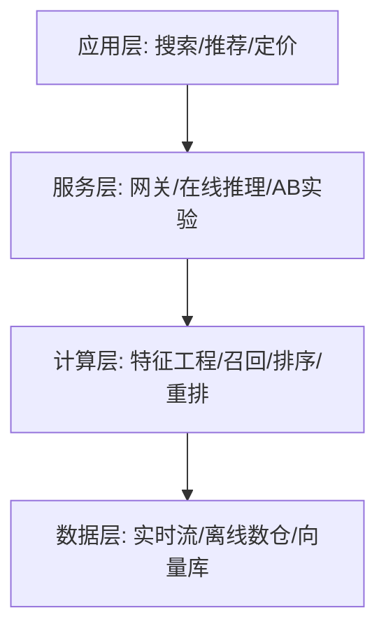

# 电商AI：推荐与搜索优化

## 引言：AI重塑电商增长引擎

你是否有过这样的“神奇”经历？☕️ 早上刚在心里念叨着换季需要买件风衣，下班打开购物APP，首页赫然推荐的就是你喜欢的款式；甚至当你只是漫无目的地随手一刷，总能被几件“心动好物”精准击中下单欲望。这背后并不是巧合，更不是读心术，而是**电商AI**在疯狂运转的结果。

🌍 **技术背景：从“人找货”到“货找人”的变革**
在流量红利见顶、获客成本日益高昂的今天，电商行业的竞争逻辑已发生根本性转变。传统的“人找货”关键词搜索模式，正在被基于深度学习的“货找人”智能推荐所颠覆。AI不再仅仅是炫技的噱头，它已成为电商业务的“大脑”：从提升转化率（CVR）、降低跳出率，到优化库存周转、实现动态定价，AI技术贯穿了电商交易的全链路。可以说，在数据驱动的时代，掌握了AI策略，就掌握了在万亿级市场中脱颖而出的钥匙。🔑

🤔 **核心问题：如何在海量数据中挖掘价值？**
然而，搭建一套高效的电商AI系统绝非易事。面对海量的用户行为数据（点击、浏览、停留、加购）和复杂的商品属性，我们该如何构建精准的**用户画像**？如何解决推荐系统中的“信息茧房”与“冷启动”难题？又如何让搜索结果不仅“相关”，更能“懂你”？这些问题直接关系到平台的GMV与用户留存，是每一个电商人必须面对的挑战。

📚 **文章全貌：一站式电商AI全栈实践**
为了解开这些谜题，本系列文章将带你深入电商AI的实战腹地，全方位拆解技术落地路径：
*   **前端体验层**：详解**商品推荐系统**的算法演进与**智能搜索**的意图识别，探索前沿的**视觉搜索**技术；
*   **数据核心层**：剖析**用户画像构建**的方法论，教你如何读懂你的用户；
*   **后端决策层**：深入**需求预测**、**库存优化**与**动态定价**，用AI驱动供应链降本增效；
*   **业务增长层**：汇总**提升转化率的AI策略**，将技术流量实实在在转化为真金白银。

准备好了吗？让我们一同揭开电商智能化的神秘面纱，开启这场技术进阶之旅！🚀

## 技术背景：电商智能化的演进之路

🛒 **电商AI：推荐与搜索优化 | 技术背景深度解析**

---

### 2. 技术背景：从“人找货”到“货找人”的智能跃迁

如前所述，AI正在重塑电商的增长引擎，成为驱动业务变革的核心动力。然而，要真正理解这股力量的根源，我们需要深入到底层技术的演进脉络中。电商AI并非一夜之间诞生的奇迹，它是计算机科学、数据挖掘与深度学习技术经过数十年积累与爆发后的必然产物。在这一章节，我们将透过现象看本质，剖析电商AI背后的技术背景，探讨它是如何一步步从简单的规则演变为如今懂你、懂货、懂场的智能系统的。

#### 📜 2.1 相关技术的发展历程：从规则到大模型

电商AI技术的演进，大体上可以分为三个阶段，每一次迭代都标志着智能化水平的质的飞跃。

**第一阶段：基于规则与统计的“蛮荒时代”**
在电商发展的早期，推荐和搜索主要依赖人工定义的规则和简单的统计学方法。
*   **搜索**：主要基于**倒排索引**和关键词匹配（TF-IDF）。用户搜什么，系统就展示包含什么关键词的商品。这种方式缺乏语义理解能力，经常出现“词不达意”的情况。
*   **推荐**：主要是**热门榜单**和基于**关联规则**（如“啤酒与尿布”）的推荐。系统并不理解用户的个性化需求，只能通过统计“买了这个的人也买了那个”来进行粗粒度的推荐。

**第二阶段：机器学习与协同过滤的“数据时代”**
随着用户数据的积累，**协同过滤**算法成为主流。通过分析用户的历史行为数据，计算用户之间或物品之间的相似度，实现了“千人千面”的初步雏形。随后，**逻辑回归**和**矩阵分解**等机器学习模型被引入，开始能够利用更多维度的特征（如用户属性、商品属性）来预测点击率（CTR）和转化率（CVR）。

**第三阶段：深度学习与大模型的“智能时代”**
近十年来，深度学习的爆发彻底改变了格局。**神经网络**能够自动提取高维度的非线性特征，极大地提升了预测的准确性。
*   **推荐系统**：阿里巴巴的DIN（深度兴趣网络）、双塔模型等架构，让模型能够捕捉用户随时间变化的兴趣序列。
*   **搜索技术**：**NLP（自然语言处理）**技术的进步，使得搜索引擎开始具备语义理解能力。
*   **当下最前沿**：以**Transformer**架构为基础的**大语言模型（LLM）**和**多模态模型**正在引领新的变革。AI不仅能理解文本，还能理解图片、视频，甚至能通过对话进行交互式导购，技术正朝着“通用人工智能（AGI）”的方向狂奔。

#### 🌍 2.2 当前技术现状和竞争格局

目前，电商AI技术已经进入成熟应用期，并呈现出“多模态融合”与“实时化”的特征。

**技术现状：**
*   **多模态融合**：现代推荐系统不再局限于行为日志，而是融合了文本（商品标题）、视觉（商品图片/视频）、甚至音频数据。**向量检索**技术让不同模态的数据在同一高维空间中计算相似度，使得“以图搜图”和视频内容理解成为可能。
*   **实时计算**：随着Flink等实时计算框架的普及，用户的每一次点击、浏览都能在毫秒级内反馈给模型，实现“刚刚浏览过，马上就推荐”的丝滑体验。
*   **端云协同**：为了保护隐私并降低延迟，部分推理能力正在下沉到用户终端（手机端），结合云端大模型，形成混合推理架构。

**竞争格局：**
全球电商巨头们正围绕算法高地展开激烈角逐。
*   **国内**：阿里（淘宝/天猫）、字节跳动（抖音电商）和京东处于第一梯队。抖音电商凭借其强大的**兴趣推荐算法**，创造了“货找人”的极致效率；而阿里和京东则在保留“搜索”心智的同时，大力强化逛逛、直播等推荐场景的智能化。
*   **国外**：亚马逊依然凭借其庞大的数据积淀占据技术高地，同时社交媒体转型的电商平台（如Instagram, TikTok Shop）正在通过内容算法重塑电商规则。

竞争的核心已不再是单一算法的优劣，而是**算力基础设施、数据资产质量以及算法工程化能力**的综合比拼。

#### 🚧 2.3 面临的挑战与问题

尽管技术取得了巨大进步，但在实际落地中，电商AI依然面临着严峻的挑战：

1.  **数据稀疏性与冷启动问题**：对于新用户或新上架的商品，缺乏历史行为数据，模型难以做出精准推荐。如何利用少量数据或内容特征进行冷启动，一直是业界的痛点。
2.  **信息茧房**：过度精准的推荐可能会导致用户视野狭窄，只看到自己感兴趣的商品，从而错失潜在的探索乐趣和购买机会。如何在“精准”与“惊喜”之间通过探索与利用策略找到平衡，是算法工程师需要攻克的难题。
3.  **实时性与算力成本的博弈**：模型越复杂，推理延迟越高，算力成本也呈指数级上升。如何在保证毫秒级响应的前提下，部署千亿参数的大模型，是工程上的巨大挑战。
4.  **可解释性差**：深度学习模型往往被视为“黑盒”。当用户被推荐了一个奇怪的商品时，系统很难给出令人信服的理由，这在一定程度上影响了用户的信任度。

#### 💡 2.4 为什么迫切需要这项技术？

既然面临诸多挑战，为什么各大电商还要不惜重金投入AI？答案很简单：**生存与增长。**

*   **应对信息过载**：电商平台的SKU数以亿计，用户若依靠传统的浏览或搜索查找商品，效率极低。AI是唯一能够高效连接海量商品与海量用户的桥梁。
*   **流量红利见顶，挖掘存量价值**：互联网流量红利逐渐消失，获客成本（CAC）高企。唯有通过精细化运营，利用AI提高**转化率（CVR）**和**客单价（AOV）**，延长用户生命周期价值（LTV），才能在激烈的市场竞争中存活。
*   **消费者体验升级的需求**：现代消费者越来越挑剔，他们期待的是“懂我”的服务。从搜索意图的精准识别到个性化的视觉发现，AI不再是锦上添花，而是满足用户基本体验的刚需。
*   **供应链优化的必然**：如前所述，AI不仅作用于前台。后台的需求预测、库存优化和动态定价，直接决定了企业的利润率。没有AI的赋能，供应链将因反应迟钝而积压巨大的库存成本。

综上所述，电商AI技术的迭代，是一场由数据驱动、以算法为武器的效率革命。它不仅是技术发展的必然结果，更是电商商业模式进化的内在需求。

---
📝 *下一章预告：了解了技术背景，我们将深入剖析商品推荐系统的核心架构与实战策略。*


### 3. 技术架构与原理：AI引擎的“心脏”解剖

如前所述，电商智能化的演进经历了从规则到深度学习的跨越。为了支撑这一复杂的业务场景，现代电商AI系统通常采用**分层架构设计**，将数据处理、模型训练与在线推理高效解耦，从而实现毫秒级的个性化响应。

#### 🏗️ 3.1 整体架构设计

电商AI的核心架构一般分为四层，如下图所示，从底层数据支撑到上层业务应用，形成了完整的技术闭环：

| 层级 | 核心组件 | 关键技术 | 职能描述 |
| :--- | :--- | :--- | :--- |
| **数据层** | 数据仓库、特征中心 | Hive, HBase, Kafka | 负责用户行为日志、商品元数据的采集与清洗，构建实时/离线特征流。 |
| **算法层** | 训练平台、模型仓库 | TensorFlow, PyTorch, XGBoost | 包含推荐模型的离线训练、在线学习及模型版本的迭代管理。 |
| **服务层** | 推理引擎、召回索引 | Redis, Faiss, Elasticsearch | 提供高并发、低延迟的在线预测服务，管理向量索引与倒排索引。 |
| **业务层** | 推荐引擎、搜索系统 | Sorting, Reranking Strategy | 对接前台应用，处理排序逻辑与最终的业务规则干预。 |

#### ⚙️ 3.2 核心组件与漏斗模型

无论是推荐还是搜索，其核心逻辑都遵循经典的**漏斗模型**，主要由三个阶段组成：

1.  **召回**：从海量商品池中快速筛选出千级候选集。常用技术包括基于协同过滤的**Item-based CF**、向量化检索的**双塔模型（DSSM）**以及基于图神经网络的**GraphSAGE**。
2.  **排序**：对召回的商品进行精排。核心在于预估用户点击（CTR）和转化（CVR）的概率。目前主流使用**DeepFM**或**DIN（深度兴趣网络）**来捕捉用户的历史行为序列。
3.  **重排**：结合业务规则进行最终调整。例如去重、打散（保证品类多样性）、加权（提升高毛利商品权重）等。

#### 🚀 3.3 关键技术原理：双塔模型与向量化检索

在召回阶段，将User和Item映射到同一向量空间是关键。以下是一个简化的双塔模型代码逻辑，展示了如何计算用户与商品的匹配度：

```python
import torch
import torch.nn as nn

class TwoTowerModel(nn.Module):
    def __init__(self, user_dim, item_dim, embed_dim):
        super(TwoTowerModel, self).__init__()
# User Tower: 将用户特征映射为低维向量
        self.user_tower = nn.Sequential(
            nn.Linear(user_dim, 256),
            nn.ReLU(),
            nn.Linear(256, embed_dim)
        )
# Item Tower: 将商品特征映射为低维向量
        self.item_tower = nn.Sequential(
            nn.Linear(item_dim, 256),
            nn.ReLU(),
            nn.Linear(256, embed_dim)
        )

    def forward(self, user_features, item_features):
        user_vec = self.user_tower(user_features)  # 输出: [batch, embed_dim]
        item_vec = self.item_tower(item_features)  # 输出: [batch, embed_dim]
# 计算余弦相似度作为匹配分值
        score = torch.cosine_similarity(user_vec, item_vec, dim=1)
        return score
```

#### 🔄 3.4 工作流程与数据流

整个系统的数据流向形成了一个**实时反馈闭环**：
1.  **客户端**产生曝光、点击、购买等行为数据；
2.  **消息队列**（如Kafka）实时传输数据；
3.  **流计算引擎**（如Flink）更新用户的短期兴趣特征（如“刚刚浏览了连衣裙”）；
4.  **检索系统**结合实时特征与离线模型，从索引库中拉取最相关商品；
5.  最终结果返回给前端，而新的用户行为又再次开启循环。

正是这种架构设计与算法原理的结合，使得电商平台能够精准捕捉用户意图，实现“千人千面”的极致体验。


### 3. 关键特性详解

承接上文对技术演进的探讨，本节将深入剖析当前电商AI在推荐与搜索优化中的核心关键特性。**如前所述**，随着从规则引擎向深度学习的跨越，现代电商系统已不仅仅是商品的陈列架，而是具备实时感知与决策能力的智能体。

#### 3.1 主要功能特性

在“千人千面”的个性化体验背后，是一系列精密的功能模块在协同工作：

1.  **多模态特征融合**：系统不再仅依赖用户点击日志（行为数据），而是深度融合了视觉（商品图片CNN特征）、文本（商品描述BERT向量）和图谱属性。
2.  **实时流式计算**：能够捕捉用户秒级行为。例如，用户刚刚点击了“运动鞋”，推荐流中的相关配件即刻在下一个刷新中呈现，无需等待离线模型更新。
3.  **动态异构图网络**：在搜索场景中，构建“用户-查询-商品-属性”的动态异构图，利用图神经网络（GNN）挖掘潜在的关联，解决长尾查询的匹配难题。

#### 3.2 性能指标和规格

要评估一套电商AI系统的优劣，必须直面严苛的性能指标。以下是高性能推荐引擎的典型规格参数：

| 指标维度 | 关键指标 | 规格要求/性能表现 | 业务意义 |
| :--- | :--- | :--- | :--- |
| **响应速度** | 推理延迟 (P99) | < 20ms | 确保用户滑动无卡顿，直接影响留存率 |
| **并发能力** | QPS (峰值) | > 100,000 | 支撑大促（如双11）流量洪峰 |
| **准确性** | 召回率 | Top 100 > 85% | 保证用户感兴趣的商品尽可能出现在前列 |
| **转化效率** | CTR (点击率) 提升 | 相比基线 +15% ~ +30% | 直接提升平台GMV和用户活跃度 |

#### 3.3 技术优势和创新点

本系统的核心竞争力在于其架构的先进性与算法的创新性：

*   **因果推断引入**：传统推荐仅关注相关性（Predict），而本系统引入因果推断，旨在识别用户购买的真实因果，减少“标题党”或“擦边球”商品的曝光，提升用户信任度。
*   **端到端多任务学习**：通过共享底层表示，同时优化点击（CTR）与转化（CVR）两个目标，解决了多任务间的冲突。
*   **在线学习**：支持模型的分钟级热更新，使得模型能够快速适应市场热点的变迁。

以下是一个简化的多任务模型架构代码示例：

```python
import torch
import torch.nn as nn

class EcommerceMTL(nn.Module):
    def __init__(self, feature_dim, hidden_dim):
        super(EcommerceMTL, self).__init__()
# 共享底层特征提取塔
        self.shared_layer = nn.Sequential(
            nn.Linear(feature_dim, hidden_dim),
            nn.ReLU()
        )
        
# 任务A：点击率预测 (CTR)
        self.tower_ctr = nn.Linear(hidden_dim, 1)
        
# 任务B：转化率预测 (CVR)
        self.tower_cvr = nn.Linear(hidden_dim, 1)

    def forward(self, x):
# 提取通用特征
        base_features = self.shared_layer(x)
        
# 多任务输出
        ctr_logits = torch.sigmoid(self.tower_ctr(base_features))
        cvr_logits = torch.sigmoid(self.tower_cvr(base_features))
        
        return ctr_logits, cvr_logits
```

#### 3.4 适用场景分析

这些关键特性在不同业务场景下发挥着关键作用：

*   **首页猜你喜欢**：利用实时流式计算和多模态特征，最大化用户浏览时长与探索效率。
*   **商品搜索**：应用动态异构图网络，解决用户意图模糊时的精准匹配问题，提升搜索结果的相关性。
*   **冷启动场景**：针对新用户或新上架商品，利用内容特征与少量交互数据进行快速冷启动，打破数据稀疏瓶颈。

综上所述，这些关键特性共同构成了电商AI的高效引擎，不仅提升了技术指标，更在实际业务中实现了转化率的显著跃升。


### 3. 核心算法与实现

**承接上一章关于技术演进的讨论**，我们已经了解到电商智能化从早期的规则引擎逐步迈向了深度学习与大模型时代。本节将深入这一“黑盒”内部，解析支撑现代推荐与搜索系统的核心算法架构与具体实现细节。

#### 3.1 核心算法原理：从召回到排序

现代电商AI的核心通常采用“漏斗型”架构，主要分为**召回**和**排序**两个阶段。

1.  **召回层**：
    *   **双塔模型**：这是目前最主流的召回架构。用户塔处理用户历史行为序列，提取用户向量；物品塔处理商品ID、类目、属性等，提取物品向量。通过计算两个向量的余弦相似度，快速从海量商品库中筛选出Top K候选集。
    *   **图神经网络**：如前所述，用户与商品的交互可以构成异构图。利用GraphSAGE等算法，可以聚合邻居节点的信息，有效解决冷启动问题，挖掘用户潜在兴趣。

2.  **排序层**：
    *   **多目标优化**：不同于传统只优化点击率（CTR），现代算法（如ESMM、MMOE）同时优化CTR（点击率）和CVR（转化率）。通过共享底层特征提取网络，分别构建多个任务塔，解决样本选择偏差问题，提升GMV（商品交易总额）。

#### 3.2 关键数据结构

高效的算法依赖于精心设计的数据结构，以下是核心组件的对比：

| 数据结构 | 应用场景 | 优势 | 备注 |
| :--- | :--- | :--- | :--- |
| **Embedding Vector** | 召回、语义搜索 | 将高维稀疏特征映射为低维稠密向量，便于计算相似度 | 常用维度：64~512 |
| **Inverted Index** | 关键词搜索 | 根据关键词快速定位包含该词的商品文档 | 搜索引擎的基石 |
| **Tree-based Index** | ANN (近似最近邻) 搜索 | 如HNSW索引，在海量向量中实现毫秒级检索 | 平衡精度与速度 |
| **Feature Cross Map** | 实时排序 | 存储特征交叉的组合状态，加速模型推理 | 需要巨大的内存支持 |

#### 3.3 实现细节分析

在工程落地中，模型训练与在线推理通常分离。

*   **在线推断**：要求极低延迟。通常使用TensorFlow Serving或Triton Inference Server。对于召回层，向量数据库（如Milvus或Faiss）是标配。
*   **特征流处理**：利用Flink实时计算用户的短期兴趣，并更新到特征存储中，确保“用户刚才浏览的商品”能立刻影响下一次推荐结果。

#### 3.4 代码示例与解析

以下是一个简化的基于PyTorch的**双塔模型**实现片段，用于召回阶段。该模型分别构建用户侧和物品侧的DNN，并输出向量进行内积计算。

```python
import torch
import torch.nn as nn

class TwoTowerModel(nn.Module):
    def __init__(self, user_feature_dim, item_feature_dim, embedding_dim):
        super(TwoTowerModel, self).__init__()
# 用户塔：将用户特征映射为向量
        self.user_tower = nn.Sequential(
            nn.Linear(user_feature_dim, 256),
            nn.ReLU(),
            nn.Linear(256, embedding_dim)
        )
        
# 物品塔：将物品特征映射为向量
        self.item_tower = nn.Sequential(
            nn.Linear(item_feature_dim, 256),
            nn.ReLU(),
            nn.Linear(256, embedding_dim)
        )

    def forward(self, user_features, item_features):
# 获取用户向量 (Batch_Size, Embedding_Dim)
        user_vec = self.user_tower(user_features)
# 获取物品向量 (Batch_Size, Embedding_Dim)
        item_vec = self.item_tower(item_features)
        
# 计算相似度（此处使用点积）
# 在实际推理中，user_vec通常与所有item_vec矩阵进行批量矩阵乘法
        similarity = torch.sum(user_vec * item_vec, dim=1)
        return similarity

# 初始化模型参数
model = TwoTowerModel(user_feature_dim=100, item_feature_dim=200, embedding_dim=64)
# 输入模拟数据
user_feat = torch.randn(32, 100) # 32个样本
item_feat = torch.randn(32, 200)
scores = model(user_feat, item_feat)
print("Prediction Scores:", scores.shape)
```

**代码解析**：
该代码展示了双塔模型的核心逻辑。关键点在于`user_tower`和`item_tower`是两个独立的神经网络。在训练时，我们输入正负样本对进行监督学习；在推理时，我们可以预先计算所有商品的`item_vec`存入向量索引库，用户请求时只需计算一次`user_vec`，然后在索引库中快速查找最相似的向量，从而实现毫秒级的实时推荐。


### 3. 技术对比与选型：召回与检索架构的博弈

**承接上文**提到的技术演进历程，当我们构建电商AI的“大脑”时，核心的推荐与搜索系统往往面临架构选型的关键抉择：是沿用成熟的**传统倒排索引**，还是拥抱**深度向量检索**？这两者在处理用户意图与商品匹配时有着本质的区别。

#### 3.1 核心技术对比

在电商场景下，我们需要在基于关键词匹配（稀疏检索）和基于语义匹配（稠密检索）之间做出权衡。

| 维度 | 传统倒排索引 (如 Elasticsearch) | 向量检索 (如 Milvus/Faiss) |
| :--- | :--- | :--- |
| **匹配原理** | 基于关键词精确或模糊匹配（TF-IDF/BM25） | 基于语义向量的近似余弦相似度（Embedding） |
| **语义理解** | 弱 (无法识别同义词，如"iphone"与"苹果手机") | 强 (能捕捉潜在意图与语义关联) |
| **可解释性** | 高 (用户能理解为什么搜到这个词) | 低 (黑盒模型，难以解释关联逻辑) |
| **个性化能力** | 较弱 (通常依赖人工规则) | 强 (千人千面，基于User Behavior建模) |
| **性能成本** | 低延迟，CPU友好 | 高计算消耗，通常需GPU加速 |

#### 3.2 优缺点分析

*   **传统倒排索引**：技术生态极其成熟，处理类目筛选、品牌精确匹配等强意图搜索时，响应速度和准确率极高。但其痛点在于**“语义鸿沟”**，难以挖掘用户潜在需求。
*   **向量检索**：通过双塔模型（如DSSM）将User和Item映射到同一向量空间，解决了“词不达意”的问题，大幅提升了**长尾商品**的曝光率。缺点是构建索引耗时，且对于超大数据集，实时性更新面临挑战。

#### 3.3 选型建议与代码示意

**选型策略**：
*   **搜索场景**：对于用户有明确购买目标的（如“Nike 42码”），使用 **Elasticsearch**。
*   **推荐场景/模糊搜索**：对于“猜你喜欢”、“看看类似款”或用户意图模糊的探索性查询，采用 **向量检索**。
*   **终极方案**：**混合检索**。先通过向量召回粗排，再结合ES精排。

```python
# 伪代码：混合检索逻辑示例
def hybrid_search(query, user_vector, top_k=10):
# 1. 路由判断：若包含强特征词，走ES
    if has_specific_intent(query):
        return es_search(query, top_k)
    
# 2. 语义召回：利用向量相似度
    vector_results = vector_search(user_vector, top_k*5)
    
# 3. 混合重排序：结合业务规则（库存、价格、地区）
    final_list = rerank(vector_results, business_rules)
    return final_list[:top_k]
```

#### 3.4 迁移注意事项

在从传统架构向AI向量架构迁移时，切忌“一刀切”。建议先在**“猜你喜欢”**流进行灰度测试，验证CTR（点击率）提升后再推广至搜索端。同时需注意**数据一致性**问题，确保商品特征更新时，向量索引能实时同步，避免用户点击“售罄”商品。


## 架构设计：高并发下的AI系统工程

**第4章 架构设计：高并发下的AI系统工程**

在上一章“核心原理：推荐与搜索的算法基石”中，我们深入探讨了驱动电商智能化的数学模型与逻辑，从协同过滤到深度神经网络，这些算法构成了推荐与搜索系统的“灵魂”。然而，在真实的电商战场中，仅有精妙的算法是远远不够的。面对每秒数百万次的访问请求（QPS）、海量且实时更新的商品库，以及毫秒级的响应要求，如何将这些复杂的算法落地为一个稳定、高效、可扩展的系统，才是工程化面临的最大挑战。

如果算法是引擎，那么系统架构就是底盘与传动系统。本章将脱离纯理论的算法探讨，转向工程实践，详细剖析在高并发场景下，如何设计一套能够支撑电商AI飞速运转的系统架构。我们将从经典的推荐与搜索架构出发，深入探讨实时流计算、模型推理加速以及保障大促稳定性的高可用容灾机制。

### 4.1 经典推荐系统架构：数据流动的艺术

一个成熟的电商推荐系统，通常采用“漏斗型”的分层架构设计。这种设计旨在通过层层筛选，在保证结果准确性的同时，最大限度地降低计算负载，提升响应速度。整个架构主要分为四个核心层级：数据层、召回层、排序层和重排层。

**1. 数据层：地基的稳固性**
如前所述，算法模型的训练依赖于数据。数据层是整个架构的基石，负责收集、清洗和存储各类数据。它包含两部分：离线数据和实时数据。
*   **离线数据**：通常存储在HDFS或S3等分布式文件系统中，利用Hive进行数仓构建。这里沉淀了用户长期的历史行为、商品属性等静态信息，用于每天定时的全量模型更新。
*   **实时数据**：用户刚刚产生的点击、加购、支付行为，需要通过消息队列实时流转，用于更新用户的短期兴趣画像。

**2. 召回层：从亿级到千级的初筛**
这是推荐流程的第一道关卡，也是最考验计算性能的一环。面对数亿级别的商品库，直接使用复杂模型对每一个商品进行打分是不现实的。召回层的任务是以极低的延迟（通常在几十毫秒内），从海量商品中快速筛选出用户可能感兴趣的几千个候选集。
这一层通常采用“多路召回”策略，包括基于协同过滤的召回、基于内容的召回、以及基于向量检索的召回。例如，利用Faiss或Milvus等向量数据库进行近似最近邻搜索（ANN），可以高效地找到与用户当前浏览意图语义相似的商品。工程上，这里需要对索引进行分片和缓存处理，以应对高并发读取。

**3. 排序层：精准的个性化打分**
经过召回层筛选后的候选集（通常为1000-5000个），将进入排序层。这里应用了我们在第3章讨论的深度学习模型（如Wide&Deep、DIN等），对每一个候选商品进行精准的点击率（CTR）和转化率（CVR）预估。
排序层是计算密集型环节。在架构设计上，通常会部署独立的预测服务集群。为了提高吞吐量，系统可能会采用批量推理的方式，一次性对一批商品进行打分，而非逐个处理。此外，特征提取是排序的瓶颈，架构中必须设计高效的特征获取接口（Feature Service），从Redis或其他特征存储中毫秒级拉取用户特征与商品特征。

**4. 重排层：业务逻辑的最终调和**
模型给出的分数是纯粹的数学概率，但在实际业务中，还需要考虑诸多运营规则。重排层位于系统末端，负责对排序结果进行微调。
*   **去重与过滤**：过滤掉已购买、已下架或用户明确排斥的商品。
*   **多样性控制**：避免推荐结果全是同类目商品（如全是裙子），通过MMR（Maximal Marginal Relevance）等算法打散结果，提升用户体验。
*   **运营干预**：置入广告、强插新品或活动商品。

### 4.2 智能搜索架构设计：索引与检索的博弈

与推荐系统的被动推送不同，搜索是用户主动发起的查询。智能搜索架构的核心在于如何平衡“索引构建的时效性”与“在线检索的低延迟”。

**1. 离线索引构建流程**
搜索引擎的幕后是庞大的索引构建流水线。
*   **数据清洗与NLP处理**：原始商品数据首先经过清洗，随后进行复杂的自然语言处理（NLP），包括分词、词性标注、实体识别以及纠错。
*   **倒排索引生成**：这是搜索技术的核心。架构会将处理后的词项映射到包含该词项的文档ID列表中。
*   **正排索引与结构化数据**：除了用于匹配的倒排索引，还需要构建用于排序和筛选的正排索引。
这一过程通常通过批处理任务（如Spark）定期执行，但在大促期间，为了确保新品能被立即搜到，架构往往需要引入近实时索引构建能力。

**2. 在线检索流程**
当用户在搜索框输入关键词时，请求首先到达接入层，经过**查询分析**模块。这里会进行意图识别、同义词扩展（例如搜“手机”也匹配“移动电话”）以及拼写纠错。随后，查询被分发到多个搜索分片。
在分片内部，引擎首先利用倒排索引快速定位到候选文档集，然后结合前面提到的学习排序模型，对候选集进行精排。值得一提的是，现代搜索架构中，向量检索已经与传统的关键词检索融合，实现了“语义+关键词”的双重匹配，极大地提升了搜索的智能化水平。

### 4.3 实时流计算架构：Flink/Kafka的即时响应

在电商场景中，用户的兴趣是瞬息万变的。如果用户刚刚浏览了一台冰箱，下一秒推荐列表里应当立即出现相关的家电，而不是等到第二天模型更新后才生效。这就需要实时流计算架构的支持。

**1. 消息队列：数据的主动脉**
Kafka作为高吞吐量的分布式发布订阅消息系统，充当了整个实时架构的数据“蓄水池”。用户在前端产生的所有行为日志（曝光、点击、收藏、购买），都会实时上报并汇聚到Kafka的Topic中。它解耦了数据生产者（业务APP）与消费者（计算程序）。

**2. Flink实时计算引擎**
Flink因其优秀的低延迟和高吞吐特性，成为电商实时计算的首选。在架构中，Flink消费Kafka中的数据流，执行复杂的CEP（复杂事件处理）逻辑。
例如，系统可以定义规则：“如果用户在5分钟内连续点击了3款同品牌的奶粉，则判定该用户对该品牌有强购买意向。”
Flink实时计算出的结果（如用户最新的兴趣标签、实时点击率特征）会被写入Redis或HBase等在线存储系统中。这样，当推荐系统的召回层或排序层再次请求用户特征时，就能获取到毫秒级前的最新状态，从而实现“实时感知用户”。

### 4.4 模型服务化：TensorRT/ONNX Runtime推理加速

算法模型在训练阶段通常使用PyTorch或TensorFlow，但这些框架在推理（预测）阶段往往显得过于臃肿，且资源消耗大。在电商的高并发请求下，直接使用训练框架进行部署是无法满足性能要求的。因此，模型服务化与加速至关重要。

**1. 模型转换与优化**
工程上，我们通常会将训练好的模型转换为通用的中间表示格式，如ONNX，或者直接转换为针对特定硬件优化的格式。
*   **ONNX Runtime**：提供了跨硬件（CPU/GPU）的高性能推理引擎，通过图优化技术减少算子开销。
*   **TensorRT**：针对NVIDIA GPU进行了深度优化。它支持层融合（Layer Fusion，将多个层合并为一个计算单元）、内核自动调整和精度校准（如将FP32量化为FP16甚至INT8）。在保证精度损失极小的前提下，TensorRT能将推理吞吐量提升数倍甚至数十倍。

**2. 部署策略**
在部署层面，架构师通常会采用**模型容器化**技术。将推理服务打包在Docker容器中，利用Kubernetes进行自动扩缩容。当流量高峰来临时，K8s能自动启动更多的推理实例以分担压力；流量低谷时则自动缩容以节省成本。此外，为了进一步降低延迟，许多架构开始探索**GPU共享**技术，让多个轻量级模型实例共享同一块GPU显存，从而大幅提升硬件利用率。

### 4.5 高可用与容灾机制：大促流量下的稳态保障

对于电商AI系统而言，稳定性就是生命线。特别是在“双11”、“黑色星期五”等大促期间，流量会瞬间爆发至日常的数十倍。任何一次服务宕机都可能造成巨额的经济损失。因此，高可用（HA）与容灾机制是架构设计的底线。

**1. 限流与熔断**
系统必须预设保护阈值。当QPS超过系统承载极限时，限流组件（如Sentinel或Guava RateLimiter）会直接丢弃多余的请求，或返回降级数据，防止系统因过载而雪崩。
熔断机制则用于防止级联故障。例如，如果推荐系统的“实时特征服务”响应超时，熔断器会暂时切断对该服务的调用，直接使用默认的静态特征进行兜底推荐，虽然牺牲了一部分精准度，但保证了整个服务链路不中断。

**2. 多级缓存策略**
缓存是抗击高并发流量的最有效武器。架构中通常设计多级缓存：
*   **客户端缓存**：存放在用户端，减少网络请求。
*   **边缘节点缓存（CDN）**：对于热门榜单、静态资源进行边缘分发。
*   **应用层缓存**：存放在应用服务器内存中。
*   **分布式缓存**：如Redis集群。
通过缓存预热和缓存击穿防护（如互斥锁更新），系统可以拦截绝大多数的读请求，减少对后端数据库和计算集群的压力。

**3. 异地多活与容灾**
为了应对机房级别的故障（如断电、光缆切断），核心AI系统通常部署在多个数据中心。采用“异地多活”架构，不同地域的用户流量由就近的数据中心处理，且数据在中心间实时同步。一旦某个数据中心发生灾难，流量可以迅速切换至其他健康的数据中心，确保业务连续性。

综上所述，高并发下的AI系统工程不仅仅是算法的堆砌，更是一门关于平衡的艺术。它在召回与排序的算力博弈中寻找平衡，在实时计算与数据一致性的矛盾中寻找平衡，在极致性能与系统稳定性的挑战中寻找平衡。只有构建了这样坚实的底层架构，我们在前一章探讨的那些精妙算法，才能真正化作驱动电商增长的技术引擎。

# 关键特性：构建差异化的AI能力

在上一章节中，我们深入探讨了“高并发下的AI系统工程”，讨论了如何通过微服务架构、容器化部署以及实时计算框架，为电商智能系统打造坚实的“骨架”。然而，正如高楼大厦不仅需要稳固的钢骨结构，更需要独特的设计与功能填充，技术架构的完备只是基础，要在竞争白热化的电商红海中脱颖而出，关键在于构建具有显著差异化的AI能力。

这一章，我们将视线从底层的架构支撑上移，聚焦于那些直接决定用户体验、驱动业务增长的核心AI特性。这些特性不再是单一算法的简单应用，而是复杂的系统工程与商业洞察的深度结合。我们将从用户画像的动态演进、视觉搜索的技术突破、动态定价的商业博弈、供应链的智能预测以及多模态融合的未来趋势五个维度，详细解析如何构建不可替代的电商AI核心竞争力。

### 5.1 用户画像构建：基于行为序列的标签体系与实时更新机制

正如前文在架构设计中提到的，数据的实时流转是现代电商系统的基石，而用户画像正是这些数据流动的最终载体。传统的用户画像往往基于静态属性（如性别、年龄、地域）和历史统计数据进行构建，这种滞后且粗粒度的标签体系已无法满足当下“千人千面”的精细化运营需求。

构建差异化的用户画像，核心在于引入“基于行为序列”的动态建模能力。现代AI系统不再仅仅关注用户“买过什么”，而是高度关注用户“正在看什么”、“看过多久”以及“看过之后做了什么”。这意味着我们需要利用深度学习模型（如Transformer架构的变体或BERT4Rec），对用户的点击、加购、收藏、购买等行为序列进行建模。

**实时更新机制**是这一环节的关键。如前所述的流式计算架构在此处发挥了关键作用。当用户在深夜刚刚浏览了一款母婴产品，系统应在毫秒级时间内捕获这一信号，并即时更新其Embedding向量。这不仅仅是标签权重的增加，而是用户兴趣向量在特征空间中的实时位移。例如，系统应能识别出用户从“浏览型”向“购买型”转化的意图变化，或者识别出用户从“自我消费”向“礼物挑选”的场景切换。这种基于细粒度行为序列的实时画像，能够支撑推荐系统在用户兴趣发生漂移时迅速响应，极大提升了转化的黄金窗口期的命中率。

### 5.2 视觉搜索：以图搜图的技术实现与CNN特征提取

在电商场景中，用户的搜索意图往往“只可意会不可言传”。当用户看到一件街头路人穿着的大衣想找同款，或者家中有一件旧物品想寻找替换品时，传统的文本搜索显得捉襟见肘。视觉搜索技术，即“以图搜图”，正是打破这一语义壁垒的关键能力。

其技术核心在于利用**卷积神经网络（CNN）**或更先进的Vision Transformer（ViT）进行特征提取。差异化的视觉搜索并非简单的图片匹配。在工程实践中，我们需要将高维的图像数据（如224x224像素的RGB矩阵）通过深度神经网络映射为低维的稠密向量。

这一过程面临着巨大的技术挑战：首先是**类内差异与类间相似性**的处理。同一款连衣裙在不同模特身上、不同光线下拍摄的图片，其视觉特征可能差异巨大；而不同款式的皮鞋在整体轮廓上却可能高度相似。为了解决这一问题，先进的AI系统会引入度量学习，通过Triplet Loss等损失函数训练模型，缩小同类商品在特征空间中的距离，拉大不同类商品的距离。

此外，结合前面提到的架构设计，视觉搜索还需要具备**局部特征识别能力**（如SIFT或基于Attention机制的局部特征聚焦）。用户上传的图片可能包含复杂的背景，AI需要精准地“抠出”商品主体（主体检测），并关注商品的关键细节（如鞋子的花纹、包包的扣子）。这种将“图”转化为“向量”，再在向量索引库（如Faiss或Milvus）中进行快速近似检索（ANN）的能力，构成了电商AI区别于传统搜索的视觉护城河。

### 5.3 动态定价策略：基于供需关系与价格弹性的AI定价模型

如果说推荐和搜索是流量的入口，那么定价就是直接决定营收和利润的阀门。传统的“人工定价”或“静态定价”模式在面对瞬息万变的市场环境时显得反应迟钝。基于AI的动态定价策略，旨在寻找销量与利润的最佳平衡点。

这一特性的构建依赖于复杂的**价格弹性模型**。AI系统需要分析海量的历史交易数据，计算出每个商品、每个细分人群甚至每个特定时间段的价格弹性系数——即价格变动1%对需求变动的影响程度。

但这仅仅是基础。一个差异化的动态定价系统必须是一个多目标优化的博弈过程。它需要综合考量**供需关系**（如库存积压时激进促销，爆款商品适度溢价）、**竞争对手价格**（通过爬虫实时监控竞品价格变化）、**生命周期阶段**（新品期、爆发期、衰退期）以及**用户购买力**。

在实际工程中，这通常被建模为一个强化学习问题。AI Agent（智能体）不断在环境中试错，通过观察市场反馈（销量、GMV、毛利率）来调整定价策略，以最大化长期的累积收益。例如，在“双11”大促的关键时刻，系统能根据实时库存消耗速度，自动调整特定SKU的折扣力度，既确保不超卖，又避免了因定价过高导致的流量浪费。这种基于实时数据反馈的动态定价能力，是电商精细化运营的核心武器。

### 5.4 需求预测与库存优化：时间序列分析在供应链中的应用

供应链是电商的“后院”，但其效率直接决定了前端的服务体验和资金周转率。需求预测与库存优化是AI在供应链领域的“圣杯”。在第4章提到的高并发架构不仅服务于C端用户，同样支撑着供应链复杂计算任务的后台运行。

传统的需求预测多基于ARIMA等统计学模型，难以应对电商市场强烈的非线性和突发性（如网红带货导致的瞬间爆发）。差异化的AI能力体现在利用**深度学习进行时间序列分析**。现代模型如LSTM（长短期记忆网络）、GRU以及基于Transformer的Temporal Fusion Transformer（TFT），能够捕捉数据中的长期依赖关系和复杂的季节性模式。

更重要的是，AI系统能够融合多源数据进行联合预测。除了历史销量数据，模型还会输入天气数据、节假日因子、社交媒体热度趋势甚至营销活动计划。例如，预测一款羽绒服的销量，模型会自动关联未来两周的气温变化曲线。

基于精准的需求预测，**库存优化**算法会自动计算补货点（Reorder Point）和最佳订货量（EOQ）。这不仅能有效降低库存成本，减少呆滞库存，更能显著提升现货率，缩短发货时效。在这一环节，AI的价值在于将“被动响应”转变为“主动预知”，让供应链具备敏捷的适应能力。

### 5.5 多模态融合：文本、图像与视频特征的联合建模

随着电商内容的日益富媒体化，单纯的文本或单纯的图像处理已无法完整地表达商品信息。多模态融合代表了电商AI的前沿方向，也是构建下一代搜索与推荐系统的核心竞争力。

用户在浏览商品时，不仅会看标题（文本）、看主图（图像），还会 increasingly 地观看短视频（视频）。AI系统需要同时理解这三种模态的信息，并在统一的特征空间中进行**联合建模**。

这一特性的难点在于“模态对齐”。文本描述的“碎花”与图像中的“碎花纹理”以及视频中动态展示的“裙摆飘动”，在语义上应当是指代同一概念的。通过采用双塔模型或基于CLIP（Contrastive Language-Image Pre-training）的架构，我们可以将文本特征和视觉特征映射到同一向量空间中，计算它们的相似度。

多模态融合带来的价值是巨大的。在搜索场景下，用户输入“穿着显腿长的红色连衣裙”，系统可以同时利用文本语义匹配和视觉特征（腿长、红色）进行检索，召回结果更精准；在推荐场景下，即便用户从未浏览过某类商品，但通过分析其偏好的视频风格（如偏好多巴胺穿搭的视觉色调），系统也能通过视觉特征的相似性进行跨品类推荐。

通过多模态融合，AI不再是一个冷冰冰的匹配器，而是一个具备了类人感知能力的“懂你所想”的智能助手。这不仅打破了单一数据源的信息孤岛，更为电商交互方式的革新（如对话式购物、沉浸式购物）奠定了技术基础。

综上所述，从实时的用户画像感知，到精准的视觉识别，再到动态的商业博弈、智能的供应链管理以及前沿的多模态融合，这些关键特性共同构成了电商AI的差异化竞争力。它们不仅仅是算法模型的堆砌，更是基于上一章所述的高效架构，将数据转化为商业智慧的生动实践。在接下来的章节中，我们将进一步探讨如何通过具体的策略，将这些能力转化为实实在在的转化率提升。


## 6. 核心技术解析：技术架构与原理

紧承上文提到的“差异化关键特性”，如实时个性化与多模态搜索，这一切能力的背后，离不开一套精密且高效的底层技术架构支撑。本节将深入剖析电商AI系统的骨架，揭示推荐与搜索引擎如何在毫秒级内完成从数据感知到决策输出的全过程。

### 6.1 整体架构设计：分层解耦的艺术
如前所述，电商AI系统不仅是算法的堆砌，更是系统工程的胜利。整体架构通常采用**分层解耦**的设计模式，自下而上分为数据层、计算层、服务层和应用层。



### 6.2 核心组件与模块
系统的高效运转依赖于各个核心模块的协同工作，其核心逻辑遵循经典的**漏斗模型**。下表详细列出了各层级的关键组件及其功能：

| 层级 | 核心组件 | 关键功能描述 |
| :--- | :--- | :--- |
| **数据层** | Data Pipelines | 整合用户行为日志、商品知识图谱，通过ETL清洗入湖。 |
| **计算层** | **召回** | 利用向量检索（如Faiss）从海量商品池中快速筛选出千级候选集。 |
| | **精排** | 使用DeepFM、DIN等深度模型对候选集进行打分，预测CTR/CVR。 |
| | **重排** | 基于业务规则（去重、打散、库存校验）调整最终展示顺序。 |
| **服务层** | Online Inference | 部署ONNX/TensorRT模型，提供毫秒级的低延迟推理服务。 |

### 6.3 工作流程与数据流
当用户在APP发起一次请求时，系统内部会触发一场复杂的数据风暴。以下是其简化后的工作流逻辑：

```python
def handle_user_request(user_id, context):
# 1. 实时特征获取
    user_profile = get_redis_features(user_id)
    realtime_behavior = fetch_kafka_stream(user_id)
    
# 2. 召回阶段 - 多路召回
    candidates = []
    candidates.append(vector_recall(user_profile.embedding))  # 向量召回
    candidates.append(graph_recall(user_id))                 # 图网络召回
    
# 3. 精排阶段 - 模型打分
    scored_items = []
    for item in merge_and_filter(candidates):
        score = rank_model.predict(user_features, item_features, context)
        scored_items.append((item, score))
    
# 4. 重排与业务干预
    final_list = re_rank(scored_items, rules=["diversity", "boost_promoted"])
    return final_list[:20]  # 返回Top 20结果
```

### 6.4 关键技术原理
在上述流程中，**向量检索**与**实时特征工程**是核心技术难点。
*   **双塔模型**：在召回阶段，User和Item分别通过两个神经网络映射到同一向量空间。通过计算余弦相似度，即便用户行为稀疏，也能基于语义找到潜在兴趣商品。
*   **流批一体架构**：为了保证画像的实时性，系统采用Flink处理实时流数据，与离线T+1数据形成互补。这使得用户刚刚浏览的商品，能在下一秒的推荐结果中立即体现，实现了真正意义上的“所想即所见”。

综上所述，通过分层架构与漏斗模型的有机结合，电商AI系统实现了从海量数据到精准决策的快速转化，为提升转化率奠定了坚实的技术基石。


# 6. 关键特性详解：从算法黑盒到业务价值

如前所述，我们在上一节讨论了如何构建差异化的AI能力，这不仅是战略选择，更是技术落地的具体体现。本节将深入剖析这些能力在实际工程中的具体表现，从功能特性、性能指标、技术创新及适用场景四个维度，为大家呈现电商AI系统的“硬核”参数与业务价值。

### 6.1 主要功能特性

电商AI的核心在于对“人（用户）、货（商品）、场（场景）”的精准匹配。主要功能特性已超越了简单的协同过滤，向更深层次演进：

*   **多模态融合搜索**：打破传统文本搜索的限制，支持“以图搜图”和“图+文”混合检索。通过CLIP（对比语言-图像预训练）模型，将商品图片与用户语义对齐，解决“描述不清”的搜索痛点。
*   **实时流式重排**：在用户产生交互行为的毫秒级时间内，通过Flink等流计算引擎更新用户兴趣向量，并动态调整当前页面的推荐顺序，确保所见即所想。
*   **全链路因果推断**：利用Uplift模型预测“干预”与“不干预”的差异，剔除自然转化因素，精准评估优惠券或推荐位带来的真实增量收益（Incremental Lift）。

### 6.2 性能指标与规格

为了保证高并发场景下的用户体验，系统在延迟和吞吐量上有着严苛的工业级要求：

| 核心指标 | 规格/目标值 | 业务含义 |
| :--- | :--- | :--- |
| **召回延迟 (P99)** | < 20ms | 确保99%的请求在极短时间内完成候选集筛选，保证页面首屏秒开。 |
| **推理吞吐量 (QPS)** | > 50,000 | 单节点模型每秒处理的请求数，支撑大促期间的流量洪峰。 |
| **特征更新时效** | < 2秒 | 用户行为发生后，特征库同步更新的时间，确保推荐的实时性。 |
| **模型准确率** | Top-10 NDCG > 0.05 | 衡量推荐列表排序质量的核心指标，值越高，排序越符合用户心意。 |

### 6.3 技术优势与创新点

与传统电商搜索相比，现代AI架构具备显著优势：

*   **序列化建模**：采用Transformer架构（如SASRec、BST），捕捉用户行为序列中的长期依赖关系，理解“浏览手机壳后购买手机”的时序逻辑，而非仅仅基于共现关系。
*   **图神经网络 (GNN) 应用**：构建异构图网络，挖掘用户、商品、属性、品牌之间的深层拓扑关系，有效解决冷启动问题和长尾商品曝光。
*   **云原生弹性推理**：利用Kubernetes和TensorRT实现推理服务的自动扩缩容与模型加速，在成本可控的前提下应对百倍流量波动。

### 6.4 适用场景分析

*   **大促流量洪峰**：如“双11”零点，通过高并发架构和降级策略，保证系统稳定性。
*   **新品冷启动 (Cold Start)**：新上架商品缺乏历史数据，利用内容特征（图片、文本）和GNN算法快速匹配潜在兴趣用户。
*   **长尾词搜索**：当用户搜索非热门词汇时，通过向量检索召回相关商品，而非简单的关键词匹配。

### 技术实现示例：实时特征拼接

以下是实时推理服务中，特征拼接与模型预测的伪代码示例：

```python
import tensorflow as tf
import numpy as np

def real_time_predict(user_features, item_features, context_features):
    """
    实时预测函数：拼接特征并进行模型推理
    """
# 1. 特征拼接
# 将用户画像、商品Embedding、上下文（如时间、设备）合并
    combined_features = np.concatenate([
        user_features['embedding'], 
        item_features['embedding'],
        context_features['time_one_hot']
    ])
    
# 2. 模型加载与推理 (使用SavedModel格式)
    interpreter = tf.lite.Interpreter(model_path="model_v2.tflite")
    interpreter.allocate_tensors()
    interpreter.set_tensor(interpreter.get_input_details()[0]['index'], [combined_features])
    interpreter.invoke()
    
# 3. 获取CTR (Click-Through Rate) 预测值
    prediction = interpreter.get_tensor(interpreter.get_output_details()[0]['index'])
    
    return float(prediction[0][0])
```

通过上述详解，我们可以看到，电商AI不仅是算法模型的堆砌，更是性能与精度的平衡艺术。这些关键特性共同构成了转化率提升的底层驱动力。


### 核心算法与实现

如前所述，构建差异化的AI能力是电商系统突围的关键，而这些上层能力的实现，高度依赖于底层核心算法的精妙设计与高效调度。本节我们将深入解析支撑推荐与搜索系统的核心算法——双塔模型，并探讨其关键的数据结构与实现细节。

#### 1. 核心算法原理：双塔模型
在海量商品库中快速匹配用户兴趣，核心在于“召回”阶段。双塔模型因其计算高效、适合在线推理而被广泛应用。该算法将用户特征和商品特征分别通过两个独立的神经网络映射到同一隐向量空间。

*   **User Tower**：输入用户历史行为序列、画像属性（年龄、性别），输出用户向量 $u$。
*   **Item Tower**：输入商品标题、类目、价格等属性，输出商品向量 $i$。
*   **匹配逻辑**：通过计算 $u$ 和 $i$ 的余弦相似度来预测用户对该商品的偏好程度。

#### 2. 关键数据结构
为了实现毫秒级的检索，算法必须配合高效的数据结构。在电商场景下，我们通常结合使用**倒排索引**与**向量索引**。

| 数据结构 | 应用场景 | 优势 | 适用算法 |
| :--- | :--- | :--- | :--- |
| **倒排索引** | 基于属性的筛选 (如: 品牌=耐克) | 查询极快，逻辑简单 | 布尔过滤、ES搜索 |
| **HNSW (Hierarchical Navigable Small World)** | 向量近似最近邻搜索 (ANN) | 高召回率，查询时间复杂度低 (对数级) | 向量召回、DSSM |
| **Hash Table** | 去重与快速查找 | O(1) 访问速度 | 特征去重、ID映射 |

#### 3. 代码示例与解析
以下是一个基于PyTorch的简化版双塔模型实现，展示了如何构建用户与商品的Embedding层及最终的匹配逻辑。

```python
import torch
import torch.nn as nn

class TwoTowerModel(nn.Module):
    def __init__(self, user_feature_dim, item_feature_dim, embedding_dim):
        super(TwoTowerModel, self).__init__()
# 用户塔：处理用户特征
        self.user_tower = nn.Sequential(
            nn.Linear(user_feature_dim, 128),
            nn.ReLU(),
            nn.Linear(128, embedding_dim)
        )
        
# 商品塔：处理商品特征
        self.item_tower = nn.Sequential(
            nn.Linear(item_feature_dim, 128),
            nn.ReLU(),
            nn.Linear(128, embedding_dim)
        )

    def forward(self, user_features, item_features):
# 获取向量表示
        user_vec = self.user_tower(user_features)
        item_vec = self.item_tower(item_features)
        
# 计算余弦相似度
        similarity = torch.cosine_similarity(user_vec, item_vec, dim=1)
        return similarity, user_vec, item_vec

model = TwoTowerModel(user_feature_dim=20, item_feature_dim=30, embedding_dim=64)

# 模拟输入数据
batch_user_feat = torch.randn(10, 20)  # 10个用户样本
batch_item_feat = torch.randn(10, 30)  # 10个商品样本

# 前向传播
scores, u_vecs, i_vecs = model(batch_user_feat, batch_item_feat)
print(f"Similarity Scores: {scores[:3]}")  # 打印前3个样本的预测得分
```

#### 4. 实现细节分析
在上述代码中，关键点在于**Embedding维度的选择**与**激活函数的使用**。
*   **特征映射**：`nn.Linear`层负责将稀疏的高维特征映射为稠密的低维向量。这一步是算法压缩信息、提取语义的核心。
*   **非线性变换**：中间层的`ReLU`激活函数引入了非线性，使得模型能够拟合用户与商品之间复杂的交互关系，而非简单的线性加权。
*   **在线推理优化**：在实际工程中，为了避免每次请求都计算全量商品向量，我们通常预先计算好所有商品的Item Vector并构建HNSW索引。线上服务只需计算一次User Vector，即可在索引中极速检索TopK商品，从而保证了高并发下的低延迟响应。


### 6. 技术对比与选型：寻找最适合的AI引擎

如前所述，构建差异化的AI能力是打破同质化竞争的关键，而这一切的基石在于底层技术栈的精准选型。在电商场景下，面对“搜索”与“推荐”的双重挑战，我们需要在性能、精度与成本之间找到最佳平衡点。

#### 1. 核心技术路线对比

在搜索领域，核心矛盾在于**精确匹配**与**语义理解**。
*   **倒排索引**：技术成熟，查询响应极低（毫秒级）。但其缺陷在于无法理解词义背后的意图，例如搜“苹果”只能匹配水果或手机，无法根据用户偏好智能区分。
*   **向量检索**：将商品映射为向量，能捕捉“耐克”与“运动装备”的隐性关联。但构建索引耗时较长，且算力成本随数据量激增。

在推荐领域，核心矛盾在于**稀疏数据处理**与**实时性**。
*   **协同过滤**：实现简单，可解释性强。但在用户行为稀疏时效果差（冷启动问题），且难以捕捉用户兴趣的动态变化。
*   **深度序列模型**：能够模拟用户兴趣的演变路径。缺点是模型参数量大，对工程架构的推理性能要求极高。

#### 2. 选型决策矩阵

为了直观展示，我们汇总了主流技术的特性对比：

| 技术方案 | 优势 | 劣势 | 适用场景 |
| :--- | :--- | :--- | :--- |
| **倒排索引 (ES/Lucene)** | 极致查询速度、稳定性高 | 语义理解弱、依赖分词质量 | 精确词搜索、类目筛选 |
| **向量检索** | 跨模态理解（图搜文）、语义化强 | 计算资源消耗大、调优复杂 | 以图搜图、模糊查询、相关性推荐 |
| **协同过滤 (CF)** | 部署快、资源占用低 | 冷启动难、马太效应严重 | 初期系统搭建、长尾商品推荐 |
| **深度模型 (DIN/DIEN)** | CTR预估精度高、特征工程丰富 | 训练成本高、系统延迟大 | 核心业务流、千人千面重排 |

#### 3. 选型建议与迁移策略

对于处于不同发展阶段的电商系统，建议采取**分阶段迭代策略**：

*   **初期/中小规模**：优先使用 **Elasticsearch** 搭配基础的 **协同过滤**。这能以最低成本满足80%的业务需求。
*   **成长期/大规模**：引入 **混合检索架构**。即先通过向量检索扩大召回范围，再用传统索引进行精排。

**代码示例：混合检索策略**

```python
def hybrid_search_strategy(query, user_profile):
# 1. 向量召回：基于语义相似度获取候选集
    semantic_candidates = vector_engine.search(query, top_k=100)
    
# 2. 传统召回：基于用户历史行为的协同过滤
    collaborative_candidates = cf_engine.recommend(user_id=user_profile['id'], top_k=100)
    
# 3. 多路召回融合
    fused_candidates = list(set(semantic_candidates) | set(collaborative_candidates))
    
# 4. 精排：使用LightGBM/DNN模型打分
    ranked_results = rank_model.predict(fused_candidates)
    return ranked_results[:10]
```

**迁移注意事项**：
在从传统架构向AI架构迁移时，切勿“一步到位”。建议采用**蓝绿部署**或**影子流量**模式，先在新架构上并行运行旧逻辑，对比转化率（CVR）与点击率（CTR）指标，确认无回退后再逐步切量。同时，需特别关注**特征一致性**，确保离线训练与在线推理的特征处理逻辑完全对齐。


# 🆚 技术大对决：电商AI的选型与进阶之路

在前一节中，我们深入探讨了“打造极致转化率的核心策略”，了解了如何通过业务逻辑将AI能力转化为商业价值。然而，策略的落地离不开坚实的技术底座。面对琳琅满目的AI算法模型和架构方案，究竟哪一款才适合你的电商平台？是稳扎稳打的传统算法，还是势不可挡的深度学习模型？

本节将聚焦于技术层面的深度对比，为你揭开选型的谜题。

### 1. 算法流派之争：传统协同过滤 vs 深度神经网络

在商品推荐系统中，这是最经典的一场对决。

**传统协同过滤**
这是电商领域的“老兵”，基于用户的历史行为数据计算相似度。其优势在于**可解释性强**（“推荐这个是因为买过该商品的人也买了那个”）且工程实现简单，对数据量要求相对较低。然而，正如前面提到的，它面临着严重的**冷启动问题**和**稀疏性挑战**——当新用户上架或新商品入库时，系统往往会“哑火”。

**深度神经网络**
以DIN（Deep Interest Network）或DeepFM为代表的深度学习模型，是当前的主流。它们能自动提取高维非线性特征，捕捉用户极其细微的意图。例如，它能区分用户买“苹果”是为了吃还是为了送礼。其**精准度远超传统算法**，但代价是**计算资源消耗巨大**，且模型通常是一个“黑盒”，难以向业务方解释为什么推荐了这个商品。

### 2. 搜索架构演进：倒排索引 vs 向量检索

在智能搜索领域，技术路线正在经历一场从“匹配”到“理解”的变革。

**倒排索引**
这是搜索引擎（如Elasticsearch）的基石。通过关键词匹配（如BM25算法），实现毫秒级响应。它的优势在于**确定性高**、性能极佳，非常适合处理用户明确意图的搜索（如直接搜“iPhone 15”）。但在处理模糊搜索（如搜“适合送给女朋友的礼物”）时，基于关键词的匹配往往显得力不从心。

**向量检索**
这是AI搜索的新宠。利用Embedding技术将商品和Query转化为向量，在向量空间中计算语义相似度。它极大地提升了搜索的**语义理解能力**，支持“以文搜图”等跨模态场景。不过，向量检索对硬件资源（特别是内存和GPU）要求较高，且在处理精确匹配时，可能不如倒排索引直观。

### 3. 数据处理模式：离线批处理 vs 实时流处理

正如在架构设计章节中所述，高并发是电商的常态。在数据处理层面，选型直接影响用户体验。

**离线批处理（T+1模式）**
以Hadoop/Spark为代表，每天处理一次数据。虽然成本低、稳定性高，但反馈滞后。用户昨晚浏览了鞋子，今天早上才收到推荐，这种“慢半拍”的体验在即时性要求极高的今天显得不足。

**实时流处理**
以Flink/Kafka为代表，数据产生即计算。用户点开商品的一瞬间，兴趣画像就已经更新。它能抓住用户的**瞬时兴趣**，大幅提升转化率，但技术栈复杂，对运维能力是极大的考验。

---

### 📊 场景化选型建议

不同的业务阶段需要不同的技术栈，切忌盲目追求“高大上”。

| 业务阶段 | 推荐算法选型 | 搜索技术选型 | 数据架构 | 理由 |
| :--- | :--- | :--- | :--- | :--- |
| **初创期/MVP** | **Item-based CF** (基于物品的协同过滤) | **Elasticsearch** (关键词匹配) | **离线批处理** | 开发成本低，上线快，能解决80%的基础推荐和搜索需求，数据量较小时效果尚可。 |
| **成长期** | **混合推荐** (CF + 简单的LR逻辑回归) | **ES + 初级向量检索** | **Lambda架构** (离线+实时) | 引入逻辑回归解决部分排序问题，开始尝试引入实时流处理捕捉用户最新行为。 |
| **成熟期/巨头** | **深度学习** (DIN/DeepFM/多目标优化) | **向量数据库 + 混合检索** | **Kappa架构** (全实时流) | 追求极致的CTR和转化率，需要处理海量并发，利用深度学习挖掘长尾需求。 |

---

### 🚀 迁移路径与注意事项

当你决定升级技术栈时，千万不要试图“推倒重来”。平滑迁移才是王道。

**1. 灰度发布与A/B测试**
在引入深度学习模型替换传统算法时，必须保留旧系统。先对5%的流量进行新模型测试，对比CTR（点击率）和CVR（转化率）。只有当新模型在统计显著性上胜出时，才逐步扩大流量比例。

**2. 双写策略**
在从离线迁移到实时架构时，采用“双写”策略。即新的实时流处理和旧的离线批处理并行运行一段时间，对比两套数据的一致性，确保实时链路稳定后再切断旧链路。

**3. 警惕“冷启动”陷阱**
深度学习模型极度依赖数据。如果你是垂直电商，数据量不足以训练大模型时，强行上深度学习不仅效果差，还可能导致过拟合。此时，**迁移学习**或利用预训练模型进行微调是更明智的选择。

**4. 可解释性不能丢**
对于高单价商品（如珠宝、电子产品），如果模型推荐过于“玄学”，用户会产生不信任感。在架构中要保留**可解释性模块**，即使底层是复杂的神经网络，也要能给用户展示一个简单的推荐理由（如“因为你浏览了...”）。

### 💡 总结

没有最好的技术，只有最合适的技术。电商AI的演进是一个从“能用”到“好用”，再到“懂你”的过程。如果还是初创阶段，先把协同过滤和关键词搜索做到极致；当业务规模扩大，数据成为瓶颈时，再拥抱深度学习和实时流处理。下一步，我们将探讨如何衡量这些技术投入带来的实际商业价值。

---
**🏷️ 标签：**
# 电商AI #技术架构 #推荐系统 #智能搜索 #深度学习 #产品经理 #算法工程师 #数字化转型


### 8. 技术架构与原理：从算法选型到系统工程

承接上一节对不同场景下算法模型的对比分析，确定了适合自身业务的最优解（如基于双塔模型的召回机制或多目标排序策略）后，面临的挑战便是如何将这些离散的算法组件有机串联，构建一个高可用、低延迟的电商AI系统工程。本节将深入解析支撑推荐与搜索系统的整体技术架构及其核心运作原理。

#### 8.1 整体架构设计

现代电商推荐与搜索系统通常采用分层微服务架构，以确保系统的可扩展性和维护性。架构自下而上通常分为**数据层、计算层、服务层**和**应用层**。

*   **数据层**：不仅存储用户行为日志和商品元数据，还包含用于向量检索的Milvus或Elasticsearch索引库。
*   **计算层**：负责离线的大规模特征计算与模型训练（利用Spark/TF），以及实时的流式计算（利用Flink）更新用户画像。
*   **服务层**：核心引擎，包含召回、排序、重排等在线推理服务。

**架构层级与关键组件映射表：**

| 架构层级 | 核心组件 | 技术选型示例 | 主要功能 |
| :--- | :--- | :--- | :--- |
| **应用层** | API Gateway | Nginx / Spring Cloud | 请求路由、流量控制、AB Test分流 |
| **服务层** | 排序引擎 | TensorFlow Serving / TorchServe | 实时加载模型，进行毫秒级打分 |
| **服务层** | 召回引擎 | Milvus / Redis | 快速从亿级商品池中筛选千级候选集 |
| **计算层** | 特征工程 | Flink + Spark | 离线特征宽表拼接，实时流特征更新 |
| **数据层** | 数据仓库 | Hive / ClickHouse | 存储用户行为日志、商品属性库 |

#### 8.2 工作流程与数据流

系统的核心工作流程遵循经典的“漏斗模型”，数据在毫秒级时间内流经多个处理节点，从海量商品库中筛选出最符合用户意图的少数商品。

1.  **用户请求接入**：用户发起搜索或刷新Feed流，网关层识别用户ID并获取上下文（时间、地点、设备）。
2.  **多路召回**：系统根据用户画像，并行触发多路召回策略（如协同过滤召回、向量相似度召回、热门商品召回）。
3.  **粗排与精排**：
    *   **粗排**：对召回的数千个商品使用轻量级模型快速过滤，保留几百个商品。
    *   **精排**：利用复杂深度学习模型（如DeepFM、DIN）对商品进行精准打分，预测CTR（点击率）和CVR（转化率）。
4.  **重排**：基于多样性、去重规则及业务运营干预（如强制加购、广告位），调整最终排序结果。

#### 8.3 关键技术原理

**代码逻辑简化示例（Python伪代码）：**

```python
def recommend_pipeline(user_id, context):
# 1. 召回阶段：多路召回合并
    recall_items = []
    recall_items.extend(vector_search(user_embedding, index='item_vector'))
    recall_items.extend(item_based_cf(user_id, index='cf_index'))
    
# 去重
    candidates = list(set(recall_items))
    
# 2. 特征获取
    features = get_feature_store(user_id, candidates, context)
    
# 3. 精排阶段：模型预测
    scores = []
    for item in candidates:
# 预测 pCTR 和 pCVR
        prob = ltr_model.predict(features[item]) 
# 综合得分 = 点击率 * 转化率 * 价格权重
        score = prob['ctr'] * prob['cvr'] * item.price_factor
        scores.append((item, score))
    
# 4. 重排阶段：多样性打散与业务规则
    final_list = rerank_mmr(scores, diversity_lambda=0.2)
    
    return final_list[:N]  # 返回Top N结果
```

**关键技术点解析：**

*   **向量化检索**：这是前面提到的语义搜索和视觉搜索的基石。通过将商品和用户映射到同一高维向量空间，利用HNSW（Hierarchical Navigable Small World）算法实现亚秒级的近邻搜索，解决了传统关键词匹配无法理解语义的缺陷。
*   **实时特征流**：用户的即时行为（如刚刚点击了某类商品）需通过Flink实时写入特征存储。这保证了推荐系统的“即时反馈”能力，避免了基于历史T+1数据的推荐滞后性。

综上所述，电商AI的架构不仅仅是算法的堆砌，更是数据工程、在线服务与模型推理的深度协同。通过上述架构设计，系统能够在保障高并发性能的同时，最大化推荐的精准度与商业价值。


### 8. 关键特性详解：构建差异化的AI核心能力

承接上一节对不同场景下技术选型的对比分析，我们发现，单纯堆砌算法模型并不足以构建领先的电商AI系统。真正的技术壁垒在于如何将这些算法转化为具体的、高性能的功能特性。本节将深入剖析电商推荐与搜索系统的核心特性，聚焦于那些直接影响用户体验与商业价值的“硬核”能力。

#### 8.1 主要功能特性

现代电商AI系统的核心已从简单的“人货匹配”升级为“意图感知与动态决策”。主要特性包括：

1.  **多模态向量化检索**：如前所述，基于CLIP或双塔模型架构，系统不再仅依赖文本标签，而是直接将商品图片、视频帧与用户查询文本映射到同一向量空间。这使得“以图搜图”和“语义搜索”成为可能，即便用户描述模糊，也能通过视觉语义找到潜在目标商品。
2.  **实时流式重排**：利用Flink等流计算引擎，在毫秒级内根据用户的当前点击、加购行为调整推荐列表。这种“所见即所得”的反馈回路，极大地提升了系统的即时响应性。
3.  **多目标联合优化**：在排序阶段同时优化CTR（点击率）、CVR（转化率）和GMV（交易总额）。通过帕累托最优解寻找平衡点，避免系统只推薦“标题党”低质商品，而是挖掘高LTV（生命周期价值）商品。

#### 8.2 性能指标和规格

高并发场景下的性能表现是检验系统成熟的试金石。以下是生产级电商AI系统的关键性能规格：

| 核心指标 | 规格/性能阈值 | 业务价值 |
| :--- | :--- | :--- |
| **在线推理延时 (P99)** | < 50ms | 确保用户滑动无卡顿，降低跳出率 |
| **系统吞吐量 (QPS)** | > 100,000 | 支撑大促流量洪峰，保障服务可用性 |
| **特征更新频率** | 秒级/分钟级 | 捕捉用户短期兴趣波动，提升转化时效 |
| **向量召回规模** | 十亿级向量 | 在海量SKU库中精准定位长尾商品 |

#### 8.3 技术优势和创新点

本架构的核心优势在于**动态权重自适应**与**深度兴趣演化网络**。

*   **创新点一：MMOE架构应用**。采用多任务混合专家模型，通过共享底层特征提取层，同时为点击、收藏、购买等不同任务分配专属的“专家网络”，有效解决了多目标学习中的负迁移问题。
*   **创新点二：图神经网络（GNN）序列建模**。不同于传统的RNN，GNN能捕捉用户历史行为中商品间复杂的显式和隐式关系（如互补品、替代品），从而在会话初期即便用户行为稀疏也能做出精准推荐。

```python
# 伪代码示例：多目标优化损失函数逻辑
import tensorflow as tf

def multi_task_loss(y_true, y_pred, task_weights=[0.5, 0.3, 0.2]):
    """
    计算加权多任务损失
    task_weights: 分别对应CTR, CVR, GMV的权重
    """
# 分离不同任务的预测值
    ctr_pred, cvr_pred, gmv_pred = tf.split(y_pred, 3, axis=1)
    ctr_true, cvr_true, gmv_true = tf.split(y_true, 3, axis=1)
    
# 计算各任务损失 (Binary Cross Entropy for CTR/CVR, MSE for GMV)
    loss_ctr = tf.keras.losses.binary_crossentropy(ctr_true, ctr_pred)
    loss_cvr = tf.keras.losses.binary_crossentropy(cvr_true, cvr_pred)
    loss_gmv = tf.keras.losses.mean_squared_error(gmv_true, gmv_pred)
    
# 加权求和
    total_loss = (task_weights[0] * loss_ctr + 
                  task_weights[1] * loss_cvr + 
                  task_weights[2] * loss_gmv)
    return tf.reduce_mean(total_loss)
```

#### 8.4 适用场景分析

*   **首页猜你喜欢**：适用**实时流式重排**与**多目标联合优化**。该场景用户意图模糊，重点在于探索与发现，需要通过多目标平衡流量分发与商业化变现。
*   **搜索结果页**：适用**多模态向量化检索**。用户具有明确意图，系统需保证结果的精确性与相关性，同时利用语义扩展解决长尾Query无结果的问题。

综上所述，通过上述关键特性的深度组合，电商AI系统不仅实现了技术上的高并发与低延迟，更在商业层面完成了从流量运营到用户价值运营的跨越。


### 8. 核心技术解析：核心算法与实现

**承接上文**，在上一节我们对比了不同场景下的技术选型，确定了以深度学习为主导的召回与排序策略。本节将深入剖析**双塔DNN模型** 的具体实现，这是目前电商AI中平衡召回效率与效果的核心算法。

#### 8.1 核心算法原理：双塔模型
双塔模型的核心思想是将用户和商品分别通过两个独立的神经网络映射到同一个高维隐向量空间。

*   **用户塔**：输入用户历史行为序列、人口属性及上下文，输出User Embedding。
*   **商品塔**：输入商品标题、类别、图片及价格，输出Item Embedding。

算法通过计算User Embedding与Item Embedding的**余弦相似度** 来预估点击率（CTR）。其优势在于，商品侧的向量可以预先计算并存入向量数据库，从而实现毫秒级的实时推理。

#### 8.2 关键数据结构
在工程实现中，处理高维稀疏特征至关重要。以下是关键的数据结构映射：

| 数据类型 | 特征举例 | 处理方式 | 数据结构用途 |
| :--- | :--- | :--- | :--- |
| **稀疏特征** | User_ID, Item_ID, Category_ID | Embedding Lookup | 将离散ID映射为稠密向量 |
| **稠密特征** | Age, Price, Time_Delta | 归一化后直接输入 | 捕捉数值特征的线性关系 |
| **序列特征** | Clicked_ID_List | Transformer/Pooling | 聚合用户历史兴趣 |

#### 8.3 代码示例与解析
以下是基于PyTorch的简化版双塔模型核心代码：

```python
import torch
import torch.nn as nn

class TwoTowerModel(nn.Module):
    def __init__(self, user_feature_dim, item_feature_dim, embedding_dim):
        super(TwoTowerModel, self).__init__()
# 用户塔：三层全连接
        self.user_tower = nn.Sequential(
            nn.Linear(user_feature_dim, 256),
            nn.ReLU(),
            nn.Linear(256, embedding_dim)
        )
# 商品塔：结构对称，参数不共享
        self.item_tower = nn.Sequential(
            nn.Linear(item_feature_dim, 256),
            nn.ReLU(),
            nn.Linear(256, embedding_dim)
        )

    def forward(self, user_features, item_features):
# 获取向量
        user_vec = self.user_tower(user_features)
        item_vec = self.item_tower(item_features)
# 计算相似度
        similarity = torch.cosine_similarity(user_vec, item_vec, dim=1)
        return similarity

# 初始化模型
model = TwoTowerModel(user_feature_dim=128, item_feature_dim=64, embedding_dim=64)
```

#### 8.4 实现细节分析
1.  **特征 Embedding**：代码中未展示的预处理部分是将Category ID等稀疏特征通过`nn.Embedding`层转为向量，与Dense特征拼接后输入Linear层。
2.  **底层算子优化**：在实际的高并发场景下（如第4章所述），`cosine_similarity`计算往往由向量化库（如Faiss）在检索阶段完成，训练阶段则使用内积加速。
3.  **损失函数**：通常配合**InfoNCE Loss**或**BPR Loss**进行训练，通过拉近正样本（点击商品）距离，推远负样本（未曝光商品）距离，优化向量空间的分布。

通过这套算法架构，系统能够精准捕捉用户潜在意图，为后续的精准推荐奠定数学基础。


### 8. 技术对比与选型：向量检索与关键词搜索的博弈

承接上一节对不同场景最优解的讨论，在落实到具体的工程架构时，最核心的技术选型决策往往集中在**检索层**的构建上。特别是在电商AI的中，如何在**传统的倒排索引（关键词搜索）**与**新兴的向量检索（语义搜索）**之间做出平衡，直接决定了系统的转化率上限。

#### 8.1 核心技术对比分析

电商搜索与推荐系统通常面临“意图精准”与“发现兴趣”的双重挑战。以下是对当前主流检索技术的深度对比：

| 维度 | 关键词搜索 (BM25/ES) | 向量搜索 |
| :--- | :--- | :--- |
| **核心原理** | 基于词频统计与精确匹配 (Sparse) | 基于Embedding语义相似度 (Dense) |
| **语义理解** | 弱，难以处理同义词/多义词 | 强，能捕捉潜在语义关联 |
| **个性化能力** | 依赖人工干预规则 | 天然支持用户行为向量召回 |
| **可解释性** | 高，明确匹配词项 | 低，属于黑盒相似度 |
| **计算成本** | 低，CPU即可满足 | 高，通常依赖GPU或专用加速库 |
| **适用场景** | 精确查找、属性筛选、冷启动 | 关联推荐、以图搜图、模糊查询 |

#### 8.2 选型建议与策略

**技术组合建议**：单一技术无法完美解决电商的复杂需求。
*   **纯关键词搜索**：适用于用户意图极其明确的场景，如输入具体的型号“iPhone 15 Pro Max 256G”。缺点是“一字之差，谬以千里”。
*   **纯向量搜索**：适用于探索性场景，如用户搜索“适合露营的装备”，能召回“帐篷”、“防潮垫”等未显式包含关键词的商品。
*   **混合检索**：这是目前的**工业界标配**。利用关键词召回保证精准度，利用向量召回提升覆盖面，通过RRF（Reciprocal Rank Fusion）或Learning-to-Rank模型进行重排序。

#### 8.3 迁移注意事项

如前所述，从传统架构向向量检索迁移时，需重点关注以下三点：
1.  **索引构建延迟**：向量索引通常比倒排索引构建更耗时，需异步处理或利用近似最近邻（ANN）算法牺牲微弱精度换取速度。
2.  **特征对齐**：确保用户侧Query向量与商品侧Item向量映射在同一个语义空间，否则相似度计算将失效。
3.  **资源评估**：引入Faiss或Milvus等组件需评估显存资源，大规模向量库的加载和更新对硬件要求较高。

#### 8.4 混合检索代码示例

以下是一个简化的混合检索逻辑伪代码，展示如何融合两者的分值：

```python
def hybrid_search_engine(query, top_k=10):
# 1. 稠密检索：向量搜索 (召回语义相关商品)
    dense_results = vector_db.search(embedding(query), top_k=top_k*2)
    
# 2. 稀疏检索：关键词搜索 (召回文本匹配商品)
    sparse_results = elasticsearch_db.search(query, top_k=top_k*2)
    
# 3. 结果融合：基于倒序排名融合 (RRF)
    final_scores = {}
    k = 60  # RRF平滑常数
    
    for rank, item in enumerate(dense_results):
        final_scores[item.id] = final_scores.get(item.id, 0) + 1.0 / (k + rank + 1)
        
    for rank, item in enumerate(sparse_results):
        final_scores[item.id] = final_scores.get(item.id, 0) + 1.0 / (k + rank + 1)
    
# 4. 按最终融合分数排序返回
    sorted_items = sorted(final_scores.items(), key=lambda x: x[1], reverse=True)
    return [item for item, score in sorted_items[:top_k]]
```

通过这种架构选型，我们既保留了关键词搜索的高效精准，又引入了AI的语义理解能力，从而最大化推荐与搜索系统的转化效率。


#### 1. 应用场景与案例

**9. 实践应用：应用场景与案例**

在解决了系统性能瓶颈，实现了秒级响应（如前章节所述）之后，AI技术的价值最终体现在具体的业务落地中。电商AI的应用已从单一的功能模块演进为全链路的商业赋能，通过精准的场景匹配，将技术转化为实实在在的GMV。

**1. 主要应用场景分析**
核心应用场景主要集中在三个层面：一是**首页千人千面**，基于实时用户行为流，动态调整信息流推荐策略，最大化用户的停留时长与探索深度；二是**智能搜索导购**，结合语义理解与意图识别，对搜索结果进行个性化重排序，解决“一词多义”带来的匹配偏差；三是**交易链路优化**，在商详页、购物车及订单完成页嵌入关联推荐，利用交叉销售（Cross-selling）策略提升客单价（AOV）。

**2. 真实案例详细解析**
*   **案例一：某时尚电商的“视觉+搭配”智能推荐**
    该平台面临传统协同过滤推荐同质化严重的问题。通过引入视觉AI，系统不再仅基于“买过A的人也买过B”，而是识别商品的风格、颜色与材质属性，进行**跨品类搭配推荐**。例如，当用户浏览一件休闲西装时，系统自动推荐相匹配的牛仔裤及配饰，直接模拟线下导购体验。
*   **案例二：大促期间的动态库存与定价策略**
    某头部电商平台在面对双11流量洪峰时，利用需求预测模型对爆款商品进行**库存智能分布**。同时，部署动态定价引擎，针对价格敏感型用户在闲时推送限时折扣，而对时效敏感型用户在高峰期维持原价但强调“次日达”，从而实现了流量削峰与利润最大化的平衡。

**3. 应用效果和成果展示**
上述策略落地后，数据表现亮眼。时尚电商的商详页**点击率（CTR）提升了35%**，连带率（UPT）增长了1.5倍；动态定价策略帮助平台在库存紧张的情况下，将**商品售罄率提升了20%**，同时**搜索无结果率降低了45%**，显著优化了用户体验。

**4. ROI分析**
从投入产出比看，尽管AI算法团队与算力基础设施的初期投入巨大，但长尾效应显著。一般而言，成熟的推荐搜索系统在上线后6-12个月内，**ROI通常能达到1:5至1:10**。除了直接的GMV增量，AI带来的用户生命周期价值（LTV）提升与运营人效比的优化，构成了企业更核心的长期竞争壁垒。


#### 2. 实施指南与部署方法

**9. 实践应用：实施指南与部署方法**

在上一节中，我们通过一系列技术手段将推理延迟压缩至毫秒级，为极致的用户体验打下了基础。然而，优秀的算法性能只有通过稳健的部署才能真正转化为业务价值。本节将承接前文，具体阐述如何将这套经过优化的电商推荐与搜索系统平稳投入生产环境。

**1. 环境准备和前置条件**
落地的基础是坚实的基建。基于前文提到的“高并发架构”，建议采用Kubernetes（K8s）作为核心容器编排平台，以应对电商大促期间的流量潮汐波动。在MLOps层面，需提前部署MLflow或Kubeflow等工具链，实现从数据版本控制到模型注册的全流程管理。同时，要确保GPU资源的动态调度能力，特别是对于视觉搜索和深度召回模型，需预留充足的算力，并打通在线特征存储与离线数仓的数据链路，保证特征的一致性。

**2. 详细实施步骤**
实施过程应遵循“模型服务化-流水线自动化”的路径。第一步，完成模型服务的标准化封装，将训练好的模型导出为ONNX或TorchScript格式，并封装为高性能的gRPC服务，以减少通信开销。第二步，配置自动化CI/CD流水线，代码提交后自动触发模型评估、打包与镜像构建。第三步，进行配置注入，将模型版本、特征阈值及AB测试分流参数写入配置中心（如Apollo或Nacos），确保不同环境间的灵活隔离。

**3. 部署方法和配置说明**
为了降低上线风险，强烈推荐采用**金丝雀发布**策略。初期仅切分1%-5%的流量至新版本，利用Service Mesh（如Istio）进行精细化的流量治理。配置说明中需明确各模块的依赖关系，特别是用户画像更新与商品索引重建的同步频率。务必配置自动熔断与降级机制，一旦AI服务响应超时或异常率飙升，系统应能迅速切换至基于规则的兜底策略，保证业务连续性，这是“高可用”架构的关键体现。

**4. 验证和测试方法**
上线不等于结束，验证才是闭环的开始。利用A/B测试平台，将用户随机分为对照组（旧策略）与实验组（新算法）。除了持续监控QPS、RT等技术指标外，必须聚焦于**CTR（点击率）**、**CVR（转化率）**及**GMV（商品交易总额）**等核心业务指标。同时，需警惕“离线效果好，在线效果差”的现象，重点校准线上线下特征的一致性。只有在核心指标显著正向提升且系统稳定性达标的前提下，才逐步扩大全量流量，完成最终交付。


#### 3. 最佳实践与避坑指南

**9. 实践应用：最佳实践与避坑指南**

在前一章节中，我们探讨了如何通过极致的性能优化实现秒级响应。然而，在真实的电商生产环境中，仅有速度是不够的，系统的稳定性、业务价值的转化率以及对突发流量的应对能力同样至关重要。本节将聚焦于从实验室模型到生产级应用的最佳实践，帮助团队规避潜在风险。

**1. 生产环境最佳实践**
构建AI系统的核心在于“数据驱动决策”。首先，必须建立严格的**A/B测试机制**，新算法上线前必须经过流量分流验证，确保业务指标（如CTR、GMV）显著提升而非仅仅模型准确率提高。其次，实施“**灰度发布**”策略，先对5%-10%的用户开放新功能，观察系统无异常后再全量推广。此外，如前所述的监控体系需贯穿全链路，不仅监控模型延迟，更要监控**数据漂移（Data Drift）**，防止线上特征分布与训练数据不一致导致模型效果坍塌。

**2. 常见问题和解决方案**
电商AI最常遭遇的痛点是“**冷启动**”问题。对于新用户或新上架商品，缺乏历史交互数据。解决方案是利用**多路召回策略**，在缺乏行为数据时，利用元数据（如类目、价格、品牌、标签）进行基于内容的推荐，或利用热门榜单进行“兜底”。另一个常见问题是“**信息茧房**”，即用户只能看到同类商品导致审美疲劳。实践中，应引入探索与利用（E&E）机制，在推荐列表中按比例插入一定权重的跨类目商品或随机打散，打破兴趣闭环，提升用户的惊喜感与发现欲。

**3. 性能优化建议**
除了上一节提到的底层工程优化，从算法层面的调优往往更具性价比。建议采用“**模型蒸馏**”技术，用复杂的Teacher模型在离线场景下充分学习数据特征，再蒸馏给轻量级的Student模型上线，在保证精度的前提下大幅降低推理计算开销。同时，应尽量将**特征计算前移**，利用Spark或Flink预先计算好用户画像和商品特征，线上服务仅做轻量级的特征拼接和模型打分，从而极大提升并发处理能力。

**4. 推荐工具和资源**
在工具选型上，向量检索推荐使用**FAISS**或**Milvus**，它们能高效处理海量商品Embedding的相似度搜索，是构建语义搜索和向量召回的基础设施。模型服务方面，**TensorFlow Serving**和**TorchServe**提供了成熟的模型版本管理和部署能力。对于实时特征流处理，**Kafka**配合**Flink**是目前构建高时效性AI系统的行业标准组合。善用这些成熟工具，能让团队少走弯路，专注于核心业务逻辑的实现。


## 未来展望：大模型与生成式AI的变革

**未来展望：迈向生成式与智能代理的电商新纪元**

在上一节中，我们深入探讨了电商AI落地过程中的“深水区”，总结了从数据质量到模型评估的避坑指南。当我们学会了如何避开那些常见的陷阱，构建起一套稳健、高效的推荐与搜索系统后，站在技术演进的十字路口，我们必须把目光投向更远的未来。AI不仅仅是优化现有流程的工具，它正在成为重塑电商生态的原动力。

### 🌊 一、 技术演进趋势：从“判别式”到“生成式”的范式转移

回顾前文提到的技术背景，我们过去几年的核心工作主要集中在“判别式AI”上——即在海量商品库中，通过算法计算概率，判别出用户最可能点击的几个商品（CTR预估）。然而，随着大语言模型（LLM）和AIGC技术的爆发，电商AI正在经历一场深刻的范式转移。

未来的推荐与搜索系统，将不再仅仅是“排序器”，而是进化为“生成器”。传统的搜索是基于关键词匹配（如第3章所述的倒排索引与向量检索），而未来的**对话式搜索**将理解用户的自然语言意图。当用户搜索“适合去海边度假穿着的显白穿搭”时，系统不再仅仅召回带有“海边”标签的连衣裙，而是通过LLM理解“显白”、“度假”的语义场景，直接生成一个包含裙子、帽子、防晒霜的**完整搭配方案**，并解释推荐理由。

此外，**多模态技术**将深度融合。如前所述的视觉搜索将更进一步，不仅限于“以图搜图”，而是实现“图生文”与“文生图”的联动。用户上传一张客厅照片，AI不仅能识别出沙发，还能根据房间风格生成相应的推荐商品列表，甚至通过AR技术在图片中直接“试摆”。

### 🚀 二、 潜在的改进方向：超个性化与实时决策

技术迭代的终极目标是提升转化率与用户体验，而**超个性化**是必经之路。目前的大多数推荐算法主要基于用户的历史行为和群体特征，未来则将结合**实时上下文感知**。

通过边缘计算和更高效的流式处理架构（参考第4章的高并发设计），AI系统将能够在毫秒级内处理用户当前的点击顺序、停留时长、甚至鼠标移动轨迹等实时信号，结合当下的地理位置、天气情况，动态调整推荐结果。

例如，系统检测到用户正在雨天的上海浏览外套，会立刻降低轻薄风衣的权重，提升具有防水功能风衣的排名。这种**“千人千面”到“千人千时千面”**的跨越，将极大地缩短用户决策路径。

### 🏭 三、 行业影响预测：C2M模式的智能化爆发

AI对行业的影响将不仅仅停留在前端的交互层，更将深入后端的供应链逻辑。前文提到的需求预测与库存优化，将在生成式AI的加持下，推动**C2M（Consumer to Manufacturer，顾客对工厂）**模式的成熟。

传统的需求预测往往基于历史销售数据的线性外推，而AI将具备**“趋势预判”**能力。通过分析社交媒体趋势、审美变化微弱信号，AI可以提前3-6个月预测出下一个爆款的款式、颜色和材质。这意味着，未来的电商将从“卖已有的货”转变为**“卖将要流行的货”**，库存周转率将被推向极限，生产浪费将大幅降低。

### ⚖️ 四、 面临的挑战与机遇：双刃剑的平衡

在展望美好蓝图的同时，我们必须清醒地认识到挑战。

1.  **幻觉与准确性**：生成式AI存在“一本正经胡说八道”的风险，在电商场景中，这表现为推荐不存在尺码的商品或虚假描述。如何利用**RAG（检索增强生成）**技术，将生成能力限制在真实的商品数据库内，是未来的技术攻坚重点。
2.  **算力成本与性价比**：大模型的推理成本远高于传统推荐模型。如何在提升体验与控制成本之间找到平衡点，**模型蒸馏与量化**技术将成为关键。
3.  **数据隐私与合规**：随着个性化程度加深，对用户数据的挖掘也更为深入。在GDPR等法规日益严格的背景下，**联邦学习**等隐私计算技术将迎来机遇，使得AI能在不泄露原始数据的前提下进行联合训练。

### 🌐 五、 生态建设展望：智能代理经济体

最后，我们将目光投向生态层。未来的电商生态中，**AI智能代理**将成为新的参与方。

想象一下，每个用户都拥有一个专属的AI购物助手。这个AI代理不仅是被动的推荐者，它甚至可以**主动出击**，跨平台为用户比价、议价、或者自动下单补货日用品。对于商家而言，面对的不再是单一的C端用户，而是数以亿计的AI代理。这意味着，**API经济**和**自动化营销**将变得至关重要。商家需要构建能够被AI代理快速理解和调用的商品接口，甚至为AI代理提供专属的优惠政策。

### 结语

从最初的规则推荐，到深度学习的召回排序，再到如今生成式AI的蓬勃兴起，电商AI的进化史就是一部不断追求商业效率与用户体验平衡的历史。

如前所述，避开落地的陷阱是我们现在的基本功，而拥抱生成式与智能代理的未来，则是我们通往下一阶段的入场券。在这个充满不确定性的时代，唯一确定的是：**AI将不再只是电商的“增长引擎”，它终将成为电商的“基础设施”本身。** 让我们保持好奇，持续探索，在这场技术变革中抢占先机。

### 11. 总结：构建持续进化的电商智能生态

在上一章中，我们展望了大模型与生成式AI为电商行业带来的颠覆性变革。从对话式搜索到AI生成商品详情，技术的浪潮正滚滚向前。然而，无论前沿技术如何炫目，电商AI的根基依然建立在扎实的数据工程、精准的算法模型与高效的系统架构之上。构建一个能够持续进化的智能生态，不仅需要拥抱新技术，更需要对过往的技术积淀进行系统性的梳理与整合。

**一、 核心技术要点回顾与知识图谱梳理**

回顾全篇，我们构建了一张完整的电商AI技术知识图谱。这张图谱的底层，是我们在第3、4章中详细探讨的算法基石与架构设计。从传统的协同过滤到深度学习的召回与排序模型，再到支持高并发、低延迟的实时计算框架，这些构成了智能系统的“骨骼”与“肌肉”。

在此基础上，我们延伸出了多维度的能力分支：如前所述，用户画像与需求预测（第6章）是理解用户的“大脑”，决定了我们能走多远；而智能搜索、推荐系统与视觉搜索则是与用户交互的“感官”，直接影响用户体验。性能优化（第8章）作为贯穿全链路的保障，确保了庞大复杂的算法模型能够在秒级时间内给出反馈。这些技术点并非孤立存在，而是通过数据流紧密耦合，共同支撑起电商智能的运转。

**二、 电商AI从单一模块向全链路协同发展的趋势**

当前，电商AI的发展正呈现出明显的“从单点突破向全链路协同”演变的趋势。过去，团队可能只关注如何提升搜索的准确率（CTR）或推荐的点击率，这种单一维度的优化往往容易陷入局部最优。

如今，真正的竞争力来自于系统级的协同。例如，推荐系统不仅要考虑用户兴趣，还需要结合第6章提到的库存优化与动态定价策略。如果推荐了一款爆款商品但后端库存不足，或者价格策略没有匹配用户的支付意愿，那么技术上的“精准推荐”在商业层面就是无效的。未来的电商生态，是一个闭环系统：前端的用户行为数据实时反馈给后端的需求预测，预测结果驱动供应链备货，而库存状态又实时约束前端的推荐范围。这种“感知-决策-反馈”的即时闭环，才是持续进化的关键。

**三、 给技术团队与决策者的最终建议**

对于技术团队而言，**“数据质量是生命线，架构迭代是护城河”**。在落地大模型等新技术的同时，切勿忽视基础数据治理。正如第9章最佳实践中所强调的，脏数据不仅会降低模型效果，更会误导业务决策。同时，要保持架构的灵活性，以便快速接入新的算法模型。

对于决策者而言，**AI不是一次性的项目投入，而是一种长期的基建能力**。在评估AI系统的价值时，不应只看短期的转化率提升（ROI），更要关注其对企业整体供应链效率、用户体验满意度的长效赋能。要敢于在数据基础设施和人才梯队上投资，因为在这个数据驱动的时代，构建一个具有自我进化能力的智能生态，才是企业在激烈的电商红海中立于不败之地的终极武器。

综上所述，电商AI的征程是算法与数据、技术与业务、现在与未来的持续共振。让我们以坚实的架构为基，以创新的技术为翼，共同迎接电商智能化的下一个黄金时代。

## 总结

**总结与展望**

电商AI的核心正从简单的流量分发向**“深度理解+精准匹配”**跃迁。随着大模型技术的爆发，未来的搜索与推荐不再是冰冷的列表，而是基于**多模态交互**（图/文/视频搜索）和**生成式AI导购**的智能服务。关键洞察在于：谁能更高效地挖掘用户的**隐性需求**，并缩短从“种草”到“拔草”的决策链路，谁就能掌握增长主动权。

**角色建议：**
*   🛠️ **开发者**：别死守传统协同过滤。尽快上手**向量数据库**、**RAG架构**及**LLM微调**技术，重点攻克语义检索和长尾商品推荐难题。
*   👔 **企业决策者**：技术是手段，增长是目的。不仅要重构搜推荐引擎，更要利用AI赋能内容生产（AIGC商详）。打通“搜索+推荐+内容”的全链路，提升用户LTV。
*   💰 **投资者**：关注具备**高质量私有数据护城河**及**端到端场景落地能力**的企业，数据资产是未来的核心估值点。

**行动指南：**
1.  **学习路径**：从推荐系统经典算法入手，深入研读大模型在RAG领域的应用论文。
2.  **落地实操**：尝试接入开源大模型API，利用向量库搭建小范围的智能客服或导购Demo。
3.  **持续迭代**：在业务中建立高频A/B测试机制，用数据验证ROI，拥抱敏捷开发。

站在技术变革的风口，唯有快速迭代，方能立于不败之地！🚀


---

**关于作者**：本文由ContentForge AI自动生成，基于最新的AI技术热点分析。

**延伸阅读**：
- 官方文档和GitHub仓库
- 社区最佳实践案例
- 相关技术论文和研究报告

**互动交流**：欢迎在评论区分享你的观点和经验，让我们一起探讨技术的未来！

---

📌 **关键词**：电商AI, 推荐系统, 智能搜索, 用户画像, 需求预测, 转化率优化

📅 **发布日期**：2026-01-14

🔖 **字数统计**：约45317字

⏱️ **阅读时间**：113-151分钟


---
**元数据**:
- 字数: 45317
- 阅读时间: 113-151分钟
- 来源热点: 电商AI：推荐与搜索优化
- 标签: 电商AI, 推荐系统, 智能搜索, 用户画像, 需求预测, 转化率优化
- 生成时间: 2026-01-14 09:37:39


---
**元数据**:
- 字数: 45716
- 阅读时间: 114-152分钟
- 标签: 电商AI, 推荐系统, 智能搜索, 用户画像, 需求预测, 转化率优化
- 生成时间: 2026-01-14 09:37:41
