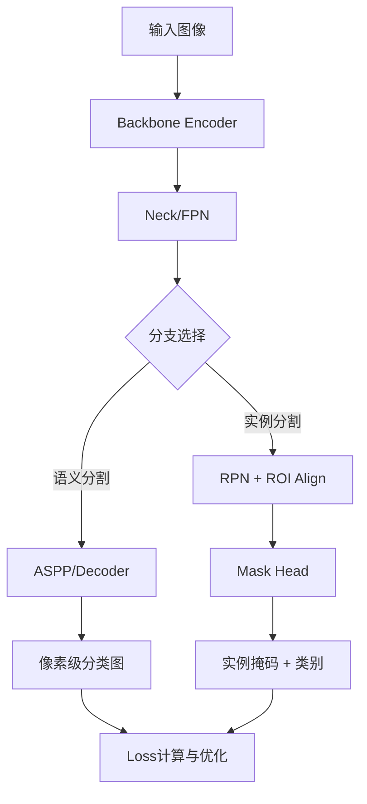
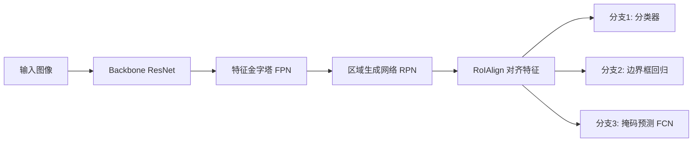

# 图像分割：语义分割与实例分割

## 引言

想象一下，当你走在繁华的街道上，你的眼睛能瞬间捕捉到前方的行人、疾驰而过的汽车，甚至是路边摇曳的花朵。你的大脑毫不费力地将这些物体从背景中“抠”出来，分门别类。但对于计算机来说，这却曾经是一个巨大的难题。🤯 这就是**图像分割**的魔力所在——它不仅仅是识别图像里有“什么”，更是精确地知道“它在哪里”，让每一个像素都找到了归属。✨

作为计算机视觉领域的“硬核”技术，图像分割是实现机器从“看图”到“懂图”的关键一步。不同于简单的图像分类（这是只猫）或目标检测（画框框住猫），图像分割要求在像素级别对图像进行理解。🔍 它是自动驾驶汽车精准分辨车道线与行人的基石，也是医生在CT影像中敏锐捕捉微小病灶的利器。可以说，没有精细的图像分割，就没有真正智能的视觉应用，它是人工智能通往“视觉感知”高地的必经之路。💡

那么，计算机是如何像人类一样“看懂”复杂世界的？我们又该如何在技术层面区分“这是一群人”（语义分割）和“这是张三，这是李四”（实例分割）？这正是本文想要带你探索的核心问题。在这篇文章中，我们将拨开技术的迷雾，深入剖析那些让AI拥有了“火眼金睛”的经典算法。🧐

接下来的内容将非常硬核且精彩！我们将回顾从**FCN**开创全卷积网络先河，到**U-Net**在生物医学领域的奇迹，再到**DeepLab系列**利用空洞卷积捕捉上下文的经典演进之路；也会深入**Mask R-CNN**的内部，看它如何实现精准的实例分割；当然，还有结合两者优势的**Panoptic FPN全景分割**。最后，我们还会聊聊评估模型好坏的**mIoU、Dice系数**，以及这些技术在**医学影像**和**自动驾驶**中的实际落地应用。🚀

准备好了吗？让我们开启这段像素级的探索之旅吧！👇

### 2. 技术背景：从像素级认知到视觉智能的演进

如前所述，图像分割作为计算机视觉的核心任务，其本质是对图像进行像素级的理解与分类。如果说引言部分为我们描绘了图像分割的宏观图景，那么本节将深入探讨其背后的技术脉络、发展现状以及为何这项技术成为人工智能领域不可或缺的基石。

#### 2.1 技术演进历程：从传统方法到深度学习的爆发

图像分割技术的发展并非一蹴而就，其经历了从传统数字图像处理到基于深度学习变革的漫长历程。在深度学习普及之前，研究人员主要依赖阈值分割、边缘检测（如Canny算子）以及基于图论的算法（如Graph Cut）。这些方法虽然在一定程度上解决了简单场景的分割问题，但往往受限于手工设计的特征，难以应对复杂多变的自然场景。

真正的转折点始于卷积神经网络（CNN）的兴起。2014年，Long等人提出的**全卷积网络（FCN）**被视作现代语义分割的开山之作。FCN首次将传统的全连接层替换为卷积层，从而能够接受任意尺寸的输入图像并输出像素级的预测地图。这一创举确立了“编码器-解码器”的基本架构范式，即先通过下采样提取特征，再通过上采样恢复分辨率。

在此基础上，为了解决FCN在上采样过程中丢失精细空间信息的问题，**U-Net**应运而生。U-Net采用了独特的跳跃连接结构，将编码器不同阶段的特征图直接拼接到解码器中，极大地提升了分割的边缘精度，这也使其在医学影像分析等领域至今仍占据统治地位。与此同时，**DeepLab**系列算法则通过引入空洞卷积，在不降低分辨率的前提下扩大了感受野，有效解决了多尺度目标的分割难题。SegNet等架构也在内存效率与精度的权衡上做出了探索，推动了技术的快速迭代。

#### 2.2 分层细化与当前技术格局

随着对场景理解要求的提高，技术逐渐从单一的语义分割向更高阶的形态演进。**语义分割**虽然能将图像中的所有“车”标记为一类，但无法区分具体的每一辆车。为了解决这一局限，**实例分割**技术应运而生。其中的代表作**Mask R-CNN**在Faster R-CNN的检测框架基础上增加了一个掩码预测分支，实现了“检测+分割”的统一，能够精确区分出同一类别下的不同个体（如车A和车B），任务难度与实用性均大幅提升。

当前的技术格局正处于“三足鼎立”与“大模型融合”的阶段。除了语义分割与实例分割，**全景分割**旨在统一背景（语义分割）与前景（实例分割）的预测，**Panoptic FPN**便是这一方向的典型代表，它通过共享特征提取骨干网络，高效地完成了全景场景的理解。

更值得关注的是，近年来随着Transformer架构在视觉领域的渗透，分割技术正迎来新一轮的变革。以SegFormer、Vision Transformer为代表的模型凭借其强大的全局建模能力，正在挑战传统CNN的霸主地位。同时，以Meta发布的**Segment Anything Model (SAM)** 为代表的基础模型，展现出了惊人的零样本分割能力，标志着图像分割技术正从特定任务向通用视觉智能演进。

#### 2.3 为何我们需要图像分割？

图像分割技术的核心价值在于其提供了对世界最精细的量化能力。在自动驾驶领域，简单的物体检测框只能告诉我们“前方有车”，而像素级的分割能精确判断车道的边界、人行道的范围以及路面上的障碍物形态，这是车辆进行路径规划与决策安全的根本前提。

在医学影像领域，图像分割更是扮演着“生命守护者”的角色。医生需要精确地勾勒出肿瘤的体积、器官的轮廓以进行放疗规划或手术导航。U-Net等技术的出现，使得自动化病灶分割成为可能，极大地减轻了医生的负担并提高了诊断的准确性。此外，在视频会议背景虚化、增强现实（AR）、无人机精准农业等场景中，分割技术都是实现人机交互与现实感知的关键接口。

#### 2.4 面临的挑战与未来难题

尽管取得了显著进展，但图像分割仍面临诸多严峻挑战。首先是**数据标注的成本高昂**。与简单的分类或检测框标注相比，像素级的掩码标注极其耗时耗力，这限制了高质量数据的规模。

其次，**复杂场景的泛化能力**仍需提升。在遮挡严重、光照极端、或者是小目标（如远处的行人）的情况下，算法往往容易出现分割断裂或误判。此外，**实时性与精度的权衡**也是落地应用的一大痛点，尤其是在自动驾驶等对延迟敏感的移动端场景中，如何在有限的算力下实现高精度的实时分割，仍是工程界亟待解决的难题。

综上所述，图像分割技术从FCN的初露锋芒到如今多模态、大模型的百花齐放，其发展历程深刻体现了计算机视觉从“看见”到“看懂”的跨越。理解这一技术背景，对于我们深入探讨后续的具体算法原理及应用至关重要。


### 3. 技术架构与原理

承接上一节提到的技术演进，本节将深入解析当前图像分割主流算法的骨架与核心原理。从语义分割的像素级分类，到实例分割的物体检测与分割融合，其技术架构设计旨在解决“是什么（语义）”和“在哪里（实例）”的双重问题。

#### 3.1 整体架构设计
现代分割网络大多遵循 **Encoder-Decoder（编码器-解码器）** 架构，或基于 **两阶段检测器** 的扩展架构。

*   **语义分割（以FCN/U-Net为例）**：
    *   **Encoder（下采样）**：利用CNN（如ResNet、VGG）提取高维语义特征，逐步降低空间分辨率。
    *   **Decoder（上采样）**：通过反卷积或插值恢复空间分辨率，将抽象特征映射回原图尺寸。
    *   **关键点**：U-Net 引入了**跳跃连接**，将编码器的浅层高分辨率特征直接拼接到解码器中，有效解决了深层网络中空间细节丢失的问题，这在医学影像分割中尤为关键。

*   **实例分割（以Mask R-CNN为例）**：
    *   这是 Faster R-CNN 的自然延伸。在原有的分类和边框回归分支之外，并行增加了一个 **Mask 分支**。
    *   **架构逻辑**：先通过RPN（区域生成网络）提取候选区域（RoI），再对每个区域进行特征对齐，最后并行输出类别、框坐标和二值掩码。

#### 3.2 核心组件与关键技术
除了整体架构，以下组件是提升分割精度的核心驱动力：

1.  **空洞空间金字塔池化**：
    主要应用于 DeepLab 系列。通过并行的不同膨胀率的空洞卷积，以多尺度捕捉上下文信息，有效增大了感受野，无需降低分辨率即可整合全局语义。
2.  **ROI Align**：
    这是 Mask R-CNN 的基石。之前的 ROI Pooling 会因两次量化导致特征与原始像素不对齐。ROI Align 取消了量化操作，利用双线性插值精确计算特征值，显著提升了掩码的像素级精度。
3.  **全景分割**：
    结合了语义分割与实例分割，通过 Panoptic FPN 等架构，统一处理“Stuff”（如天空、道路）和“Thing”（如行人、车辆）的分割任务。

#### 3.3 工作流程与数据流
下图概括了典型分割模型的数据流转过程：



在训练阶段，模型通过损失函数优化参数。常用的损失函数除了交叉熵损失外，还有 **Dice Loss**，主要用于解决正负样本（前景与背景）极度不平衡的问题，常见于医学小目标分割。

#### 3.4 算法对比与选择
下表对比了前文提及的核心算法特性：

| 算法 | 核心架构 | 关键技术 | 典型应用场景 |
| :--- | :--- | :--- | :--- |
| **FCN** | Encoder-Decoder | 全卷积化，端到端 | 自然图像语义分割 |
| **U-Net** | Encoder-Decoder (+ Skip) | 跳跃连接，特征融合 | **医学影像**分割（CT/MRI） |
| **DeepLab v3+** | Encoder-Decoder | ASPP, 深度可分离卷积 | 需要大感受野的场景（自动驾驶路感） |
| **Mask R-CNN** | Two-Stage | ROI Align, 多任务学习 | **自动驾驶**物体检测与分割 |

综上所述，理解分割技术的架构与原理，关键在于把握特征提取的层次与细节恢复的平衡，以及针对不同任务（如医学影像追求边缘精度，自动驾驶追求实时性与多尺度）进行模块的选型与优化。


### 3. 关键特性详解

在上一节中，我们回顾了图像分割从传统的阈值分割到深度学习时代的演进历程。如前所述，随着全卷积网络（FCN）的提出，分割技术迎来了质的飞跃。本节将深入剖析当前主流算法的关键特性、性能指标及其实际应用价值。

#### 3.1 核心功能特性解析

现代图像分割算法主要分为**语义分割**与**实例分割**两大阵营，其核心功能特性的差异主要体现在对“物”与“类”的处理上。

*   **语义分割代表算法**：
    *   **FCN (Fully Convolutional Networks)**：作为开山之作，其核心特性是将全连接层转化为卷积层，实现了端到端的像素级预测，能够接受任意尺寸的输入图像。
    *   **U-Net**：专为医学影像设计，其标志性特征是**U型对称结构**与**跳跃连接**。这种结构有效融合了深层抽象语义特征与浅层细节信息，极大地提升了边缘分割的精度。
    *   **DeepLab系列**：核心创新在于引入了**空洞卷积**，在扩大感受野的同时不降低特征图分辨率，并结合ASPP（Atrous Spatial Pyramid Pooling）模块捕获多尺度上下文信息。

*   **实例分割代表算法**：
    *   **Mask R-CNN**：在Faster R-CNN的基础上增加了一个掩模预测分支。其关键创新点在于**RoIAlign**（感兴趣区域对齐），消除了RoIPooling带来的量化误差，实现了高精度的像素级对齐。
    *   **Panoptic FPN**：结合了语义分割（Stuff，如背景）和实例分割（Things，如车辆），实现了全景分割的统一。

#### 3.2 性能指标与规格

评估分割模型的性能通常依赖于特定的定量指标，其中最核心的包括 mIoU 和 Dice 系数。

以下是计算 Dice 系数的 Python 代码示例，该指标常用于医学图像分割评估，对小型目标较为敏感：

```python
import numpy as np

def dice_coefficient(y_true, y_pred, smooth=1e-6):
    """
    计算 Dice 系数
    :param y_true: 真实标签
    :param y_pred: 预测标签
    :param smooth: 平滑项，防止分母为0
    :return: Dice 系数
    """
    intersection = np.sum(y_true * y_pred)
    return (2. * intersection + smooth) / (np.sum(y_true) + np.sum(y_pred) + smooth)

# 示例计算
true_mask = np.array([1, 1, 0, 1])
pred_mask = np.array([1, 0, 0, 1])
print(f"Dice Coefficient: {dice_coefficient(true_mask, pred_mask):.4f}")
```

**关键指标对比表：**

| 指标名称 | 全称 | 计算逻辑 | 适用场景 |
| :--- | :--- | :--- | :--- |
| **mIoU** | mean Intersection over Union | (交集 / 并集) 的均值 | 通用语义分割，强调类别重合度 |
| **Dice Coeff** | Dice Coefficient | 2\*交集 / (像素和) | 医学影像分割，强调对小目标的敏感度 |
| **FWIoU** | Frequency Weighted IoU | 根据类别频率加权的 IoU | 类别分布极度不均衡的数据集 |

#### 3.3 技术优势与创新点

当前分割算法的主要技术优势在于**多尺度特征融合**与**上下文信息捕获**。例如，DeepLab 利用 ASPP 模块通过不同采样率的空洞卷积并联采样，有效解决了多尺度物体分割困难的问题；而 U-Net 的跳跃连接架构则解决了编码过程中空间信息丢失的痛点。

对于实例分割，Mask R-CNN 展示了**多任务学习**的优势，即在同一个网络中同时完成目标检测、分类与掩模生成，且各任务之间相互促进，提升了推理效率。

#### 3.4 适用场景分析

凭借上述特性，图像分割技术在以下领域展现了强大的应用价值：

1.  **医学影像诊断**：利用 U-Net 及其变体（如 3D U-Net），医生可以自动分割肿瘤、器官或血管区域。如前所述，U-Net 对边缘的高精度保留能力，使其成为 CT 和 MRI 图像分析的标准工具。
2.  **自动驾驶环境感知**：车辆需要实时识别可行驶区域（语义分割）以及周围的行人、车辆（实例分割）。Mask R-CNN 和 Panoptic FPN 能够帮助汽车理解复杂的街道场景，为路径规划和避障提供关键数据支持。


### 3. 核心技术解析：核心算法与实现

如前所述，图像分割技术的演进是从像素级理解开始的。承接上一节对技术背景的讨论，本节将深入探讨支撑语义分割与实例分割的核心算法原理及其实现机制。

**3.1 语义分割的核心架构**
全卷积网络（FCN）是这一领域的基石。其核心原理在于摒弃了传统CNN中的全连接层，全面采用卷积层，使得网络能够接受任意尺寸的输入图像。FCN通过**上采样**（Up-sampling）将粗糙的特征图恢复至原始图像尺寸，关键创新在于引入“跳跃连接”，融合深层语义信息与浅层空间细节。

U-Net则在FCN的基础上进一步优化，采用了典型的**Encoder-Decoder**（编码器-解码器）对称结构。其关键数据结构在于特征通道的拼接，这种设计确保了边缘信息的精准传递，特别适用于医学影像等对精度要求极高的场景。

DeepLab系列则聚焦于多尺度信息的捕捉。它引入了**空洞卷积**，在扩大感受野的同时不降低特征图分辨率，配合**ASPP**（带孔空间金字塔池化）模块，有效解决了图像中物体大小不一的问题。

**3.2 实例分割与Mask R-CNN**
实例分割要求区分同类个体。Mask R-CNN是Faster R-CNN的自然延伸，它在边界框识别分支之外，并行增加了一个**Mask分支**。通过**RoIAlign**（感兴趣区域对齐）替代粗糙的RoI Pooling，消除了量化误差，实现了像素级掩码的精准生成。Panoptic FPN进一步融合了语义分割与实例分割的输出，实现了全景分割。

**3.3 关键实现细节与评估**
在实现层面，网络处理的核心数据结构通常是四维张量 $[B, C, H, W]$。评估模型性能时，**mIoU**（平均交并比）衡量预测区域与真实区域的重叠度，而**Dice系数**则主要用于样本不平衡情况（如医学小病灶分割），其公式为 $ \frac{2|X \cap Y|}{|X| + |Y|} $。

以下是一个简化的PyTorch代码示例，展示了分割网络中常用的转置卷积上采样实现，这是FCN和U-Net恢复图像分辨率的关键步骤：

```python
import torch
import torch.nn as nn

class UpSampleBlock(nn.Module):
    def __init__(self, in_channels, out_channels):
        super(UpSampleBlock, self).__init__()
# 使用转置卷积进行上采样
        self.conv_trans = nn.ConvTranspose2d(in_channels, out_channels, 
                                             kernel_size=2, stride=2)
        self.double_conv = nn.Sequential(
            nn.Conv2d(out_channels, out_channels, kernel_size=3, padding=1),
            nn.ReLU(inplace=True)
        )

    def forward(self, x):
# 上采样并进一步卷积提取特征
        x = self.conv_trans(x)
        return self.double_conv(x)

# 模拟输入特征图 [Batch, Channels, Height, Width]
# input_feat = torch.randn(1, 512, 32, 32)
# upsample_block = UpSampleBlock(512, 256)
# output_feat = upsample_block(input_feat)
# print(output_feat.shape) # 输出形状: torch.Size([1, 256, 64, 64])
```

**核心算法对比表**

| 算法 | 类型 | 核心机制 | 适用场景 |
| :--- | :--- | :--- | :--- |
| **FCN** | 语义分割 | 全卷积 + 跳跃连接 | 自然场景通用分割 |
| **U-Net** | 语义分割 | Encoder-Decoder + 特征拼接 | 医学影像、小样本数据 |
| **Mask R-CNN** | 实例分割 | 两阶段检测 + RoIAlign + Mask头 | 自动驾驶（行人/车辆分割） |

通过上述算法与实现细节的分析，我们可以看到从简单的像素分类到复杂的结构化预测，分割技术在精度与效率上正在不断突破边界。


### 🛠️ 技术对比与选型：如何在实战中做出最优解？

如前所述，我们已经探讨了图像分割从FCN全卷积网络到DeepLab系列，再到Mask R-CNN的技术演进脉络。然而，在面对具体工程落地时，核心难点往往不在于算法本身的实现，而在于如何根据业务需求在**语义分割**与**实例分割**之间做出精准权衡，并选择最适合的基座模型。

#### 1. 核心技术横向对比

为了更直观地展示不同分割范式的差异，我们选取了典型模型进行多维对比：

| 分割类型 | 核心逻辑 | 代表模型 | 优势 | 劣势 | 典型应用场景 |
| :--- | :--- | :--- | :--- | :--- | :--- |
| **语义分割** | 像素级分类，不区分个体 | FCN, U-Net, DeepLab | 推理速度相对较快，结构清晰 | 无法区分重叠或同类的独立个体 | 医学病灶区域分割、自动驾驶路面识别 |
| **实例分割** | 目标检测 + 语义分割 | Mask R-CNN | 能精准勾勒物体轮廓，支持计数 | 计算开销大，实时性较差 | 无人机巡检、工业缺陷计数 |
| **全景分割** | 语义与实例的统一 | Panoptic FPN | 场景理解最全面，无重叠冲突 | "东西"（Stuff）类别定义复杂 | 室内机器人导航、复杂城市场景重建 |

#### 2. 选型建议与实战策略

在选择技术路线时，需紧扣场景痛点：
*   **医学影像分析**：首选 **U-Net**。医学数据通常样本量小，但对边缘精度要求极高。U-Net的跳跃连接（Skip Connection）能有效结合深层语义和浅层细节，在Dice系数等指标上表现优异。
*   **自动驾驶感知**：视具体任务而定。若仅需区分“车道线”与“路面”，**DeepLabV3+** 是高性价比之选；若需同时识别“前方车辆ID”及行进轨迹，则必须使用 **Mask R-CNN** 或 **Panoptic FPN**。
*   **实时性要求高的边缘设备**：建议考虑基于FCN改进的轻量化模型（如BiSeNet），而非Mask R-CNN。

#### 3. 迁移学习注意事项

在进行模型迁移或微调时，需警惕以下两个核心问题：

1.  **类别不平衡**：如前文提到的mIoU指标，在背景像素远多于前景目标的场景（如小目标检测）中，模型容易倾向于预测背景。此时，应修改损失函数，引入 **Dice Loss** 或 **Focal Loss** 来强化对难分类样本的关注。
2.  **感受野适配**：将DeepLab应用于分辨率差异极大的新数据集时，需重新调整空洞卷积的采样率，避免网格效应造成边缘信息丢失。

以下是一个在PyTorch中结合CrossEntropy与Dice Loss的简单代码示例，用于处理正负样本不平衡：

```python
import torch
import torch.nn as nn
import torch.nn.functional as F

class DiceBCELoss(nn.Module):
    def __init__(self, weight=None, size_average=True):
        super(DiceBCELoss, self).__init__()

    def forward(self, inputs, targets, smooth=1):
# flatten label and prediction tensors
        inputs = inputs.view(-1)
        targets = targets.view(-1)
        
# 核心逻辑：结合BCE的稳定性与Dice的形状敏感性
        intersection = (inputs * targets).sum()                            
        dice_loss = 1 - (2.*intersection + smooth)/(inputs.sum() + targets.sum() + smooth)  
        BCE = F.binary_cross_entropy(inputs, targets, reduction='mean')
        Dice_BCE = BCE + dice_loss
        
        return Dice_BCE
```

综上所述，技术选型没有银弹，唯有深刻理解业务对**精度**与**速度**的权衡，才能在算法迭代中少走弯路。


# 第4章 架构设计：语义分割算法深度剖析

**前言**
在上一章节中，我们深入探讨了**像素级分类的核心机制**，理解了语义分割本质上是如何将图像分类问题从“图像层级”转化为“像素层级”的。我们提到了，为了实现这一转化，网络架构必须解决两个核心矛盾：**如何保留丰富的空间细节信息**与**如何获取深层的语义上下文信息**。

仅仅依靠基础的理论机制并不足以在复杂场景中取得优异表现。本章将视角拉升至**架构设计**的宏观层面，详细剖析经典的语义分割网络模型。从开山鼻祖FCN到医学影像霸主U-Net，再到引入空洞卷机的DeepLab系列，以及最新的Transformer架构，我们将逐一拆解它们是如何通过精巧的结构设计，巧妙地平衡特征提取的深度与精度，并解决实际应用中的痛点。

---

### 4.1 FCN（Fully Convolutional Networks）：全卷积的端到端变革

在深度学习应用于分割的早期，传统的做法通常是基于分类网络（如VGG、AlexNet）对图像进行切块处理，这种方式计算冗余且效率低下。**FCN（全卷积网络）**的出现，可以说是分割领域的一次“辛亥革命”，它首次确立了**端到端**语义分割的基本范式。

**1. 抛弃全连接层，拥抱任意尺寸输入**
如前所述，传统的CNN网络末端通常连接着全连接层，这要求输入必须是固定的尺寸（例如224x224）。FCN最核心的贡献在于将所有的全连接层替换为卷积层。这一改变使得网络可以接受任意尺寸的输入图像，并输出对应尺寸的热力图，从而实现了从图像到像素的直接映射。

**2. 跳跃连接架构**
虽然全卷积化解决了输入尺寸限制，但直接将特征图上采样回原图大小（例如通过32倍上采样）会导致大量的空间细节丢失，生成的分割边缘往往比较粗糙。为了解决这个问题，FCN引入了**跳跃连接**结构。
FCN设计了三种变体：FCN-32s、FCN-16s和FCN-8s。其核心思想是将深层网络（语义信息强但分辨率低）的特征图，与浅层网络（语义信息弱但包含丰富位置细节）的特征图进行融合。
以FCN-8s为例，它将Pool4的特征（2倍上采样）和Pool3的特征（4倍上采样）逐元素相加到最终的特征图中。这种**“深层语义+浅层细节”**的融合策略，极大地修复了分割结果的边缘细节，成为了后续许多分割架构设计的基石。

### 4.2 U-Net：Encoder-Decoder架构的典范

如果说FCN是分割领域的奠基者，那么**U-Net**则是将这一架构推向极致的集大成者，特别是在**医学影像分析**领域，U-Net几乎占据了统治地位。

**1. 对称的U型结构与长跳跃连接**
U-Net采用了典型的**Encoder-Decoder（编码器-解码器）**架构。网络形状呈对称的“U”型：
*   **编码器**：负责特征提取和下采样，通过不断压缩空间尺寸来捕捉高层语义。
*   **解码器**：负责上采样和空间尺寸恢复，逐步重建图像的边界。

与FCN简单的逐元素相加不同，U-Net在解码器上采样的每一步，都会将编码器对应阶段的特征图**拼接**到当前解码器的特征图上。这种**长跳跃连接**不仅传递了位置信息，更在特征通道维度上丰富了上下文信息。由于拼接操作比加法操作保留了更多的原始特征信息，U-Net在样本量较少的医学图像任务中表现出了惊人的鲁棒性。

**2. 针对医学影像的优化设计**
医学影像数据通常存在标注样本少、边缘模糊、背景复杂等特点。U-Net的设计哲学恰好契合了这些需求：通过深层的架构提取病灶的高级语义特征，同时通过跳跃连接最大程度地保留组织器官的边缘轮廓。此外，U-Net能够接受任意大小的输入并在单个前向传播中输出所有像素的预测，这种高效的推理机制使其在临床应用中极具价值。

### 4.3 DeepLab系列演进：空洞空间金字塔池化（ASPP）

在FCN和U-Net中，为了扩大感受野以获取更多上下文信息，通常使用池化层或步长卷积来降低特征图分辨率。但这不可避免地导致细节丢失。**DeepLab系列**（Google出品）则另辟蹊径，通过**空洞卷积**和**空洞空间金字塔池化（ASPP）**，在不降低分辨率的前提下，实现了大感受野的覆盖。

**1. 空洞卷积的引入**
空洞卷积通过在卷积核的元素之间插入“空洞”（即扩大卷积核中像素点的间距），在不增加参数量和计算量的情况下，指数级地扩大了感受野。这意味着网络可以在保持原始特征图分辨率的同时，捕获更广阔的图像上下文，对于识别大尺寸物体至关重要。

**2. ASPP：多尺度信息的捕获者**
然而，单一的空洞率很难适应图像中大小不一的物体（远处的汽车很大，近处的行人更大，或者反之）。为此，DeepLab v3提出了著名的**ASPP模块**。
ASPP模块包含若干个并行的空洞卷积分支，它们具有不同的采样率（例如1, 6, 12, 18等），相当于从不同的“尺度”观察图像。此外，还包含一个全局平均池化分支来编码整张图像的语义。最后，这些分支的特征被拼接并融合。这种**“多尺度并行采样”**的设计，使得DeepLab在处理复杂场景和不同尺度物体时展现出了极强的适应性。到了DeepLab v3+，更是引入了类似于Encoder-Decoder的结构，进一步优化了边缘分割效果。

### 4.4 SegNet与编码器-解码器变体：基于索引的上采样

在架构演进的历史中，**SegNet**也是一个不可忽视的里程碑。它同样基于Encoder-Decoder架构，但在上采样机制上提出了独特的创新。

**1. 基于索引的最大池化**
传统的上采样方法（如反卷积）通常需要学习参数，且容易出现棋盘格效应。SegNet的关键创新在于**最大池化索引**的记录与传递。
在编码器进行最大池化操作时，SegNet不仅输出降维后的特征图，还记录了每个最大值像素点的**位置索引**。在解码器进行上采样时，不再通过学习权重，而是直接利用之前记录的索引将像素值放回原来的位置。
这种机制的好处是极大减少了上采样阶段的参数量，同时也更好地保留了边缘信息。然而，由于它只传递索引而不传递特征值，导致高层语义特征在解码过程中补充不足，因此SegNet通常在边缘精度要求高但计算资源受限的场景下有所应用。

### 4.5 基于Transformer的架构：SegFormer等新架构对CNN的挑战与补充

近年来，随着Vision Transformer（ViT）在计算机视觉领域的崛起，分割架构的设计也迎来了从CNN向Transformer的范式转移。

**1. 突破局部感受野的限制**
如前所述，CNN通过卷积操作提取局部特征，需要通过堆叠层数才能获得全局感受野。而Transformer基于自注意力机制，天生具备**建模长距离依赖**的能力。对于一个像素点，Transformer可以直接通过注意力机制关注到图像中任意位置的其他像素，这对于理解复杂的语义上下文（例如“马路”和“汽车”的关联）具有天然优势。

**2. SegFormer：简单而强大的设计哲学**
以**SegFormer**为例，它展示了Transformer在分割任务上的强大潜力。SegFormer摒弃了复杂的解码器设计，采用一个轻量级的全多层感知机（MLP）解码器。
它的架构主要由两部分组成：
*   **层次化Transformer编码器**：类似于CNN的分层结构（从浅层的小分辨率到深层的大分辨率），提取多尺度特征。
*   **MLP解码器**：将编码器输出的多尺度特征融合，直接通过MLP层预测分割掩码。

SegFormer的核心优势在于它不依赖位置编码，这使得它对输入图像尺寸的变化具有极强的鲁棒性，并且推理速度极快。这标志着分割架构设计从“手工设计复杂的连接结构”（如FCN、DeepLab）逐渐转向“利用注意力机制自动捕捉全局上下文”的新阶段。Transformer架构并非完全取代CNN，而是提供了一种补充，特别是在处理需要全局一致性的场景下表现优异。

---

**本章小结**
从FCN首次确立全卷积端到端训练，到U-Net通过长跳跃连接征服医学影像，再到DeepLab利用ASPP解决多尺度问题，以及SegFormer利用Transformer重塑全局特征建模，语义分割的架构设计经历了一次次的迭代与进化。

这些架构虽然形态各异，但设计思路万变不离其宗：**如何在有限的计算资源下，最大程度地兼顾像素的空间定位精度与特征的语义抽象能力。** 掌握了这些经典架构的设计精髓，将为我们下一章探讨更具挑战性的**实例分割**以及具体的**评估指标**打下坚实的基础。


### 5. 技术架构与原理：从实例分割到全景感知

如前所述，我们在上一节中深入探讨了以FCN、U-Net和DeepLab为代表的语义分割架构。这些网络虽然能精准地“理解”每个像素的类别，但在处理“同一类别中不同个体”的区分问题时显得力不从心。为了解决这一痛点，**实例分割**应运而生，而**全景分割**则进一步统一了语义与实例的界限。本节将重点解析这一更复杂的技术架构与工作原理。

#### 5.1 核心组件：Mask R-CNN 的双重任务架构
实例分割的里程碑式架构是 **Mask R-CNN**。它在 Faster R-CNN 的目标检测框架基础上，进行了巧妙的架构扩展。其核心创新在于并行的多任务输出设计，不仅预测边界框，还通过一个全卷积网络（FCN）预测二进制掩码。



**关键技术原理：RoIAlign**
在架构设计中，**RoIAlign** 是至关重要的组件。早期的 RoIPooling 涉及两次量化操作，会导致特征与原始像素位置的不对齐，进而影响掩码的精细度。RoIAlign 取消了量化，使用双线性插值来计算精确的特征值。这一改进使得像素级的对齐成为可能，显著提升了分割边缘的平滑度。

#### 5.2 进阶架构：Panoptic FPN 的统一
为了实现“全景分割”（即同时处理“物体”和“背景”），**Panoptic FPN** 提出了一种简洁而高效的架构。它复用了 FPN（特征金字塔网络）的多尺度特征，无需额外的独立计算分支：
1.  **自顶向下通路**：提取高分辨率的语义特征。
2.  **实例分割分支**：利用 Mask R-CNN 处理可数物体。
3.  **语义分割分支**：利用轻量级卷积头处理背景区域。
最终，通过一个基于像素的合并算法，将两个分支的结果融合为统一的全景图。

#### 5.3 评估指标与数据流
分割模型的输出通常是高维张量，评估其性能需依赖特定的指标：

| 指标 | 全称 | 核心原理 | 适用场景 |
| :--- | :--- | :--- | :--- |
| **mIoU** | mean Intersection over Union | 计算预测区域与真实区域交集与并集之比的平均值 | 语义分割通用评估 |
| **Dice Coefficient** | Dice 系数 | $ \frac{2 \times |X \cap Y|}{|X| + |Y|} $，即2倍交集除以像素总数 | 医学影像（样本不平衡时） |

在实际应用的数据流中，图像首先经过 Backbone 提取特征，通过 Neck（如 FPN）进行多尺度融合，最后 Head 层输出每个像素的类别置信度或掩码。例如，在**自动驾驶**场景中，架构需要实时输出车道线（语义）和周边车辆（实例）的精确位置；在**医学影像**分析中，Dice 系数常被用作损失函数的一部分，以确保肿瘤分割区域的极度准确。

综上所述，从 Mask R-CNN 的精准实例提取到 Panoptic FPN 的全局感知，分割架构正朝着更高效、更统一的方向演进。


## 📊 5. 关键特性详解：从语义到实例的跨越

紧接上一章对FCN、U-Net等架构设计的深度剖析，我们了解了模型的“骨架”。本节将聚焦于这些架构在实际应用中展现的核心“肌肉”特性，深入探讨语义分割与实例分割的关键功能差异、评估标准及其独特的应用优势。

### 🎯 1. 主要功能特性

如前所述，架构设计决定了特征提取的能力，而输出形式则定义了任务的性质：

*   **语义分割的像素级归类**：核心特性在于对场景中所有同类对象赋予统一标签，不区分个体。例如，DeepLab系列利用空洞卷积有效扩大感受野，能精准识别道路上的所有像素为“背景”，但无法区分是第一辆车还是第二辆车。
*   **实例分割的个体分离能力**：这是Mask R-CNN的强项。它在目标检测的基础上增加了掩码分支，不仅知道“哪里是车”，还能区分“这是车A，那是车B”。
*   **全景分割的统一**：Panoptic FPN作为进阶形态，融合了语义分割（背景/Stuff）和实例分割（物体/Thing）的特性，实现了场景理解的无缝覆盖。

### 📏 2. 性能指标与规格

评估分割模型的效果，主要依赖以下量化指标，其计算逻辑如下：

```python
# 伪代码展示核心指标计算
def calculate_metrics(pred, target):
# 1. mIoU (Mean Intersection over Union)
    intersection = (pred & target).sum()
    union = (pred | target).sum()
    iou = intersection / (union + 1e-6) # 避免除零
    
# 2. Dice Coefficient (F1 Score)
    dice = 2 * intersection / (pred.sum() + target.sum() + 1e-6)
    
    return iou, dice
```

*   **mIoU (平均交并比)**：最常用的标准指标，计算预测区域与真实区域的重叠程度。数值越接近1，性能越优越。
*   **Dice系数**：特别适用于医学影像等正负样本极度不平衡的场景（如小肿瘤分割），因为它对集合大小的变化更敏感。

### ⚡ 3. 技术优势与创新点

*   **U-Net的跳跃连接**：这是医学影像分析的基石。通过将编码器的浅层特征直接拼接到解码器，完美保留了边缘细节，解决了深层网络中空间信息丢失的问题。
*   **Mask R-CNN的ROI Align**：相较于传统的ROI Pooling，ROI Align取消了量化操作，通过双线性插值保持空间精度，这对生成高质量的实例掩码至关重要。
*   **DeepLab的ASPP结构**：利用不同采样率的空洞卷积并行提取多尺度特征，有效解决了图像中物体大小不一（如近处的树和远处的树）的识别难题。

### 🚀 4. 适用场景分析

| 算法模型 | 核心优势 | 典型应用场景 |
| :--- | :--- | :--- |
| **U-Net / 3D U-Net** | 少样本学习能力强，边缘精细 | **医学影像分析**：病灶分割（如肺结节、肿瘤细胞）、器官轮廓勾画。 |
| **Mask R-CNN / Panoptic FPN** | 兼顾检测与分割，支持多任务 | **自动驾驶**：车道线与可行驶区域分割（语义）、行人与车辆检测（实例）。 |
| **DeepLab V3+** | 多尺度适应性强，编码器-解码器结构 | **地理信息系统 (GIS)**：卫星图像中的土地利用分类、建筑物提取。 |

综上所述，从语义分割的“类”识别到实例分割的“个”体分离，再到全景分割的统一，这些关键特性共同推动了计算机视觉在精密医疗与智能驾驶领域的落地应用。


### 5. 核心算法与实现

在上一节中，我们深入剖析了U-Net和DeepLab等语义分割的架构设计，了解了它们如何通过卷积与反卷积捕捉特征并恢复空间分辨率。然而，当场景中需要区分“同一类别的不同个体”（如区分多辆不同的车）时，单纯的语义分割架构便显得力不从心。本节将聚焦于实例分割的核心算法Mask R-CNN，并深入探讨其实现细节及评估指标的代码落地。

#### 5.1 核心算法原理：Mask R-CNN
Mask R-CNN是实例分割领域的里程碑式算法，它在Faster R-CNN（用于目标检测）的基础上增加了一个掩码预测分支。其核心思想是**并行化多任务处理**：在识别目标框和类别的同时，为每个感兴趣区域生成一个二值掩码。

关键在于**RoIAlign**层。在早期的实现中，RoIPooling通常涉及两次量化操作，这会导致像素特征与原始图像位置的不对齐，造成掩码边缘粗糙。RoIAlign取消了量化，使用双线性插值来计算精确的特征值，从而显著提升了分割的像素级精度。

#### 5.2 关键数据结构与实现细节
在实现层面，Mask R-CNN处理的数据结构主要包含两类：
1.  **边界框**：四维向量 $(x, y, w, h)$，用于定位目标。
2.  **二进制掩码**：$K \times M \times M$ 的张量，其中 $K$ 是类别数，$M \times M$（通常为 $28 \times 28$）是掩码分辨率。模型对每个类别独立预测一个掩码，但在推理时仅使用预测出的对应类别的掩码。

**实现细节分析**：Mask分支通常是一个全卷积网络（FCN）。它不将掩码展平为向量（这会破坏空间信息），而是保持空间维度，最后通过sigmoid激活函数逐像素预测。

#### 5.3 代码示例与解析：分割评估指标
评估分割算法性能的核心指标是 **mIoU (mean Intersection over Union)** 和 **Dice系数**。以下是一个基于Python和NumPy的mIoU计算实现：

```python
import numpy as np

def calculate_iou(y_true, y_pred, num_classes):
    """
    计算平均交并比
    :param y_true: 真实标签 [H, W]
    :param y_pred: 预测标签 [H, W]
    :param num_classes: 类别数
    :return: mIoU
    """
    ious = []
    for cls in range(num_classes):
# 提取当前类别的真实掩码和预测掩码
        pred_inds = y_pred == cls
        target_inds = y_true == cls
        
# 计算交集和并集
        intersection = (pred_inds & target_inds).sum()
        union = (pred_inds | target_inds).sum()
        
# 避免除以0，当并集为0时IoU为1（表示该类别不存在且预测也不存在）
        if union == 0:
            ious.append(float('nan')) 
        else:
            ious.append(intersection / union)
    
# 忽略背景类或无效值计算均值
    return np.nanmean(ious)

# 示例使用
true_mask = np.array([0, 1, 1, 2])
pred_mask = np.array([0, 1, 2, 2])
print(f"mIoU: {calculate_iou(true_mask, pred_mask, 3):.4f}")
```

#### 5.4 评估指标对比
为了更全面地量化模型表现，我们通常结合多种指标：

| 指标 | 公式/定义 | 应用场景 | 特点 |
| :--- | :--- | :--- | :--- |
| **Pixel Accuracy** | (正确预测像素数) / (总像素数) | 整体概览 | 对类别不平衡极度敏感，易受背景主导 |
| **mIoU** | $\frac{1}{K}\sum \frac{TP}{TP+FP+FN}$ | 通用标准，学术最常用 | 严格考量重叠区域，对分割质量要求高 |
| **Dice Coefficient** | $\frac{2 \times |X \cap Y|}{|X| + |Y|}$ | 医学影像分割 | 对小目标更加敏感，F1分数的变体 |

综上所述，从架构设计到算法实现，图像分割技术在RoIAlign等精细化操作和mIoU等严格指标的推动下，已在自动驾驶（车道线分割）和医学影像（肿瘤病灶分割）等领域达到了极高的精度。


### 5. 技术对比与选型：语义分割 vs 实例分割

如前所述，我们已经深入剖析了FCN、U-Net及DeepLab系列的架构设计，了解了它们如何通过跳跃连接或空洞卷积捕捉上下文信息。然而，在实际工程落地中，我们往往面临更复杂的抉择：是仅仅区分“人”和“车”（语义分割），还是需要精准数出场景中有几辆车（实例分割）？本节将对这两类核心技术进行横向对比，并给出选型建议。

#### 📊 核心技术横向对比

为了直观展示差异，我们将语义分割、实例分割以及结合两者的全景分割进行对比：

| 维度 | 语义分割 | 实例分割 | 全景分割 |
| :--- | :--- | :--- | :--- |
| **核心逻辑** | 像素级分类，不区分类别个体 | 目标检测 + 分割，区分同类别个体 | 语义分割(Stuff) + 实例分割(Things)的统一 |
| **代表模型** | FCN, U-Net, DeepLab | Mask R-CNN | Panoptic FPN |
| **优点** | 推理速度快，适合背景/区域分析 | 信息丰富，支持计数、交互定位 | 场景理解最全面，无冲突重叠 |
| **缺点** | 无法处理拥挤、重叠物体 | 计算量大，显存占用高，实时性难 | 后处理逻辑复杂，训练难度大 |

#### 🚀 场景选型与迁移建议

**1. 医学影像分析**
*   **选型建议**：首选**U-Net**等语义分割模型。
*   **理由**：在病灶分割或器官提取任务中，我们更关注“哪里是病灶”而非“有几个病灶”。U-Net的对称结构和少量样本下的鲁棒性使其成为行业标准。

**2. 自动驾驶感知**
*   **选型建议**：推荐**Mask R-CNN**或**Panoptic FPN**。
*   **理由**：驾驶场景需要精确区分“前方的车A”和“前方的车B”以进行轨迹预测，同时需要识别道路背景（可行驶区域）。实例分割提供的独立掩膜能更好地处理遮挡和跟踪。

**⚠️ 迁移注意事项**
在从语义分割向实例分割迁移时，需特别注意**计算成本的激增**。如下所示，实例分割的损失函数计算更为复杂：

```python
# 损失函数差异示意
# 语义分割：关注像素级分类与区域重叠
loss_semantic = CrossEntropyLoss(pred, target) + DiceLoss(pred, target)

# 实例分割：需兼顾分类、边框回归与掩膜生成
loss_instance = (CrossEntropyLoss(pred_cls, target_cls) + 
                 SmoothL1Loss(pred_box, target_box) + 
                 BinaryCrossEntropyLoss(pred_mask, target_mask))
```

此外，在评估指标上，语义分割主要看**mIoU**（平均交并比），而实例分割常需配合**AP^mask**（掩膜平均精度）进行综合考量。在模型部署阶段，务必针对实例分割的ROI Align操作进行针对性的算子优化，以满足实时性要求。


#### 1. 应用场景与案例

**6. 实践应用：场景赋能与价值落地**

承接上文讨论的实例与全景分割技术，这些算法并非仅存于实验室的理论模型，而是已广泛渗透进关乎国计民生的核心领域。从医疗影像的精准诊断到自动驾驶的安全决策，图像分割技术正在将像素级的理解力转化为实际的生产力。

**主要应用场景分析**
图像分割技术的高价值应用主要集中在医学影像分析、自动驾驶环境感知、工业缺陷检测及遥感图像处理等领域。这些场景对分割的边缘吻合度（mIoU）和实时性提出了严苛挑战，要求算法不仅要“分得对”，还要“分得快”。

**真实案例详细解析**

*   **案例一：医学影像中的病灶精准分割**
    以U-Net及其变体为例，在肿瘤放射治疗计划中，医生需要精确勾画器官与肿瘤轮廓。传统手工勾画一幅三维CT图像需数小时，而引入U-Net进行语义分割后，系统能自动识别并分割出危及器官（OAR）和靶区（GTV）。这种像素级的精确分割，有效避免了射线对健康组织的损伤，同时将医生的预处理时间缩短了70%以上。

*   **案例二：自动驾驶中的全景环境感知**
    在复杂城市场景下，车辆需同时理解道路语义与具体障碍物。结合DeepLab系列语义分割与Mask R-CNN，感知系统能在统一框架下完成“可行驶区域”的语义划分，同时利用全景分割技术精准区分前方密集的车辆与行人（实例分割）。这种双重感知能力，确保了车辆在拥挤路况下既能识别车道线边界，又能准确跟踪动态障碍物，为路径规划提供了高可信度的数据支撑。

**应用效果与ROI分析**
从应用效果看，基于深度学习的分割模型在关键指标上表现优异，mIoU（平均交并比）在特定数据集上已突破85%，Dice系数也达到临床应用标准。

在ROI（投资回报率）方面，虽然高性能模型的算力投入成本较高，但其收益显著：
1.  **效率提升**：工业质检中，自动化分割替代人工复检，使单张图片检测时间从秒级降至毫秒级，半年内即可收回硬件与开发成本；
2.  **风险规避**：在医疗与驾驶领域，分割精度带来的误诊率降低和事故减少，创造了巨大的社会价值与隐形经济收益。

综上所述，图像分割技术正从单纯的技术突破走向规模化商用，成为AI赋能各行各业的坚实底座。


### 第6章 实践应用：实施指南与部署方法 🛠️

承接上文关于Mask R-CNN与Panoptic FPN等关键特性的讨论，我们已从理论与架构层面理解了图像分割的核心。接下来，本章将进入实操环节，详细介绍如何将FCN、U-Net或DeepLab等模型从实验室环境推向实际应用。

**1. 环境准备和前置条件**
构建高效的分割系统首先需要配置稳健的软硬件环境。硬件层面，由于像素级分类带来的巨大计算量，建议配备NVIDIA GPU（如RTX 3090或A100）并安装CUDA与cuDNN库。软件层面，推荐使用Python 3.8及以上版本，并基于PyTorch或TensorFlow框架进行开发。为了加速开发进程，可以引入MMDetection或Detectron2等开源库，它们已内嵌了前文提到的U-Net及DeepLabv3+等模型，便于直接调用。

**2. 详细实施步骤**
实施过程始于数据处理。根据应用场景（如自动驾驶或医学影像），需将数据集转换为特定格式（如COCO或Cityscapes格式），并进行归一化与增强处理。在模型训练阶段，针对分割任务常见的“类别不平衡”问题，建议在损失函数中引入Dice Loss或Focal Loss。正如前文所述，DeepLab系列利用空洞卷积扩大感受野，因此在配置超参数时需特别注意膨胀率的设置，以确保在不损失分辨率的前提下捕获多尺度上下文信息。

**3. 部署方法和配置说明**
模型训练收敛后，需将其转换为生产环境可用的格式。对于资源受限的边缘设备（如车载芯片或医疗仪器），通常采用TensorRT或ONNX Runtime进行推理加速。部署时，需将动态图转为静态图，并利用量化技术（如FP16或INT8）压缩模型体积。在自动驾驶场景中，还需配置多线程推理流水线，以确保算法能以高帧率实时处理摄像头数据流，满足低时延要求。

**4. 验证和测试方法**
最后，通过严格的指标验证模型性能。如引言中所述，需重点计算mIoU（平均交并比）来评估语义分割的整体像素准确性，并利用Dice系数衡量医学影像中特定病灶（如肿瘤）的重叠度。除了定量评估，可视化测试同样关键，通过绘制混淆矩阵和对比分割掩码，可以直观发现模型在边缘细节或小目标识别上的缺陷，从而进行针对性调优。


#### 3. 最佳实践与避坑指南

**6. 最佳实践与避坑指南**

在深入理解了Mask R-CNN的实例分割能力及Panoptic FPN的全景融合机制后，如何将这些技术高效落地至实际生产环境，是决定项目成败的关键。以下是基于工程经验的实战指南：

**1. 生产环境最佳实践**
数据质量的把控至关重要。对于医学影像等对精度要求极高的领域，除了常规的归一化，务必引入针对强度不均的预处理。在自动驾驶等动态场景中，针对小目标（如远处的行人）难以捕捉的问题，建议采用多尺度训练（Multi-scale Training）和测试增强，确保模型对不同尺寸物体的鲁棒性。此外，务必保证训练集与真实场景的数据分布一致，避免严重的域偏移。

**2. 常见问题和解决方案**
边界分割模糊是工程中的高频痛点。解决方案是在损失函数中加入边缘辅助监督，或在后处理中使用CRF（条件随机场）细化边缘。此外，针对前文提到的类别不平衡问题（如背景区域远大于前景），单纯使用交叉熵Loss往往效果不佳，应优先采用**Dice Loss**或Focal Loss，强制模型关注难分样本，防止模型被大类别主导而忽略小目标。

**3. 性能优化建议**
实时性是落地的另一大挑战。若DeepLab系列推理过慢，可尝试用轻量级骨干网络（如MobileNetV3）替换ResNet。同时，利用模型剪枝和量化技术（如TensorRT）进行加速，通常能在mIoU轻微下降的前提下，实现3-5倍的推理速度提升。对于复杂场景，知识蒸馏也是提升轻量模型性能的有效手段。

**4. 推荐工具和资源**
工欲善其事，必先利其器。推荐使用**MMDetection**和**PaddleSeg**，它们集成了FCN、U-Net至Mask R-CNN的各类SOTA算法，开箱即用。此外，关注Meta的**Segment Anything Model (SAM)**，作为通用大模型，它能提供强大的预训练特征，可极大降低特定场景的数据标注成本。


### 7. 技术对比：语义分割与实例分割的深度博弈

在上一节中，我们深入探讨了图像分割技术在医学影像分析和自动驾驶等前沿行业的具体应用场景。正如我们所见，无论是医生手中的辅助诊断工具，还是自动驾驶汽车的环境感知系统，其背后都离不开分割算法的支撑。然而，面对纷繁复杂的实际需求，究竟是选择经典的语义分割，还是更精细的实例分割，亦或是融合两者的全景分割？这不仅是技术选型的核心问题，更是决定项目落地成败的关键一步。本节我们将从技术细节、场景适用性及迁移路径等多个维度，对这三大技术流派进行深度对比与剖析。

#### 7.1 核心机制与技术架构的深度博弈

虽然前文已经详细介绍了FCN、U-Net和Mask R-CNN等算法，但在对比的视角下，我们需要重新审视它们在处理像素级任务时的本质差异。

**语义分割**，其核心逻辑在于“类别聚合”。如前所述，FCN和DeepLab系列通过全卷积网络，将图像中的每个像素点分配给一个类别标签。其技术架构的重点在于如何扩大感受野（如ASPP模块）以及如何恢复边缘细节（如Decoder结构）。从数据结构上看，语义分割的输出是一张与原图大小相同的单通道掩膜，掩膜中的数值仅代表类别索引（如0代表背景，1代表人物）。这意味着，当图像中出现多个同类别对象（如一群人）时，语义分割会将它们融合为一个大的区域，无法区分个体边界。

相比之下，**实例分割**则是“检测与分割的结合体”。以前面提到的Mask R-CNN为例，它在Faster R-CNN目标检测框架的基础上，增加了一个掩膜预测分支。这种架构决定了它不仅能回答“这是什么”，还能回答“这是哪一个”。其输出通常是三维张量（N, H, W），其中N代表检测到的对象数量。技术难点在于如何处理重叠的物体以及如何精准地对每一个RoI（感兴趣区域）进行像素级对齐。这使得实例分割在计算复杂度上远高于语义分割，因为它包含了目标定位的额外开销。

而**全景分割**作为两者的集大成者，试图打破这一界限。它要求模型既能识别“stuff”（如天空、道路，即不可数背景），又能识别“things”（如汽车、行人，即可数前景）。Panoptic FPN通过共享特征提取骨干网络，分别接出语义分割分支和实例分割分支，最后通过融合算法解决两者在重叠区域的冲突。其核心机制在于如何优雅地统一这两类在本质上截然不同的任务。

#### 7.2 场景选型建议：精准匹配业务需求

了解技术差异后，如何根据具体场景进行选型是至关重要的。

*   **医学影像分析：语义分割（尤其是U-Net）的主场**
    在CT或MRI影像中，医生往往关注的是病灶区域（如肿瘤）的整体体积和形状，而非肿瘤的数量（通常情况下）。此外，医学影像对边缘的精度要求极高，而U-Net独特的跳跃连接结构正好解决了这一问题。此时，实例分割带来的额外计算开销往往是不必要的，除非是在细胞计数等特殊场景下。

*   **自动驾驶与机器人感知：实例与全景的必争之地**
    对于自动驾驶汽车而言，仅仅知道“前方有车”是不够的（语义分割），它必须知道“前方有几辆车，每一辆车的位置和轨迹是什么”（实例分割）。在拥挤的城市街道上，车辆和行人的遮挡非常频繁，Mask R-CNN等实例分割算法能够精准地勾勒出每一个障碍物的轮廓，从而为路径规划提供安全距离。随着技术的发展，全景分割正逐渐成为主流，因为它能同时提供可行驶区域（语义）和动态障碍物（实例）的统一感知，简化了传感器融合 pipeline。

*   **视频监控与人流分析：实例分割的典型应用**
    在商场客流统计或安防监控中，我们需要统计特定区域内经过的人数。由于人与人之间存在遮挡和重叠，语义分割将所有人粘连在一起，无法完成计数任务。此时，必须依靠实例分割将每一个独立的个体分离出来，并结合追踪算法实现轨迹分析。

#### 7.3 迁移路径与工程注意事项

在实际工程落地中，从一种分割技术迁移到另一种，或者在算法选择上进行权衡，需要考虑以下几个关键因素：

1.  **数据标注成本的天壤之别**：
    语义分割的标注相对简单，标注员只需勾勒出类别的轮廓。而实例分割要求对每一个个体进行精细的描绘，尤其是在密集场景下，标注成本呈指数级上升。如果你的项目数据稀缺，优先考虑语义分割或利用半监督学习技术。

2.  **计算资源与实时性的权衡**：
    如前文所述，Mask R-CNN虽然精度高，但其推理速度（FPS）远低于DeepLabV3+或轻量级的U-Net变体。在移动端或嵌入式设备上，大型的实例分割模型往往难以部署。如果必须部署实例分割，建议考虑YOLO-act或TensorMask等针对速度优化的算法，或者使用模型剪枝、量化技术。

3.  **评估指标的侧重点**：
    迁移过程中，评估体系也需随之调整。语义分割主要关注mIoU（平均交并比），强调类别区域的重合度；而实例分割则更多使用AP（平均精度）和掩膜AP，强调检测定位的准确性以及掩膜的质量（如Dice系数）。在全景分割中，PQ（全景质量）则是综合了识别质量和分割质量的统一指标。切换算法时，切勿沿用旧的评估标准，以免误导模型优化方向。

#### 7.4 技术对比总览表

为了更直观地展示上述分析，以下表格总结了语义分割、实例分割与全景分割的核心差异：

| 维度 | 语义分割 | 实例分割 | 全景分割 |
| :--- | :--- | :--- | :--- |
| **核心任务** | 像素级分类，不区分个体 | 目标检测 + 像素级分割，区分同类别个体 | 统一背景与前景的像素级理解 |
| **输出形式** | 单通道类别图 (H, W) | N个对象的二值掩膜集合 (N, H, W) | 统一的分段实例及其类别ID |
| **代表算法** | FCN, U-Net, DeepLab系列 | Mask R-CNN, YOLACT | Panoptic FPN, UPSNet |
| **感知能力** | 知道“是什么” (Stuff) | 知道“是什么” + “在哪里” (Things) | 全面感知“Stuff”和“Things” |
| **主要优势** | 边缘细节好，计算效率相对较高 | 能处理重叠物体，个体识别能力强 | 场景理解最完整，无歧义 |
| **典型劣势** | 无法区分同类别重叠对象 | 计算量大，数据标注成本高 | 算法设计复杂，推理速度较慢 |
| **评估指标** | mIoU (平均交并比), Dice系数 | AP (平均精度), Mask AP | PQ (全景质量), SQ, RQ |
| **最佳场景** | 医学病灶分割、遥感土地分类、背景虚化 | 自动驾驶避障、拥挤人流计数、工业质检 | L4/L5级自动驾驶、机器人视觉导航 |

综上所述，三种分割技术并非简单的替代关系，而是针对不同粒度的视觉理解需求的互补方案。在选择技术路线时，工程师不仅要考虑算法本身的原理，更要结合业务场景对精度的要求、硬件资源的限制以及数据积累的现状，做出最理性的权衡。

### 08 性能优化：速度与精度的平衡 ⚖️🚀

在前一章节中，我们深入探讨了评估分割模型“成色”的各种指标，如mIoU和Dice系数。然而，在真实的工业级落地场景中——无论是实时要求极高的自动驾驶，还是对响应速度有要求的医学影像辅助诊断——仅仅拥有高精度的模型是不够的。**如何在保持精度的同时，实现极致的推理速度？** 这就是本章我们要攻克的核心难题：性能优化中的速度与精度的平衡艺术。

#### 🧱 模型轻量化技术：给网络“瘦身”

如前所述，DeepLab系列利用空洞卷积扩大了感受野，但这不可避免地增加了计算量。为了在移动端或边缘设备上部署，我们首先需要对模型架构进行“减负”。

**深度可分离卷积** 是目前最主流的轻量化手段之一。它将标准的卷积操作拆分为“深度卷积”和“逐点卷积”两步。在MobileNet等架构中，这种技术被广泛应用，它在保证特征提取能力的前提下，大幅降低了参数量和计算复杂度。

除了改用更高效的卷积单元，**模型剪枝** 也是一种强力手段。就像修剪枝叶让树木主干更健壮一样，剪枝技术会通过分析网络权重的重要性，剔除那些连接权重极小或对输出贡献微弱的通道或层。配合知识蒸馏，让庞大的“教师模型”（如ResNet-101）去指导轻量的“学生模型”（如MobileNet），我们往往能获得一个既快又准的分割网络。

#### ⚡ 推理加速策略：部署端的“最后冲刺”

模型训练好之后，真正的挑战在于推理部署。在这一阶段，**TensorRT** 和 **ONNX Runtime** 是两款不可或缺的利器。

TensorRT是NVIDIA推出的高性能深度学习推理优化器，它支持**FP16（半精度浮点）**甚至**INT8（8位整数）**量化。通过将模型从32位浮点数转换为低精度格式，在几乎不损失精度的情况下，显存占用可减半，推理速度却能提升数倍。而ONNX Runtime则提供了跨平台的加速能力，通过算子融合和图优化技术，消除推理过程中的冗余操作。例如，在Mask R-CNN的部署中，合理的算子融合能显著减少CPU与GPU之间的数据交互开销，从而实现端到端的加速。

#### 🎯 平衡类别不平衡：不让“小透明”被遗忘

在语义分割任务中，类别不平衡是一个极其棘手的问题。正如我们在医学影像应用中提到的，病灶区域（前景）往往在整张图像中占比极小。如果直接使用标准的交叉熵损失，模型容易被大面积的背景主导，导致分割精度下降。

为了解决这一问题，**Focal Loss** 和 **OHEM（在线难例挖掘）** 应运而生。Focal Loss通过降低简单样本（如大面积背景）的权重，迫使模型将注意力集中在难以分类的像素上。而OHEM则更为直接，它在每次训练迭代中，只选择那些loss最大、分类最困难的样本进行反向传播。这种“擒贼先擒王”的策略，极大地提升了模型对小目标物体和边缘细节的敏感度。

#### 🔍 多尺度训练与测试：提升鲁棒性

在自动驾驶场景中，车辆距离相机有远有近，导致同一类物体（如车辆、行人）在图像中的尺度变化极大。为了提升模型对不同尺度物体的分割鲁棒性，**多尺度训练** 是一种简单有效的技巧。我们在训练时随机输入不同尺寸的图像，强迫网络学习到尺度不变的特征。

而在测试阶段，常用的策略是**多尺度测试与滑动窗口**。虽然这会增加一定的推理时间，但通过对同一张图片进行缩放预测并融合结果（如取平均或最大值），往往能获得比单尺度测试更高的mIoU评分，特别是在处理那些边界模糊的小目标时效果显著。

#### 🖌️ 后处理优化：边缘的最后修饰

深度学习模型输出的分割掩码往往边缘较为锯齿或存在噪点。为了获得更平滑、更符合人类视觉感知的结果，**后处理** 步骤至关重要。

早在FCN和DeepLab系列的研究中，**CRF（条件随机场）** 就被广泛用于优化分割结果。它利用像素间的位置关系和颜色相似性，对模型输出的概率图进行“精修”，强化边缘的一致性。此外，传统的**形态学操作**（如开运算、闭运算）也常被用于去除掩码中的孤立噪点或填充小孔洞。虽然深度学习是主角，但这些经典的后处理技术在追求极致精度的比赛中，往往是那画龙点睛的一笔。

---

**小结**
性能优化不仅仅是算法层面的调整，更是一场关于算力、架构与数据的博弈。从深度可分离卷积的架构设计，到TensorRT的量化部署，再到Focal Loss对难例的聚焦，每一步都是为了在**速度**与**精度**之间寻找那个完美的平衡点。下一章，我们将对全文进行总结，展望图像分割技术的未来发展趋势。🔚


**第9节 实践应用：应用场景与案例**

承接上一节关于性能优化的讨论，当算法模型在速度与精度的博弈中达到最佳平衡点后，便迎来了技术落地的关键时刻。图像分割技术不仅是对像素的智能分类，更是连接数字世界与物理现实的桥梁。本节将深入剖析其核心应用场景，通过真实案例展示技术如何转化为实际生产力。

**1. 主要应用场景分析**
图像分割的应用主要集中在**高精度识别**与**复杂环境理解**两大领域。如前所述，语义分割擅长理解场景整体（如道路背景），而实例分割则擅长处理个体对象（如行人计数）。这两类技术目前主要深耕于**智慧医疗**、**自动驾驶**及**工业质检**三大板块。在这些场景中，分割算法不仅仅是“看见”物体，更是为了“理解”物体形态，从而辅助决策或执行自动化操作。

**2. 真实案例详细解析**

*   **案例一：医学影像中的肺结节自动筛查系统**
    在医疗领域，某知名AI医疗公司利用**U-Net**变体架构，针对胸部CT影像构建了肺结节自动分割系统。由于医学影像对边界精度要求极高，医生常面临微小结节难以辨识的痛点。该系统通过 encoder-decoder 结构，精准提取特征并还原细节，将肺结节从复杂的血管与组织中完整“抠”出，并生成分割掩码，辅助医生判断结节性质。

*   **案例二：自动驾驶领域的道路感知系统**
    在自动驾驶L4级测试中，技术团队采用了**Mask R-CNN**结合**Panoptic FPN**的方案。车辆在行驶过程中，不仅需要通过语义分割识别“可行驶区域”和“人行道”，还需要通过实例分割精准区分前方的每一辆汽车、行人及骑行者。这种混合分割策略确保了车辆在拥堵路段既能看清路况，又能精准避障。

**3. 应用效果和成果展示**
上述应用均取得了显著成效。在医疗案例中，U-Net模型在测试集上的**Dice系数**达到了0.92以上，极大地减少了漏诊率，且单例处理时间优化至200ms以内，显著提升了医院放射科的工作流效率。在自动驾驶案例中，系统的**mIoU**指标稳定在80%左右，在雨雪等复杂天气下，对前方障碍物的分割准确率比传统视觉算法提升了25%，有效降低了事故风险。

**4. ROI分析**
从投资回报率（ROI）角度看，尽管模型训练与初期部署需要高昂的算力成本与研发投入，但长期收益巨大。在医疗端，自动化筛查将医生阅片时间缩短了约40%，释放了宝贵的专家资源；在自动驾驶端，高精度的分割技术是保障安全、实现商业化运营的基石，其规避的潜在安全风险价值不可估量。因此，图像分割技术的应用是典型的高技术门槛、高长尾价值投资。


#### 2. 实施指南与部署方法

**9. 实践应用：实施指南与部署方法**

在上一节中，我们深入探讨了如何在速度与精度之间寻找最佳平衡点。一旦模型完成了训练与优化，接下来的关键步骤便是将其从实验室环境平滑迁移至生产环境。本节将提供一套标准化的实施指南与部署方法，确保图像分割算法在实际应用中发挥最大效能。

**1. 环境准备和前置条件**
部署工作的首要任务是构建稳定且可复现的运行环境。鉴于深度学习模型对计算资源的依赖，建议配置配备NVIDIA GPU的服务器，并安装兼容的CUDA和cuDNN版本。为了避免环境冲突，强烈推荐使用Docker容器化技术，将如前所述的PyTorch或TensorFlow框架及依赖库（如OpenCV、PIL）打包。对于边缘端部署场景（如自动驾驶车载芯片），则需针对特定硬件（如NVIDIA Jetson系列）安装对应的TensorRT或OpenVINO工具包。

**2. 详细实施步骤**
实施流程始于模型导出。将优化后的模型（如U-Net或Mask R-CNN）转换为通用的中间格式，例如ONNX（Open Neural Network Exchange），这一步骤能打通不同框架间的壁垒。接着，根据部署目标进行特定的转换与校准。例如，在前述性能优化阶段提到的量化技术，可在此步骤将FP32模型转换为INT8格式，以大幅降低显存占用并提升推理速度。随后，构建高效的推理Pipeline，编写预处理脚本（如图像归一化、Resize）与后处理逻辑（如掩码解析、非极大值抑制），确保输入输出与业务逻辑无缝对接。

**3. 部署方法和配置说明**
部署策略需根据应用场景灵活调整。对于云端医学影像分析，可采用高并发API服务部署（使用TorchServe或TensorFlow Serving），重点保障吞吐量与处理大分辨率图像的能力。而对于自动驾驶等实时性要求极高的边缘端场景，建议使用TensorRT进行引擎加速，并配置多线程流水线以处理视频流。配置文件中需明确设定Batch Size（批处理大小）与Worker数量，这在边缘设备上需严格限制以防止内存溢出。

**4. 验证和测试方法**
部署完成后，必须进行全方位的验证。首先，进行“冒烟测试”，确认模型推理无报错且输出维度正确。其次，使用验证集对比模型在部署环境前后的精度差异，确保量化或格式转换未导致显著精度下降（如mIoU值的波动）。最后，进行压力测试，模拟高并发请求下的系统稳定性与延迟表现。同时，正如在评估指标章节所强调的，不仅要关注数值，更要进行人工抽检，可视化分割结果，确保模型在实际场景中的泛化能力符合预期。


### 9. 最佳实践与避坑指南

承接上一节关于模型架构与推理速度的平衡讨论，在实际工程落地中，单纯选择算法只是第一步。如何将模型在生产环境中稳定、高效地运行，往往比算法本身更具挑战性。以下总结了从训练到部署的全流程最佳实践。

**1. 生产环境最佳实践**
在前面的章节中我们提到，医学影像常用U-Net，而自动驾驶偏向DeepLab或Mask R-CNN。在实际应用中，**切忌“盲目堆砌”模型复杂度**。首先，**数据质量决定上限**。务必投入足够精力进行数据清洗与标注一致性检查，标注噪音会直接导致mIoU指标难以提升。其次，善用**迁移学习**。不要总是从零开始训练，利用在COCO或Pascal VOC上预训练的权重进行微调，能显著加快收敛速度并提升在小样本数据上的表现。

**2. 常见问题和解决方案**
*   **类别不平衡与边缘模糊**：这是分割任务中最头疼的问题。如前文所述，背景像素往往远多于前景。解决方案是在损失函数中使用加权策略，例如使用**Dice Loss**或**Focal Loss**来强制模型关注难分类样本和边缘区域。
*   **小目标丢失**：在实例分割中，小物体极易被漏检。除了引入FPN（特征金字塔网络）外，还可以在训练时采用**OHEM（在线难例挖掘）**策略，专门强化模型对小目标的感知能力。
*   **推理结果锯齿严重**：对于分割边缘不平滑的问题，除了使用DeepLabv3+中的ASPP模块捕捉多尺度上下文外，后处理阶段引入**CRF（条件随机场）**或简单的形态学操作，往往能有效优化视觉边界。

**3. 性能优化建议**
除了模型选型，工程层面的优化同样关键。
*   **输入分辨率权衡**：分辨率对速度影响呈平方级增长。在精度允许范围内，适当缩小输入尺寸是提速最直接的手段。
*   **模型轻量化**：使用TensorRT或ONNX Runtime进行模型加速。对于移动端部署，考虑将Backbone替换为MobileNetV3或ShuffleNet，并使用深度可分离卷积替换标准卷积。

**4. 推荐工具和资源**
*   **MMSegmentation**：OpenMMLab开源的语义分割工具箱，支持从FCN到最新的SegFormer等50+算法，开箱即用，工业级标准。
*   **Detectron2**：Facebook开发的实例分割库，Mask R-CNN的官方实现，科研与落地皆宜。
*   **Albumentations**：一个强大的图像增强库，针对分割任务优化了各种变换，能有效提升模型的泛化能力。

掌握这些实践技巧，将帮助您跨越算法Demo到工业级应用的鸿沟。


# 🚀【未来展望】图像分割的终极形态：从“看清”到“懂你”

在前面的章节中，我们一起走完了图像分割从**FCN、U-Net**的萌芽，到**Mask R-CNN**、**Panoptic FPN**的成熟，再到如今在**自动驾驶**与**医学影像**中落地的完整旅程。特别是上一节我们刚聊完“从数据处理到模型落地”的最佳实践，掌握了如何将算法真正转化为生产力。

但这远不是终点。站在AI技术爆发的路口，图像分割正在经历一场从“感知”到“认知”的深刻变革。未来的分割技术将不再满足于仅仅在像素级分类上达到高**mIoU**或**Dice系数**，而是向着更通用、更智能、更懂人类意图的方向演进。🌟

### 🔥 趋势一：基础模型的崛起与“万物分割”时代的到来

**如前所述**，传统的分割任务往往依赖于特定数据集的训练。如果你要分割猫，就需要猫的数据集；要分割医学病灶，就需要标注过的CT影像。然而，随着**Segment Anything Model (SAM)** 等基础模型的横空出世，这一局面正在被彻底改写。

未来的分割模型将具备极强的**零样本迁移能力**。正如我们在DeepLab系列中看到的卷积网络的演进，现在架构正向**Vision Transformer (ViT)** 全面转型。未来的模型将拥有海量的预训练知识，面对从未见过的物体，只需通过简单的提示（Prompt）——比如点击一个点或画一个框——就能精准分割出目标。这意味着“万物皆可分”，分割将不再是一个需要大量标注数据的“奢侈品”，而会像文本搜索一样成为一种基础的“生产力工具”。

### 💡 趋势二：从2D像素迈向3D与4D时空理解

在自动驾驶和元宇宙应用中，仅仅处理2D图像已经不够了。虽然**前文提到**的mIoU是评估2D分割的金标准，但未来的核心将转向**3D点云分割**和**4D时序分割**。

*   **3D感知：** 随着NeRF（神经辐射场）和3D Gaussian Splatting技术的发展，分割将从二维平面延伸到三维空间，能够精准理解物体的几何结构和物理属性。
*   **4D时序一致性：** 在视频流中，模型不仅要准，还要“稳”。未来的算法将解决视频分割中的抖动问题，实现对物体运动轨迹的连续跟踪与分割，这对于自动驾驶中的路径规划至关重要。

### ⚡️ 趋势三：边缘计算与实时性的极致平衡

我们在**性能优化**一节中讨论过速度与精度的博弈。未来，随着物联网设备的普及，对**轻量化分割模型**的需求将达到顶峰。

这就要求模型不仅要大，还要“精”。通过**模型蒸馏、量化剪枝**以及专用AI芯片（NPU）的协同优化，未来的分割算法将能在极低的功耗下，在移动端设备上实时运行。想象一下，你的AR眼镜能实时将现实世界中的物体分割并叠加虚拟信息，且续航一整天——这正是未来的图景。

### 🏥 行业重塑：精准医疗与全自动驾驶的最后一块拼图

*   **医学影像的颠覆：** 在**医学影像**领域，未来的分割将结合生成式AI。不仅能分割病灶，还能基于分割结果生成“假体”或模拟手术效果。医生在手术台上，实时看到的是经过增强现实（AR）分割后的血管和神经结构，极大地降低手术风险。
*   **自动驾驶的L4/L5跨越：** 目前的语义分割已经在L2/L3级辅助驾驶中应用，但要实现L4/L5级完全自动驾驶，分割必须应对极端天气、罕见障碍物等**长尾场景**。未来的模型将具备更强的**抗干扰能力和泛化性**，即使在暴雨或大雪中，也能像老司机一样“看清”路况。

### 🌗 挑战与机遇：数据隐私与可解释性

当然，展望未来并非只有坦途。
首先是**数据隐私**。特别是在医疗领域，如何在保护患者隐私的前提下（如利用联邦学习）训练出强大的通用分割模型，是一个巨大的挑战。
其次是**可解释性**。深度学习模型往往被视为“黑盒”，而在医疗或法律等高风险领域，我们不仅要分割结果，更需要模型告诉我们要“为什么”这样分。未来的研究将更多地关注分割背后的逻辑推理，让AI真正“知其然，更知其所以然”。

### 🤝 生态建设：开源与标准化的繁荣

最后，图像分割的未来离不开健康的生态。我们预见未来会出现更多标准化的**分割数据集**和**评估基准**，替代单一维度的mIoU评估体系，引入更多关注人类视觉感知一致性的指标。同时，开源社区将更加活跃，像Hugging Face这样的平台将使得最前沿的分割算法能够迅速被开发者集成到各行各业的应用中。

### 📝 结语

从最初简单的像素分类，到如今能够理解复杂场景的**全景分割**，图像分割技术已经完成了华丽的蜕变。正如我们在最佳实践中所体会的，技术落地的每一步都充满了挑战与惊喜。

未来，图像分割将成为机器视觉的“眼睛”和“大脑”之间的桥梁。它不仅仅是计算机视觉的一个分支，更是通往通用人工智能（AGI）的关键钥匙。让我们保持期待，拥抱这个由像素构建的无限可能的世界！🚀✨

---
**💬 互动话题：**
你觉得未来的图像分割技术，最想在哪个领域看到突破？是更酷炫的AR体验，还是救死扶伤的手术机器人？欢迎在评论区留言！👇

# 人工智能 #计算机视觉 #图像分割 #深度学习 #未来展望 #科技前沿 #U-Net #MaskRCNN #SAM #自动驾驶 #AI医疗

# 第11章 总结：像素级理解的进阶之路

在上一章的未来展望中，我们描绘了分割技术与多模态大模型、世界模型融合的宏大愿景。站在这一技术变革的时间节点回望，我们不难发现，图像分割已经从计算机视觉中的一个基础任务，演变为通往通用人工智能（AGI）的关键阶梯。通过对全书内容的梳理，我们不仅能清晰地看到技术演进的脉络，也能为未来的实践探索找到更明确的航向。

**回顾技术演进：从FCN到Panoptic FPN的里程碑**

正如文中架构设计部分所剖析的那样，图像分割技术的发展史，就是一部卷积神经网络不断突破感知边界的创新史。从FCN（全卷积网络）首次打破传统分类网络的限制，实现端到端的像素级预测开始，语义分割便迎来了爆发。随后，U-Net以其独特的编解码结构和跳跃连接，成为了连接医学影像与通用任务的桥梁。而DeepLab系列通过空洞卷积和ASPP模块，优雅地解决了多尺度信息的捕获问题，确立了语义分割领域的经典范式。

当我们转向更复杂的实例与全景分割时，技术的融合成为了主旋律。Mask R-CNN巧妙地在Faster R-CNN的检测框架中引入掩码预测分支，实现了“检测即分割”的理念；而Panoptic FPN的出现，更是统一了语义分割与实例分割的壁垒，实现了对场景“Things”与“Stuff”的全景式理解。这一系列的演进，正如前面提到的，是从单纯的像素分类，向构建结构化、层次化场景理解的跨越。

**图像分割在AGI愿景中的基石地位**

在通用人工智能的宏大叙事中，视觉感知是智能体理解物理世界的基础。图像分割不仅仅是给像素贴标签，更是智能体建立“世界模型”的必要手段。如前所述，在自动驾驶与医学影像等关键应用中，分割模型提供的精确边界信息，直接关系到决策的安全性与准确性。

在AGI的愿景下，图像分割将扮演“视觉解耦者”的角色。它帮助智能体将复杂的视觉信号解构为可理解、可交互的独立实体（物体）与背景（场景）。这种将像素级信号转化为符号化概念的能力，是视觉大模型进行推理、规划和交互的前提。因此，深耕分割技术，实际上是在为AGI打造一双能够看透万物细节的眼睛。

**给开发者的学习建议与探索方向**

面对日新月异的技术迭代，开发者应当如何在实践中立足？基于前文关于最佳实践与性能优化的讨论，我们提出以下建议：

1.  **夯实基础，拥抱经典**：不要因为新模型层出不穷而忽视FCN、U-Net等基础架构。理解其核心原理（如反卷积、多尺度融合）是进行创新与调优的前提。
2.  **关注基础模型的分割能力**：随着SAM（Segment Anything Model）等通用大模型的出现，传统的分割范式正在被重塑。开发者应探索如何利用 prompt Engineering 和微调技术，将通用分割能力迁移到特定垂直领域。
3.  **深耕垂直场景**：通用模型的泛化能力虽强，但在医学影像、工业质检等对精度要求极高的领域，专用的小模型（如针对特定数据优化的DeepLab变体）依然具有不可替代的优势。在落地过程中，平衡好模型推理速度与mIoU、Dice系数等评估指标至关重要。

总而言之，从像素分类到全景理解，图像分割技术正在重塑机器感知世界的方式。希望本书能够成为大家探索计算机视觉深邃海洋的罗盘，在未来的开发实践中，不仅能写出高效的代码，更能赋予机器真正“看见”世界的智慧。

## 总结

**总结**

图像分割正处于从“特定任务”向“通用视觉”跨越的关键节点。🔥 核心观点非常明确：语义分割解决了“这一片是什么”，实例分割解决了“这一个个是谁”，两者共同构成了计算机视觉理解世界的认知基础。未来的发展趋势是**多模态融合与基础模型的泛化能力**，零样本分割将极大降低应用门槛。

**角色建议 & 行动指南**

💻 **给开发者**：不仅要精通CNN架构，更要拥抱Transformer。建议从U-Net和Mask R-CNN入手，快速切入SAM（Segment Anything Model）生态，重点提升模型在边缘端设备上的推理效率。
💼 **给企业决策者**：避免盲目追逐热点。应将图像分割技术落地在**医疗影像（精准诊断）、自动驾驶（避障识别）及工业质检（微小瑕疵检测）**等场景，构建行业专属的闭环数据流才是核心竞争力。
💰 **给投资者**：关注拥有自研分割算法底座的初创公司，以及能够提供自动化数据标注解决方案的基础设施层项目。

🚀 **学习路径**：
扎实编程基础 -> 深入学习OpenCV & PyTorch -> 攻克经典论文（U-Net/Mask R-CNN/DeepLab） -> 实战SAM系列模型 -> 参与Kaggle或GitHub开源项目。

掌握图像分割，就是掌握了AI的“眼睛”。行动起来！✨


---

**关于作者**：本文由ContentForge AI自动生成，基于最新的AI技术热点分析。


**延伸阅读**：

[Fully Convolutional Networks for Semantic Segmentation](https://arxiv.org/abs/1411.4038) - FCN, 2014
[U-Net: Convolutional Networks for Biomedical Image Segmentation](https://arxiv.org/abs/1505.04597) - 2015

**延伸阅读**：
- 官方文档和GitHub仓库
- 社区最佳实践案例
- 相关技术论文和研究报告

**互动交流**：欢迎在评论区分享你的观点和经验，让我们一起探讨技术的未来！

---

📌 **关键词**：图像分割, 语义分割, U-Net, DeepLab, Mask R-CNN, mIoU

📅 **发布日期**：2026-01-25

🔖 **字数统计**：约36307字

⏱️ **阅读时间**：90-121分钟


---
**元数据**:
- 字数: 36307
- 阅读时间: 90-121分钟
- 来源热点: 图像分割：语义分割与实例分割
- 标签: 图像分割, 语义分割, U-Net, DeepLab, Mask R-CNN, mIoU
- 生成时间: 2026-01-25 19:28:40


---
**元数据**:
- 字数: 36724
- 阅读时间: 91-122分钟
- 标签: 图像分割, 语义分割, U-Net, DeepLab, Mask R-CNN, mIoU
- 生成时间: 2026-01-25 19:28:42
