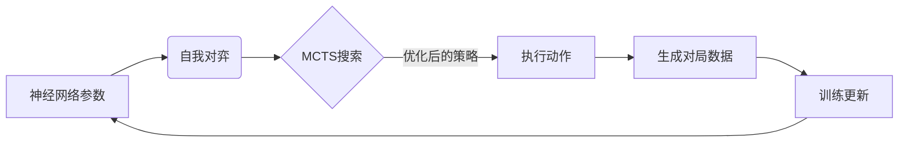

# RL在游戏AI中的应用

## 引言：游戏——通往通用人工智能的试金石

🎮 **当AI学会了玩游戏：通往AGI的必经之路？**

还记得2016年那个震惊世界的下午吗？当AlphaGo在围棋棋盘上落下那记神之一手，击败人类顶尖棋手李世石时，我们仿佛窥见了一个新的未来。🔥那不仅仅是棋盘上的胜负，更是人工智能历史上的一座巍峨里程碑。但这，仅仅是序幕。

为什么是游戏？对于人工智能研究者而言，游戏不仅仅是娱乐，它们是通往通用人工智能（AGI）最完美的“试炼场”。在这里，规则清晰、反馈即时、环境可控却又充满变数。而强化学习，正是这场智力进化背后的核心引擎。🚀它不再像传统程序那样依赖死记硬背的数据库，而是像人类婴儿一样，通过不断的试错、自我博弈，从零开始学习策略，甚至衍生出了人类从未设想的“超人类”直觉。

那么，AI究竟是如何在这些复杂多变的博弈中一步步超越人类的？从围棋的深蓝计算，到Dota 2的复杂团战协作，再到星际争霸的宏观运营与不完美信息博弈，这背后隐藏着怎样的技术变革？这些在虚拟世界中练就的“超能力”，又该如何迁移到现实世界，解决复杂的实际问题？🤔

在这篇文章中，我们将带大家深入探索RL在游戏AI中的奇幻之旅。我们将首先复盘AlphaGo系列的进化史，深度解析MCTS与策略价值网络如何打造出“围棋之神”；紧接着，走进OpenAI Five的世界，看AI如何在Dota 2和捉迷藏中学会团队协作与涌现行为；随后，我们将涉足星际争霸的RTS复杂度与德州扑克的心理博弈；最后，我们将站在更高的视角，探讨从游戏AI中诞生的智慧，究竟给通用人工智能的发展带来了哪些深刻的启示。

准备好了吗？让我们推开这扇通往未来的大门吧！👇

### 2. 技术背景：从规则导向到深度学习的范式转移

如前所述，游戏作为通往通用人工智能（AGI）的试金石，其核心驱动力在于底层算法的代际跨越。在探索AlphaGo、OpenAI Five等里程碑式的成就之前，我们需要深入理解其背后的技术演进脉络。这不仅仅是计算能力的提升，更是人工智能从“依赖人工经验”向“自主学习决策”转变的革命性过程。

#### 📜 相关技术的发展历程

游戏AI的发展史，本质上是一部人类试图模拟甚至超越人类决策智慧的奋斗史。

在早期，受限于算力与算法理论，游戏程序主要依赖**手工特征、数据增强及启发式规则**。以1997年战胜国际象棋冠军卡斯帕罗夫的“深蓝”为例，其核心在于暴力搜索算法（如极大极小值算法）和人类专家精心设计的评估函数。这种“暴力美学”虽然强大，但极其依赖人类对游戏规则的先验知识，且面对围棋等复杂度呈指数级爆炸的游戏时束手无策。

随着深度学习的兴起，神经网络架构经历了从早期的M-P模型、感知机，到LeNet、ResNet、LSTM，再到如今大行其道的Transformer的演进。这一演进为游戏AI注入了灵魂。

真正的转折点发生在**AlphaGo**身上。它以CNN（卷积神经网络）作为主干网络，创造性地将深度神经网络与蒙特卡洛树搜索（MCTS）结合，实现了里程碑式的突破。然而，AlphaGo Zero及随后的**AlphaZero**则更加彻底，它们摒弃了所有人类先验知识（不再使用人类棋谱），仅利用深度神经网络、通用强化学习算法和MCTS，通过自我对弈从零开始学习。这种“零知识”的进化模式，使其成为一种更通用的算法框架，不仅在围棋上称霸，更在国际象棋和日本将棋上达到了超人类水平。

此外，对于德州扑克这类包含不完全信息的博弈游戏，技术路线也有所不同。AI的发展引入了**博弈论推理**（如反事实后悔最小化算法），使得AI能够在对手信息不透明的情况下，通过均衡策略进行决策，这是对仅处理完全信息（如棋盘全可见）技术的有力补充。

#### ⚙️ 核心技术与现状：深度强化学习的深度融合

当前，游戏AI的核心技术特征在于**深度神经网络、强化学习与蒙特卡洛树搜索（MCTS）的深度融合**。这一范式已成为复杂决策领域的标杆，其技术现状主要体现在以下几个方面：

1.  **直觉与推理的统一**：
    系统使用参数为 $\theta$ 的深度神经网络 $f_\theta(s)$。输入当前棋盘状态 $s$，网络同时输出两类关键信息：**策略向量 $p$**（即当前局面下各个动作的选取概率，代表“直觉”）和**价值标量 $v$**（即当前局面的胜率评估，代表“判断”）。

2.  **取代手工评估**：
    传统的基于人工特征的评估函数和启发式的滑动排序已被完全取代。神经网络能够通过海量数据自主学习提取特征，其评估精度远超人类专家设计的规则。

3.  **MCTS的高效搜索**：
    在每一步决策时，系统会进行成千上万次的MCTS模拟。神经网络提供的先验概率 $p$ 引导搜索方向，而模拟结束后的叶子节点评估则由神经网络的价值 $v$ 或搜索结果来更新。这一过程精准评估了各候选动作的胜率，并修正了策略网络的输出，使得每一次落子都经过深思熟虑。

4.  **架构的迭代升级**：
    模型架构正从早期的CNN（如AlphaGo）向更高效的Transformer（如AlphaFold 2中使用的EvoFormer思想）迭代，以处理更复杂的空间关系和长序列依赖。

#### ⚠️ 面临的挑战与问题

尽管技术已取得巨大进步，但从游戏AI迈向通用AI仍面临严峻挑战：

*   **巨大的算力消耗**：AlphaZero的训练需要数周的TPU算力，OpenAI Five更是需要高达128,000个CPU核心和256块P100 GPU。这种高门槛限制了技术的普及与快速迭代。
*   **样本效率问题**：虽然相比人类学习AI需要大量对弈，但如何进一步提高样本效率，让AI在更少的交互中学会复杂策略，仍是当前研究的难点。
*   **环境复杂性与泛化能力**：目前的AI大多在特定规则下表现优异。在星际争霸（复杂战争迷雾、多单位协作）和Dota 2（高维度动作空间、长时序策略）中，虽然取得了成功，但面对完全陌生的开放世界环境，其泛化能力仍有待验证。

#### 💡 为什么需要这项技术？

为什么我们要投入如此巨大的资源开发游戏AI？正如前面章节所提到的，游戏不仅是娱乐，更是理想化的**安全测试场**。

现实世界的决策往往具有高风险、不可逆和高成本的特点，而AI无法直接在自动驾驶、医疗诊断或金融交易中随意试错。游戏环境提供了一个规则明确、反馈即时、成本极低的封闭系统。在这里，AI可以在数天内完成人类数千年的对弈量，从而习得处理复杂局势、制定长远规划和多智能体协作的能力。

这种在虚拟世界习得的“决策智能”，未来有望迁移到现实世界中，解决物流调度、资源管理、机器人控制等复杂现实问题。这正是我们研究RL在游戏AI中应用的终极意义所在。


### 3. 技术架构与原理：双网络驱动的决策引擎

承接上一章关于从手工规则到深度神经网络演进的讨论，本节我们将进一步拆解现代游戏AI的核心技术架构。正如前所述，深度学习赋予了AI强大的感知与表征能力，而真正让这些AI展现出超越人类水准的，是**深度强化学习与蒙特卡洛树搜索（MCTS）的深度融合**。

#### 3.1 整体架构设计

现代游戏AI（如AlphaZero系列）的架构核心在于构建了一个闭环的“感知-决策-进化”系统。该架构摒弃了传统的人类领域知识（如开局库、定式），采用**端到端**的深度强化学习模式。系统主要由两个深度神经网络和高效的模拟搜索环境组成，通过不断的“自我对弈”实现指数级的进化。

#### 3.2 核心组件与模块

在该架构中，大脑由两个分工明确的神经网络构成：

| 组件名称 | 功能描述 | 输出形式 |
| :--- | :--- | :--- |
| **策略网络** | **决策指导**：在当前局面下，模拟人类直觉，预测下一步落子的概率分布。 | 概率向量 ($p$)，用于缩小搜索范围 |
| **价值网络** | **局势评估**：替代传统的静态搜索函数，直接评估当前局面的胜率。 | 标量值 ($v$)，范围在 [-1, 1] 之间 |

对于复杂环境（如Dota 2或星际争霸），架构中还会引入LSTM（长短期记忆网络）来处理序列信息，以应对“部分可观测”的状态。

#### 3.3 工作流程与数据流

系统的工作流程是一个典型的“飞轮”效应，数据流在模拟与训练之间循环：



1.  **自我对弈**：每一个智能体实例都持有一份当前最新的神经网络参数副本。
2.  **MCTS搜索**：在实际走子前，利用策略网络进行有导向的随机模拟，利用价值网络评估叶子节点，得到更精准的走子概率 $\pi$。
3.  **数据生成**：将 $(State, \pi, Winner)$ 作为一条训练数据存入经验回放池。
4.  **模型优化**：从回放池中采样，通过梯度下降更新网络参数，使网络的预测 $p$ 逼近 MCTS 的搜索结果 $\pi$，同时最小化预测胜率 $v$ 与实际胜负 $z$ 的误差。

#### 3.4 关键技术原理

本系统的核心技术突破在于**MCTS与深度神经网络的协同**。

传统MCTS计算量大且由于搜索深度限制往往看不远。引入神经网络后，**策略网络**充当了“直觉”，快速砍掉低价值的分支（剪枝），**价值网络**充当了“棋感”，对无法展开的深层局面进行静态评估。

这种架构使得AI具备了类似人类的“高水平直觉”与“逻辑推演”能力。AlphaZero正是利用这种原理，从随机初始化开始，仅通过自我对弈就在围棋、日本将棋和国际象棋上达到了统治级水平，证明了通用算法的强大威力。


### 3. 核心技术解析：关键特性详解

如前所述，从手工规则到深度神经网络的演进，为游戏AI打下了坚实的感知基础。而强化学习（RL）的引入，则让AI真正具备了“思考”与“决策”的灵魂。本节将深入剖析RL在游戏AI中的关键特性，通过技术规格与创新点的拆解，揭示其背后的核心逻辑。

#### 3.1 主要功能特性：从单智能体到多智能体协作

在游戏AI中，RL的核心功能不仅仅是策略优化，更在于其对复杂环境的适应性。

*   **自我对弈与进化学习**：以AlphaZero为例，其不再依赖人类棋谱数据，而是通过“左右互搏”式的自我对弈，从随机噪声开始不断迭代。
*   **多智能体协作**：OpenAI Five在Dota 2中的表现突显了宏观协作能力。通过集中式的训练框架，五个AI英雄能够共享部分参数，学会复杂的Gank与推塔配合。
*   **不完美信息处理**：在德州扑克中，AI必须处理隐藏信息（对手的手牌），利用反事实遗憾最小化（CFR）技术逼近纳什均衡，实现即使在不完全信息下也能进行最优决策。

#### 3.2 性能指标与规格对比

不同的游戏环境对RL模型的架构与性能提出了截然不同的要求。下表对比了几个代表性AI系统的技术规格：

| AI系统 | 游戏类型 | 核心算法架构 | 动作空间/状态空间特征 | 核心性能指标 |
| :--- | :--- | :--- | :--- | :--- |
| **AlphaZero** | 完美信息<br>(围棋/国际象棋) | MCTS + 深度残差网络 | 离散动作，状态空间约为$10^{170}$ (围棋) | 训练24小时超越AlphaGo Lee；胜率超过99% |
| **OpenAI Five** | 实时战略<br>(Dota 2) | PPO + LSTM | 连续与离散混合，高维观测空间 | 有效动作空间约$10^{20,000}$；处理延迟约80ms |
| **AlphaStar** | 实时战略<br>(星际争霸II) | 分层RL + Transformer | 部分可观测，极大状态空间 | APM（每分钟操作数）限制在人类水平；宗师段位 |
| **Pluribus** | 不完美信息<br>(德州扑克) | CFR + 深度神经网络 | 隐藏信息，动态博弈 | 在6人局中击败人类顶级职业选手，盈利显著 |

#### 3.3 技术优势与创新点

RL在游戏AI中的应用，带来了三个显著的技术优势：

1.  **超越人类经验的探索**：传统AI受限于人类数据的边界（如AlphaGo Lee基于人类棋谱），而AlphaZero通过纯粹的RL搜索，发现了人类数千年来未曾设想的开局与定式，展现了“通用人工智能”的雏形。
2.  **长视距规划**：通过引入价值网络，AI能够评估当前局势对未来数千步的影响，解决了即时奖励与长期目标的平衡问题，这在星际争霸这种长达数十分钟的对局中尤为关键。
3.  **极强的泛化能力**：OpenAI Five在Hide&Seek游戏中展示了“涌现”行为。AI不仅学会了藏与找，还学会了利用游戏Bug（如堵门、冲天）来获胜，这种非预设的行为正是RL适应环境的有力证明。

#### 3.4 适用场景分析与代码逻辑

RL在游戏中的成功验证了其在处理“序列决策问题”上的优越性。其核心逻辑遵循标准的循环机制，以下代码块展示了Agent在环境中的核心交互逻辑：

```python
# RL Agent 核心交互逻辑伪代码
class GameAgent:
    def __init__(self, policy_network, value_network):
        self.policy = policy_network  # 策略网络：输出动作概率
        self.value = value_network    # 价值网络：评估当前状态胜率
        
    def decide_action(self, state, is_training=True):
# 1. 获取当前状态特征
        state_tensor = preprocess(state)
        
# 2. 推理阶段：利用策略网络贪婪选择
        action_probs = self.policy.predict(state_tensor)
        
        if is_training:
# 训练阶段：结合探索与利用
            action = sample_action(action_probs)
        else:
# 比赛阶段：选择最优动作
            action = argmax(action_probs)
            
        return action

    def update_model(self, trajectory):
# 3. 根据轨迹更新策略和价值网络
# 计算 Advantage 和 Value Loss
        loss = compute_loss(trajectory)
        self.optimizer.step(loss)
```

综上所述，RL通过上述特性将游戏AI从“死记硬背”推向了“举一反三”。这些技术不仅适用于游戏竞技，更为自动驾驶、机器人控制以及复杂的资源调度等通用AI场景提供了重要的技术储备。


### 3. 核心算法与实现：AlphaZero架构与MCTS深度剖析

承接上文，深度神经网络为AI提供了强大的特征提取能力，而强化学习（RL）则是其决策的“大脑”。在现代游戏AI，尤其是AlphaGo Zero和AlphaZero中，核心架构发生了范式转移：摒弃了人为设计的特征，直接通过**策略价值网络**与**蒙特卡洛树搜索（MCTS）**相结合进行端到端学习。

#### 3.1 核心算法原理：策略价值网络
如前所述，早期的DQN仅能输出动作的Q值，而AlphaZero算法采用了更为高效的双头网络架构。这意味着同一个神经网络 $f_\theta(s)$ 在同一轮前向传播中同时输出两个结果：
*   **策略头**：输出当前局面下所有合法动作的概率分布 $P(s, a)$，用于指导MCTS的搜索方向，模拟人类的直觉。
*   **价值头**：输出当前局面的标量价值 $v(s) \in [-1, 1]$，预测当前的胜率，用于评估局面优劣，替代了传统的随机模拟。

这种设计使得网络既能像直觉一样快速判断局势（价值），又能像计算一样规划步骤（策略），极大地提升了搜索效率。

#### 3.2 关键数据结构：MCTS节点
MCTS是博弈类游戏的“计算引擎”。不同于传统的Minimax搜索，MCTS在有限的算力下专注于搜索最有希望的路径。其节点结构设计至关重要，如下表所示：

| 属性 | 类型 | 描述 | 公式/逻辑 |
| :--- | :--- | :--- | :--- |
| **N(s, a)** | int | 动作访问次数 | 累计统计，用于置信度计算 |
| **W(s, a)** | float | 累计总价值 | 累计该动作下的所有估值 $v$ |
| **Q(s, a)** | float | 平均价值 | $Q = W / N$，代表该动作的长期收益 |
| **P(s, a)** | float | 先验概率 | 由神经网络策略头输出 |

#### 3.3 实现细节与代码解析
在自对弈过程中，MCTS通过**PUCT（Predictor + UCB applied to Trees）**公式选择最优子节点，平衡“利用”（选择当前最优）和“探索”（尝试未充分验证的动作）：

$$U(s, a) = C_{puct} \cdot P(s, a) \cdot \frac{\sqrt{\sum_b N(s, b)}}{1 + N(s, a)}$$

$$Action = \arg\max_a [Q(s, a) + U(s, a)]$$

以下是一个简化的Python实现，展示了MCTS中核心的节点选择逻辑：

```python
import math

class MCTSNode:
    def __init__(self, prior_prob):
        self.prior_prob = prior_prob # P(s, a)
        self.visit_count = 0         # N(s, a)
        self.total_value = 0.0       # W(s, a)
        self.children = {}           # 子节点字典

    def get_value(self):
        """计算平均价值 Q(s, a)"""
        if self.visit_count == 0:
            return 0
        return self.total_value / self.visit_count

    def select_child(self, c_puct=1.5):
        """根据PUCT公式选择最佳子节点"""
        best_score = -float('inf')
        best_action = None
        
# 计算父节点总访问次数的平方根，用于探索项
        sqrt_total_visits = math.sqrt(self.visit_count)
        
        for action, child in self.children.items():
# Q项：利用 - 追求高收益
            q_value = child.get_value()
# U项：探索 - 依据先验概率和访问次数
            u_value = c_puct * child.prior_prob * (sqrt_total_visits / (1 + child.visit_count))
            
            score = q_value + u_value
            
            if score > best_score:
                best_score = score
                best_action = action
                
        return best_action, self.children[best_action]
```

#### 3.4 训练闭环与损失函数
训练并非静态的，而是动态的“自对弈”闭环：网络生成对局数据 $\rightarrow$ 存入经验回放池 $\rightarrow$ 随机采样训练网络 $\rightarrow$ 更新网络参数。损失函数 $L$ 同时优化策略和价值，公式如下：

$$L = (z - v)^2 - \pi^T \log p + c ||\theta||^2$$

其中，$z$ 为实际游戏结果（胜负），$\pi$ 为MCTS搜索后得到的更强概率分布。通过这种不断的自我博弈与参数迭代，AI最终从零开始掌握了超越人类直觉的博弈策略。


### 3. 技术对比与选型：深度RL的“兵器谱” 🛡️

紧承上文，我们探讨了从手工规则到深度神经网络的演进历史。然而，**如前所述**，深度强化学习并非“万金油”，面对围棋的完美信息博弈与Dota 2的实时复杂战局，我们需要精细化的技术选型。

#### 3.1 核心技术架构对比 🥊

当前游戏AI的主流路线主要分为以 **AlphaZero** 为代表的搜索与学习结合型，以及以 **OpenAI Five** 为代表的大规模分布式强化学习型。

| 核心维度 | AlphaZero 架构 | OpenAI Five 架构 |
| :--- | :--- | :--- |
| **代表算法** | MCTS + 策略价值网络 | PPO (Proximal Policy Optimization) + LSTM |
| **信息类型** | **完美信息** (双方状态透明) | **不完美信息** (战争迷雾) |
| **决策机制** | 模拟推演，基于树搜索 | 实时反应，基于当前观测 |
| **核心优势** | 决策极其精准，稳定性高 | 处理高维动作空间，宏观策略强 |
| **计算瓶颈** | 推理时需要大量算力进行搜索 | 训练需要大规模GPU集群并行 |

#### 3.2 优缺点深度解析

**AlphaZero类** 利用 **MCTS (蒙特卡洛树搜索)** 作为策略提升的手段，它虽然训练成本极高，但在推理时能够通过自我对弈发现“神之一手”。其缺点在于对实时性要求极高的游戏（如FPS）无能为力，因为每一帧的时间不足以完成深度搜索。

**OpenAI Five类** 放弃了显式的搜索，直接训练神经网络映射状态到动作。这种 **Model-Free** 方法反应极快，适合处理复杂的长时序任务，但其劣势在于可能存在局部最优，且缺乏AlphaZero那种“绝对理性”的逻辑推导。

#### 3.3 场景选型与代码建议

针对不同游戏类型，以下是选型建议：

```python
def select_ai_architecture(game_type):
    """
    游戏AI架构选型逻辑
    """
    if game_type == "Board_Game":
# 围棋、国际象棋：逻辑严密，回合制
        return "AlphaZero (MCTS + ResNet)"
    elif game_type == "RTS_MOBA":
# Dota 2, 星际争霸：实时、多智能体协作
        return "Centralized PPO + RNN (LSTM/GRU)"
    elif game_type == "Card_Game":
# 德州扑克：心理博弈、不完美信息
        return "CFR (Counterfactual Regret Minimization)"
    else:
        return "Standard DQN / DDPG"
```

#### 3.4 迁移注意事项

在将游戏AI技术迁移至通用领域时，需注意以下几点：
1.  **Sim2Real Gap**：游戏环境是完美的数字模拟，现实世界存在噪声与物理误差，迁移时需加入领域随机化。
2.  **样本效率**：游戏可以进行亿万次自我对弈，但在工业控制或机器人应用中，数据采集成本高昂，需优化算法的样本利用率。

综上所述，技术选型的本质是在 **“推理精度”** 与 **“反应速度”** 之间寻找平衡点。


# 第4章 架构设计：从 CNN 到 Transformer 的神经网络演变 🧠⚡️

在上一章中，我们深入探讨了**蒙特卡洛树搜索（MCTS）与强化学习的深度融合**，揭示了AlphaGo如何通过“直觉”与“逻辑”的双重引擎，在复杂的博弈中超越人类棋手。我们了解了MCTS如何通过自我对弈不断精搜索路径，以及强化学习如何更新策略网络。

然而，所有这些精妙的算法逻辑，终究需要一个强大的载体来执行。这就好比拥有了一流的赛车手（算法）和顶级的战术（策略），但如果没有一辆性能卓越的赛车（神经网络架构），冠军依然遥不可及。

本章将把目光投向游戏AI的“躯体”——**神经网络架构的设计演变**。我们将看到，为了处理从围棋棋盘到Dota 2复杂战场的海量信息，架构设计是如何从早期的卷积神经网络（CNN）向更深层的残差网络（ResNet）进化，并最终迈向更具通用性的Transformer架构的。

---

### 1. 输入层设计：将混沌世界转化为数字张量 🌐➡️🔢

在神经网络能够“思考”之前，它首先必须“看见”。对于游戏AI而言，**输入层的设计至关重要**，它是连接虚拟游戏世界与数学计算的桥梁。

如前所述，MCTS依赖状态评估，而神经网络需要将这些状态转化为计算机可理解的张量。

*   **围棋的平面化处理**：
    在AlphaGo中，19x19的围棋棋盘并没有被简单看作一个图片矩阵。设计团队采用了**特征平面**的堆叠策略。输入张量通常是一个 $19 \times 19 \times N$ 的结构。其中，$N$代表了历史信息的步数（例如最近8步）以及一些辅助特征（如当前气数、打吃状态等）。这种设计不仅保留了棋盘的空间拓扑结构，还让网络能够感知到“这一步棋是在什么历史背景下落下的”，这对于判断劫材和死活至关重要。

*   **Dota 2 与星际争霸的高维抽象**：
    相比于围棋的二维网格，Dota 2和星际争霸的状态空间是离散且高维的。OpenAI Five并没有直接处理像素屏幕（那样效率太低），而是采用了**高层抽象表示**。它将游戏状态转化为一个巨大的向量，包含了英雄的位置、血量、技能冷却时间、视野状态等数值信息。这种输入层设计类似于将游戏世界变成了一个巨大的表格数据，网络不再去“看”画面，而是直接读取上帝视角的数据流。这种从“感知”到“认知”的跨越，是处理RTS（即时战略）游戏的关键第一步。

### 2. AlphaGo 的 CNN 主干：利用空间特征提取棋感 🏰

在确定了输入形式后，AlphaGo的核心架构选择了**卷积神经网络（CNN）**。这一选择深受计算机视觉领域的启发，但在游戏AI中有着独特的意义。

*   **局部相关性与平移不变性**：
    围棋中的棋形（如“虎口”、“跳”、“尖”）具有极强的局部相关性。无论在棋盘的哪个角落，一个特定的棋形往往蕴含着相似的意义。CNN的卷积核正是利用了这种**局部感知**特性，在棋盘上滑动扫描，提取出基础的线条和形状特征。
    
*   **特征金字塔的构建**：
    随着网络层数的加深，浅层的卷积层识别简单的断点连接，深层的卷积层则将这些简单的形状组合成复杂的战术概念（如大模样、治孤、进攻）。这种层级化的特征提取，使得策略网络能够像人类棋手一样，首先关注局部的死活，再通过全连接层评估全局的局势。

在AlphaGo Lee版本中，使用的是较为标准的CNN结构，但这仅仅是开始。随着对算力和模型深度的追求，架构设计迎来了重要的变革。

### 3. 残差网络的应用：打破深度学习的诅咒 🚀

当我们试图通过加深网络层数来提升AI的棋力时，遇到了一个经典的机器学习难题：**退化问题**。理论上，增加层数应该能让网络学到更复杂的函数，但在实践中，过深的网络往往导致梯度消失，使得训练难以进行，甚至不如浅层网络效果好。

为了解决这一瓶颈，AlphaGo Master和后续的AlphaZero全面引入了**残差网络**。

*   **跳跃连接的智慧**：
    ResNet的核心创新在于引入了“跳跃连接”。在传统的层与层之间，它增加了一条“高速公路”，允许输入数据直接绕过某些层传递到输出。数学表达上，与其让网络学习目标映射 $H(x)$，不如让它学习残差映射 $F(x) = H(x) - x$。如果某一层是多余的，网络只需将 $F(x)$ 置为0，这就退化成了恒等映射，保证了模型至少不会比浅层网络差。

*   **AlphaZero 的深度爆发**：
    利用ResNet结构，AlphaZero成功将神经网络的层数扩展到了**40层甚至更深**（如AlphaZero论文中使用的40层ResNet）。这使得模型拥有了极强的非线性表达能力，能够捕捉到极其微妙的棋局变化。在自我对弈的过程中，深度的残差网络能够更精准地拟合MCTS搜索出的价值标签，从而大幅提升了决策的准确度。可以说，没有ResNet，就没有后来横扫一切棋类的AlphaZero。

### 4. 向 Transformer 的迭代：超越空间的全局注意力 🧩

虽然CNN和ResNet在处理棋类这种规则固定、空间感强的游戏中表现出色，但在面对更复杂的任务时，其局限性开始显露。CNN的**局部感受野**使得它在处理长距离依赖时表现不佳——在Dota 2中，上路的一个走位可能需要10秒钟后才会影响下路的团战，这种跨地图的全局联系很难通过卷积层逐层传递。

这就引出了向**Transformer架构**的迭代趋势。

*   **注意力机制的引入**：
    Transformer的核心是自注意力机制。不同于CNN关注局部，注意力机制允许网络在处理每一个状态时，都能“关注”到全局的其他所有部分。
    *   *类比 AlphaFold 2*：DeepMind在解决蛋白质折叠问题的AlphaFold 2中引入了**EvoFormer**模块。该模块利用注意力机制处理氨基酸序列（MSA）和残基对之间的几何信息。这种架构对于游戏AI具有极大的启发性。
    *   *游戏AI中的应用*：在一个复杂的开放世界游戏中，每一个单位、每一个道具都可以被视为序列中的一个Token。通过注意力机制，AI可以瞬间捕捉到地图角落里隐身的敌人对自己当前产生的威胁。这种**全局建模能力**，是CNN难以企及的。

*   **从网格到图的结构化思考**：
    Transformer可以看作是对图神经网络的一种特例。未来的游戏AI架构，很可能不再强制要求将游戏状态切割成网格，而是直接处理单位与单位之间的关系图。这种架构不仅更符合真实游戏的逻辑（游戏本质是实体的交互），也为从游戏AI迈向通用人工智能（AGI）提供了更强的泛化能力。

### 5. 分布式训练架构：支撑自我博弈的钢铁基石 🖥️🖥️🖥️

最后，要实现上述复杂架构的训练，离不开底层的**分布式训练架构**。正如前面提到的，自我博弈会产生海量的数据，单机训练早已成为历史。

*   **Actor-Learner 架构**：
    这是OpenAI Five和AlphaZero采用的核心模式。系统被拆分为两个角色：
    *   **Actor（演员）**：负责运行当前的策略模型与环境（游戏引擎）进行交互，产生经验数据。它们不需要很强大的计算能力，但数量庞大，可以同时进行成千上万局游戏。
    *   **Learner（学习者）**：负责接收Actor传回的数据，利用高性能GPU（如NVIDIA Tesla系列）进行反向传播，更新神经网络的参数。

*   **参数服务器**：
    为了协调成百上千个Actor和Learner，通常会部署参数服务器。它像是一个中央图书馆，存储着最新的模型参数。Actor定期从服务器拉取最新模型进行对弈，Learner在计算出新梯度后推送到服务器进行合并。

OpenAI Five曾展示过一张震撼的架构图：256张GPU用于训练，128,000个CPU核心用于自我对弈。正是这种**分布式强化学习**架构，让AI能够在短短几天内模拟人类几千年的练习量，实现了从量变到质变的飞跃。

---

### 小结

从最初的简单感知机，到AlphaGo的**CNN**，再到AlphaZero的**ResNet**，最后向着**Transformer**和更复杂的分布式架构演进，游戏AI的神经网络演变史，实际上是一部不断追求更高效特征提取、更强全局建模能力的探索史。

架构的升级让AI不仅“算得快”，更“看得深、看得远”。而在下一章，我们将走出围棋和Dota的棋盘，探讨AI如何在德州扑克这种“不完美信息”游戏中，学会虚张声势与心理博弈。敬请期待！🔥

# 关键特性：深度搜索、神经网络与博弈论的三角平衡

👋 大家好！在上一章中，我们深入探讨了从CNN到Transformer的神经网络架构演变，看到了更强大的“大脑”是如何赋予AI处理复杂信息能力的。然而，仅仅拥有一个庞大的神经网络并不足以造就顶级的游戏AI。就像一个天才棋手不仅需要强大的记忆力，还需要冷静的逻辑推理和战术博弈一样，现代游戏AI的真正威力，源于**深度搜索、神经网络与博弈论**这三者之间精妙的三角平衡。

本章将抽丝剥茧，为您解析这三驾马车如何协同工作，彻底改变了游戏AI的范式。

---

### 1. 彻底告别“手搓”时代：神经网络对传统评估函数的颠覆

在DeepBlue（深蓝）时代，国际象棋AI的强大依赖于人类大师编写的“手工规则”。程序员需要告诉AI：“车比马价值高”、“控制中心很重要”、“孤兵是弱点”。这种基于特征的评估函数虽然直观，但存在致命的**天花板**——它受限于人类对游戏本身的理解。

**如前所述**，随着深度学习的发展，我们迎来了完全端到端的学习方式。现在的游戏AI（如AlphaGo系列）不再需要人类告诉它“什么是好的棋形”。

*   **价值网络的直觉**：价值网络不再依赖硬编码的加权求和，而是通过数百万盘对弈的自我对弈，自动学习棋盘上的复杂模式。它能捕捉到那些人类难以量化的微妙优势，例如“厚势”与“实地”在特定局势下的动态平衡。
*   **策略网络的决策**：策略网络取代了传统的启发式搜索算法（如Alpha-Beta剪枝中的排序启发式）。它不需要维护一个巨大的开局库，而是直接根据当前盘面，计算出下一步落子在所有合法位置的概率分布。

这种“完全取代手工制作”的变革，意味着AI不再是在模拟人类的知识，而是在创造属于自己的知识体系。这也是为什么AlphaGo Zero能在不参考任何人类棋谱的情况下，下出诸如“第37手五路肩冲”这种令人类顶级棋手感到陌生却精妙绝伦的棋局。

---

### 2. MCTS的精确评估：用“想象力”修正直觉

虽然神经网络提供了强大的直觉，但直觉有时会出错。这时候，**蒙特卡洛树搜索（MCTS）** 就充当了AI的“深思熟虑”过程。

在上一节架构设计的讨论中，我们提到了网络如何提取特征，而MCTS则是利用这些特征进行**精确评估**的核心引擎。MCTS与神经网络的结合，不仅仅是简单的叠加，而是一个动态修正的过程：

1.  **先验概率的引入**：当MCTS开始搜索时，策略网络会提供一个先验概率（$P(s, a)$），指导搜索优先看向那些“有希望”的分支。这大大提高了搜索效率，避免了像传统AI那样在无用分支上浪费算力。
2.  **模拟与修正**：MCTS通过成千上万次的快速模拟，推演未来的局势。每一次模拟都会更新叶子节点的访问次数和价值估计（$Q(s, a)$）。
3.  **后验概率的输出**：这里最关键的机制在于，MCTS最终的搜索结果（访问次数分布 $N(s, a)$）往往比策略网络原本的先验概率 $P(s, a)$ 更加精准。

具体来说，策略网络可能在初期认为某步棋有80%的胜率，但在MCTS经过深入推演发现这步棋会导致十步后的死活问题后，它会通过降低该节点的访问次数来“修正”这一判断。最终，AI不是选择策略网络认为最好的棋，而是选择**经过MCTS千次模拟验证后，访问次数最多、胜率评估最高**的棋。这种机制完美结合了神经网络的“直觉”和搜索树的“逻辑推演”，使得AI既快又准。

---

### 3. 迷雾中的博弈：不完全信息处理与纳什均衡

当我们把目光从围棋（完全信息博弈）转向德州扑克（不完全信息博弈）时，单纯的“搜索+神经网络”就不够用了。在德州扑克中，你看不到对手的底牌，对手的举动可能包含诈唬。这引入了游戏AI的第三个支柱：**博弈论**。

*   **信息的不对称性**：在Dota 2或德州扑克中，AI必须在信息缺失的情况下做决策。如果像AlphaGo那样试图穷举所有可能的底牌组合，计算量是天文数字。
*   **纳什均衡**：为了解决这个问题，像Libratus（冷扑大师）和Pluribus这样的AI引入了博弈论中的纳什均衡概念。纳什均衡是一种策略组合，使得任何一方单方面改变策略都无法获得更大的收益。

AI在处理不完全信息时，不再追求“必胜”（这在信息不透明时是不可能的），而是追求**“不可剥削”**。通过反事实遗憾最小化算法，AI会在策略中混合诈唬和弃牌，确保自己的打法在长期统计上是平衡的。即便对手知道了AI的策略风格，也无法利用这一点来赢钱。这种基于博弈论的推理能力，标志着AI从“计算器”进化为了“心理学家”，能够在充满欺诈和迷雾的对手心中寻找逻辑支点。

---

### 4. 宏观与微观的共舞：多智能体协作的艺术

在OpenAI Five（Dota 2）这类复杂的MOBA游戏中，挑战不仅在于单体的强大，更在于**多智能体协作**。一个Dota 2英雄有几十个操作维度，五个英雄就是几百个维度，且还需要考虑长达45分钟的比赛时间跨度。

AI是如何在团队竞技中理解宏观策略与微观操作的平衡呢？

*   **宏观策略（大局观）**：AI团队需要理解何时推塔、何时打肉山、何时控线。这通常通过“中心化训练”来实现。训练时，引入一个超贪心的参数，迫使所有AI英雄为了同一个最终目标（摧毁远古遗迹）而优化，从而涌现出高超的团队配合，如经典的“抱团推进”或“分带牵制”。
*   **微观操作（手速与反应）**：在具体战斗中，又需要“去中心化执行”。每个英雄神经网络独立控制自己的动作，实现躲避技能、精准释放技能等超人级操作。

这种**宏观统一、微观独立**的架构，让AI展现出了惊人的战术素养。例如，在一场比赛中，OpenAI Five会在一瞬间决定牺牲一名英雄来换取对方塔的摧毁，这种极其理性的“献祭”战术往往需要极高的团队默契，而AI通过数亿次的自我对练，将这种默契刻写进了参数之中。

---

### 5. 鲁棒性与泛化：通往通用AI的最后一公里

最后，我们要讨论的是AI的**鲁棒性**与**泛化能力**。一个只会背棋谱的AI在实战中是脆弱的。

*   **面对干扰与未知对手**：早期的游戏AI往往存在“过拟合”现象，一旦对手走出训练数据之外的棋路，或者利用规则漏洞（Bug），AI就会崩溃。而现代RL智能体通过引入随机噪声、Domain Randomization（域随机化）等技术，极大地增强了鲁棒性。例如，OpenAI Five在训练中会随机设置网络延迟、模拟掉线，迫使AI适应各种恶劣环境。
*   **通用性的启示**：AlphaZero最震撼人心的一点在于，它证明了同一个算法架构（加上MCTS和博弈论思想），不需要任何游戏特定的修改，就能精通围棋、国际象棋和日本将棋。

这种特性深刻地启示了通用AI（AGI）的发展：**智能的本质可能不在于针对特定任务设计复杂的规则，而在于构建一个通用的、具备强大搜索与推理能力的架构，让其在特定环境中通过交互自我进化。**

---

### ✨ 总结

深度搜索提供了逻辑的深度，神经网络提供了感知的广度，而博弈论提供了策略的理性。这三者的三角平衡，不仅造就了在棋盘上无敌的AlphaGo，在战场上无敌的OpenAI Five，更为我们指明了通往通用人工智能的清晰路径。

在下一章，我们将探讨这些惊人的技术突破是如何走出实验室，反哺现实世界的。敬请期待！🚀


#### 1. 应用场景与案例

**6. 实践应用：应用场景与案例**

如前所述，深度搜索、神经网络与博弈论的三角平衡为游戏AI奠定了坚实的理论基础。当这些理论付诸实践，强化学习（RL）便展现出了惊人的适应性与创造力。本节将剖析RL在不同类型游戏中的具体应用场景，并通过经典案例展示其实际效能。

**1. 主要应用场景分析**
RL在游戏AI中的应用主要分为三个层级：
*   **完美信息博弈**：如围棋、国际象棋。环境状态完全公开，重点在于利用强大的计算能力进行深度搜索和局面评估。
*   **不完美信息博弈**：如德州扑克。对手信息隐藏，AI需要通过概率建模进行“虚张声势”和对手建模，更依赖博弈论中的纳什均衡。
*   **即时战略与多智能体协作**：如《Dota 2》、《星际争霸》。涉及长视界规划、海量单位控制及复杂地形导航，是检验AI宏观策略与微观操作协同能力的最高试炼场。

**2. 真实案例详细解析**
*   **案例一：AlphaZero——从零开始的自我进化**
    AlphaGo系列的集大成者AlphaZero，彻底抛弃了人类棋谱数据。它仅利用强化学习中的自我对弈机制，结合前文提到的蒙特卡洛树搜索（MCTS），在不到24小时内从零学会了围棋、日本将棋和国际象棋，并击败了各自领域的顶级引擎。它证明了纯粹的算法可以在没有人类先验知识的情况下，通过推演发现人类未曾设想的策略（如著名的“第37手”）。

*   **案例二：OpenAI Five——复杂环境下的团队协作**
    在《Dota 2》这款高复杂度MOBA游戏中，OpenAI Five面临的是长达45分钟的长期宏观决策。通过使用大规模的分布式强化学习，AI通过“近端策略优化”（PPO）算法，让五个英雄学会了对线、发育、团战配合。特别值得一提的是，OpenAI Five在捉迷藏（Hide & Seek）等简化环境中，甚至展现出了利用环境漏洞进行“工具使用”的涌现行为，这充分体现了RL在非结构化环境中的强大适应力。

**3. 应用效果和成果展示**
上述案例的应用效果具有里程碑意义。AlphaZero不仅在胜率上对人类顶尖棋手呈现碾压态势（胜率超90%），更重要的是它重塑了人类对围棋战术的认知。OpenAI Five则在TI8国际邀请赛中击败了世界冠军战队OG，证明了在观测空间巨大、延迟极高的复杂实时对抗中，AI也能达到超越人类的操作精度与团队配合度。

**4. ROI分析**
尽管训练顶级游戏AI的算力成本极高（如OpenAI Five使用了128,000个CPU核心和256块P100 GPU），但其投资回报率（ROI）在通用人工智能领域是巨大的。游戏作为“沙盒”环境，以极低的现实风险验证了算法的鲁棒性。这些经过游戏验证的算法架构（如Transformer在处理长序列决策中的应用）和训练策略，正逐渐迁移至机器人控制、物流调度、金融交易等现实场景，为解决现实世界的复杂决策问题提供了核心算法资产。


#### 2. 实施指南与部署方法

**6. 实施指南与部署方法：从理论代码到智能体实战**

在深入探讨了深度搜索、神经网络与博弈论的三角平衡后，我们已经构建了坚实的理论地基。现在，让我们将这些抽象概念转化为可运行的代码和智能体，从理论走向实战。以下是构建高性能游戏AI的具体实施路线图。

**1. 环境准备和前置条件**
强化学习训练对算力资源有着极高的要求。硬件层面，建议配置多GPU服务器（如NVIDIA A100或H100集群）以支持大规模并行计算，这对于如前所述的蒙特卡洛树搜索（MCTS）加速至关重要。软件栈方面，除了基础的Python环境和深度学习框架（如PyTorch或TensorFlow）外，关键在于获取目标游戏的高性能开发接口（API）。例如，复现星际争霸AI需安装PySC2环境，而开发Dota 2类AI则需对接OpenAI Gym Retro环境。此外，搭建高效的分布式文件系统也是必不可少的，用于存储海量自我对弈产生的回放数据。

**2. 详细实施步骤**
实施的核心在于建立一个高效的自我进化闭环：
*   **初始化**：搭建包含策略网络和价值网络的神经网络架构，并随机初始化参数。
*   **自我对弈**：部署多个Agent实例在隔离的虚拟环境中互搏。利用MCTS进行高效搜索，生成高质量的$(状态, 动作, 奖励)$元组，并存储至经验回放池。
*   **模型优化**：异步地从回放池中采样数据，输入神经网络进行训练，最小化预测动作与实际奖励之间的误差，不断更新网络权重。

**3. 部署方法和配置说明**
参考OpenAI Five的工程经验，推荐采用**Actor-Learner架构**进行生产级部署。将系统拆分为“演员”和“学习者”两部分：“演员”负责在分布式节点上运行游戏实例并产生数据，对实时性要求高；“学习者”则集中在高性能节点进行梯度计算和全局模型更新。建议使用Docker容器化技术封装所有依赖环境，配合Kubernetes进行编排，可以极大提高部署的弹性和容错率，确保数千个并发环境稳定运行。

**4. 验证和测试方法**
仅监控训练过程中的Loss是不够的，实战表现才是检验真理的唯一标准。建议采用**Elo等级分系统**来量化模型强度。定期让当前模型与历史基准版本、内置规则AI或人类职业选手进行对抗，绘制胜率曲线。此外，应进行鲁棒性测试，通过A/B测试比较不同超参数配置下的表现，确保智能体不仅在训练环境中表现优异，在面对未知策略或干扰时也能保持稳定。

通过以上步骤，我们便能将AlphaGo等先驱的技术精髓成功复现并迁移到新的游戏场景中，见证智能体的诞生与进化。


#### 3. 最佳实践与避坑指南

**6. 实践应用：最佳实践与避坑指南**

正如上一节提到的，深度搜索、神经网络与博弈论的三角平衡是游戏AI的核心。但要打破这层“理论天花板”，在实际开发中落地这些技术，还需要遵循成熟的工程实践。

**1. 生产环境最佳实践**
在构建像AlphaGo或OpenAI Five这样复杂的系统时，**分布式自对弈**是必经之路。不要试图在单机上进行训练，应采用“中心化参数服务器+分布式Actor”架构，让数千个智能体同时在云端对战，持续产出高质量数据。此外，**奖励函数设计**至关重要。避免使用过于稀疏的奖励（如仅输赢奖励），应引入中间奖励（如控制视野、资源收集率）来引导智能体探索，防止在复杂状态空间中迷失。

**2. 常见问题和解决方案**
实践中最常见的问题是“**灾难性遗忘**”和“策略震荡”。当智能体面对新策略时，容易遗忘旧策略。解决方案是引入**经验回放池**和**对手池**，定期从历史模型中采样对手，确保策略的鲁棒性。另一个痛点是“死循环”，特别是在如《星际争霸》这种长视界游戏中。建议采用**课程学习**，从简单的子任务或简化地图开始训练，逐步增加难度。

**3. 性能优化建议**
游戏AI对推理延迟极其敏感。最佳实践是**计算与仿真解耦**：利用GPU进行神经网络推理，利用CPU进行蒙特卡洛树搜索或环境模拟。此外，采用**混合精度训练**和**批处理推理**可以显著提升吞吐量。在代码层面，务必使用JIT编译（如PyTorch的TorchScript或Numba）来加速核心的游戏逻辑计算。

**4. 推荐工具和资源**
工欲善其事，必先利其器。对于大规模强化学习，**Ray RLlib**是目前工业界首选框架，它完美支持分布式训练。环境搭建方面，推荐使用**PettingZoo**或**OpenSpiel**，它们提供了丰富的多智能体环境和标准API，能让你快速验证算法原型，避免重复造轮子。


### 🛠️ 7. 技术对比：不同游戏场景下的最优解与迁移之道

**承接上文：**

在前一节“实践应用”中，我们见证了AlphaGo在围棋棋盘上的“封神”，也看到了OpenAI Five在Dota 2复杂战场中的“团灭”五连坐，更领略了AI在捉迷藏游戏中涌现出的惊人策略。这些成就标志着强化学习（RL）已经从单纯的算法理论，变成了能够征服从完美信息博弈到复杂即时战略游戏的各种利器。

然而，正如我们在“架构设计”章节中所提到的，并非所有的游戏AI都适用于同一套技术方案。面对浩如烟海的游戏类型，如何像搭积木一样选择最适合的RL算法？传统的规则AI与深度RL究竟孰优孰劣？当我们试图将游戏中的经验迁移到现实世界时，又该注意哪些陷阱？本节将深入这些技术细节，为你剖析不同场景下的最优解。

#### 🔬 7.1 深度技术对比：RL与传统AI的较量

要理解RL的强大，我们必须将其与其它技术流派放在显微镜下观察。除了我们重点讨论的深度强化学习（DRL），游戏AI领域长期盘踞着“监督学习（SL）”和“基于规则的专家系统”两座大山。

**1. 深度强化学习 vs. 监督学习**
这是最容易被混淆的一组概念。在AlphaGo出现之前，许多围棋AI（如Crazy Stone）主要依赖监督学习，通过学习人类高手的棋谱来提升。
*   **上限差异：** 监督学习的天花板是人类的水平，它是在模仿过去；而强化学习是在通过自我对弈探索未来。正如我们在AlphaGo Zero中看到的，脱离人类棋谱后，它甚至下出了人类从未设想过的“第37手”。
*   **数据依赖：** 监督学习需要海量高质量的标注数据（人类对局），这在《星际争霸》或Dota 2这种极度复杂的游戏中几乎是不可得的天量数据；而RL可以通过与环境交互自己生成数据，虽然样本效率低，但潜力无限。

**2. 深度强化学习 vs. 传统搜索与规则**
*   **处理复杂度：** 对于国际象棋，传统的Minimax搜索配合Alpha-Beta剪枝极其有效。但在Dota 2这种状态空间达到天文数字（$10^{20,000}$数量级）的游戏中，传统搜索在第一步就会“爆栈”。RL通过神经网络“直觉”地压缩搜索空间，将不可能变为可能。
*   **泛化能力：** 规则系统一旦遇到规则库之外的情况（如OpenAI Five捉迷藏中AI发现的卡墙BUG），就会立即瘫痪。而RL具有极强的鲁棒性，它学到的是“策略”而非死记硬背的“规则”。

#### 🎯 7.2 不同场景下的选型建议

既然RL如此强大，是否意味着我们应该在任何游戏中都无脑使用RL？答案是否定的。根据游戏特性的不同，选型逻辑截然不同：

**场景一：完美信息、回合制游戏（如围棋、象棋、五子棋）**
*   **最优方案：** **MCTS + 深度神经网络（如AlphaZero架构）**
*   **理由：** 这类游戏规则透明，状态空间虽大但可计算。如前所述，蒙特卡洛树搜索（MCTS）能提供强大的规划能力，结合神经网络的评估，能在允许的计算时间内达到接近最优解。
*   **注意事项：** 需要大量的算力支持自我对弈。

**场景二：不完美信息博弈（如德州扑克、麻将）**
*   **最优方案：** **反事实后悔最小化（CFR） + 深度学习**
*   **理由：** 在这类游戏中，你无法看到对手的手牌，单纯靠搜索未来的状态是无效的，因为你不知道“当前”到底是哪个状态。需要利用博弈论中的纳什均衡概念，通过CFR算法最小化后悔值。
*   **案例：** 扑克AI如Pluribus并没有像AlphaGo那样依赖复杂的MCTS，而是更多地利用线性CFR和深度神经网络来近似策略。

**场景三：实时战略与FPS（如Dota 2, StarCraft II）**
*   **最优方案：** **多智能体强化学习（MARL） + 层级强化学习（HRL）**
*   **理由：** 这类游戏不仅是实时对抗，更涉及单位控制、资源管理等多重任务。单一的网络无法处理，需要采用“宏观指挥官+微观士兵”的层级结构。同时，因为是团队作战，必须使用MARL（如QMix, MADDPG）来解决智能体间的协作与通信问题。

#### 🚀 7.3 迁移路径和注意事项：从虚拟走向现实

我们研究游戏AI的终极目标，往往是通往通用人工智能（AGI）。然而，将游戏中的算法迁移到现实场景（如机器人控制、自动驾驶）充满了挑战。

**1. Sim2Real（从模拟到现实）的鸿沟**
游戏中的物理引擎是完美的，没有摩擦力误差，没有传感器噪声。而现实世界充满了“脏数据”。
*   **迁移路径：** 采用**域随机化**策略。在训练时，故意在模拟环境中改变参数（如重力、摩擦力、颜色、光照），让AI学到那些在任何环境下都通用的“核心特征”，而不是死记硬背某种特定的物理反馈。OpenAI Five之所以能训练机械臂抓积木，正是得益于这种在虚拟环境中进行极端随机化训练的技巧。

**2. 奖励函数的设计**
这是RL迁移中最痛苦的部分。在游戏中，胜负一目了然（Reward = +1/-1）。但在现实中，你很难给机器人倒水定义一个清晰的“奖励”。
*   **注意事项：** 避免出现**奖励黑客**。AI可能会为了得分而钻规则的空子（比如为了“让球离地”而不断把球扔向空中，而不是完成任务）。设计奖励时必须结合稀疏奖励（完成任务）与稠密奖励（动作的平滑性），并引入**模仿学习**作为辅助，让AI先学会人类的基本操作，再通过RL进行优化。

#### 📊 7.4 技术对比总结表

为了更直观地展示上述分析，我们整理了以下技术对比表：

| 维度 | 传统规则/搜索AI | 监督学习 (SL) | 深度强化学习 (DRL) | 多智能体强化学习 (MARL) |
| :--- | :--- | :--- | :--- | :--- |
| **代表案例** | Deep Blue (深蓝) | 早期围棋AI (Crazy Stone) | **AlphaZero, DQN** | **OpenAI Five, AlphaStar** |
| **核心机制** | 人工规则、Alpha-Beta剪枝 | 拟合人类专家数据分布 | 试错学习，最大化累积奖励 | 多个智能体协作/对抗学习 |
| **数据需求** | 无需数据，需规则 | **海量人工标注数据** | 自我交互生成数据（样本效率低） | 海量并行自我对局 |
| **泛化能力** | 弱 (规则外即崩溃) | 中 (受限于数据质量) | **极强 (具备超越人类的创造力)** | 极强 (涌现出团队协作策略) |
| **适用场景** | 简单、规则明确的棋类 | 有丰富历史对局的棋类 | 单人、复杂环境/决策 | 复杂的多方对抗、即时战略 |
| **主要局限** | 无法处理状态爆炸 | 无法超越人类上限 | 训练不稳定，奖励难设计 | 维度灾难，信用分配难 |

**本章小结：**

从上表可以看出，强化学习在游戏AI中的应用并非单一维度的技术，而是一个根据游戏复杂度、信息完整性实时动态调整的算法光谱。AlphaZero代表了“深度思考”的巅峰，而OpenAI Five则展示了“群体协作”与“实时反应”的奇迹。

在下一节，我们将跳出具体的技术细节，站在更高的维度，探讨这些游戏AI的突破究竟给通用人工智能（AGI）的发展带来了哪些深刻的哲学启示与未来展望。

# 第八章：性能优化：算力极限下的训练与推理加速 ⚡️💻

在上一节中，我们详细对比了不同游戏场景下算法的差异性。从棋盘类的完全信息博弈到Dota 2和星际争霸的复杂实时战略，我们看到了算法架构如何随着环境复杂度的提升而演进。然而，正如硬币的两面，**强大的算法模型如果缺乏底层算力与工程优化的支撑，终究只是空中楼阁。** 尤其是在深度强化学习（DRL）领域，自我博弈产生的海量数据与神经网络庞大的参数量，对计算资源提出了前所未有的挑战。

本章我们将深入探讨“性能优化”这一核心议题，看看在算力极限的压迫下，工程师们是如何通过硬件协同、算法改进与精细调优，实现训练与推理的极限加速的。🚀

---

### 1. 硬件加速：TPU/GPU 集群的并行计算策略 🖥️🔗

如前所述，AlphaZero和OpenAI Five的成功背后是惊人的算力消耗。单纯增加硬件数量并不等同于线性提升性能，关键在于**并行计算策略**的高效性。

在深度强化学习中，我们通常面临两类计算任务：一是神经网络的大规模矩阵运算（前向与反向传播），二是环境模拟与自我博弈的交互。
*   **异构计算架构**：Google的TPU（Tensor Processing Unit）专为深度学习矩阵运算而生，在AlphaZero系列中，数千个TPU被分为“ Actor（执行者）”和“Learner（学习者）”。Actor负责在TPU核心上快速运行自我博弈生成数据，而Learner则利用TPU Pod的高带宽互联进行梯度聚合与模型更新。
*   **分布式训练瓶颈**：对于OpenAI Five这样规模庞大的模型，不仅需要GPU集群，还需要处理分布式通信的延迟。通过采用Ring-AllReduce等梯度聚合算法，极大地减少了节点间的通信开销，使得在数百张GPU上进行同步随机梯度下降（SGD）成为可能。

### 2. 搜索算法优化：虚拟损失与批处理 MCTS 🔍🚦

蒙特卡洛树搜索（MCTS）虽然强大，但本质上是一个串行的、迭代扩展的树搜索过程，这与GPU擅长的批量并行计算存在天然的矛盾。为了解决这一痛点，**虚拟损失**和**批处理 MCTS**技术应运而生。

*   **虚拟损失机制**：在并行MCTS中，当多个线程同时尝试扩展同一个节点时，会导致重复计算，浪费资源。为了解决这个问题，当一个线程访问某个节点进行评估时，会临时给该节点施加一个“虚拟损失”或降低其胜率估值。这会误导其他线程认为该节点“价值不高”，从而转向搜索树的其他部分，迫使线程分散探索，最大化GPU的利用率。
*   **批处理评估**：传统的MCTS是每走一步就请求一次神经网络评估，这会造成GPU频繁的空闲等待。优化后的策略是收集所有线程需要评估的叶子节点状态，打包成一个大的Batch一次性送入GPU。这种“攒一波再算”的策略，虽然可能引入微小的延迟，但极大地提升了GPU的吞吐量。

### 3. 数据流水线优化：高效的经验回放与存储 💾🌊

在OpenAI Five等复杂环境中，每天产生的自我博弈数据量高达数百TB。如果数据处理速度跟不上生成速度，GPU就会因为“喂不饱”而空转。**高效的数据流水线**是性能优化的隐形冠军。

*   **环形缓冲区**：为了解决I/O瓶颈，工程师设计了多级缓冲机制。自我博弈进程产生的经验数据首先被压缩并存储在内存或高速SSD中，形成一个大型的环形经验回放池。
*   **异步流水线**：训练过程被解耦为独立的数据加载、预处理和模型训练步骤。当Learner正在更新第 $t$ 步的参数时，数据加载器已经在后台预先加载好了第 $t+1$ 步所需的Batch数据。这种异步机制掩盖了数据读取的延迟，确保计算核心始终处于满负荷运转状态。

### 4. 模型压缩与蒸馏：为实时推理“瘦身” 📉🧠

**训练时的庞然大物，并不适合推理时的实时对战。** 在Dota 2这种毫秒必争的游戏中，AI的决策延迟必须控制在极短范围内。这就涉及到模型压缩与知识蒸馏。

*   **知识蒸馏**：OpenAI Five在训练初期使用了一个非常宽大且深层的“教师网络”，以高精度捕捉复杂的局势判断。当训练收敛后，会训练一个结构更简单的“学生网络”来模仿教师网络的行为（Output匹配）。学生网络虽然体积小、推理速度快，但能保留教师网络95%以上的性能。
*   **量化与剪枝**：通过将模型参数从32位浮点数（FP32）量化为8位整数（INT8），甚至更低的精度，可以在几乎不损失精度的情况下，将模型体积缩小4倍，推理速度提升数倍，从而适应实时推理的严苛要求。

### 5. 超参数调优：探索与收敛的平衡艺术 ⚖️🎛️

除了硬核的工程加速，**超参数调优**同样是决定训练收敛速度的关键一环。在强化学习中，这一点尤为微妙。

*   **学习率调度**：不同于传统视觉任务的固定学习率，RL训练常采用Warmup机制。在训练初期使用较小的学习率防止模型崩塌，随着策略逐渐稳定，再逐步降低学习率以微调性能。
*   **探索参数的动态调整**：如前面提到的 $\epsilon$-greedy 策略或熵正则化系数。在训练初期，鼓励AI随机探索以发现新策略；随着训练进行，逐渐减少随机性，利用已学到的最优策略。这种从“探索”到“利用”的动态平衡，直接决定了模型能否在有限的算力预算内收敛到最强水平。

---

**📝 本章小结**

性能优化不仅是关于“更快”的竞赛，更是关于“更聪明”地利用资源。从TPU集群的宏观调度到MCTS虚拟损失的微观 trick，再到模型蒸馏的艺术，每一处细节的打磨都体现了工程智慧在AI突破中的决定性作用。正是这些底层技术的支撑，才让我们在算力极限下，见证了AlphaGo到OpenAI Five的壮举。

下一章，我们将站在这些技术积累的肩膀上，探讨**“从游戏AI到通用人工智能（AGI）的启示”**，看看这些虚拟世界中的智慧，将如何照亮现实世界的未来。🌟

# 人工智能 #深度强化学习 #性能优化 #AlphaGo #OpenAIFive #技术干货 #AI算法 #算力极限


### 9. 实践应用：应用场景与案例

继上一章探讨了算力极限下的训练与推理加速后，强大的计算效能终于让复杂的强化学习（RL）模型得以走出理论框架，在实际的游戏环境中落地。深度搜索与神经网络的结合，不仅解决了高维状态空间的决策难题，更催生了多样化的应用场景。

**主要应用场景分析**
目前，RL在游戏AI中的应用主要集中在三大高挑战性场景：首先是**非完全信息博弈**，如Dota 2和德州扑克，AI需要在信息缺失的情况下进行心理博弈和风险评估；其次是**大规模即时战略（RTS）**，如星际争霸，涉及长期规划、多单位协同及资源管理；最后是**多智能体复杂对抗**，如OpenAI Five的Hide&Seek，侧重于突现行为的探索与团队协作策略的生成。

**真实案例详细解析**
**案例一：OpenAI Five（Dota 2）**
作为多智能体协作的典范，OpenAI Five利用前述的RNN网络架构处理长序列游戏状态。它通过近端策略优化（PPO）算法，在256个GPU和128,000个CPU核心上进行大规模自我对弈。其核心突破在于掌握了“打钱”、“推塔”与“团战”的宏观节奏，以及五个英雄之间的微观配合，最终在2019年以2:0击败了世界冠军OG战队。

**案例二：DeepMind AlphaStar（星际争霸II）**
AlphaStar针对RTS游戏的特性，采用了深度LSTM与Transformer结合的架构，并结合多智能体循环强化学习（Leagues）。其应用难点在于处理极高的操作空间（APM）和战争迷雾。AlphaStar不仅学会了不同的种族打法，甚至在对抗中展现出了类似人类的“牵制”与“空投”战术，在宗师段位取得了超过99.8%玩家的胜率。

**应用效果和成果展示**
上述应用的效果已远超人类基准。OpenAI Five的团队协同率达到了极致，其平均反应时间虽限制在人类水平，但决策准确性极高。AlphaStar则在微观管理上展现了惊人的效率，能够同时控制数百个单位进行精准打击。更重要的是，这些AI开发出了许多人类未曾设想过的战术组合，证明了算法在策略探索上的优越性。

**ROI分析**
虽然训练这些AI模型的硬件投入成本高昂（如AlphaZero训练需数千万美元算力），但其带来的回报同样丰厚。在**科研价值**上，它们验证了RL算法处理复杂系统的泛化能力，为通用AI（AGI）提供了关键范式；在**商业价值**上，RL模型正被用于自动化游戏测试（QA），大幅降低人力成本，同时生成的智能NPC极大地提升了玩家的沉浸感与游戏的生命周期，实现了技术投入的长效转化。


**9. 实践应用：实施指南与部署方法**

承接上一节关于算力极限下的性能优化，本节将聚焦于如何将经过充分优化的模型从实验室环境推向实际应用。构建一个高水平的游戏AI不仅需要理论深度，更依赖于严谨的工程实施与高效的部署策略。

**1. 环境准备和前置条件**
实施高性能游戏AI的首要任务是搭建分布式训练环境。鉴于如前所述的深度神经网络对算力的巨大需求，建议配置具备高性能GPU集群的物理环境或租用云端算力。软件层面，需安装PyTorch或TensorFlow等深度学习框架，并集成Ray或Horovod等分布式计算库以协调多机训练。此外，为了确保环境一致性，推荐使用Docker容器化技术，封装游戏引擎接口（如OpenAI Gym API）与算法依赖库，避免不同环境间的版本冲突。

**2. 详细实施步骤**
实施过程通常分为三个阶段。首先，进行**环境封装**，将复杂的游戏逻辑（如《星际争霸》的单位状态或《Dota 2》的视野信息）转化为适合神经网络输入的张量格式。其次，构建**算法核心**，利用第4章中提到的网络架构（如CNN或Transformer），结合自我对弈机制，构建Actor-Critic架构的智能体。最后，实施**分布式训练流水线**：通过多个Actor进程并行采集对局数据，Learner进程利用第8节提到的加速技术聚合梯度并更新模型，实现数据吞吐量最大化。

**3. 部署方法和配置说明**
模型训练收敛后，需将其部署至推理服务器。此时应将模型导出为ONNX通用格式，并利用TensorRT或OpenVINO等工具进行推理加速与量化，大幅降低模型体积与延迟。配置方面，需采用多线程服务架构（如gRPC），以处理高并发的玩家请求，确保AI决策响应时间控制在毫秒级，从而提供流畅的游戏体验。

**4. 验证和测试方法**
验证阶段不能仅依赖训练中的Reward指标。必须引入“竞技场测试”，让新模型与基准模型（如上一版本或内置脚本AI）进行数千局对抗。采用ELO等级分系统量化评估AI的真实战力，并观察其是否存在致命的盲点或“Bug”。只有当新模型在统计上显著优于基线且胜率稳定时，方可确认部署成功。


**实践应用：最佳实践与避坑指南**

前一章节我们深入探讨了如何在算力极限下对训练与推理进行加速，这为RL在游戏AI中的落地提供了硬性保障。然而，从实验室走向实际应用，仅有速度是不够的，还需要遵循一系列最佳实践并规避常见陷阱，以确保智能体的稳定与高效。

**1. 生产环境最佳实践**
构建高效且可扩展的自助博弈流水线是核心。在生产环境中，应优先采用分布式架构，将环境模拟与参数训练解耦，利用数千个并行环境持续收集数据。此外，建立严格的数据监控体系至关重要，需实时追踪Q值分布、熵值及策略更新幅度等关键指标，以便在模型出现发散或灾难性遗忘风险时及时回滚。版本管理也不容忽视，对模型权重、环境参数及超参数进行全链路版本控制，是复现优异结果的基石。

**2. 常见问题和解决方案**
游戏AI中最棘手的问题莫过于“奖励黑客”。如前所述，智能体往往通过“钻空子”（如无限循环刷分、利用物理环境Bug）而非掌握游戏技巧来最大化奖励。解决之道在于：一是引入人工设计的约束条件或潜在奖励模型，剔除不合理的高分行为；二是采用课程学习，让智能体从简单场景逐步过渡到复杂场景，防止其过早陷入局部最优。此外，样本效率低也是常见痛点，可以通过引入模仿学习进行预训练，或在训练初期利用高探索策略来缓解。

**3. 性能优化建议**
除前面提到的算法级加速外，工程实现层面的优化同样关键。建议最大限度地利用向量化操作和批处理，减少CPU与GPU之间的数据传输开销。同时，采用异步采样机制，确保GPU在处理梯度更新时，CPU能并行进行环境交互，消除资源空闲等待。对于大型神经网络，使用混合精度训练（FP16）不仅能提升计算速度，还能显著降低显存占用。

**4. 推荐工具和资源**
工欲善其事，必先利其器。推荐使用 **Ray RLLib** 进行大规模分布式训练，它提供了完善的工业级实现；环境构建方面，**Gymnasium**（原OpenAI Gym）和 **PettingZoo**（针对多智能体）是行业标准。此外，**Stable Baselines3** 提供了丰富的即插即用算法，非常适合快速原型验证与开发。


## 10. 🌌 未来展望：从游戏主宰到通用智能的星辰大海

回顾我们在上一节中总结的“构建顶级游戏AI的最佳实践”，我们已经掌握了从算法设计到工程落地的完整方法论。然而，正如DeepMind创始人Demis Hassabis所言，游戏AI从来不仅仅是为了赢得比赛，它是通往通用人工智能（AGI）的康庄大道。站在当前的技术节点眺望未来，我们发现RL（强化学习）在游戏领域的突破，正酝酿着一场更为深刻的智能革命。

### 🚀 一、 技术演进趋势：从“单一专才”到“全能通才”

**前面提到**的AlphaGo和OpenAI Five，虽然在特定领域超越了人类，但它们大多属于“窄人工智能”。未来的发展趋势将致力于打破游戏之间的壁垒。

1.  **RL与大模型（LLM）的深度融合**
    未来最激动人心的趋势之一，是将RL的序列决策能力与大语言模型的语义理解能力相结合。在像《星际争霸》或复杂的RPG游戏中，AI不仅需要微操（RL的强项），更需要理解复杂的任务文本、进行策略规划和沟通（LLM的强项）。这种融合将赋予AI“常识”和“推理”能力，使其不再只是机械地执行最优策略，而是像真正的人类指挥官一样思考和布局。

2.  **世界模型的构建**
    如前所述，当前的AI在完全信息博弈中表现卓越，但在面对未知环境时仍显笨拙。未来发展的核心将转向构建高保真的“世界模型”。AI不再仅仅通过试错来学习，而是能像人类一样在脑海中“想象”和“推演”未来的状态。LeCun等人推崇的JEPA架构预示着一种可能：通过学习环境的内部表征，AI将能够更高效地规划未来，极大地降低对海量模拟训练数据的依赖。

### 🛠️ 二、 潜在的改进方向：效率与泛化的双重突破

在总结了现有系统的性能优化经验后，我们必须正视下一代AI的改进方向。

*   **离线强化学习的成熟**
    目前的训练往往需要昂贵的实时模拟器。未来的技术将致力于让AI从海量的历史数据（人类的对局录像）中直接学习，而无需在线交互。这不仅能极大地降低训练成本，还能让AI学会处理“非最优”的数据，使其在现实世界的复杂交互中更加鲁棒。
*   **跨域迁移学习**
    我们将看到更多像**AlphaZero**那样从零开始学习的算法，但它们将具备“举一反三”的能力。在一个游戏（如围棋）中习得的策略直觉和搜索算法，能够经过微调快速迁移到另一个完全不同的游戏（如国际象棋或甚至物流调度）中。这种泛化能力的提升，是迈向AGI的关键一步。

### 🌍 三、 行业影响预测：重塑数字体验与物理世界

游戏AI技术的溢出效应将深刻改变两个主要领域：

1.  **游戏产业的范式革命**
    对于游戏行业而言，AI将不再仅仅是高水平的对手，而是成为生产力的核心。未来的NPC将不再是基于脚本树的木偶，而是拥有独立人格、能根据玩家行为动态产生情感反馈的智能体。这预示着“无限剧情”和“千人千面”的游戏体验时代的到来。
2.  **从Sim2Real：机器人技术的飞跃**
    就像OpenAI Five在Dota 2中展示的协作能力一样，这些技术正在被移植到物理世界。在虚拟游戏中训练出的机械臂控制策略、自动驾驶的决策逻辑，将通过Sim2Real技术迁移到现实机器人身上。游戏环境成为了现实世界的“安全练兵场”。

### ⚔️ 四、 面临的挑战与机遇

尽管前景光明，但前路依然荆棘密布。

*   **挑战：可解释性与对齐**
    当AI系统变得像AlphaZero一样复杂且强大时，人类越来越难以理解其决策逻辑。如何确保一个超级游戏智能在迁移到现实任务时，其目标函数与人类的价值观完全对齐，避免“Reward Hacking”（奖励黑客），是未来必须解决的安全难题。
*   **机遇：科学研究的新范式**
    正如AlphaFold解决了蛋白质结构预测问题，游戏RL中发展出的搜索和优化算法，正在被应用于材料科学、数学定理证明和芯片设计等领域。AI将成为人类科学家的超级助手，在复杂的搜索空间中找到人类未曾触及的答案。

### 🌳 五、 生态建设展望

未来的进步不再仅靠单一实验室的闭门造车，而是依赖于一个开放的生态。
*   **通用基准的建立**：我们需要比Atari 2600和Dota 2更复杂、更接近现实复杂度的通用AI测试基准。
*   **开源与工具链**：随着框架的成熟，构建顶级AI的门槛将降低。开源社区将像维护Linux内核一样，共同维护这些智能体的进化，让更多开发者能够参与到AGI的构建中来。

### 📝 结语

从AlphaGo那一声震惊世界的落子开始，到OpenAI Five在宏大的战场中展现的团队协作，游戏AI已经完成了从“玩具”到“工具”再到“先驱”的蜕变。

正如我们在最佳实践中所强调的，算力、算法与数据的结合创造了当下的奇迹。而展望未来，随着技术向通用化、具身化发展，我们有理由相信：**今天在虚拟游戏中诞生的智能，明天将走出屏幕，成为改变物理世界和推动人类文明进步的重要力量。**

这场通往通用人工智能的旅程，才刚刚开始。🎮➡️🌍

# 11. 总结

承接上一章对于通用人工智能（AGI）未来的展望，回望本书对游戏AI发展历程的深度剖析，我们不难发现，游戏不仅是人类智慧的游乐场，更是AI技术从弱人工智能向强人工智能进化的“练兵场”。通过对RL在游戏AI中应用的系统性总结，我们可以清晰地梳理出技术演进的脉络与未来的方向。

**首先，回顾全文，核心技术点的融合是游戏AI取得突破性胜利的关键基石。** 如前所述，蒙特卡洛树搜索（MCTS）、深度神经网络与强化学习的深度结合，构成了现代顶级游戏AI的“三位一体”。单纯的深度搜索受限于算力，单纯的深度学习缺乏逻辑推演，而强化学习则提供了自我进化的动力。正是这三者的有机结合，使得AI能够像人类一样具备“直觉”（通过神经网络快速估值）与“逻辑”（通过MCTS推演未来），并在不断的自我对弈中实现超越人类极限的迭代。这种从AlphaGo时期的策略价值网络双塔结构，到后续架构向Transformer等更复杂模型的演变，本质上都是为了更高效地提取信息与表征状态。

**其次，从AlphaGo到OpenAI Five的技术演进逻辑，展示了AI从“专用”向“通用”、从“完全信息”向“不完全信息”跨越的壮阔图景。** 在第6章和第7章的讨论中我们提到，AlphaGo及其后的AlphaZero虽然在围棋、将棋等完全信息游戏中达到了“神”的境界，但其环境相对封闭。而OpenAI Five在Dota 2和Hide&Seek中的表现，以及星际争霸AI的突破，则标志着RL开始处理复杂的实时协作、海量状态空间以及部分可观测问题。这种演进不仅是算法层面的胜利，更是AI处理现实世界复杂度能力的飞跃。

**再次，强调游戏AI研究对于推动人工智能技术边界的重要意义。** 正如文中多次论证的，游戏提供了一个成本低廉、可重复性强且反馈机制明确的虚拟模拟环境。在这里，AI可以安全地进行数百万次的试错，学习复杂的策略规划与多智能体协作。这种在虚拟世界中训练出来的能力——如长期规划、不确定性下的决策以及对抗博弈——正在逐步迁移到机器人控制、物流调度、金融建模等现实场景中。游戏AI实际上充当了算法创新的“孵化器”，每一次在游戏环境中的技术突破，往往预示着RL在工业应用层面的新一轮爆发。

**最后，展望未来，游戏AI将继续作为引领通往AGI道路的灯塔。** 虽然当前的AI已经在特定游戏中战胜了人类，但距离真正的通用智能仍有距离。未来的游戏AI将不再局限于规则的输赢，而是向更具创造性、更具常识推理能力的方向演进。正如我们在第10章所展望的，当AI能够理解游戏背后的文化隐喻，能够像人类一样从零样本中学习新规则时，游戏AI将完成它的历史使命，助推人类跨越通用人工智能的奇点。

综上所述，RL在游戏AI中的应用不仅是计算机科学史上的里程碑，更是人类探索智能本质的重要一步。在这场技术与智慧的博弈中，每一次代码的迭代，都是向AGI迈进的一小步。

## 总结

**总结：从“战胜人类”到“服务人类”的跨越**

RL（强化学习）正引领游戏AI从固定的“脚本化”迈向动态的“拟人化”质变。核心趋势表明，RL不仅能创造出具备顶尖博弈能力的Bot，更在智能NPC行为塑造、自动化QA测试、游戏数值平衡及动态关卡生成等工业化环节发挥关键作用。未来的游戏将因RL而具备“自我进化”的能力，极大地提升玩家的沉浸感与游戏生命周期。

**给不同角色的建议：**

*   👨‍💻 **开发者**：不要盲目追求复杂算法，建议从Unity ML-Agents或Python Stable-Baselines3入手，优先掌握“环境建模”能力。在实际开发中，尝试“行为树+RL”的混合架构，即用传统逻辑处理常规状态，RL负责复杂决策。
*   👔 **企业决策者**：将RL视为“降本增效”的利器。它能解决高活游戏的平衡性噩梦，并显著降低QA测试的人力成本。建议在内部设立RL技术小组，积累交互数据资产。
*   💼 **投资者**：重点关注将RL与生成式AI（AIGC）深度结合的团队。那些能提供通用智能NPC解决方案或自动化生产管线的底层技术公司，将具备极高的投资溢价。

**学习路径与行动指南：**

1.  **夯实基础**：通读《Reinforcement Learning: An Introduction》（Sutton & Barto），理解MDP、策略梯度及PPO等核心算法。
2.  **工具实践**：在Gym或MuJoCo环境中跑通经典Demo，并尝试在游戏引擎中训练一个能自主寻路或战斗的Agent。
3.  **进阶落地**：关注OpenAI Five或AlphaStar的工程实现细节，学习如何处理大规模并发与奖励函数（Reward Shaping）的设计。

RL不仅是技术的升级，更是游戏设计理念的重构，入局正当时！🚀


---

**关于作者**：本文由ContentForge AI自动生成，基于最新的AI技术热点分析。

**延伸阅读**：
- 官方文档和GitHub仓库
- 社区最佳实践案例
- 相关技术论文和研究报告

**互动交流**：欢迎在评论区分享你的观点和经验，让我们一起探讨技术的未来！

---

📌 **关键词**：AlphaGo, AlphaZero, MCTS, 游戏AI, Dota, 星际争霸, 德州扑克

📅 **发布日期**：2026-02-10

🔖 **字数统计**：约33336字

⏱️ **阅读时间**：83-111分钟


---
**元数据**:
- 字数: 33336
- 阅读时间: 83-111分钟
- 来源热点: RL在游戏AI中的应用
- 标签: AlphaGo, AlphaZero, MCTS, 游戏AI, Dota, 星际争霸, 德州扑克
- 生成时间: 2026-02-10 11:09:28


---
**元数据**:
- 字数: 33758
- 阅读时间: 84-112分钟
- 标签: AlphaGo, AlphaZero, MCTS, 游戏AI, Dota, 星际争霸, 德州扑克
- 生成时间: 2026-02-10 11:09:30
