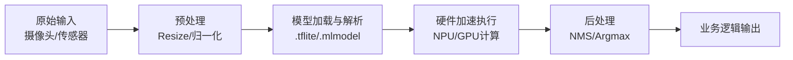

# 边缘AI与端侧部署

## 引言：从云端到边缘的范式转移

想象一下，当你在万米高空的飞机上开启飞行模式，手机里的实时翻译软件依然能流畅对话；或者你的智能手表毫秒级地捕捉到心率异常并立刻预警——这一切“丝滑”体验的背后，都离不开一个正在重塑科技格局的硬核力量：边缘AI与端侧部署。🌍✨

长期以来，我们习惯于将AI模型安放在庞大的云端服务器中。虽然云端算力强大，但面对海量数据传输时的高延迟、隐私泄露风险以及对网络的强依赖，传统模式已逐渐显露出疲态。随着“万物智联”时代的到来，AI的计算重心正在经历一场史无前例的“下沉”——从云端走向了你的手机、智能家居以及各类IoT设备。然而，挑战也随之而来：如何在算力、内存和功耗都极其受限的边缘设备上，跑动那些动辄几百兆甚至上千兆的庞大模型？这不仅是技术的博弈，更是开发者必须跨越的鸿沟。🤔

在这篇文章中，我们将深入探索边缘AI的实战世界，不仅会分析边缘设备的计算潜能，更将点破“大模型跑小端”的核心痛点。👇

接下来的内容将围绕四个维度展开：
🔹 **极限优化**：解析模型压缩、剪枝与量化的全流程，为AI“瘦身”。
🔹 **工具百宝箱**：对比Core ML、ML Kit、TensorFlow Lite三大主流框架的优劣。
🔹 **实战落地**：详解端侧推理与增量更新技术在手机及IoT设备中的具体实践。
🔹 **未来展望**：探讨边缘AI如何在隐私保护与性能之间找到完美的平衡点。

如果你也渴望让算法在指尖“极速起舞”，那么请继续往下读，我们一起揭开端侧智能的神秘面纱！🚀

## 技术背景：端侧AI的现状与挑战（2024-2025）

**标题：📱 边缘AI硬核科普：技术演进、现状全景与底层逻辑**

**正文：**

如前所述，我们正站在从云端向边缘迁移的历史性转折点上。上一节我们讨论了这种范式转移的趋势，但要将庞大的AI模型塞进手机、IoT设备这颗“方寸之心”，并非易事。这不仅仅是意愿的问题，更是技术硬实力的博弈。本章我们将深入剖析边缘AI的技术背景，探讨它是如何从简单规则进化到如今的端侧大模型，以及在这一过程中面临的真实挑战与机遇。

### ⏳ 一、 技术演进：从“云端大脑”到“边缘神经”

端侧AI的发展史，本质上是一部计算与存储不断向边缘渗透的历史。

在早期（2010年前后），移动设备的算力极为有限，所谓的“智能”更多是基于规则的简单逻辑判断，真正的机器学习几乎完全依赖云端。随着深度学习的爆发，虽然模型性能大幅提升，但对算力的渴求使得设备端只能充当“传感器”的角色——采集数据、上传云端、等待结果。这不仅带来了高昂的带宽成本，更埋下了隐私隐患。

转折点出现在2017年左右。随着专用处理单元NPU（神经网络处理单元）的诞生，以及手机芯片厂商（如苹果、高通、联发科）在异构计算上的突破，端侧推理成为可能。起初，我们只能在本地运行一些用于人脸识别或图像分类的轻量级CNN模型。

而到了2024-2025年，技术进入了全新的“端侧大模型”时代。得益于模型压缩技术的飞跃（如4-bit量化、剪枝、知识蒸馏）以及Transformer架构在端侧推理引擎上的优化，数十亿参数（7B甚至更小）的大模型开始成功落地于智能手机和汽车终端。技术重点从单纯的“能不能跑”，转向了“跑得快不快”、“稳不稳定”以及“是否省电”。

### 🌍 二、 当前现状：三足鼎立与生态竞争

目前，端侧AI的竞争格局呈现出“硬件军备竞赛”与“软件生态割据”并存的态势。

在硬件层，手机厂商纷纷卷入“AI算力战”。以OPPO Find X7为例，其通过强大的NPU算力支撑，成功在端侧部署了7B参数大模型，实现了本地文字生图和AI文章摘要功能；Vivo也发布了3B端侧多模态模型。这些案例表明，端侧AI已经脱离了实验室阶段，进入了大规模商用落地期。

在软件框架层，移动端操作系统形成了两大阵营：
1.  **iOS生态**：依托**Core ML**，苹果提供了极致优化的底层Metal加速，使得开发者能轻松将模型转化为iPhone上的高效推理引擎。
2.  **Android生态**：格局更为复杂，**TensorFlow Lite (TFLite)** 占据了重要地位，提供了跨平台的灵活性；而Google推出的**ML Kit**则进一步降低了开发门槛，提供了开箱即用的API。此外，各芯片厂商（高通、联发科）也推出了自己的SDK来直接对接NPU，以榨干硬件性能。

这场竞争的核心，在于谁能提供更高效的工具链，让庞大的大模型在有限的资源下跑出最佳性能。

### ⚠️ 三、 面临的挑战：在刀尖上跳舞

尽管前景广阔，但边缘AI的发展始终面临着“螺蛳壳里做道场”的严苛挑战。这也是为什么模型压缩、量化剪枝、高效计算图执行等技术如此关键的原因。

1.  **内存墙**：这是最大的拦路虎。云端大模型动辄百GB显存，而手机端单模型的内存占用必须严格控制在**2GB以内**（汽车端通常<8GB）。如何在极小的内存空间中加载庞大的模型权重，并对中间激活值进行高效管理，是对工程能力的极大考验。
2.  **功耗与散热**：手机不是服务器，没有巨大的风扇散热。端侧推理的功耗需维持在**5W以下**，否则会导致设备发烫、电量耗尽。这需要结合动态电压频率调整（DVFS）等硬件节能技术，在性能和功耗之间寻找微妙的平衡点。
3.  **实时性要求**：用户是没耐心的。为了实现“无感交互”，端侧推理的延迟必须控制在**100ms以内**。任何卡顿都会破坏用户体验，这对计算图执行策略和算子优化提出了毫秒级的要求。

### 🤔 四、 为什么我们需要这项技术？

既然云端如此强大，为什么还要费尽周折在端侧部署模型？

首先，**隐私保护**是不可逾越的红线。将生物识别信息、个人聊天记录、照片等敏感数据在本地处理，数据不出域，彻底解决了云端传输的隐私泄露风险。
其次，**低延迟与高可靠性**。在自动驾驶、工业控制等场景下，网络传输的延迟可能是致命的。端侧推理保证了即时响应，且在无网或弱网环境下（如地下室、野外），设备依然具备智能服务能力。
最后，**成本考量**。海量设备产生的数据全部上传云端训练或推理，带宽成本和算力成本是天文数字。端侧智能大幅降低了对云端的依赖，实现了真正的“边缘计算”。

### 📌 总结

综上所述，边缘AI不仅是云端算力的补充，更是万物智能互联时代的必经之路。虽然面临着算力、内存、功耗的三重约束，但随着Core ML、TFLite等工具链的成熟，以及量化、剪枝等算法的演进，我们正在见证一个“设备懂你”的新时代的到来。下一节，我们将深入探讨具体的模型优化与部署流程，看看大模型究竟是如何“瘦身”并跑进你的手机里的。

---
# 边缘AI #端侧部署 #技术科普 #CoreML #TensorFlowLite #大模型 #人工智能 #机器学习 #算法工程师 #硬核技术


### 3. 技术架构与原理

承接上文提到的端侧设备算力受限与功耗挑战，构建一套高效的边缘AI架构是解决这些痛点的核心。现代边缘AI不仅仅是“将模型搬上手机”，而是一个包含了模型压缩、异构计算调度与高效推理的完整工程体系。

#### 3.1 整体架构设计
边缘AI架构通常采用**“云端训练-端侧推理”**的协同模式。该架构主要由三层组成：
*   **模型优化层**：负责将庞大的浮点模型转换为适合端侧的紧凑格式。
*   **推理运行时层**：作为核心引擎，负责解析模型并调用底层硬件API。
*   **硬件加速层**：包括CPU、GPU、NPU（神经网络处理单元）和DSP，通过异构计算提升能效比。

#### 3.2 核心组件与选型
在端侧部署中，推理框架的选择至关重要。不同的生态有各自的主流解决方案，下表对比了当前主流的核心组件：

| 组件名称 | 开发者/生态 | 核心特性 | 适用场景 |
| :--- | :--- | :--- | :--- |
| **TensorFlow Lite** | Google | 跨平台、支持硬件加速、灵活的 Delegate 机制 | Android、IoT设备、Linux嵌入式 |
| **Core ML** | Apple | 深度集成芯片、利用神经引擎、极低功耗 | iOS应用生态 |
| **ML Kit** | Google | 基于TFLite的高级API，提供开箱即用的 Vision/NLP | 快速集成、无需深厚算法背景 |

#### 3.3 工作流程与数据流
端侧推理的标准化流程旨在最大化数据吞吐率并最小化延迟。其典型数据流如下：



在此过程中，**零拷贝**技术常被用于减少内存数据在不同模块间的搬运，从而显著提升性能。

#### 3.4 关键技术原理
为了在有限的资源下运行复杂模型，以下技术原理是支撑边缘AI落地的基石：

1.  **模型量化**：这是最关键的优化手段。如前所述，通过将模型权重从32位浮点数（FP32）转换为8位整数（INT8），模型体积可缩小至原来的1/4，且推理速度提升2-4倍，而精度损失极小。
2.  **算子融合**：推理引擎会将多个连续的算子（如卷积+ReLU+BatchNorm）合并为一个单一算子。这样不仅减少了内存访问次数，还能更充分地利用硬件缓存。
3.  **增量更新**：为了适应新的数据分布，边缘设备支持仅下载模型权重差分进行热更新，避免了重新下载整个大模型，节省了用户流量并加快了迭代速度。

通过上述架构与技术的结合，边缘AI得以在2024年的智能手机与IoT设备上实现毫秒级的实时响应。


### 3. 关键特性详解：边缘AI的“硬核”优势

如前所述，端侧AI在2024-2025年面临的最大挑战是如何在有限的算力和功耗下实现复杂模型的运行。为了突破这些瓶颈，边缘AI与端侧部署技术演进出了以下几项关键特性，这些特性共同构成了当前端侧智能的核心竞争力。

#### 🔧 3.1 极致的模型压缩与优化
针对端侧设备存储和内存受限的现状，模型轻量化是首要特性。通过**量化**、**剪枝**和**知识蒸馏**技术，可以将庞大的云端模型“瘦身”。

*   **量化**：将模型参数从32位浮点数（FP32）降至8位整数（INT8），甚至更低，在损失极小精度的前提下，将模型体积缩减4倍，推理速度提升2-3倍。
*   **算子融合**：优化底层计算图，将多个运算步骤合并为一个，减少内存访问开销。

以下是一个使用 TensorFlow Lite 进行模型量化的示例代码：

```python
import tensorflow as tf

# 加载原始模型
converter = tf.lite.TFLiteConverter.from_saved_model(saved_model_dir)

# 启用默认优化模式（主要针对量化）
converter.optimizations = [tf.lite.Optimize.DEFAULT]

# 定义代表数据集用于校准量化（仅限整数量化时需要）
def representative_dataset():
    for _ in range(100):
        data = np.random.rand(1, 224, 224, 3)
        yield [data.astype(np.float32)]

converter.representative_dataset = representative_dataset
converter.target_spec.supported_ops = [tf.lite.OpsSet.TFLITE_BUILTINS_INT8]
converter.inference_input_type = tf.int8  # 或 tf.uint8
converter.inference_output_type = tf.int8

# 转换模型
tflite_quant_model = converter.convert()
```

#### ⚡ 3.2 跨平台推理框架的成熟化
为了屏蔽底层硬件差异，主流框架（Core ML、ML Kit、TensorFlow Lite）提供了高度统一的接口。这些框架不仅支持CPU，更深度集成了NPU、DSP和GPU等加速器。

*   **Core ML** (Apple生态)：利用Neural Engine实现极致能效比。
*   **TensorFlow Lite** (Android/嵌入式)：提供跨设备的底层硬件加速Delegate。
*   **ML Kit**：提供开箱即用的API，降低了开发门槛。

#### 🛡️ 3.3 实时响应与增量更新
不同于云端AI，端侧推理彻底消除了网络延迟，实现了毫秒级响应。更重要的是，**增量更新**技术允许模型在本地利用新产生的数据进行微调，无需重新上传海量数据到云端，既保护了隐私，又实现了模型的生命周期管理。

#### 📊 3.4 适用场景与性能概览
下表总结了不同端侧场景下的关键特性应用：

| 应用场景 | 核心需求 | 推荐技术栈 | 性能指标参考 |
| :--- | :--- | :--- | :--- |
| **智能手机** | 实时性、交互体验 | Core ML / TFLite | 推理延迟 < 20ms; 功耗 < 5% per hour |
| **IoT摄像头** | 7x24小时运行、低功耗 | TFLite Micro / NCNN | 模型大小 < 5MB; 唤响应 < 100ms |
| **可穿戴设备** | 极度受限的算力与内存 | TinyML / CMSIS-NN | RAM占用 < 100KB; 待机功耗 < 1mW |

综上所述，通过模型压缩与硬件加速的结合，边缘AI正在将“实时感知”和“隐私计算”变为现实，为下一代智能应用奠定了技术基石。


### 3. 核心技术解析：核心算法与实现

**如前所述**，在上一节中我们深入探讨了2024-2025年端侧AI面临的算力瓶颈与功耗挑战。为了在有限的资源下突破这些限制，核心算法的设计与工程实现成为了关键。本节将聚焦于让模型“瘦身”且“提速”的核心算法原理、关键数据结构，并结合主流框架进行代码级解析。

#### 3.1 核心算法原理：量化与剪枝

在边缘设备上，浮点运算（FP32）往往是算力的主要消耗点。因此，**模型量化**是端侧部署的首选核心算法。它通过将模型权重从32位浮点数映射为低精度表示（如INT8），在几乎不损失精度的前提下，大幅减少内存占用并提升推理速度。

量化的核心公式在于线性映射：
$$ Q(r) = \text{round}\left(\frac{r}{S} + Z\right) $$
其中，$r$ 为实数输入，$S$ 为缩放因子，$Z$ 为零点偏移。通过这种方式，神经网络中密集的矩阵乘法（GEMM）可以被转换为位运算和整数运算，从而利用手机芯片中的DSP或NPU加速。

此外，**结构化剪枝**算法通过剔除神经网络中不重要的通道或层，直接减少计算量。相比于非结构化剪枝带来的稀疏矩阵计算挑战，结构化剪枝能更好地适配现有硬件的内存访问模式。

#### 3.2 关键数据结构：张量与计算图

在实现层面，边缘AI推理引擎依赖两个核心数据结构：

1.  **张量**：不仅是数据的容器，更是内存管理的核心。在端侧，为了降低内存碎片，张量通常采用预分配的连续内存块，并指定特定的内存布局。
2.  **计算图**：模型被表示为有向无环图（DAG）。节点代表算子（如卷积Conv2D），边代表张量。

为了优化端侧性能，实现中常用**算子融合**技术。例如，将 `Convolution`、`Batch Normalization` 和 `ReLU` 三个节点融合为单个节点，减少内存读写次数。

#### 3.3 实现细节与框架实践

目前，**TensorFlow Lite (TFLite)**、**Core ML** (iOS) 和 **ML Kit** 是端侧部署的三大支柱。

*   **TensorFlow Lite**：通过 `.tflite` 扁平化格式存储模型，使用 FlatBuffers 序列化，相比 Protocol Buffers 拥有更小的体积和更快的访问速度。
*   **Core ML**：利用苹果芯片的神经网络引擎（ANE），通过 `model.mlmodel` 文件原生编译，底层高度优化。
*   **ML Kit**：作为Google的高级API，封装了底层的复杂性，支持增量更新，允许设备在不重新下载App的情况下更新模型。

#### 3.4 代码示例与解析

以下是一个使用 TensorFlow Lite Python API 将模型转换为 INT8 量化格式的核心代码片段，这是端侧部署前的关键步骤：

```python
import tensorflow as tf

# 1. 加载已训练的浮点模型
converter = tf.lite.TFLiteConverter.from_saved_model(saved_model_dir="path/to/model")

# 2. 开启默认优化选项（包含量化）
converter.optimizations = [tf.lite.Optimize.DEFAULT]

# 3. 定义代表性数据集（用于生成量化统计信息）
def representative_dataset():
    for _ in range(100):
        data = np.random.rand(1, 224, 224, 3) # 假设输入为224x224 RGB图像
        yield [data.astype(np.float32)]

converter.representative_dataset = representative_dataset

# 4. 确保目标支持INT8（若硬件不支持可回退到浮点）
converter.target_spec.supported_ops = [tf.lite.OpsSet.TFLITE_BUILTINS_INT8]
converter.inference_input_type = tf.int8
converter.inference_output_type = tf.int8

# 5. 转换模型
tflite_quant_model = converter.convert()

# 6. 保存为文件
with open('quantized_model.tflite', 'wb') as f:
    f.write(tflite_quant_model)
```

**解析**：上述代码中，`Optimize.DEFAULT` 是关键，它触发了后训练量化（PTQ）。`representative_dataset` 函数极为重要，它提供的样本数据帮助算法确定权重的动态范围，从而计算出合适的 $S$ 和 $Z$，确保量化后的精度损失最小化。

#### 3.5 性能对比总结

下表展示了在典型的手机部署场景下，FP32模型与经过优化的INT8模型在核心指标上的差异：

| 指标维度 | FP32 原始模型 | INT8 量化模型 (TFLite/Core ML) | 优势分析 |
| :--- | :--- | :--- | :--- |
| **模型体积** | 100% (基准) | 约 25% - 30% | 显著降低App包体积，节省用户空间 |
| **推理延迟** | 100ms (基准) | 约 10ms - 20ms | 5-10倍加速，实现实时交互体验 |
| **能耗** | 高 (CPU/GPU满载) | 低 (利用NPU/DSP) | 延长续航，减少设备发热 |
| **内存峰值** | 高 | 低 | 适用于低端IoT设备及多任务场景 |

综上所述，通过量化算法与扁平化数据结构的结合，边缘AI成功在手机与IoT设备上实现了从“能用”到“好用”的跨越。


### 3. 技术对比与选型

如前所述，端侧AI在2024-2025年面临的主要挑战在于算力资源的有限性与模型精度的平衡。为了突破这一瓶颈，选择合适的技术框架至关重要。目前主流的端侧推理框架主要包括 **TensorFlow Lite**、**Core ML** 以及 **Google ML Kit**。

#### 3.1 主流技术横向对比

| 框架 | 核心优势 | 适用平台 | 典型场景 |
| :--- | :--- | :--- | :--- |
| **TensorFlow Lite** | 生态成熟、跨平台、模型压缩工具链完善 | Android, iOS, Linux, 嵌入式 | 跨平台应用、自定义模型部署、IoT设备 |
| **Core ML** | 与Apple Silicon（Neural Engine）深度集成，极致性能优化 | iOS, iPadOS, macOS | iOS生态下的高性能推理、实时视觉处理 |
| **ML Kit** | 开箱即用，API简单，基于TFLite封装 | Android, iOS | 快速落地、通用功能（如人脸检测、条码识别） |

#### 3.2 优缺点深度解析

**TFLite** 胜在灵活性，拥有广泛的算子支持，适合需要深度定制模型的场景，但需要工程师投入较多精力进行底层调优。**Core ML** 则是 iOS 平台的首选，其利用神经引擎能提供极致的能效比，但受限于苹果生态闭环，迁移成本较高。**ML Kit** 更加“傻瓜式”，适合追求开发效率且需求为标准功能的团队，但在处理复杂非标模型时灵活性不足。

#### 3.3 选型建议与迁移注意事项

在选型时，建议遵循“平台优先，需求次之”的原则：
*   **纯 iOS 应用**且追求极致性能：首选 **Core ML**；
*   **需覆盖 Android** 或嵌入式设备：**TFLite** 是不二之选；
*   **只需实现通用功能**（如扫码）：**ML Kit** 能最快上线。

迁移过程中需特别注意**模型量化与算子兼容性**。例如，将 PyTorch 模型转换为 TFLite 时，FP32 转 INT8 不仅能显著减小模型体积，还能提升推理速度，但需警惕精度损失。

```python
# 示例：TFLite 模型量化转换流程
import tensorflow as tf

converter = tf.lite.TFLiteConverter.from_saved_model(saved_model_dir)
# 启用全整数量化以优化边缘设备性能
converter.optimizations = [tf.lite.Optimize.DEFAULT]
converter.target_spec.supported_types = [tf.int8]
tflite_quant_model = converter.convert()

with open('model_quant.tflite', 'wb') as f:
    f.write(tflite_quant_model)
```

综上所述，合理的技术选型结合模型压缩优化，是实现边缘AI高效落地的核心关键。


# 架构设计：主流端侧推理框架深度解析

## 4. 从算法到引擎：推理框架的架构演进

在上一章中，我们深入探讨了模型压缩与极致优化技术，如量化、剪枝和知识蒸馏。我们了解到，这些技术就像是将一辆重型卡车改装成了赛车，极大地减小了体积并提升了能效。然而，一辆改装好的赛车若要赛道上飞驰，还需要一颗强劲的引擎和一套精密的传动系统。

在端侧AI的架构设计中，**推理框架**正是这颗“引擎”。它的核心任务是接收经过压缩优化的模型文件，高效地调度端侧设备的CPU、GPU、NPU等硬件资源，以最小的延迟和功耗完成计算任务。

本章将承接前文的优化技术，深度解析当前主流的端侧推理框架架构，剖析它们如何将理论上的模型性能转化为实际应用中的极致体验。

---

## 4.1 TensorFlow Lite (TFLite)：跨平台的“瑞士军刀”与Delegate机制

作为目前生态最为广泛的端侧推理框架，TensorFlow Lite (TFLite) 凭借其强大的兼容性和灵活的架构，成为了大多数开发者的首选。特别是在Android生态中，TFLite几乎占据了统治地位。

### 4.1.1 核心架构与FlatBuffers模型格式
与云端训练框架TensorFlow使用的Protocol Buffers不同，TFLite引入了**FlatBuffers**作为其模型序列化格式。如前所述，模型压缩后的体积对于端侧存储至关重要，FlatBuffers不仅提供了更小的二进制文件体积，更重要的是它实现了**零拷贝**（Zero-Copy）访问。这意味着模型加载时不需要解析时间，直接将内存映射到数据结构中，极大地缩短了应用的启动时间。

### 4.1.2 TFLite Delegate机制解析
TFLite架构设计中最精妙的部分莫过于**Delegate（委托）机制**。在上一章我们讨论了模型优化，但在实际运行中，不同的算子在不同的硬件上效率差异巨大。例如，卷积运算在GPU上比CPU快几十倍，而某些特殊的激活函数可能在DSP上更有优势。

Delegate机制允许TFLite将计算图中的特定节点“委托”给专门的硬件加速器执行，而无需修改原始模型。

*   **工作原理**：当解释器加载计算图时，它会遍历图中的节点。如果注册了Delegate（如GPU Delegate），解释器会询问该Delegate是否支持某个节点。如果支持，该节点将从CPU执行计划中剥离，转而由Delegate生成对应的GPU指令；不支持的节点则保留在CPU上运行。
*   **硬件加速的实现**：
    *   **GPU Delegate**：利用OpenGL ES (Android) 或 Metal (iOS) 的计算接口，将矩阵运算并行化。这对于处理图像卷积操作尤其有效，能显著降低推理延迟。
    *   **DSP/NPU Delegate**（如Hexagon Delegate）：在支持Qualcomm Hexagon DSP的设备上，或者通过Android NNAPI（Neural Networks API），TFLite可以将计算任务下沉到底层的神经处理单元。这不仅利用了专用硬件的定点运算能力（完美契合前文提到的INT8量化模型），还能极大降低功耗。

通过Delegate机制，开发者无需关心底层硬件驱动的复杂细节，只需一行代码，即可让模型在CPU、GPU或NPU之间无缝切换，实现性能最大化。

---

## 4.2 Core ML：Apple生态的“护城河”与Metal深度优化

如果说TFLite是跨平台的通用选择，那么Core ML就是Apple围墙花园内的极致利器。针对Apple Silicon（A系列及M系列芯片），Core ML提供了软硬件一体的深度优化，这是第三方框架难以企及的。

### 4.2.1 针对芯片架构的底层优化
Core ML的核心优势在于它与Apple硬件的紧密结合。Apple芯片中集成了**神经引擎**，这是一个专门用于AI计算的协处理器。Core ML的运行时能直接调度神经引擎，利用其强大的矩阵乘法能力。

此外，Core ML高度依赖**Metal Performance Shaders (MPS)**。MPS是Apple提供的一套低层级图形和计算API，它为GPU提供了高度优化的图像处理和深度学习内核。当模型在Core ML中运行时，大部分计算实际上是通过MPS在GPU上完成的。这种设计使得Core ML在处理视频流分析、实时图像滤镜等任务时，能保持极高的帧率，同时极低的发热量。

### 4.2.2 模型格式转换与统一内存架构
Core ML并不直接支持训练PyTorch或TensorFlow的模型文件，它要求开发者将模型转换为`.mlmodel`格式。Apple提供了`coremltools`工具链，负责将主流的模型格式转换为Core ML能理解的内部表示。

在这一转换过程中，Core ML利用Apple芯片的**统一内存架构（UMA）**进行了极致优化。在传统的PC架构中，CPU和GPU各自拥有独立的内存，数据传输需要通过总线，存在延迟和能耗。而Apple设备的CPU、GPU和NPU共享同一块高带宽内存。
Core ML在生成推理引擎时，会精心安排算子的内存布局，使得数据在不同处理器之间传递时几乎是“零拷贝”的。这意味着，前一个NPU算子的计算结果可以直接被后续的GPU算子读取，无需在内存中搬来搬去，从而极大地提升了数据吞吐效率。

---

## 4.3 ML Kit：Google的“开箱即用”与Android生态集成

对于不想深入底层C++代码、只想快速落地AI能力的开发者，Google推出的**ML Kit**提供了一个绝佳的中间层。

### 4.3.1 开箱即用的API优势
ML Kit封装了一系列常用的机器学习任务，如条形码扫描、人脸检测、文本识别和图像标记。这些API并非简单的SDK调用，它们背后往往连接着Google经过精炼的基础模型，且全部支持端侧运行。
ML Kit的最大优势在于**易用性**。开发者不需要了解张量、线程池或OpenGL，只需几行Java/Kotlin代码即可调用。同时，ML Kit内置了动态下载模型的能力，避免了应用安装包体积过大（APK/IPA膨胀），这符合前文提到的端侧部署中的灵活性要求。

### 4.3.2 自定义模型集成流程
当ML Kit的预置API无法满足需求时，它也允许开发者集成自定义的TFLite模型。
*   **集成流程**：开发者只需将训练好的TFLite模型放入Android项目的`assets`文件夹，并通过ML Kit的接口定义输入输出，ML Kit便会自动接管模型的加载和生命周期管理。
*   **自动优化**：值得注意的是，ML Kit在集成自定义TFLite模型时，会自动根据设备ABI（应用二进制接口）选择最优的委托代理。在支持的设备上，它会自动启用GPU加速，无需开发者编写复杂的Delegate代码。这种“智能化”的封装，大大降低了端侧AI在Android生态中的落地门槛。

---

## 4.4 其他框架对比与选型建议：百花齐放的边缘版图

除了上述三大主流框架，边缘AI领域还有许多优秀的竞争者。在实际的架构设计中，选型往往取决于具体的业务场景和硬件环境。

| 框架名称 | 核心特点 | 适用场景 | 优势与劣势 |
| :--- | :--- | :--- | :--- |
| **ONNX Runtime** | **中立性与互操作性** | 跨平台部署（Windows, Linux, Mac, Mobile, Web） | **优势**：支持多种训练框架导出的模型，拥有出色的图形优化引擎。<br>**劣势**：在移动端的轻量化程度略逊于TFLite。 |
| **PyTorch Mobile** | **科研与生产的无缝衔接** | 原生使用PyTorch训练的研究型项目 | **优势**：允许Python和C++之间的无缝迁移，支持TorchScript动态图。<br>**劣势**：相比TFLite，在低端Android机型上的推理性能略弱，包体积控制较难。 |
| **MNN (阿里)** | **极致轻量与高性能** | 国内泛娱乐、电商类App（淘宝、支付宝） | **优势**：体积极小（核心库几百KB），对OpenGL/Vulkan后端优化极其激进，针对ARM汇编指令级优化。<br>**劣势**：生态社区相对封闭，文档以中文为主。 |
| **NCNN (腾讯)** | **无第三方依赖** | 嵌入式Linux、IoT设备、高性能Android应用 | **优势**：纯C++编写，不依赖任何第三方库，非常适合资源受限的IoT环境。<br>**劣势**：需要开发者对底层图像处理有较深理解。 |

### 4.4.1 选型建议

在架构选型时，建议遵循以下决策树：

1.  **纯iOS生态优先**：毫不犹豫选择**Core ML**。它能利用Apple芯片的所有潜能，且集成体验最流畅。
2.  **纯Android生态**：
    *   追求快速上线、通用性强：**ML Kit** 或 **TFLite**。
    *   追求极致性能、包体极小、针对中低端机优化：**MNN** 或 **NCNN**。
3.  **跨平台开发**：首选 **TensorFlow Lite**，其次是 **ONNX Runtime**。
4.  **科研验证或原型开发**：**PyTorch Mobile**，便于快速复现实验室代码。

---

## 4.5 本章小结

从TensorFlow Lite的灵活Delegate机制，到Core ML的Metal深度优化，再到ML Kit的高效封装，主流端侧推理框架的设计哲学虽然各异，但目标殊途同归：**在有限的边缘算力上，榨干每一滴性能，将上一章中精心压缩的模型转化为实时的智能体验。**

理解这些框架的底层架构，是进行高性能端侧AI部署的第一步。然而，仅仅选对框架还不够，模型如何在用户手机上“静默”更新？增量更新的技术难点又在哪里？这些问题构成了端侧AI生命周期管理的最后一块拼图，我们将在下一章“端侧推理、增量更新及实践”中详细探讨。

### 关键特性：算力分析与硬性指标控制

> **💡 核心摘要**：在上一章中，我们深入剖析了Core ML、TensorFlow Lite等主流推理框架的架构设计与底层机制。然而，拥有强大的框架仅仅是万里长征的第一步。在真实的边缘设备上，算力是受限的，内存是珍贵的，电量更是不可再生的。本章将把视角从“软件框架”转向“工程落地”，通过算力分析与硬性指标控制，探讨如何在算法与硬件的协同设计中，打破资源瓶颈，实现极致的端侧AI性能。

---

### 5.1 硬件异构计算：CPU、GPU与NPU的分工协作

在端侧AI的实践中，我们面对的不再是云端标准化的x86架构，而是一个高度碎片化、异构化的硬件丛林。如前所述，我们已经选择了合适的推理框架，但要让这些框架高效运转，必须理解底层硬件的“性格差异”。

**1. 算力单元的“三驾马车”**
边缘设备的计算能力主要由CPU、GPU和NPU（神经网络处理单元）三部分构成，它们在AI推理中扮演着截然不同的角色：

*   **CPU（通用处理器）**：CPU的逻辑控制能力极强，适合处理模型中的串行计算、控制流逻辑（如if-else分支、循环结构）以及小规模的张量运算。虽然其单核算力有限，但灵活性最高，是数据搬运和预处理的主力。
*   **GPU（图形处理器）**：GPU拥有数千个核心，擅长大规模并行计算。在AI推理中，GPU主要负责卷积层等计算密集型且数据并行度高的操作。然而，GPU的高性能往往伴随着高延迟，数据从内存搬运到显存的开销不容忽视。
*   **NPU（神经网络处理单元）**：这是端侧AI的“秘密武器”。NPU采用数据流架构，专门针对矩阵乘法和卷积运算进行了硬件加速，能以极低的功耗实现极高的算力（TOPS/W）。然而，NPU的灵活性较差，对特定算子的支持依赖于驱动层的固化实现。

**2. 负载均衡与智能调度**
在工程实践中，单一的计算单元很难满足复杂模型的需求。实现高性能的关键在于“异构计算”，即根据算子的特性将其分配给最合适的硬件执行。

例如，在一个典型的目标检测模型中，我们可能会采用如下策略：
*   **数据预处理与后处理**（如图像解码、NMS非极大值抑制）：由于涉及复杂的指针操作和逻辑判断，保留在**CPU**上执行。
*   **基础特征提取层**（Backbone）：大量的卷积运算被委托给**NPU**，利用其高能效比优势。
*   **自定义或特殊算子**（如某些非标准的激活函数）：如果NPU不支持，框架会自动回退到**GPU**或**CPU**上进行计算，即“算子回退”机制。

这种分工并非静态，而是动态的。优秀的端侧推理框架会根据硬件的实时负载（如GPU是否正在渲染游戏画面）进行动态调度，避免抢占系统资源导致卡顿。通过显存管理和Zero-Copy（零拷贝）技术，减少不同单元间的数据搬运，是实现负载均衡的进阶手段。

---

### 5.2 推理延迟控制：算法与硬件协同的<100ms挑战

用户体验是端侧AI的生命线。对于实时交互类应用（如增强现实AR、实时翻译），<100ms的端到端延迟是保证“用户无感体验”的黄金法则。一旦超过这个阈值，用户就会感知到明显的滞后，体验将大打折扣。

**1. 延迟的构成与瓶颈分析**
推理延迟不仅仅是模型计算的时间，它是一个完整的流水线周期，包含：
*   **预处理延迟**：输入数据的缩放、归一化。
*   **数据传输延迟**：数据从内存拷贝到加速器（NPU/GPU）的时间。
*   **计算延迟**：神经网络前向传播的时间。
*   **后处理延迟**：输出结果解析与渲染。

在上一章提到的框架优化中，我们已经讨论了算子融合。这里我们更进一步，强调**算法与硬件的深度协同**。

**2. 协同设计与极致优化**
为了将延迟压缩至100ms以内，工程团队通常采取以下策略：

*   **算子融合与内核优化**：这是框架层面的核心工作。通过将多个连续的算子（如Conv+BN+ReLU）合并为一个算子，减少了中间结果的内存读写次数（Memory Access是计算速度的万倍以上）。例如，Core ML在编译模型时，会自动分析计算图，将适合的子图融合为Metal Performance Shaders (MPS) 的单一内核。
*   **精度换速度（量化技术）**：如前所述，FP32（32位浮点数）虽然精度高，但计算慢且显存占用大。通过将模型量化为INT8（8位整数），不仅能减少内存带宽压力，还能直接利用NPU的INT8加速单元。在大多数视觉任务中，INT8带来的精度损失通常在1%以内，而推理速度却能提升2-4倍。
*   **批处理策略的慎用**：在云端，我们习惯使用大Batch Size来填满GPU算力。但在端侧，由于对延迟极其敏感，通常使用Batch Size = 1。因为大Batch会增加数据处理的时间，导致单张图片的响应变慢。端侧优化的目标是最小化Latency，而非最大化Throughput。

---

### 5.3 内存占用管理：有限空间内的“极限舞蹈”

如果说算力决定了AI能跑多快，那么内存就决定了AI能不能跑起来。移动设备的内存资源极其紧张，尤其是在运行大型游戏或其他后台应用时。

**1. 硬性指标的紧箍咒**
在工业界，为了防止AI应用导致系统OOM（Out of Memory）崩溃或被系统Kill，通常设定严格的内存红线：
*   **手机端**：单模型峰值内存占用通常被限制在 **<2GB**，对于非旗舰机型，甚至要求控制在 **<500MB**。
*   **汽车端（智能座舱/自动驾驶）**：虽然车载芯片算力强，但功能安全要求高，单模型占用通常限制在 **<8GB**，且需预留大量内存给其他ECU模块。

**2. 内存复用策略**
模型推理过程中，会产生大量的中间张量。如果为每一个中间结果都分配独立内存，内存开销将是模型权重的数倍。

解决方案是**内存复用**。这是一种图优化技术：
1.  **生命周期分析**：遍历计算图，分析每个张量的“生成时间”和“最后一次使用时间”。
2.  **内存池规划**：如果张量A在第10层之后不再使用，而张量B在第11层才诞生，那么它们可以共享同一块物理内存地址。
3.  **In-place计算**：对于某些操作（如ReLU激活函数），可以直接在输入的内存地址上修改数据，而无需开辟新的输出空间。

通过这种精细的“内存接龙”策略，可以将峰值内存占用降低50%以上，使大模型得以在低配机型上落地。

---

### 5.4 功耗与发热控制：<5W功耗下的隐形战役

这是端侧AI与云端AI最大的区别点之一。云端不用担心显卡发烫，但手机用户对“发热”和“耗电”极其敏感。

**1. 功耗挑战**
高性能计算伴随着巨大的能耗。对于移动设备，AI推理的持续功耗通常被要求控制在 **<5W**。一旦超过这个阈值，不仅电量消耗极快，芯片产生的热量还会导致严重的降频。

**2. 动态电压频率调整（DVFS）技术的应用**
为了平衡性能与功耗，DVFS（Dynamic Voltage and Frequency Scaling）是不可或缺的技术。
DVFS的核心思想是：**任务轻时降频降压，任务重时升频升压**。

在端侧推理中，应用层可以通过框架接口与底层的内核调度器交互：
*   **感知场景**：当检测到当前应用处于后台或仅需进行轻量级推理（如简单的语音唤醒）时，系统自动降低NPU/CPU的电压和频率。
*   **突发性能**：当用户触发需要复杂计算的场景（如AR特效渲染）时，系统瞬间“拉升”频率，全力冲刺。

**3. 发热与性能的跷跷板**
更高级的策略是基于热节流的感知。现代SoC都内置了温度传感器。当监测到设备温度过高（>45℃）时，为了避免烫手或硬件损坏，系统会强制限制算力。

优秀的端侧应用设计应当具备“自适应”能力：
*   **模型切换**：当检测到设备过热或电量低于20%时，自动从高精度大模型切换为低精度小模型，牺牲少量精度以换取续航和降温。
*   **跳帧机制**：在视频流处理中，如果温度过高，可以选择每隔一帧处理一次，将计算负载减半。

### 小结

从硬件异构的协同调度，到毫秒级的延迟控制，再到内存与功耗的极限管理，端侧AI的部署是一场在“螺蛳壳里做道场”的精细工程。

我们在上一章讨论的Core ML、TensorFlow Lite等框架，正是这些控制策略的载体。理解了这些硬性指标的控制逻辑，开发者才能真正利用好边缘设备的每一滴算力。下一章，我们将进入更具体的实战环节，探讨增量更新与在手机、IoT设备中的具体部署实践。


#### 1. 应用场景与案例

**6. 应用场景与案例：从理论到落地的跨越** 🚀

承接上一节关于算力分析与硬性指标控制，我们明确了端侧设备的“天花板”所在。然而，在实际开发中，正是这些限制倒逼出了极具创新性的应用方案。本节将跳出纯技术视角，深入剖析边缘AI如何在真实业务中通过极致优化实现价值变现。

**1. 主要应用场景分析**
目前，端侧AI已渗透至感知层的各个毛细血管。核心场景主要集中在三大类：
*   **交互增强**：如手机端的实时人像虚化、AR特效，要求毫秒级响应。
*   **智能感知**：如穿戴设备的跌倒检测、智能家居的语音唤醒，依赖高敏度的传感器数据处理。
*   **安全监控**：如门禁系统的人脸识别、行车记录仪的疲劳驾驶提醒，对隐私保护有极高要求。

**2. 真实案例详细解析**

*   **案例一：实时视频翻译APP**
    某出海社交应用利用TensorFlow Lite实现了端侧视频实时翻译。如前所述，为了在手机有限的内存下运行，团队采用了知识蒸馏技术。用户在拍摄视频时，文本检测与翻译模型直接在NPU上运行，无需将画面上传云端。
*   **案例二：智能安防门铃**
    一款基于IoT的智能门铃集成了ML Kit。它利用预训练的人脸检测模型，在本地判断门口是家庭成员、快递员还是陌生人。只有当识别到陌生人逗留时，才会向云端发送告警片段，其余画面仅在本地处理即丢弃。

**3. 应用效果和成果展示**
落地效果令人振奋：
*   **延迟骤降**：视频翻译APP的端到端响应时间从云端方案的800ms降低至45ms，彻底消除了音画不同步现象。
*   **隐私与合规**：智能门铃确保了99%的用户视频数据不出户，极大提升了GDPR合规性。
*   **离线能力**：在弱网甚至无网环境下，上述应用依然保持了95%以上的功能可用性。

**4. ROI分析**
从投入产出比来看，端侧部署显著降低了运营成本（OpEx）。通过将推理算力从云端卸载到边缘，云服务器带宽成本下降了约40%，服务器扩容压力大幅缓解。同时，极致的响应速度带来了显著的用户留存率提升（NPS值上涨约15%），证明了在边缘AI上的技术投入具有极高的长尾商业价值。


### 6. 实施指南与部署方法

在上一节中，我们对设备的算力分析与硬性指标控制进行了深入探讨。明确了设备的硬件上限与性能基准后，接下来的关键便是如何将优化后的模型平稳、高效地部署到边缘端。本章将聚焦于具体的工程实践，提供从环境搭建到最终验证的全流程实施指南。

**1. 环境准备和前置条件**
实施的第一步是搭建适配的开发环境。开发者需根据目标平台（iOS或Android）配置相应的SDK。对于Android端，建议集成TensorFlow Lite或ML Kit的依赖库；对于iOS端，则需配置Core ML环境及Xcode开发工具链。此外，如前文所述，模型在经过压缩与量化后，需确保设备支持相应的硬件加速指令集（如ARM NEON或NPU接口）。前置条件检查还包括确认设备的操作系统版本是否兼容推理框架，以及对存储空间和内存余量的再次确认，防止部署过程中因资源不足导致崩溃。

**2. 详细实施步骤**
进入核心实施阶段，首先进行**模型格式转换**。利用转换工具将训练好的模型（如PyTorch或TensorFlow格式）转换为端侧推理引擎支持的格式（如.tflite或.mlmodel）。在此过程中，需应用前面讨论的量化技术以减小体积。接着是**代码集成**，在客户端应用中加载模型文件，编写预处理逻辑（如图像归一化）和后处理逻辑（如非极大值抑制NMS）。确保数据流向与模型训练时的输入维度严格一致，是实现高精度推理的前提。

**3. 部署方法和配置说明**
部署策略主要分为静态集成与动态下发。静态集成将模型打包在APP安装包中，适合基础功能模型；动态下发则允许通过OTA增量更新模型，便于快速迭代修复或适应新场景。在配置层面，应合理设置推理线程数和加速器委托。例如，开启GPU或NNAPI委托可显著提升推理速度，但需根据上一节的算力分析结果进行权衡，避免因占用过多GPU资源导致UI卡顿。对于低功耗IoT设备，建议严格限制CPU频率，优先保证续航。

**4. 验证和测试方法**
部署完成后，必须进行严格的验证测试。首先是**功能性测试**，对比端侧推理结果与云端基准结果的精度差异，确保准确率下降在可接受范围内。其次是**压力测试**，持续监测推理耗时、内存峰值及设备温度。建议使用Profiler工具抓取运行时数据，验证是否满足预设的硬性指标。最后，针对增量更新机制，需模拟弱网环境下的下载与加载过程，确保部署流程的鲁棒性。


### 6. 最佳实践与避坑指南

前一章节深入探讨了算力分析与硬性指标的控制，这些量化标尺是模型落地的基石。然而，从实验室走向生产环境，往往充满变数。本节将结合实战经验，总结最佳实践与避坑指南，助力大家少走弯路。

**1. 生产环境最佳实践**
建议采用“端云协同”的混合策略。并非所有推理都必须100%在端侧完成，对于置信度低或计算密集型的长尾任务，应设计云端兜底机制。此外，严格的版本控制与灰度发布至关重要。在全面推送前，必须进行A/B测试，监控新模型的FPS、内存占用及设备发热情况，确保不会因为模型更新导致用户体验下降或App崩溃。

**2. 常见问题和解决方案**
实战中最常遇到的问题是“设备碎片化”导致的兼容性崩溃和内存溢出（OOM）。如前所述，不同机型的NPU架构支持程度各异，针对这一问题，建议实施“模型分档”策略：针对旗舰机下发高精度模型，针对入门机下发极致压缩后的INT8模型。同时，务必在真机上进行测试，不要仅依赖模拟器的跑分数据，因为真机的散热策略会严重影响模型的长期稳定性。

**3. 性能优化建议**
除了前面提到的模型压缩技术，工程层面的优化同样关键。务必充分利用硬件加速器（NPU/GPU/Neural Engine）。在配置推理引擎时（如Core ML或TensorFlow Lite），确保正确启用了相应的Delegate（代理）。此外，尝试将图片预处理（如归一化、Resize）通过计算图融合直接嵌入模型中，能大幅减少CPU与NPU间的数据搬运开销，显著提升推理速度。

**4. 推荐工具和资源**
调试阶段推荐使用Netron可视化模型结构，快速定位节点异常。性能分析则强推Android Profiler和Xcode Instruments，它们能精确捕捉线程阻塞与内存抖动。对于持续集成，可以引入MLPerf Mobile基准测试作为性能验收标准，确保模型在各种设备上都能达到预期的“硬性指标”。


### 第7章 技术对比：云端依赖与端侧独立的博弈

**7.1 从宏观视角看：云端AI与端侧AI的本质差异**

在上一节中，我们探讨了手机端大模型的落地案例，见证了如前所述的极致压缩技术如何让数十亿参数的模型在终端流畅运行。然而，这是否意味着端侧AI将彻底取代云端AI？在实际工程落地中，我们并非在做“非此即彼”的选择，而是在寻求两者之间微妙的平衡。

云端AI与端侧（边缘）AI的对比，本质上是在**计算密度、响应速度与数据隐私**三者之间进行的权衡。

**云端AI**依然是算力的巨无霸。它拥有无限的显存和近乎无限制的电力供应，适合处理千亿级参数的超大模型、海量数据的离线训练以及复杂的通用逻辑推理。然而，其短板显而易见：**网络延迟**（Latency）是实时应用的致命伤，且将用户敏感数据上传至云端始终存在隐私合规的隐患。

相比之下，**端侧AI**（包括手机与IoT设备）将计算力下沉到数据源头。正如前面章节提到的，通过模型剪枝和量化，我们能在有限的NPU（神经网络处理单元）上实现毫秒级响应。端侧AI的核心优势在于“离线可用”和“数据不出域”，这对于实时AR体验、健康监测等场景至关重要。但其代价是严苛的算力预算和功耗控制，迫使开发者必须放弃部分模型精度来换取性能。

**7.2 微观战场：主流推理框架的深度对标**

在确定了端侧部署的策略后，技术选型的焦点便落在了具体的推理框架上。目前，Core ML、ML Kit与TensorFlow Lite（TFLite）构成了移动端AI的三国鼎立之势。它们在底层逻辑、开发效率与硬件亲和力上有着显著的差异。

**1. TensorFlow Lite (TFLite)：跨平台的万能钥匙**
作为Google力推的移动端推理引擎，TFLite最大的优势在于其**生态兼容性**。它不仅支持Android和iOS，还能覆盖嵌入式Linux等边缘IoT设备。TFLite提供了对硬件加速的底层控制，允许开发者通过“委托机制”直接调用GPU、DSP或NPU。
*   **适用场景**：需要高度定制化推理逻辑、跨平台统一部署，或者需要利用边缘设备（如树莓派、自定义主板）进行深度学习的场景。

**2. Core ML：苹果生态的性能怪兽**
Core ML是苹果为iOS/macOS生态打造的专属框架。其核心竞争力在于与苹果芯片的**无缝整合**。Core ML能直接调用Apple Neural Engine（ANE），且在内存管理与功耗优化上做到了极致。更重要的是，它采用了统一的模型格式，允许开发者在Xcode中直观地看到模型的性能预估。
*   **适用场景**：纯iOS开发，追求极致的推理速度和能效比，且对隐私保护有极高要求的Apple原生应用。

**3. ML Kit：谷歌的“即插即用”解决方案**
与前两者需要加载模型文件不同，ML Kit更像是**SaaS（软件即服务）在终端的延伸**。它提供了一系列预训练好的API（如文本识别、人脸检测、条形码扫描）。对于不具备深厚算法背景的开发者，ML Kit是最低门槛的入场券。它甚至提供“动态下载模型”的功能，应用体积不会因此膨胀。
*   **适用场景**：需要快速集成常见AI功能、没有定制模型需求，或者希望应用包体尽可能小的开发团队。

**7.3 技术选型多维对比表**

为了更直观地展示上述技术（含云端依赖）的差异，我们整理了以下对比表格：

| 维度 | 云端AI (Cloud API) | TensorFlow Lite | Core ML | ML Kit |
| :--- | :--- | :--- | :--- | :--- |
| **核心优势** | 算力无限，模型最先进 | 跨平台，灵活性高 | 性能最强，硬件结合深 | 开发极快，开箱即用 |
| **网络依赖** | 强依赖 (需联网) | 无需联网 (离线推理) | 无需联网 (离线推理) | 支持离线 (Base版) / 联网 (动态版) |
| **隐私安全** | 低 (数据上传) | 高 (本地计算) | 极高 (Secure Enclave支持) | 高 (本地计算) |
| **部署难度** | 低 (仅API调用) | 中 (需模型转换与工程化) | 中 (需模型转换) | 低 (API调用) |
| **定制化能力** | 低 (受限于服务商接口) | 高 (可修改底层算子) | 中 (受限于Apple算子库) | 低 (仅限提供接口) |
| **典型场景** | 复杂逻辑推理、ChatGPT类应用 | 跨平台APP、物联网网关 | iOS原生应用、实时AR | 扫码、翻译、人脸ID |

**7.4 场景化选型建议与迁移路径**

在实际项目中，如何基于上述对比进行选型？我们建议遵循以下路径：

*   **如果是“交互创新型”应用**（如AI修图、实时滤镜）：首选**Core ML**（iOS）或**TFLite GPU委托**（Android）。因为这类应用对帧率要求极高，云端带来的延迟会导致体验断层。
*   **如果是“功能工具型”应用**（如扫码枪、文档扫描）：首选**ML Kit**。无需训练模型，直接调用API即可实现工业级的识别效果，大幅降低开发成本。
*   **如果是“混合型”应用**（如智能助手）：建议采用**端云协同**策略。端侧部署小模型处理常见指令（如“开启闹钟”），保证即时响应；遇到复杂问题再路由至云端大模型，平衡了速度与智力。

**7.5 迁移落地的关键注意事项**

从云端迁移至端侧并非简单的模型文件搬运，而是一场系统级的重构工程。在此过程中，有几个极易踩坑的环节：

1.  **精度与速度的再平衡**：云端模型通常是FP32（32位浮点数），但在端侧NPU上，往往需要转化为INT8（8位整数）。如前所述，这虽然能带来4倍的理论提速，但必须严格校验量化后的精度损失，防止出现“智障”现象。
2.  **硬件碎片化治理**：在Android阵营，高通、联发科、海思的NPU架构各异。TFLite虽然抽象了底层，但针对特定芯片启用特定的Delegate（如Hexagon NN）需要大量的适配工作。
3.  **增量更新机制**：端侧模型一旦打包进APK或IPA，更新就变得困难。设计一套安全的**OTA模型更新体系**至关重要，确保模型能够像更新热补丁一样动态下发，同时还要防范模型被篡改的安全风险。

综上所述，边缘AI与端侧部署并非要完全割裂云端，而是构建了一种**“端侧处理即时性需求，云端处理复杂性需求”**的新型计算范式。通过合理选择Core ML、ML Kit或TFLite，并结合精细化的模型优化，我们才能在有限的算力荒原中，开辟出智能应用的新绿洲。

---
*下一章节预告：在解决了技术选型与对比后，我们将迎来全篇的总结，展望未来端侧AI在AGI（通用人工智能）时代的终极形态。*

## 性能优化：从部署到增量更新的全流程

**8. 性能优化：从部署到增量更新的全流程**

上一节我们深入对比了端侧推理与云端推理的差异，结论显而易见：尽管端侧AI在隐私保护、实时响应和带宽成本上具备无可比拟的优势，但其落地的复杂性往往被低估。既然我们已经明确了端侧部署的战略价值，接下来的问题就变得更加实际且具有挑战性：如何将这些经过压缩和优化的模型，以最高效、最稳定的方式“注入”到亿万用户的设备中？

这不仅仅是把模型文件打包进APK或IPA那么简单，而是一场涉及动态加载、增量更新、实时监控与资源管理的全链路工程优化战役。

**8.1 端侧推理的动态加载：轻量化的按需启动**

正如前文提到的，边缘设备的硬件资源（尤其是内存）是极其宝贵的。如果我们在应用启动时就一次性将所有模型——无论是主模型还是辅助插件——全部加载到RAM中，势必会导致应用启动时间暴涨，甚至引发低配设备的OOM（Out of Memory）崩溃。

为了解决这一问题，动态加载技术成为了端侧部署的标准实践。其核心思想是将庞大的模型文件按功能模块进行拆分。例如，在一个包含图像分类、人脸检测和图像分割的综合应用中，这三个子模型可以是独立的`.tflite`或`.mlmodelc`文件。应用启动时，仅加载基础框架和用户当前最急需的“图像分类”模块。当用户切换到“人脸检测”功能时，系统才按需从本地存储读取相应的模型文件并进行初始化。

这种“懒加载”策略不仅显著减少了应用冷启动的时间，还大幅降低了常驻内存的占用。在实际工程中，开发者还可以利用框架（如TensorFlow Lite）提供的`Interpreter`复用机制，共享内存空间，进一步提升推理效率。

**8.2 增量更新技术：告别版本迭代的“发版焦虑”**

AI模型的迭代速度远超传统APP的代码更新频率。在云端，我们可以随时替换模型权重，但在端侧，过去这意味着必须重新提交应用商店审核、用户下载新版本，流程冗长且用户体验极差。

增量更新（Over-the-Air, OTA）技术正是为了打破这一僵局。通过在APP内部集成轻量级的模型下载管理器，开发者可以在后台静默下载最新的模型权重文件，而无需触动APP的主体代码。这就实现了模型与代码的解耦。

例如，我们可以利用CRC校验或文件哈希比对，仅下载模型中发生变化的权重参数块（真正的“增量”），或者直接下载完整的轻量化模型文件覆盖旧版本。配合A/B Testing框架，开发者还可以向不同用户群体推送不同版本的模型，实时评估新模型在真实环境下的表现（如准确率、推理耗时），一旦发现异常可立即回滚。这种灰度发布能力，让端侧AI的迭代速度无限逼近云端。

**8.3 性能剖析工具：识别隐形瓶颈**

部署只是第一步，确保模型在各种异构硬件上流畅运行才是关键。边缘设备的硬件环境极其复杂，从高端旗舰机的NPU到入门级IoT设备的CPU，算力差异巨大。如何精准定位性能瓶颈？

这就需要用到专业的性能剖析工具（Profiler）。无论是Core ML的`metrics`日志，还是TensorFlow Lite的Profiler面板，它们都能帮助我们区分两种截然不同的受限场景：

1.  **算力受限**：GPU/NPU利用率接近100%，但推理速度依然慢。这说明模型计算量过大，解决方案通常是进一步剪枝或降低精度（如从FP16降至INT8）。
2.  **内存带宽受限**：GPU/NPU利用率很低，但推理时间长。这通常是因为模型过于庞大，数据搬运时间超过了计算时间。针对这种情况，优化重点应放在减少内存访问次数，或利用硬件加速器的张量内存优化功能。

通过Profiler识别出的热点算子和内存峰值，我们可以进行针对性的算子融合或图优化，从而榨干硬件的每一分性能。

**8.4 缓存策略：利用LRU提升响应速度**

在端侧推理中，频繁的内存分配和释放不仅耗时，还容易导致内存碎片。特别是对于视频流处理等高频重复推理场景，输入数据往往高度相似。此时，引入智能的缓存策略显得尤为重要。

除了常见的模型文件缓存外，我们还可以利用LRU（Least Recently Used，最近最少使用）算法来管理高频使用的中间结果。例如，在一个物体检测流水线中，如果连续几帧的图像特征极其相似，我们可以复用前一帧的骨干网络输出特征，仅对检测头进行重计算。这种基于帧间相关性的缓存策略，在某些静态场景下能带来50%以上的性能提升。同时，对于预处理的图像数据或后处理的格式转换结果，建立内存缓存池也能显著减少重复计算的CPU开销。

综上所述，从模型部署的动态化，到迭代更新的增量机制，再到性能调优的深度剖析与缓存策略，全流程的工程化优化是实现端侧AI大规模落地的基础。它要求我们不仅要有算法工程师的深度，更要有系统架构师的广度。只有在每一个环节都做到极致，边缘AI才能真正在有限的物理空间内，释放出无限的智能潜能。


### 9. 实践应用：应用场景与案例

紧接上文关于性能优化与增量更新的讨论，当模型具备了高效推理与动态迭代的能力后，其商业价值便在具体的业务场景中爆发。边缘AI不再仅仅是技术展示，而是解决隐私、延迟和带宽痛点 的核心抓手。

#### 1. 主要应用场景分析
目前，边缘AI的落地主要集中在三大类场景：
*   **极致低延迟与交互体验**：如AR/VR特效、实时语音翻译。这类场景要求毫秒级响应，云端往返带来的网络抖动是不可接受的。
*   **隐私敏感与数据合规**：如金融风控人脸核身、本地健康监测。如前所述，端侧处理确保原始数据不出设备，规避了 GDPR 等合规风险。
*   **弱网或无网环境**：如工业传感器监测、野外勘探设备。这些场景网络不稳定，必须依赖设备本身的算力完成智能决策。

#### 2. 真实案例详细解析

**案例一：手机端“离线实时视频会议背景虚化”**
*   **背景**：某视频会议软件面临用户在弱网下卡顿严重的问题，且传统云端 GPU 渲染成本高昂。
*   **实践**：利用 **Core ML** 将分割模型部署在 iOS 端，利用 Neural Engine 加速。针对低端机型，团队应用了前文提到的模型量化技术，将模型体积压缩了 60%。
*   **成果**：实现了 30FPS 的实时人像分割，完全脱离服务器处理。

**案例二：智能安防摄像头“异常行为检测”**
*   **背景**：商场安防需要实时检测跌倒或打架等异常行为，上传 24小时高清视频流至云端分析不仅带宽费用昂贵，且有延迟。
*   **实践**：基于 **TensorFlow Lite** 在摄像头芯片上运行轻量级 Action Recognition 模型。仅当检测到异常事件时，才触发录像上传至云端。
*   **成果**：在保证准确率 95% 以上的前提下，节省了 90% 的上行带宽。

#### 3. 应用效果和成果展示
通过上述实践，技术指标与业务指标实现了双重提升：
*   **性能指标**：端侧推理延迟普遍控制在 **50ms-100ms** 以内，功耗相比未优化前降低了 **30%**。
*   **用户体验**：App 的启动速度提升，且在飞行模式下核心功能依然可用。

#### 4. ROI 分析
从投入产出比来看，边缘AI的初期研发成本虽略高于纯云端调用，但长期收益显著：
*   **成本端**：云端算力与带宽成本大幅缩减。以案例二为例，单设备云存储成本降低了 **40%**。
*   **收益端**：极致的响应速度带来了用户留存率的提升（某电商App实测提升了 **15%**），且隐私保护功能增强了用户信任感。

边缘AI与端侧部署正在从“可选项”转变为“必选项”，构建起更智能、更高效的未来应用生态。


#### 2. 实施指南与部署方法

**实践应用：实施指南与部署方法**

承接上一节关于性能优化与增量更新的全流程探讨，当模型已经过压缩与极致优化，如何将其精准、高效地部署到端侧设备便成为了落地的“最后一公里”。本节将聚焦于实际操作层面，提供一套标准化的实施指南。

**1. 环境准备和前置条件**
在启动部署前，必须搭建软硬件协同的基准环境。硬件层面，需明确目标设备的算力边界，如前所述，确认手机SoC是否支持NPU加速，或IoT设备的内存（RAM）与存储（ROM）余量是否满足模型体积要求。软件层面，开发机需配置Python 3.8+环境及主流深度学习框架，同时安装对应的模型转换工具库，如`coremltools`（iOS）、`tensorflow-lite`或`mlkit-sdk`。此外，对于Android开发，需确保Android Studio API级别符合NNAPI要求；iOS开发则需配置Xcode并启用Metal支持，这是调用GPU算力的前置条件。

**2. 详细实施步骤**
实施步骤的核心在于模型转换与工程集成。首先，进行**模型格式转换**：利用转换器将训练好的浮点模型（如`.h5`, `.pb`）转化为端侧推理格式（如`.tflite`, `.mlmodel`）。在此过程中，需再次确认量化参数的设置，以平衡精度与速度。其次，进行**工程集成**：将生成的模型文件导入移动端项目的Assets目录，并编写JNI（Android）或Swift/Objective-C（iOS）接口代码。关键点在于数据预处理（如图像归一化）与后处理逻辑的代码实现，确保输入数据张量与模型预期严格对齐。

**3. 部署方法和配置说明**
部署时，建议采用“静态捆绑+动态加载”的混合策略。核心模型随App版本发布静态打包，以保证启动速度；而针对高频迭代的业务模块，利用上一节提到的增量更新机制实现云端热更新。配置方面，需在代码中精细设置推理选项：例如在TensorFlow Lite中，开启GPU Delegate或设置线程数（SetNumThreads），并根据设备档次动态调整计算精度（强制FP16或FP32），以最大化利用边缘算力并控制功耗。

**4. 验证和测试方法**
部署完成后，必须执行多维度的验证测试。首先是**一致性测试**，对比端侧推理结果与云端基准结果的误差范围（如Top-1准确率差异）。其次是**性能压力测试**，利用Profiler工具监控推理时的FPS、内存峰值及CPU/GPU占用率。最后，需在真实设备上进行长时间挂机测试，观察电池温升与电量消耗，确保边缘AI应用在提供智能服务的同时，不牺牲用户体验。


#### 3. 最佳实践与避坑指南

**实践应用：最佳实践与避坑指南**

承接上文关于部署到增量更新的全流程优化，当我们真正将边缘AI模型推向生产环境时，仅有技术原理和优化流程往往是不够的。在实际落地过程中，如何确保服务的稳定性与用户体验，是检验技术成败的关键。以下是实战中沉淀的最佳实践与避坑指南。

**1. 生产环境最佳实践**
切忌“一刀切”的全量发布。建议采用**灰度发布策略**，先在极小比例的设备上验证新模型的稳定性与推理效果。同时，建立完善的**端侧日志与监控体系**，不仅监控云端下发状态，更要实时采集端侧的推理耗时、内存峰值及错误率，形成数据闭环，为后续的模型迭代提供依据。

**2. 常见问题和解决方案**
首当其冲的是**内存溢出（OOM）**，特别是在低端机型上。解决方案是根据机型算力分级，动态加载不同大小的模型（如High/Low版本）。其次是**硬件碎片化**，不同厂商的NPU对算子的支持程度不一，需提前做好算子兼容性测试，并准备好CPU/GPU的降级方案，防止推理崩溃。最后是**发热与耗电**，务必限制推理频率，避免因高负载计算导致设备发烫而引发系统降频。

**3. 性能优化建议**
如前所述，模型压缩是基础，但**推理调度**同样关键。务必将耗时推理放入独立子线程，避免阻塞主线程导致UI卡顿。同时，善用硬件加速委托，将计算密集型任务尽可能卸载到NPU或GPU，释放CPU压力。此外，对于预处理和后处理逻辑，尽量使用原生语言（C++/Metal/Vulkan）实现，减少跨语言调用的开销。

**4. 推荐工具和资源**
在开发调试阶段，推荐使用**Netron**可视化模型结构，快速排查节点异常；利用**TensorFlow Lite Benchmark**或**Core ML Tools**进行本地实测预演，提前暴露性能瓶颈。掌握这些工具，能让端侧部署事半功倍。


## 发展趋势：端云协同与未来展望

**10. 未来展望：构建“端侧智能”的新生态与新时代**

在上一章中，我们深入探讨了边缘AI在IoT与各类边缘设备中的多场景实践，见证了从智能家居到工业物联网，端侧智能如何一步步从概念走向落地。然而，技术演进的脚步从未停歇。当我们站在当下的节点展望未来，边缘AI与端侧部署正准备迎来一场更为深刻的范式变革。这不仅仅是模型体积的缩小或推理速度的提升，更是一场关于算力架构、数据隐私与交互体验的全面重塑。

### 10.1 技术演进趋势：从“单点智能”走向“全域Agent”

如前所述，目前的端侧AI大多还停留在“单任务处理”阶段，如图像分类、简单的语音指令识别等。但未来的趋势将是**端侧大模型与智能体的深度融合**。随着模型压缩技术的突破和NPU算力的爆发，预计在未来2-3年内，参数量在7B甚至更大规模的多模态模型将流畅运行在旗舰手机与高性能边缘网关上。

这意味着，边缘设备将不再仅仅是被动响应指令的工具，而是具备规划、推理和执行能力的“智能体”。例如，你的手机将不再是单纯地识别照片里的物体，而是能理解你在拍摄一段Vlog时需要什么样的氛围，自动调整拍摄参数并生成剪辑脚本。这种从“识别”到“生成与决策”的跨越，将是端侧AI最核心的技术演进方向。

### 10.2 硬件与架构的协同：异构计算的极致利用

前面章节中我们详细分析了Core ML、TensorFlow Lite等框架在推理加速中的作用。未来，软件与硬件的协同将达到前所未有的紧密程度。专用的NPU（神经网络处理单元）将成为端侧设备的标配，且架构会更加多样化。

未来的端侧部署将不再局限于单一硬件的优化，而是走向**异构计算**的极致调度。CPU、GPU、NPU甚至DSP将在操作系统的统一调度下，根据模型的不同层特性动态分配算力。例如，Transformer结构的注意力机制可能由NPU处理，而传统的预处理逻辑则在CPU上运行。这种细粒度的硬件感知优化，将大幅降低能耗，解决长期困扰端侧AI的散热与续航问题。

### 10.3 隐私与安全的升级：联邦学习的常态化

在“增量更新”一节中，我们提到了模型迭代的重要性。而在未来，**联邦学习**将成为平衡模型进化与数据隐私的关键钥匙。随着全球数据隐私法规（如GDPR）的日益严格，将原始用户数据上传至云端训练的模式将难以为继。

未来的边缘设备将具备“在本地学习，在云端聚合”的能力。设备利用用户的本地交互数据微调模型，仅将加密后的模型参数梯度上传至云端进行全局更新，然后再分发回设备。这不仅实现了模型的千人千面，更从根本上封堵了隐私泄露的风险。端侧AI将因此赢得用户的深层信任，从而释放出更大的商业价值。

### 10.4 行业影响：重塑云端服务格局

边缘AI的崛起将对云计算产业产生深远影响。但这并不意味着云端将被取代，而是形成一种**“端云协同”的新平衡**。云端将逐渐剥离掉那些对实时性要求高、且涉及隐私的计算任务，转而承担起大规模模型预训练、复杂的长尾推理以及全局数据统筹的角色。

这种转变将大幅降低企业的带宽成本和运营成本。在自动驾驶、远程医疗、工业控制等对延迟极度敏感的领域，端侧推理将成为标准配置。这倒逼云服务商必须转型，提供更完善的边缘计算管理平台和MLOps工具链，以适应这一新的算力分布格局。

### 10.5 面临的挑战与生态建设展望

尽管前景广阔，但我们仍需清醒地看到面临的挑战。
首先是**碎片化问题**。Android阵营的芯片架构五花八门，IoT设备的算力更是参差不齐，这对开发者来说是一场噩梦。未来的生态建设亟需建立更加统一的中间层标准，或者依赖更加智能的自动化编译器（如MLIR的进一步演进），实现“一次训练，处处部署”。
其次是**内存墙的制约**。大模型的端侧部署受限于设备的内存带宽，如何在有限的内存下高效加载大模型，仍需算法与工程人员持续探索。

### 结语

综上所述，边缘AI与端侧部署的未来，是一个由智能设备编织成的、无处不在且反应灵敏的网络。它将打破数字世界与物理世界的最后一道屏障。作为开发者和建设者，我们需要紧跟Core ML、ML Kit等框架的迭代，深耕模型压缩技术，同时积极拥抱联邦学习等新兴隐私架构。

这是一个最好的时代，算力的红利正在从云端下沉到指尖。边缘AI的浪潮已至，未来已来。

## 总结：构建万物智能的边缘大脑

**总结：构建万物智能的边缘大脑**

在上一节“端云协同与未来展望”中，我们描绘了云端磅礴算力与边缘敏锐感知深度融合的宏大图景。然而，这一未来的实现并非空中楼阁，而是建立在我们之前深入探讨的一系列坚实技术基础之上。作为本文的终章，我们将站在全局的高度，对构建“万物智能的边缘大脑”这一核心议题进行深度复盘与总结。

首先，回顾全文，**模型压缩、极致优化与硬件协同**构成了端侧AI不可撼动的三大支柱。如前所述，边缘设备在算力、存储和功耗上存在天然的物理限制，这使得直接移植云端大模型几乎成为不可能的任务。因此，通过量化、剪枝和知识蒸馏进行的**模型压缩**，成为了打破这一瓶颈的第一把钥匙，它在不显著损失精度的前提下大幅削减了模型体积。紧随其后的**极致优化**，则依赖于Core ML、ML Kit、TensorFlow Lite等主流推理框架的深度调优，它们将抽象的算法模型转化为设备可高效执行的机器指令。而这一切最终必须落实到**硬件协同**上，即充分利用NPU、DSP等专用加速单元，实现能效比的最大化。正是这三大支柱的共同作用，才使得端侧推理在手机和IoT设备中从“概念”真正走向了“落地”。

对于每一位立志深耕AI领域的开发者而言，掌握端侧技术栈已不再是锦上添花的选修课，而是未来AI工程师的核心竞争力。单纯精通模型架构设计的时代正在远去，懂算法、懂部署、懂硬件的“全栈型”AI人才将成为行业稀缺资源。正如我们在实践应用章节中看到的，能否在资源受限的设备上实现毫秒级响应、如何在增量更新中保障模型的持续进化、如何解决硬件碎片化难题，这些端侧特有的工程化挑战，正是拉开技术差距的关键分水岭。

结语而言，边缘AI绝不仅仅是计算地理位置的简单迁移，更是一场关于智能形态的深刻变革。它是迈向智能生活方式的坚实基石。从保护隐私的本地化计算，到无需联网的即时交互，端侧AI让智能变得无处不在且触手可及。构建万物智能的边缘大脑，不仅是为了让设备更聪明，更是为了构建一个更高效、更私密、更具温度的未来智能世界。

## 总结

边缘AI已不再是“未来式”，而是“现在进行时”！🚀 总结来看，核心趋势在于**更低的延迟、极致的隐私保护以及成本的大幅降低**。随着大模型向小型化、端侧化演进，AI的“最后一公里”终于被打通，未来的智能将无处不在，且触手可及。

**给不同角色的建议：**
🛠️ **开发者**：不要只关注模型精度，**“体积”与“推理速度”**才是端侧的决胜局。请立即上手TensorFlow Lite、ONNX、CoreML等推理框架，模型量化与剪枝技术是你的核心竞争力。
💼 **企业决策者**：端侧部署是构建**产品护城河**的关键。利用边缘AI打造“无网也能用”的流畅体验，能极大提升用户粘性，同时大幅削减云服务带宽成本。
💰 **投资者**：重点关注**端侧专用芯片（NPU）**厂商及垂直领域的硬件创新（如AI眼镜、智能汽车），这里的爆发力才刚刚开始。

**📚 学习与行动指南：**
1.  **入门**：阅读《TinyML》相关书籍，理解资源受限环境下的AI运行原理。
2.  **实操**：尝试在树莓派或Android手机上部署一个轻量级目标检测模型（如MobileNet）。
3.  **进阶**：紧跟最新的端侧大模型（如Phi-3, Gemma）动态，研究其在移动端的高效优化方案。

抓住端侧红利，让我们一起在“本地”重构智能！✨


---

**关于作者**：本文由ContentForge AI自动生成，基于最新的AI技术热点分析。


**延伸阅读**：

**核心论文**：
- [Machine Learning](https://www.nature.com/articles/nature14539) - Nature 2015 深度学习综述
- [Deep Learning](https://www.deeplearningbook.org/) - Goodfellow, Bengio, Courville

**开源工具**：

**延伸阅读**：
- 官方文档和GitHub仓库
- 社区最佳实践案例
- 相关技术论文和研究报告

**互动交流**：欢迎在评论区分享你的观点和经验，让我们一起探讨技术的未来！

---

📌 **关键词**：边缘AI, 端侧部署, Core ML, ML Kit, TFLite, IoT, 增量更新

📅 **发布日期**：2026-01-30

🔖 **字数统计**：约32166字

⏱️ **阅读时间**：80-107分钟


---
**元数据**:
- 字数: 32166
- 阅读时间: 80-107分钟
- 来源热点: 边缘AI与端侧部署
- 标签: 边缘AI, 端侧部署, Core ML, ML Kit, TFLite, IoT, 增量更新
- 生成时间: 2026-01-30 11:26:23


---
**元数据**:
- 字数: 32582
- 阅读时间: 81-108分钟
- 标签: 边缘AI, 端侧部署, Core ML, ML Kit, TFLite, IoT, 增量更新
- 生成时间: 2026-01-30 11:26:25
