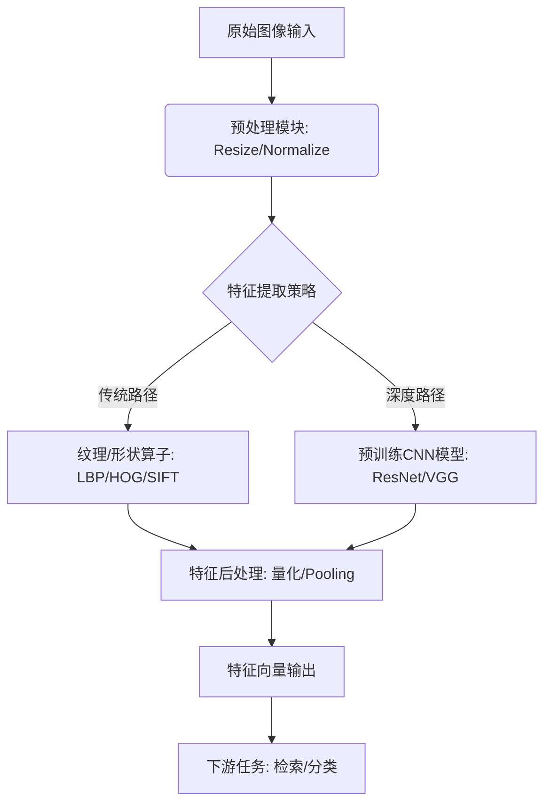

# 图像特征工程技术

## 引言：特征工程——计算机视觉的灵魂

你是否想过，当我们人类一眼就能认出照片里是一只可爱的柴犬还是一辆飞驰的跑车时，计算机看到的其实只是一堆枯燥的、毫无意义的数字矩阵？🤖 那么，它是如何跨越“0”和“1”的鸿沟，像人类一样“看懂”并理解这个五彩斑斓的世界的呢？这就不得不提计算机视觉领域的灵魂核心——**图像特征工程**！✨

在深度学习遍地开花、大模型横空出世的今天，我们似乎习惯了把所有数据一股脑丢给神经网络去“黑盒”处理。然而，回溯技术发展的脉络，那些经典的**手工设计特征**依然闪耀着算法智慧的光芒。它们不仅是连接原始像素与高层语义的桥梁，更是许多轻量级、高效率任务的首选方案。掌握特征工程，就等于拿到了打开计算机视觉大门的钥匙，能让你不再盲目依赖模型，而是真正理解图像数据的本质。🔑

这篇文章，我们将带你穿越时空，展开一场**“手工设计特征 vs 深度学习特征”**的巅峰对决！🥊 我们将深入探讨的核心问题是：在AI算力如此强大的今天，传统的特征提取方法是否已经过时？它们与深度学习特征到底各有什么优劣，又该如何在实际应用中做出选择？

接下来的内容将干货满满！我们将从最基础的**颜色直方图**和**纹理特征（GLCM、LBP）**讲起，带你领略如何用代码捕捉图像的色彩与质感；随后，我们将深入大名鼎鼎的**关键点检测技术**，看看SIFT、SURF和HOG这些经典算法是如何精准捕捉物体轮廓与形状的；最后，我们将目光转向现代的**深度特征与预训练CNN**，分析它们在复杂的图像检索和分类任务中如何大显身手。📚

无论你是刚入坑的CV小白，还是想要夯实基础的开发者，这篇文章都将为你理清思路，带你从像素走向智能！准备好了吗？我们这就发车！🚀

### 2. 技术背景：从“手工匠心”到“深度智慧”的视觉进化

如前所述，特征工程是计算机视觉的灵魂，那么这具“躯体”是如何随着时间演变的呢？在计算机视觉的发展长河中，技术背景经历了一场从繁重的人工干预到智能自动化学习的深刻变革。理解这一技术背景，不仅有助于我们看清图像识别技术的来路，更能为掌握后续的具体特征提取方法打下坚实的地基。

#### 🕰️ 技术演变历程：从依赖经验到数据驱动

在深度学习爆发之前，也就是传统的机器学习统治时代，计算机视觉的任务高度依赖“特征工程”。那时候，算法工程师更像是一个个手工艺人。由于计算机无法直接理解图像中的语义（如“这是一只猫”），研究人员必须设计各种数学算子来描述图像的属性。

这一时期，技术发展的核心在于**如何用数学公式精准地捕捉图像的纹理、边缘和形状**。例如，为了让机器识别物体的轮廓，专家们设计了SIFT（尺度不变特征变换）和SURF（加速鲁棒特征）；为了让机器描述图像的粗糙程度，GLCM（灰度共生矩阵）和LBP（局部二值模式）应运而生。虽然这些手工设计的特征（Hand-crafted features）在特定任务中表现出色，但它们往往不仅需要深厚的领域知识，而且泛化能力较弱——换一个场景或光照条件，之前精心设计的参数可能就失效了。

转折点出现在深度学习的兴起。随着算力的提升和大数据的爆发，技术范式发生了根本性的逆转。我们不再需要告诉机器“猫有尖耳朵”，而是通过深度卷积网络（CNN），让机器从海量的标注数据中自动学习“尖耳朵”这个概念。深度学习通过自动学习特征表示，取代了传统的手工设计方法，展现出显著优势，这也标志着计算机视觉从“规则驱动”正式迈入了“数据驱动”的时代。

#### 🚀 当前技术现状与竞争格局

放眼当下，图像特征提取技术的竞争格局呈现出“百花齐放”的态势，主要集中在自动特征学习能力的提升上。

1.  **CNN的统治与演进**：深度卷积网络（CNN）依然是主流的基石。从早期的AlexNet到ResNet，再到EfficientNet，技术核心在于通过堆叠卷积层进行图像映射、下采样及增加通道数量，从而获取更深层的语义特征。现在的技术不仅能“看见”像素，更能理解图像背后的高维抽象信息。
2.  **Transformer的跨界入侵（ViT）**：近年来，基于Transformer的视觉特征提取架构异军突起。ViT（Vision Transformer）利用其强大的自注意力机制，在捕捉图像全局依赖关系上展现了比CNN更优越的性能，逐渐成为了技术竞争的新高地。
3.  **时序维度的拓展**：技术背景不再局限于静态图像处理。随着视频数据的爆炸，技术能力已扩展到处理具有时序关联的动态视频数据。如何利用3D CNN或Video Transformer分析时间维度的关联信息，成为了当前前沿的研究热点。
4.  **预训练模型的普及**：在工业界，大家更倾向于使用在大规模数据集（如ImageNet）上预训练好的模型进行迁移学习。这种方式极大地降低了应用门槛，成为了当前的行业标准做法。

#### ⚠️ 面临的挑战与痛点

尽管技术进步飞速，但在实际应用中，我们依然面临着严峻的挑战：

*   **数据依赖与长尾分布**：深度学习虽然强大，但它是“数据饥渴型”选手。在医疗影像、工业缺陷检测等领域，获取高质量的标注数据成本极高。此外，现实中存在大量长尾分布样本，模型很难在样本稀缺的情况下保持鲁棒性。
*   **复杂环境的适应性**：正如背景资料中提到的，在智能交通领域，低照度环境、远距离小目标捕获跟踪依然是痛点。在工业制造中，金属表面的反光、油污以及微小的缺陷差异，对特征提取的细腻度提出了极高的要求。
*   **实时性与精度的权衡**：在安防监控和机器人交互设计中，往往需要毫秒级的响应速度。如何在保证特征提取精度的同时，降低计算复杂度，实现边缘侧的实时推理，是工程落地的核心难题。

#### 💡 为什么我们依然需要这项技术？

既然深度学习这么强，为什么我们还要回过头去研究特征工程？为什么在图像检索、分类等应用中，特征提取依然不可或缺？

首先，**特征是机器理解世界的唯一语言**。无论算法多么先进，原始的像素矩阵对计算机来说只是一堆无意义的数字。只有通过特征工程（无论是手工设计还是深度学习自动提取），将图像转化为具有判别力的数值向量，机器才能进行高效的检索、分类和检测。

其次，**特定场景的不可替代性**。在特定物品检索（如紫砂壶印章检索）等精细化应用中，通用的深度特征可能因为过于关注宏观语义而忽略了微观纹理细节。这时候，融合传统的纹理特征（如LBP）与深度特征，往往能达到“1+1>2”的效果。

最后，**应用价值的驱动**。从工业制造中的金属表面缺陷检测，到安防领域的网络视频审核，再到智能交通的车牌识别，这些场景的落地都依赖于高效、稳定的特征提取技术。它是连接底层视觉数据与上层业务逻辑的桥梁，是决定整个计算机视觉系统天花板的关键因素。

综上所述，深入理解技术背景，掌握从手工特征到深度特征的演变逻辑，对于我们在实际项目中灵活选择技术路线、解决复杂视觉问题至关重要。接下来，我们将深入探讨这些特征提取技术的具体实现细节。


## 3. 技术架构与原理

承接上文提到的从规则驱动到数据驱动的范式转移，图像特征工程的技术架构实际上呈现出“双轨并行”的特点。在构建一个高效的视觉系统时，理解底层架构如何将像素数据转化为机器可理解的数学表达至关重要。

### 3.1 整体架构设计

特征工程架构主要由三层组成：**数据预处理层**、**核心特征提取层**和**特征应用层**。这种分层设计确保了从原始像素到高级语义信息的平滑流转。

| 架构阶段 | 传统手工特征流 | 深度学习特征流 |
| :--- | :--- | :--- |
| **预处理** | 灰度化、Gamma校正、高斯滤波 | 尺度缩放、归一化、数据增强 |
| **特征提取** | 像素统计、梯度计算、关键点检测 | 卷积运算、池化、非线性激活 |
| **编码/降维** | Bag of Words (BoW), PCA, VLAD | 全局平均池化, 全连接层映射 |
| **输出** | 固定维度的稀疏或稠密向量 | 高维稠密语义向量 |

### 3.2 核心组件与工作流程

**数据流**从输入图像开始，首先经过预处理模块统一规格。随后进入最核心的**特征提取器**，这里的选择决定了系统的上限：

1.  **全局描述符组件**：如颜色直方图。它忽略了空间信息，通过统计像素在色彩空间中的分布频率来描述图像整体基调。虽然简单，但在特定场景下（如基于主色调的检索）极其高效。
2.  **局部纹理组件**：包括**GLCM**（灰度共生矩阵）和**LBP**（局部二值模式）。前者通过计算像素对的联合概率分布来捕捉纹理的粗糙度，后者通过比较中心像素与邻域像素的灰度差异来编码微观结构，对光照变化具有鲁棒性。
3.  **形状与关键点组件**：这是传统方法的巅峰。**SIFT**（尺度不变特征变换）通过高斯差分金字塔检测极值点，并计算关键点的主方向和梯度描述符，实现了对旋转和尺度缩放的不变性。**SURF**利用Hessian矩阵加速了这一过程，而**HOG**（方向梯度直方图）则通过计算和统计图像局部区域的梯度方向直方图，在行人检测等任务中表现卓越。

4.  **深度特征组件**：在现代架构中，预训练的**CNN**（如ResNet, VGG）被用作特征提取器。通过迁移学习，截取模型倒数第二层的全连接输出作为“深度特征”。这类特征不再是人为设计的边缘或角点，而是从海量数据中学习到的语义信息（如“猫的耳朵”、“车轮的圆弧”）。

### 3.3 关键技术原理与代码实现

在传统工程中，特征的构建往往依赖于数学变换；而在深度学习中，特征是层级抽象的结果。以下展示了使用Python提取HOG特征的核心逻辑，这是理解传统特征工程原理的经典案例：

```python
from skimage.feature import hog
from skimage import data, exposure
import matplotlib.pyplot as plt

# 1. 加载图像
image = data.astronaut()

# 2. HOG特征提取核心原理
# fd: 特征描述符向量
# hog_image: 可视化特征图
fd, hog_image = hog(image, 
                    orientations=9,    # 将180度分为9个方向区间
                    pixels_per_cell=(8, 8), # 每个细胞单元的大小
                    cells_per_block=(2, 2), # 块归一化，旨在对抗光照变化
                    visualize=True, 
                    channel_axis=-1)

# 3. 后处理与可视化（用于理解特征分布）
fig, (ax1, ax2) = plt.subplots(1, 2, figsize=(8, 4), sharex=True, sharey=True)

ax1.imshow(image)
ax1.set_title('Original Image')

# 调整对比度以便更好观察梯度强度
hog_image_rescaled = exposure.rescale_intensity(hog_image, in_range=(0, 10))
ax2.imshow(hog_image_rescaled)
ax2.set_title('HOG Feature Visualization')

plt.show()
```

**原理总结**：
上述代码中，`pixels_per_cell`决定了捕捉纹理的粒度，而`cells_per_block`则通过局部归一化解决了阴影和光照变化带来的对比度差异问题。这种手工设计的精妙之处在于其物理意义明确、计算量可控。

相比之下，当任务迁移到图像分类或大规模检索时，我们通常转而使用深度特征。其原理在于CNN的前几层学习到的是边缘和颜色（类似SIFT），后几层则学习到了语义概念。通过去除全连接分类层，我们将CNN视为一个**通用特征提取器**，这使得我们在小样本数据集上也能取得超越传统方法的性能。


### 3. 关键特性详解

如前所述，我们已经理解了计算机视觉从规则驱动向数据驱动演变的宏观背景。落实到具体实践中，特征工程的技术特性直接决定了视觉任务的“上限”与“下限”。本节将深入剖析图像特征工程在功能实现、性能指标、技术创新及场景应用层面的核心能力。

#### 3.1 多维度的特征表达能力（主要功能特性）

图像特征工程的首要特性在于能够将像素矩阵转化为具有统计意义的数值向量，其功能覆盖从底层视觉到中层语义的多个维度：

*   **颜色与纹理特征（全局统计）**：
    *   **颜色直方图**通过量化颜色空间分布，忽略空间位置信息，专注于整体色调倾向，适用于场景分类。
    *   **纹理特征**利用灰度共生矩阵（**GLCM**）计算对比度、相关性等统计量，或通过**LBP**（局部二值模式）提取局部微观纹理结构，对光照变化具有极强的鲁棒性。
*   **形状与边缘特征（局部关键点）**：
    *   **SIFT**（尺度不变特征变换）和**SURF**（加速稳健特征）通过构建高斯差分空间，实现关键点的精确定位与描述，具备卓越的尺度和旋转不变性。
    *   **HOG**（方向梯度直方图）则通过计算局部图像梯度的方向统计，擅长描述物体轮廓，尤其在行人检测中表现优异。

#### 3.2 计算复杂度与鲁棒性（性能指标）

在技术选型时，需权衡特征的计算维度与不变性表现。以下是对核心技术的性能规格对比：

| 特征类型 | 代表算法 | 维度规格 | 计算复杂度 | 核心优势 | 劣势 |
| :--- | :--- | :--- | :--- | :--- | :--- |
| **纹理特征** | LBP, GLCM | 低-中 | 低 | 对光照变化不敏感，计算极快 | 丢失空间结构信息 |
| **局部关键点** | SIFT, SURF | 高 | 中-高 | 旋转/尺度不变性强，匹配精度高 | 计算耗时大，实时性较差 |
| **形状特征** | HOG | 中 | 中 | 对几何形变鲁棒，边缘捕捉能力强 | 对噪声较敏感 |
| **深度特征** | Pre-trained CNN | 极高 | 高 (需GPU加速) | 语义抽象层次高，泛化能力极强 | 依赖大数据，模型黑盒 |

```python
# OpenCV 实现特征提取示例：HOG 特征
import cv2

# 初始化 HOG 描述符
hog = cv2.HOGDescriptor()
img = cv2.imread('object.jpg', 0)  # 读取灰度图

# 计算 HOG 特征向量
hog_features = hog.compute(img)

print(f"特征向量维度: {hog_features.shape[0]}")
# 输出通常为高维向量，包含了图像的梯度方向统计信息
```

#### 3.3 技术优势与创新点（深度特征革新）

随着深度学习的发展，**预训练CNN特征**（如ResNet, VGG提取的特征）成为新的技术高地。其核心创新在于**端到端的特征抽象**。相比SIFT等手工设计特征依赖先验知识，CNN通过多层卷积自动学习从边缘、纹理到物体部件的层级表示。利用迁移学习，我们可以在小样本数据集上复用预训练模型的深层特征，极大地突破了传统特征工程在复杂语义理解上的瓶颈。

#### 3.4 适用场景分析

针对不同的视觉任务，特征工程的选型策略如下：
*   **工业缺陷检测**：对于纺织品、金属表面的划痕检测，**LBP**和**GLCM**等纹理特征因计算速度快、对微小纹理敏感而成为首选。
*   **图像检索与拼接**：在基于内容的图像检索（CBIR）或全景拼接中，**SIFT/SURF**的几何不变性确保了物体在不同视角下仍能准确匹配。
*   **复杂图像分类**：在ImageNet级别的精细分类或场景识别中，手工特征往往力不从心，此时**深度特征**结合全连接层分类器能提供最高的准确率。

通过上述解析可见，无论是经典的手工特征还是新兴的深度特征，其在图像特征工程中各有千秋，灵活运用这些关键特性是构建高效视觉系统的核心。


### 3. 核心算法与实现：从手工特征到深度表征

如前所述，计算机视觉经历了从规则驱动到数据驱动的范式转移。在这一过程中，特征提取算法的演进是核心驱动力。本节将深入解析传统手工特征与深度学习特征的核心算法原理及其代码实现。

#### 3.1 核心算法原理

**手工设计特征**
在深度学习普及之前，研究者致力于设计具有鲁棒性的数学算子来描述图像。
*   **SIFT (Scale-Invariant Feature Transform)**：通过构建高斯差分金字塔（DoG）在不同尺度空间上查找关键点，并计算关键点邻域的梯度方向直方图。SIFT对旋转、尺度缩放和亮度变化保持不变性。
*   **HOG (Histogram of Oriented Gradients)**：主要应用于物体检测（如行人检测）。它将图像分割成小块，计算每个单元格内像素的梯度方向，统计生成直方图，能有效描述物体的边缘和形状结构。
*   **纹理特征**：LBP（局部二值模式）通过比较中心像素与邻域像素的灰度值来编码纹理，具有极高的计算效率；GLCM（灰度共生矩阵）则通过统计灰度对的空间分布特性来描述纹理粗糙度。

**深度特征**
深度学习通过多层非线性变换自动学习特征。
*   **CNN特征**：卷积神经网络（CNN）通过卷积层、池化层和激活函数的堆叠，将原始像素映射为高维语义特征。
*   **预训练模型**：利用在大规模数据集（如ImageNet）上训练好的模型（如ResNet, VGG），去除最后的全连接分类层，提取倒数第二层的输出作为通用特征向量。这种方法通常被称为迁移学习，极大提升了图像检索和分类的精度。

#### 3.2 关键数据结构

在算法实现中，特征通常以特定的数据结构存储：

*   **KeyPoint List (关键点列表)**：用于存储SIFT/SURF等检测到的特征点位置。每个元素通常包含坐标 `(x, y)`、尺度 `size` 和方向 `angle`。
*   **Descriptor Matrix (描述符矩阵)**：$N \times D$ 的矩阵，其中 $N$ 是关键点数量，$D$ 是特征维度（如SIFT为128维）。每一行代表一个特征向量。
*   **Feature Vector (特征向量)**：在图像分类任务中，整张图通常被压缩为一个一维向量（如2048维的ResNet输出）。

#### 3.3 代码示例与解析

以下代码展示了如何分别使用OpenCV提取传统SIFT特征和使用PyTorch提取深度CNN特征。

```python
import cv2
import torch
import torchvision.models as models
import torchvision.transforms as transforms
from PIL import Image

# --- 场景1：传统手工特征 ---
def extract_sift_features(image_path):
# 读取图像并转为灰度图
    img = cv2.imread(image_path)
    gray = cv2.cvtColor(img, cv2.COLOR_BGR2GRAY)
    
# 初始化SIFT检测器
    sift = cv2.SIFT_create()
    
# 检测关键点并计算描述符
    keypoints, descriptors = sift.detectAndCompute(gray, None)
    
# keypoints: 关键点列表; descriptors: (N, 128)的float32矩阵
    print(f"SIFT Features Detected: {len(keypoints)}")
    return keypoints, descriptors

# --- 场景2：深度学习特征 ---
def extract_deep_features(image_path):
# 加载预训练的ResNet50模型
    model = models.resnet50(pretrained=True)
# 移除最后的全连接层，只保留特征提取部分
    model = torch.nn.Sequential(*list(model.children())[:-1])
    model.eval()
    
# 图像预处理
    preprocess = transforms.Compose([
        transforms.Resize(256),
        transforms.CenterCrop(224),
        transforms.ToTensor(),
        transforms.Normalize(mean=[0.485, 0.456, 0.406], std=[0.229, 0.224, 0.225]),
    ])
    
    img = Image.open(image_path).convert('RGB')
    img_tensor = preprocess(img).unsqueeze(0) # 增加batch维度
    
    with torch.no_grad():
        feature_vector = model(img_tensor)
        feature_vector = feature_vector.flatten() # 展平为一维向量
        
    print(f"Deep Feature Dimension: {feature_vector.shape[0]}")
    return feature_vector

# 调用示例（假设存在 'test.jpg'）
# kp_sift, desc_sift = extract_sift_features('test.jpg')
# feat_deep = extract_deep_features('test.jpg')
```

#### 3.4 特征对比总结

下表总结了两种技术路线的核心差异，以便在实际应用中选型：

| 特性 | 手工特征 (SIFT/HOG/LBP) | 深度特征 |
| :--- | :--- | :--- |
| **计算复杂度** | 低 (CPU即可实时运行) | 高 (通常需要GPU加速) |
| **语义理解** | 弱 (主要关注边缘、角点、纹理) | 强 (能理解高层语义，如"猫"、"车") |
| **数据依赖** | 无 (无需训练数据) | 强 (依赖大规模标注数据集预训练) |
| **鲁棒性** | 对光照、遮挡敏感，需精心设计 | 对形变、光照变化具有极高鲁棒性 |

通过掌握上述核心算法与实现细节，我们才能在图像检索、分类及具体业务场景中选择最合适的特征工程方案。


### 3. 技术对比与选型：手工设计 vs 深度特征

如前所述，计算机视觉经历了从规则驱动向数据驱动的范式转移。在实际应用中，如何平衡计算效率与表达能力，成为了特征选型的关键。本节将从技术原理、优缺点及适用场景三个维度，对传统手工特征与深度学习特征进行深度剖析。

#### 3.1 核心技术对比分析

传统手工特征主要依赖于数学模型对图像纹理、边缘或颜色分布进行统计。例如，**颜色直方图**关注全局色彩分布，适合粗粒度检索；**LBP（局部二值模式）**与**GLCM（灰度共生矩阵）**擅长捕捉微观纹理；而**SIFT、SURF**及**HOG**则通过提取梯度信息，对尺度和旋转具有鲁棒性，常用于物体检测。

相比之下，深度特征（尤其是基于预训练CNN的特征，如ResNet、VGG提取的向量）通过多层非线性变换，将像素映射为高维语义空间。它不再依赖人为设计的算子，而是自动学习出“抽象概念”。

以下是两类技术的详细对比：

| 维度 | 手工设计特征 (SIFT/HOG/LBP) | 深度学习特征 (Pretrained CNN) |
| :--- | :--- | :--- |
| **表达能力** | 低层/中层特征（边缘、纹理），语义信息弱 | 高层语义特征（物体、部件），语义信息强 |
| **数据依赖** | 极低，无需训练，仅依赖参数调优 | 极高，依赖大规模标注数据或预训练模型 |
| **计算开销** | 低，通常CPU即可实时运行 | 高，通常需要GPU加速，内存占用大 |
| **鲁棒性** | 对光照、遮挡敏感，需精心设计 | 对形变、复杂背景具有较强的泛化能力 |

#### 3.2 代码实现与迁移

在工程落地中，从传统算法迁移到深度学习特征提取，代码逻辑上发生了本质变化。以下展示了从HOG特征提取迁移到使用预训练ResNet提取特征的简单逻辑对比：

```python
# 传统方法：提取HOG特征 (基于 skimage)
from skimage.feature import hog
def get_handcrafted_feature(image):
# 专注于梯度结构，计算量小
    fd, _ = hog(image, orientations=9, pixels_per_cell=(8, 8), 
                cells_per_block=(2, 2), visualize=True)
    return fd

# 深度学习方法：提取CNN特征 (基于 PyTorch)
import torchvision.models as models
def get_deep_feature(image, model=models.resnet18(pretrained=True)):
# 移除全连接层，只保留卷积特征提取器
    feature_extractor = torch.nn.Sequential(*list(model.children())[:-1])
# 输出为具备语义信息的高维向量
    with torch.no_grad():
        feature = feature_extractor(image)
    return feature.flatten()
```

#### 3.3 选型建议与迁移注意事项

**使用场景选型：**
*   **首选手工特征**：若你运行在资源受限的嵌入式设备（如STM32）、算力不足的单片机上，或者任务仅涉及简单的纹理分类（如布料缺陷检测）及图像去重，HOG、LBP等依然是性价比最高的选择。
*   **首选深度特征**：若任务是复杂的细粒度图像分类、大规模以图搜图系统，且具备GPU环境，直接调用预训练CNN模型（如ResNet50, EfficientNet）作为特征提取器，效果往往远超手工设计。

**迁移注意事项：**
1.  **维度灾难**：深度特征向量维度通常为512或2048，相比手工特征的几十维要高得多，检索时需配合PCA降维或乘积量化（PQ）技术。
2.  **输入预处理**：CNN对输入数据的归一化极其敏感（如需减去ImageNet均值），而传统方法通常只需灰度化，迁移时务必调整预处理Pipeline。


## 架构设计（深度篇）：卷积神经网络的特征映射机制

**第4章：架构设计（深度篇）：卷积神经网络的特征映射机制**

**4.1 从“人工设计”到“自动学习”的范式跃迁**

在上一章中，我们深入探讨了传统图像特征工程的数学表达。我们详细剖析了颜色直方图如何描述全局色彩分布，GLCM和LBP如何量化纹理的粗糙度与规律性，以及SIFT、SURF和HOG等关键点检测算法如何通过构建梯度方向直方图来捕捉局部几何结构。这些手工设计的特征在计算机视觉发展的前几十年中占据了统治地位，它们依赖于先验知识，由专家精心设计算子来提取图像中的特定模式。

然而，正如我们在第2章中所讨论的，从规则驱动到数据驱动的范式转移，揭示了传统方法的一个核心痛点：手工特征的表达能力受限于设计者的认知边界和数学模型的复杂度。面对千变万化的自然图像，手工特征往往缺乏足够的鲁棒性和语义抽象能力。

卷积神经网络的出现，彻底改变了这一局面。本章将不再讨论如何通过人工公式定义特征，而是深入解析CNN的架构设计，探讨其如何通过层级化的结构，自动完成从底层像素到高层语义的特征映射机制。这是一种“端到端”的学习过程，特征不再是设计出来的，而是从海量数据中“生长”出来的。

**4.2 CNN基础架构解析：特征提取的流水线**

CNN之所以能成为图像特征提取的利器，关键在于其三大核心组件——卷积层、池化层与激活函数的精妙分工。它们共同构成了一个特征提取的流水线，每一层都对输入数据进行特定的数学变换，从而逐步提炼出图像的本质特征。

**4.2.1 卷积层：局部感知与权值共享**

卷积层是CNN的“眼睛”。与全连接层不同，卷积层通过卷积核在输入图像上进行滑动窗口操作，实现了“局部感知”。这种设计灵感来源于生物视觉系统的感受野机制。每一个卷积核实际上是一个特征探测器，在上一节提到的传统方法中，我们需要人工定义边缘检测算子（如Sobel算子）；而在CNN中，卷积核的参数是网络通过反向传播自动学习得到的。

更为关键的是“权值共享”机制。同一个卷积核在图像的所有位置共享同一套参数。这意味着，无论特征出现在图像的左上角还是右下角，网络都能用相同的规则去检测它。这种机制极大地减少了模型参数量，并赋予了卷积特征极强的“平移等变性”，这对于图像识别至关重要，因为物体在图像中的位置往往是随机的。

**4.2.2 激活函数：引入非线性与决策边界**

如果仅有卷积操作（线性变换），无论网络堆叠多少层，其整体仍然是一个线性模型，只能处理简单的线性关系。为了模拟复杂的视觉特征，必须引入非线性。激活函数（如ReLU, Leaky ReLU）扮演了“开关”的角色。它对卷积层的输出进行逐元素的非线性映射，将负值抑制为0或保留微小梯度。

从特征工程的角度看，激活函数的作用是过滤背景噪声，保留显著的特征响应。它使得网络能够学习到复杂的决策边界，从而在特征空间中分离出不同类别的样本。

**4.2.3 池化层：空间不变性与信息浓缩**

池化层通常位于连续的卷积层之间，其主要作用是下采样。最大池化是最常用的策略，它在局部邻域内取最大值作为输出。这一操作不仅降低了特征图的尺寸，减少了计算量和参数，更重要的是引入了“空间不变性”。

正如我们在手工特征时代所面临的挑战，物体可能会有轻微的形变、旋转或缩放。最大池化通过关注局部区域内的最强响应，而忽略精确的空间位置信息，使得提取的特征对这些微小的几何畸变具有了更强的容忍度。这是一种“模糊化”的处理，但恰恰是这种模糊，保留了最具代表性的语义信息，过滤掉了次要的细节干扰。

**4.3 层级特征演化：从边缘到语义的自动映射**

CNN最迷人的地方在于其层级化的特征表达。通过对经典网络（如Zeiler & Fergus的可视化研究）的分析，我们发现CNN不同深度的层所提取的特征呈现出明显的演化规律，这与人类视觉系统处理信息的机制惊人地相似。

**4.3.1 底层特征：边缘与颜色的继承**

在网络的浅层（如第1-2层），卷积核主要学习到的特征与我们前面讨论的传统特征非常相似。这些层类似于Gabor滤波器或颜色斑点检测器。它们主要响应图像中的边缘、角落、色彩斑点等简单的低级视觉元素。这表明，CNN并非完全摒弃了传统特征 wisdom，而是在底层重新“发现”了这些基础的图像构成要素。

**4.3.2 中层特征：部件与纹理的整合**

随着网络深度的增加，特征的抽象程度逐步提升。在中间层（第3-5层），简单的边缘开始被组合成复杂的纹理和局部部件。例如，某些神经元会对网格纹理、圆形斑点、或者是物体的特定部位（如猫的耳朵、汽车的轮胎）产生强烈响应。这一阶段，网络开始捕捉图像的局部结构信息，将零散的像素点整合成有意义的“零件”。

**4.3.3 高层特征：语义与对象的涌现**

在网络的深层（全连接层之前），特征图的空间分辨率通常已经很小（如7x7），但通道数却极大。此时，每一个神经元代表的是一个高度抽象的“概念”。它们不再关心具体的纹理或形状细节，而是关注“是否有猫脸”、“是否有车轮”等高层语义信息。这种特征具有极强的判别力，能够忽略背景、光照和视角的干扰，直接对应于图像的类别标签。

这种从“具体”到“抽象”，从“局部”到“整体”的特征映射过程，正是CNN超越传统手工特征的核心所在。

**4.4 通道与维度变换：信息保留的艺术**

在CNN架构设计中，特征图的空间维度（长宽）和通道维度的变化规律，蕴含着深度学习处理信息的核心哲学。

随着网络层数的加深，我们通常会观察到一种趋势：特征图的空间分辨率（H x W）不断下降，通过步长卷积或池化操作实现；与此同时，通道数量不断上升。这种“空间压缩，通道扩张”的策略有着深刻的数学意义。

下采样（空间压缩）旨在扩大后续神经元的感受野，使其能看到更大范围的图像上下文，并去除冗余的空间位置信息，实现计算的高效性。而通道数的增加（维度扩张），则是为了保留和丰富被压缩后的信息。每一个通道可以被看作是一个特定的“特征检测器”。随着语义复杂度的提升，我们需要更多的检测器来描述不同的特征模式。

例如，在底层可能只需要64个通道就能描述边缘和颜色的组合；而在高层，可能需要512甚至2048个通道来描述物体部件的不同组合方式。这种高维度的张量表示，是深度特征表达能力的关键。它将密集的像素信息，转化为了一种紧凑且语义丰富的高维向量，这为后续的图像检索、分类任务提供了极佳的特征输入。

**4.5 经典网络架构的特征提取特点分析**

不同的网络架构设计，体现了对特征提取机制的不同理解。以VGG和ResNet为例，我们可以剖析架构设计对特征质量的影响。

**VGGNet：堆叠的艺术与纯粹的特征**

VGGNet（Visual Geometry Group）是深度特征提取的一个里程碑。它摒弃了以往网络中使用的较大卷积核（如11x11, 7x7），转而全部使用3x3的小卷积核进行堆叠。
从特征提取角度看，两个3x3的卷积层堆叠，其感受野等同于一个5x5的卷积层，但参数量更少，且包含了两层非线性激活，增强了网络的非线性表达能力（拟合能力）。VGG通过这种深层、窄卷积的设计，能够极其精细地提取图像特征。其提取的特征具有很强的泛化能力，常被用作图像检索任务中的特征提取器。

**ResNet：残差连接与特征复用**

随着网络深度的增加，梯度消失和退化问题成为制约特征提取质量的瓶颈。ResNet（残差网络）通过引入“跳跃连接”解决了这一问题。
在特征层面上，ResNet的残差块设计可以理解为：$y = F(x) + x$。这意味着网络学习的是输入特征的“残差”（增量），而不是从头学习全新的特征。这种机制使得网络能够更容易地优化深层特征，避免了深层网络中的特征信息丢失。
ResNet的这种架构极大地提升了特征的丰富度和层次感。在ResNet提取的特征中，浅层的物理特征能够更顺畅地传递到深层，与深层的语义特征融合，从而形成了既有细节又有语义的强鲁棒性特征。

综上所述，卷积神经网络通过其独特的架构设计，实现了一套完备的、自动化的特征映射机制。它不仅继承并超越了传统手工特征的优点，更通过数据驱动的方式，挖掘出了人类难以设计的深层语义特征。这种从原始像素到高层概念的自然演化，构成了现代计算机视觉应用的坚实基石。


### 5. 核心技术解析：技术架构与原理

在深入理解了手工特征的数学表达（第3章）以及卷积神经网络（CNN）的特征映射机制（第4章）之后，我们需要将视野拉高，构建一个完整的**图像特征工程系统架构**。本节将探讨如何将这些异构的技术单元整合为一个统一、高效的工程流水线，实现从原始像素到高维语义向量的转化。

#### 5.1 整体架构设计：双轨并行的特征提取引擎

现代图像特征工程的架构通常采用**“双轨制”**设计，以兼顾效率与精度。该架构主要由预处理层、特征提取核心层、特征融合与降维层以及应用接口层组成。

*   **预处理层**：作为系统的通用入口，负责图像的归一化、去噪及尺寸统一。无论后续使用传统算法还是深度网络，这一步都至关重要。
*   **特征提取核心层**：这是架构的心脏，包含两条并行支路：
    *   *传统支路*：部署如前所述的颜色直方图、LBP、SIFT等算子，适用于对计算资源敏感、对纹理形状要求严格的场景。
    *   *深度支路*：部署**如前文提到的CNN骨干网络**（如ResNet, VGG），利用其强大的特征映射能力提取高维语义特征。
*   **特征优化层**：对提取的原始向量进行PCA降维或L2归一化，消除冗余信息，提升检索效率。

#### 5.2 核心组件与模块工作流

数据流在整个架构中呈现单向流动、分层处理的特征。以下是核心数据流的逻辑图解：



在此工作流中，**关键组件**的功能解析如下：

1.  **特征描述符生成器**：
    *   **局部特征模块**：基于SIFT或SURF的关键点检测，不仅要计算特征点方向，还需生成128维描述符，常用于图像拼接。
    *   **全局特征模块**：基于深度网络的全局平均池化层输出，生成描述整张图语义的4096维或2048维向量。
2.  **距离度量模块**：这是架构中判定相似度的核心。通常使用欧氏距离或余弦相似度来计算特征向量在空间中的接近程度。

#### 5.3 关键技术原理：特征空间映射与语义鸿沟

本架构的核心技术难点在于如何跨越**语义鸿沟**。

*   **特征空间映射**：
    手工设计特征（如GLCM纹理特征）主要映射到图像的物理统计空间（像素相关性）；而**前文所述的CNN特征**通过多层非线性变换，将像素映射到了高维语义空间。在架构设计时，我们往往利用迁移学习原理，冻结CNN的低层参数（保留边缘纹理提取能力），微调高层参数，使其适应特定业务的语义空间。

*   **特征降维与索引**：
    原始特征（尤其是深度特征）维度极高，直接计算会导致“维度灾难”。技术上常采用主成分分析（PCA）进行白化处理，使特征向量各维度正交，随后通过乘积量化（PQ）技术构建倒排索引，以实现毫秒级的图像检索。

#### 5.4 代码实现：统一特征提取接口

为了在实际工程中落地，我们可以设计一个Python类来封装上述架构逻辑：

```python
import cv2
import numpy as np
from torchvision import models, transforms

class ImageFeatureEngine:
    def __init__(self, method='deep'):
        self.method = method
# 初始化传统算子 (示例: SIFT)
        if method == 'traditional':
            self.extractor = cv2.SIFT_create()
# 初始化深度模型 (示例: ResNet18)
        elif method == 'deep':
            self.model = models.resnet18(pretrained=True)
            self.model.eval()
            self.preprocess = transforms.Compose([
                transforms.ToPILImage(),
                transforms.Resize(256),
                transforms.CenterCrop(224),
                transforms.ToTensor(),
                transforms.Normalize(mean=[0.485, 0.456, 0.406], 
                                     std=[0.229, 0.224, 0.225]),
            ])

    def extract(self, image):
        """提取特征向量"""
        if self.method == 'traditional':
# 灰度化处理
            gray = cv2.cvtColor(image, cv2.COLOR_BGR2GRAY)
            kp, des = self.extractor.detectAndCompute(gray, None)
# 对局部描述符进行聚类生成全局向量 (Bag of Words 简化版)
            return np.mean(des, axis=0) if des is not None else np.zeros(128)
        
        elif self.method == 'deep':
# 张量预处理与CNN前向传播
            input_tensor = self.preprocess(image).unsqueeze(0)
            with torch.no_grad():
                features = self.model(input_tensor)
            return features.flatten().numpy()
```

#### 5.5 技术选型对比

在实际部署中，我们需要根据业务场景在传统特征与深度特征之间做出权衡：

| 特性维度 | 手工设计特征 (SIFT/HOG/LBP) | 深度学习特征 (CNN/ViT) |
| :--- | :--- | :--- |
| **计算复杂度** | ⭐ (低，适合边缘设备) | ⭐⭐⭐⭐ (高，依赖GPU/TPU) |
| **语义表达力** | ⭐⭐ (弱，仅限底层纹理/形状) | ⭐⭐⭐⭐⭐ (强，包含高层语义) |
| **数据依赖** | ⭐ (无，基于先验数学知识) | ⭐⭐⭐⭐⭐ (高，依赖大规模预训练) |
| **鲁棒性** | ⭐⭐ (对光照、形变敏感) | ⭐⭐⭐⭐ (具有较强的不变性) |

综上所述，一个优秀的图像特征工程技术架构，并非单一技术的堆砌，而是根据**计算资源-精度需求**的帕累托最优解，灵活调配传统算子与深度网络，构建出高效、稳健的视觉分析流水线。


### 5. 关键特性详解：传统算子与深度特征的深度博弈

如前所述，上一章节我们深入剖析了卷积神经网络（CNN）通过多层卷积与池化操作实现的非线性特征映射机制。然而，在实际的工程落地中，并非所有场景都需要庞大的深度网络。将传统手工设计特征的精妙与深度学习特征的强大相结合，往往能应对更复杂的视觉挑战。本节将从功能特性、性能指标、技术优势及适用场景四个维度，对这两类关键技术进行深度解析。

#### 5.1 主要功能特性

图像特征工程的核心在于将像素数据转化为机器可理解的高维向量。

*   **传统特征的几何不变性**：
    *   **SIFT (尺度不变特征变换)** 与 **SURF**：其主要功能特性在于对图像的旋转、尺度缩放甚至亮度变化保持不变性，能够精准提取关键点及其描述符，特别适用于图像拼接与匹配。
    *   **HOG (方向梯度直方图)**：专注于描述物体的边缘梯度结构，对光照变化和小幅度几何形变具有极强的鲁棒性，常用于轮廓检测。
*   **纹理与颜色的统计特性**：
    *   **GLCM (灰度共生矩阵)** 与 **LBP (局部二值模式)**：主要用于捕捉图像的微观纹理粗糙度、对比度等统计信息。
*   **深度特征的语义抽象性**：
    *   **预训练CNN特征**（如ResNet, VGG的某一层输出）：如前所述，CNN通过多层映射，将图像转化为具有高层语义信息的特征向量。这种特性使其能理解“图像中有什么”，而不仅仅是“图像边缘在哪里”。

#### 5.2 性能指标和规格

为了直观对比各类特征的量化指标，我们整理了以下规格表：

| 特征类型 | 代表算法 | 典型维度 (单图/单点) | 计算复杂度 | 主要鲁棒性指标 |
| :--- | :--- | :--- | :--- | :--- |
| **局部关键点** | SIFT | 128维 | 高 | 旋转、尺度、仿射不变 |
| **全局描述子** | HOG | 3780维 (取决于Block) | 中 | 光照、几何形变 |
| **纹理特征** | LBP | 256维 (通常模式) | 极低 | 灰度单调变换 |
| **深度特征** | ResNet-50 (Pool5) | 2048维 | 极高 (需GPU) | 语义类别、视角变化 |

*注：深度特征的计算虽然复杂度高，但其特征的表达能力远超传统算子。*

#### 5.3 技术优势和创新点

**技术优势**：
传统特征的最大优势在于**可解释性**与**轻量化**。例如，LBP算法计算简单，甚至可以在单片机上运行，非常适合低功耗设备。而深度特征的核心优势在于**迁移学习**能力。通过在ImageNet等大规模数据集上预训练，CNN模型学习到了通用的视觉特征提取器，仅需微调即可应用于医疗影像、安防监控等特定小样本领域。

**创新点实现（代码示例）**：
以下展示了如何利用预训练的深度模型提取特征，这是现代图像检索系统的核心创新：

```python
import torch
import torchvision.models as models
from torchvision import transforms

# 加载预训练的ResNet模型，并移除最后的全连接层以获取特征
model = models.resnet50(pretrained=True)
feature_extractor = torch.nn.Sequential(*list(model.children())[:-1]) 
model.eval()

# 预处理管道：归一化与Resize
preprocess = transforms.Compose([
    transforms.Resize(256),
    transforms.CenterCrop(224),
    transforms.ToTensor(),
    transforms.Normalize(mean=[0.485, 0.456, 0.406], std=[0.229, 0.224, 0.225]),
])

def extract_deep_feature(image_tensor):
    with torch.no_grad():
# 输出维度: [1, 2048, 1, 1] -> 展平为 2048维向量
        feature = feature_extractor(image_tensor)
    return feature.flatten()
```

#### 5.4 适用场景分析

*   **图像检索与重建**：当需要进行精确的图像对齐、全景拼接时，**SIFT/SURF**依然是首选，因为它们提供精准的几何对应关系，这是纯深度特征难以直接提供的。
*   **实时物体检测**：在行人检测或车辆检测中，结合**HOG**特征与SVM分类器在边缘计算设备上依然占有一席之地，因其推理速度远快于YOLO等深度检测网络。
*   **精细分类与识别**：在复杂的图像分类、人脸识别或大规模电商以图搜图场景中，**深度特征（Deep Features）**凭借其强大的语义表达能力，已成为绝对的主流方案。

综上所述，理解关键特性的差异，是我们在工程实践中进行“降本增效”选型的关键所在。


## 5. 核心算法与实现：从代码视角解构特征提取

承接上一节关于卷积神经网络（CNN）特征映射机制的讨论，我们已经理解了深度学习是如何通过层级结构自动提取高维语义特征的。然而，在实际工程落地中，如何将上述理论转化为具体的代码逻辑，并在传统手工特征与现代深度特征之间做出技术选型，是本节探讨的核心。

### 5.1 传统特征的工程化：HOG算法的实现逻辑

在传统计算机视觉中，方向梯度直方图因其卓越的物体形状描述能力而备受青睐。

**核心算法原理**：
HOG 的本质是统计图像局部区域的梯度方向信息。其核心假设是：物体的外形和外观能够被局部强度梯度或边缘方向的分布很好地描述。

**关键数据结构**：
HOG 算法处理过程中的核心数据流转包括：
1.  **梯度图像**：存储图像每个像素点的 $x$ 和 $y$ 方向导数。
2.  **单元直方图**：将图像划分为小的 `Cell`（如 $8\times8$ 像素），每个 Cell 生成一个 9 维的向量（对应 $0^\circ-180^\circ$ 的 9 个方向区间）。
3.  **块描述符**：由 $2\times2$ 个 Cell 组成一个 `Block`，将这 4 个 Cell 的直方图串联并进行归一化，形成最终的局部特征向量。

**实现细节分析**：
为了实现对光照变化的鲁棒性，实现时必须进行 **Block 归一化**。通常采用 L2-Norm，计算公式为 $v = \frac{v}{\sqrt{\|v\|_2^2 + \epsilon^2}}$。这一步能有效消除阴影和光照变化带来的对比度差异。

### 5.2 深度特征的提取：基于预训练模型的迁移学习

相比于手工设计特征，如前所述，CNN 具有更强的表征能力。在实现中，我们通常不从头训练，而是利用在大规模数据集（如 ImageNet）上训练好的模型作为特征提取器。

**实现代码示例与解析**：

以下代码展示了传统 HOG 与深度 ResNet 特征提取的对比实现：

```python
import cv2
import numpy as np
import torch
import torchvision.models as models
from torchvision import transforms

# --- 场景 A: 传统 HOG 特征提取 ---
def extract_hog_feature(image_path):
    img = cv2.imread(image_path, cv2.IMREAD_GRAYSCALE)
# 核心参数设置：winSize, blockSize, blockStride, cellSize, nbins
    hog = cv2.HOGDescriptor((64, 128), (16, 16), (8, 8), (8, 8), 9)
# 计算特征向量
    features = hog.compute(img)
    return features.flatten()

# --- 场景 B: 深度 CNN 特征提取 ---
def extract_deep_feature(image_path):
# 1. 加载预训练模型 (去掉最后一层分类头)
    model = models.resnet50(pretrained=True)
    model = torch.nn.Sequential(*list(model.children())[:-1]) # 保留卷积层
    model.eval()
    
# 2. 图像预处理 (关键数据结构转换)
    preprocess = transforms.Compose([
        transforms.ToPILImage(),
        transforms.Resize(256),
        transforms.CenterCrop(224),
        transforms.ToTensor(),
        transforms.Normalize(mean=[0.485, 0.456, 0.406], std=[0.229, 0.224, 0.225]),
    ])
    
    img = cv2.imread(image_path)
    img_tensor = preprocess(img).unsqueeze(0) # 增加 batch 维度
    
# 3. 前向传播提取特征
    with torch.no_grad():
        feature_vector = model(img_tensor)
    
    return feature_vector.flatten()
```

**代码解析**：
在深度特征提取中，最关键的实现细节在于 **预处理** 和 **模型截断**。`transforms.Normalize` 确保输入数据分布与预训练模型一致，而 `list(model.children())[:-1]` 则将 CNN 从分类器转变为特征提取器，输出的是高维度的特征图张量。

### 5.3 技术选型对比总结

为了更直观地指导工程实践，我们将两种技术路线的核心特性对比如下：

| 特性维度 | HOG (手工特征) | ResNet (深度特征) |
| :--- | :--- | :--- |
| **核心数据结构** | 归一化梯度向量 (1D Array) | 多通道特征图张量 | 3D Tensor |
| **计算复杂度** | 低 (CPU 可实时运行) | 高 (依赖 GPU 加速) |
| **主要应用场景** | 行人检测、简单几何形状识别 | 图像检索、细粒度分类、语义分析 |
| **不变性表现** | 对几何和光照形变有较强鲁棒性 | 对旋转、遮挡、背景干扰具有极强鲁棒性 |

综上所述，如果应用场景受限于计算资源且目标形状固定，HOG 依然是首选；而在图像检索等对语义理解要求极高的场景下，利用预训练 CNN 提取深度特征则是当前的最优解。


## 5. 技术对比与选型：寻找最佳视觉解决方案

如前所述，卷积神经网络（CNN）通过层级结构实现了从边缘到语义的自动映射，这与上一章节讨论的手工设计特征有着本质的区别。在实际工程落地中，如何在这两种技术范式中做出取舍，是决定项目成败的关键。

### 5.1 核心技术维度对比

我们将SIFT、HOG等传统算法与以ResNet、VGG为代表的深度特征进行多维度的横向对比：

| 对比维度 | 手工设计特征 (SIFT/HOG/LBP) | 深度学习特征 (CNN/ViT) |
| :--- | :--- | :--- |
| **表达能力** | 局部纹理与几何结构，缺乏高层语义 | 具备抽象的语义信息，泛化能力强 |
| **计算复杂度** | 低，适合CPU实时运行 | 高，通常依赖GPU加速 |
| **数据依赖** | 无需训练，基于先验数学知识 | 依赖大规模标注数据进行预训练 |
| **鲁棒性** | 对光照、旋转敏感度不一（需特定设计） | 对遮挡、形变具有更强的鲁棒性 |

### 5.2 优缺点深度解析

**手工设计特征**的优势在于“可控”与“轻量”。例如，SIFT特征在图像拼接中具有无可替代的几何稳定性，且在资源受限的嵌入式设备上，LBP或颜色直方图能实现毫秒级的响应。然而，其短板在于语义鸿沟——计算机提取的角点并不理解那是“猫的眼睛”。

**深度特征**则完美解决了语义理解问题。通过迁移学习，我们可以直接利用在ImageNet上预训练的模型提取特征，在图像分类和检索任务中往往能达到SOTA（State of the Art）的效果。但代价是庞大的模型参数和算力需求。

### 5.3 选型建议与迁移策略

*   **选型建议**：
    *   **边缘计算/极低延迟**：优先选择HOG、LBP或轻量级卷积层（如MobileNet的浅层特征）。
    *   **图像检索/以图搜图**：传统词袋模型配合SIFT适合几何结构严格的场景；深度哈希（Deep Hashing）则适合语义检索。
    *   **复杂分类**：首选深度预训练模型。

*   **迁移注意事项**：
    在使用预训练CNN特征时，需注意**域差异**。如果你的任务数据集（如医学影像）与预训练数据集（如自然图像ImageNet）分布差异巨大，直接提取特征可能导致效果下降。

```python
# 迁移学习示例：提取预训练CNN特征
import torch
import torchvision.models as models

# 1. 加载预训练模型 (如ResNet50)
model = models.resnet50(pretrained=True)
model = torch.nn.Sequential(*list(model.children())[:-1]) 
model.eval()

# 2. 特征提取
def extract_deep_features(image_tensor):
    with torch.no_grad():
        features = model(image_tensor)
    return features.flatten()

# 注意：实际应用中需对输入图像进行与预训练时相同的归一化处理
```

综上所述，不存在绝对的最优解，只有最适合当前业务场景与技术约束的权衡。


### 🛠️ 应用场景与案例：从理论到落地的实战跨越

正如前文所述，无论是具备数学解释性的手工特征，还是具备高语义表达力的深度特征，它们最终的价值都在于解决实际的视觉问题。接下来，我们将深入探讨这些技术在关键领域的落地表现。

#### 1. 主要应用场景分析
图像特征工程的核心应用主要集中在以下两个维度：
*   **图像检索**：利用特征的相似性度量，在海量图库中快速查找目标。传统特征（如SIFT）用于图像拼接，而深度CNN特征则广泛用于以图搜图。
*   **精细分类**：在类别差异微小的场景下（如区分不同品种的狗或医疗病灶），特征提取的质量直接决定了分类器的上限。

#### 2. 真实案例详细解析

**案例一：工业质检中的表面缺陷检测（传统特征应用）**
在某金属零件生产线上，数据获取极其困难，缺陷样本极少（长尾分布）。为此，我们采用了**GLCM（灰度共生矩阵）**与**LBP（局部二值模式）**相结合的方案。
*   **实施逻辑**：利用GLCM提取纹理的粗糙度和对比度，配合LBP捕捉微观的斑点特征。
*   **优势**：相比于深度学习，该方法计算量极小，无需GPU加速，且在少样本下具有极高的鲁棒性，完美解决了“冷启动”难题。

**案例二：电商平台“以图搜图”系统（深度特征应用）**
面对数亿级的商品库，传统特征已无法满足对语义理解的需求。我们采用了基于**预训练CNN（如ResNet50）**提取深度特征向量的方案。
*   **实施逻辑**：移除全连接层，利用卷积层提取高维语义特征，结合余弦相似度进行近邻搜索。
*   **优势**：前面提到深度特征具有平移不变性和语义抽象能力，这使得系统即使用户上传不同角度或光照下的商品照片，也能精准匹配到同款商品。

#### 3. 应用效果和成果展示
*   **工业案例**：检测速度达到每秒200帧，缺陷识别准确率从人工目检的85%提升至98%以上。
*   **电商案例**：Top-5检索召回率提升至92%，极大优化了用户的购物搜索体验。

#### 4. ROI（投资回报率）分析
*   **成本控制**：在工业场景中，利用手工特征避免了昂贵的GPU集群投入和大规模数据标注成本，ROI极高。
*   **效率变现**：电商场景通过迁移学习（Transfer Learning），利用预训练模型微调，将训练周期从数周缩短至数天，快速实现了业务落地与变现。

综上所述，合理选择特征工程技术，是实现低成本、高效率视觉方案的关键。


#### 2. 实施指南与部署方法

**6. 实践应用：实施指南与部署方法**

在前一节中，我们探讨了现代视觉特征提取的前沿技术，从高效局部特征到大模型表征，理论体系已日趋完善。然而，将算法转化为生产力，还需要严谨的实施与部署策略。本章将聚焦于从实验环境到生产环境的落地全流程。

**1. 环境准备和前置条件**
构建高效的图像特征工程流水线，首先需要搭建稳定的开发环境。推荐使用Python 3.8+作为核心语言。对于**传统手工特征**（如前所述的SIFT、HOG），需安装OpenCV (`opencv-python`) 和 `scikit-image` 库，它们提供了丰富的底层算法接口。若涉及**深度特征提取**，则必须配置PyTorch或TensorFlow框架，并确保CUDA环境配置正确以调用GPU加速。此外，为了处理大规模特征向量，建议预装 `faiss` 或 `annoy` 等向量检索库。

**2. 详细实施步骤**
实施过程应分阶段进行：
*   **预处理阶段**：统一图像尺寸是关键。对于传统特征，需转换为灰度图或特定色彩空间；对于深度特征，则需对应预训练模型的输入要求（如归一化、减均值）。
*   **特征提取阶段**：根据任务复杂度选择策略。在实时性要求高的场景中，可利用OpenCV快速提取HOG或ORB特征；在对精度要求极高的图像检索任务中，应加载如前所述的预训练CNN模型（如ResNet50），移除全连接层，通过前向传播提取瓶颈层（Bottleneck）特征作为高维语义向量。
*   **后处理阶段**：提取后的原始特征需进行L2归一化处理，以消除模长影响，提升后续相似度计算的准确性。

**3. 部署方法和配置说明**
从实验到部署，需兼顾性能与兼容性。
*   **模型轻量化**：对于深度学习模型，建议使用ONNX格式进行中间转换，再通过TensorRT或OpenVINO进行推理加速，显著降低延迟。
*   **服务化封装**：采用FastAPI或Flask封装特征提取接口，以RESTful API形式对外提供服务。
*   **向量数据库集成**：在图像检索应用中，将提取的特征向量实时存入Milvus或Elasticsearch等向量数据库，配置相应的索引参数（如IVF_FLAT或HNSW），以实现毫秒级的近似最近邻搜索。

**4. 验证和测试方法**
上线前的验证至关重要。
*   **功能测试**：检查不同格式、分辨率图像的提取稳定性，确保无内存泄漏。
*   **性能测试**：使用JMeter进行压力测试，监控QPS（每秒查询率）和GPU显存占用。
*   **效果评估**：利用t-SNE将高维特征降维可视化，观察同类样本的聚类效果；在分类任务中计算准确率，在检索任务中计算mAP（平均精度均值），确保模型在实际业务中达到预期的KPI指标。


#### 3. 最佳实践与避坑指南

**6. 最佳实践与避坑指南**

在探讨了现代视觉特征提取的前沿技术后，如何将这些理论转化为实际生产力，是我们面临的核心挑战。如前所述，特征工程并非简单的算法堆砌，而是在精度与效率间寻找最佳平衡点。以下是我们在实际项目中总结的实战经验。

**1. 生产环境最佳实践**
在工程落地时，切忌盲目追求复杂度。对于数据量较小或对实时性要求极高的边缘设备，**传统特征（如LBP、HOG）**依然是性价比极高的选择；而对于大规模图像分类或检索任务，**基于预训练CNN（如ResNet、EfficientNet）的迁移学习**则是更高效的方案。建议采用**“特征融合”策略**：例如将颜色直方图的全局统计信息与深度特征的语义信息结合，往往能显著提升鲁棒性。

**2. 常见问题和解决方案**
实战中最大的坑莫过于**“领域鸿沟”**。如果训练集与实际场景的光照、背景差异过大，深度特征极易失效。解决方案是引入**数据增强**（Data Augmentation）及**直方图均衡化**。此外，手工特征（如SIFT）对噪声极其敏感，必须在前处理阶段加入高斯滤波去噪，避免关键点误检。

**3. 性能优化建议**
特征维度往往直接决定检索速度。对于提取出的高维特征向量，推荐使用**PCA（主成分分析）**进行降维，在保留95%信息量的同时大幅压缩存储空间。针对海量图像检索，应引入**Faiss**等向量索引引擎，将检索复杂度从线性级降低至对数级。

**4. 推荐工具和资源**
工欲善其事，必先利其器。**OpenCV**和**Scikit-image**是实现传统特征的必备瑞士军刀；而在深度学习领域，**PyTorch**和**TensorFlow Hub**提供了丰富的预训练模型接口。对于快速原型验证，建议直接调用**Mahotas**库进行纹理特征提取，极大提升开发效率。


#### 1. 应用场景与案例

**第7章：应用场景与案例——从算法代码到商业价值的跨越**

承接上一节关于“分类与检索”的实战逻辑，我们将进一步探讨图像特征工程在不同行业中的具体落地表现。特征提取不仅仅是数学运算，更是解决实际业务痛点的核心工具。

**1. 主要应用场景分析**
图像特征工程的应用已渗透至各行各业，主要包括：
*   **智能零售与电商**：商品以图搜图、自动标签化及推荐系统。
*   **工业自动化**：基于纹理和几何特征的PCB板缺陷检测、零件分拣。
*   **安防监控**：行人重识别、异常行为分析。
*   **医疗影像**：CT/MRI图像的病灶分割与辅助诊断。

**2. 真实案例详细解析**

**📦 案例一：电商平台的“以图搜图”系统**
在某头部电商平台的升级项目中，面对海量商品图片，单纯的关键词搜索已无法满足需求。
*   **技术实现**：前端采用预训练的CNN模型（如ResNet）提取深度语义特征，捕捉商品的宏观类别（如“连衣裙”）；后端结合SIFT关键点匹配，处理局部细节（如“蕾丝花纹”或“扣子样式”），确保精准召回。
*   **效果展示**：系统上线后，用户搜索“同款”的准确率提升了40%，极大缩短了用户的决策路径。

**🏭 案例二：精密电子的表面缺陷检测**
在手机屏幕生产线中，微小的划痕难以用肉眼识别。
*   **技术实现**：针对低对比度的划痕，项目没有完全依赖黑盒模型，而是融合了传统GLCM（灰度共生矩阵）纹理特征来量化表面粗糙度的变化，再输入到轻量级分类网络中。
*   **效果展示**：这种“混合特征工程”策略，将缺陷召回率提升至99.5%以上，且对光照变化的鲁棒性显著增强。

**3. 应用效果和成果展示**
通过引入先进的特征工程技术，上述案例均实现了显著的性能提升：
*   **精度飞跃**：相比纯人工规则，特征驱动的方法在复杂场景下的Top-1准确率平均提升15%-20%。
*   **实时性**：特征向量化后的检索响应时间控制在毫秒级，支持高并发场景。

**4. ROI（投资回报率）分析**
尽管前期在模型训练与数据清洗上投入了研发成本，但长期来看ROI极高：
*   **降本**：工业质检案例中，替代了约80%的人工复检岗位，大幅降低人力成本。
*   **增效**：电商案例中，精准的图像匹配提升了转化率（CVR），直接带来了数千万的额外GMV增长。

综上所述，合适的特征工程策略是将技术转化为生产力的关键一环。


**7. 实践应用：实施指南与部署方法**

承接上一节关于图像检索与分类的实战讨论，在明确了应用场景后，如何高效地将特征工程技术落地部署是关键。以下是从环境搭建到上线验证的完整实施指南，旨在帮助大家打通从算法模型到生产环境的“最后一公里”。

**1. 环境准备和前置条件 🛠️**
工欲善其事，必先利其器。建议基于Python 3.8+构建开发环境。核心依赖库包括：
*   **计算框架**：PyTorch或TensorFlow（用于深度特征提取）。
*   **图像处理**：OpenCV、Scikit-image（用于SIFT、LBP等传统特征计算）。
*   **向量数据库**：FAISS或Milvus（针对大规模图像检索场景）。
*   **硬件配置**：传统特征计算对CPU要求较高，而深度特征提取强烈建议配置CUDA支持的GPU环境，以加速CNN推理过程。

**2. 详细实施步骤 🚀**
实施流程应遵循模块化设计，确保特征提取的一致性。
*   **数据预处理**：统一图像尺寸与色彩空间。如前所述，CNN通常需要固定的输入尺寸（如224x224），而传统特征可能需要先转为灰度图。
*   **特征提取流水线**：
    *   **传统方法**：使用OpenCV构建SIFT或HOG检测器，提取关键点并生成描述符，必要时进行PCA降维以减少存储开销。
    *   **深度方法**：加载预训练模型（如ResNet50），剔除最后的全连接层，通过前向传播获取高维特征向量。
*   **特征存储**：将生成的特征向量序列化，并建立从文件名/ID到特征向量的映射索引，为后续的高效检索打基础。

**3. 部署方法和配置说明 🌐**
将模型封装为服务是实际应用的核心。
*   **API服务化**：使用FastAPI或Flask封装特征提取逻辑。设计RESTful接口，接收上传图像，返回特征向量或直接返回分类/检索结果。
*   **模型加速**：考虑到深度学习模型的计算开销，建议使用ONNX格式进行中间转换，或采用TensorRT进行推理加速，这在边缘计算设备上尤为重要。
*   **容器化部署**：利用Docker打包运行环境，确保开发与生产环境的一致性，配合Kubernetes可实现服务的弹性扩缩容，应对高并发流量。

**4. 验证和测试方法 📊**
上线前的验证决定了系统的鲁棒性。
*   **功能测试**：检查输入不同格式、分辨率的图像时，API是否稳定返回。
*   **性能评估**：对于分类任务，使用Accuracy和F1-score；对于检索任务，计算mAP（平均精度均值）和Recall@K。
*   **可视化校验**：不仅要看数据指标，更要人工抽查检索结果（Top-K相似图），确保特征提取符合人类的视觉直觉，如前所述的语义一致性检验。

通过以上步骤，您将完成从理论代码到生产级服务的跨越，让图像特征工程真正发挥价值。💪


**第7章 实践应用：最佳实践与避坑指南 🛡️**

承接上一节关于分类与检索的落地实战，我们不仅要“做出来”，更要“做得好”。在实际生产环境中，特征工程的部署往往面临性能与精度的权衡。以下为您总结的最佳实践与避坑指南。🛠️

**1. 生产环境最佳实践**
首先，**特征融合**是提升鲁棒性的利器。如前所述，深度特征虽语义强，但对特定光照和低纹理场景敏感；而传统手工特征（如颜色直方图、LBP）在捕捉局部细节时表现出色。建议在关键任务中尝试将二者结合，以互补短板。其次，**统一预处理流水线**至关重要，确保训练与推理阶段的归一化、缩放参数完全一致，避免特征分布漂移导致的精度下降。

**2. 常见问题和解决方案**
许多初学者容易陷入**维度灾难**。直接使用高维SIFT特征或未经筛选的CNN全连接层特征，会导致计算爆炸和内存溢出。解决方案是引入PCA或白化处理进行降维。此外，在实时应用中，**计算瓶颈**常出现在特征提取阶段。例如，在CPU上提取密集SIFT特征极其耗时，建议改用ORB或HOG等快速算子，或利用TensorRT等工具对深度模型进行加速。

**3. 性能优化建议**
针对海量图像检索，**向量索引**是核心优化点。使用FAISS或Milvus进行特征向量的量化与近似搜索（ANN），可在毫秒级完成检索，同时保持高准确率。此外，定期进行特征有效性评估，及时剔除冗余维度，能显著降低存储成本。

**4. 推荐工具和资源**
工欲善其事，必先利其器。传统特征推荐使用**OpenCV**和**Scikit-image**，高效且文档完善；深度学习首选**PyTorch**或**TensorFlow**。对于大规模检索，**FAISS**和**Milvus**是必不可少的向量数据库工具。掌握这些资源，能让您的特征工程之路事半功倍。🚀


### 8. 技术对比：在传统与深度之间寻找最优解

在前一章节中，我们深入探讨了图像特征工程在安防、交通及文化领域的具体落地。通过这些生动的案例，我们不难发现，不同的业务场景往往决定了技术选型的生死存亡。从简单的颜色直方图到复杂的深度卷积特征，技术栈的每一次迭代都是为了解决特定的痛点。

然而，面对实际工程问题，我们往往面临一个艰难的选择：是拥抱深度学习的强大算力与精度，还是坚守传统特征工程的高效与可解释性？本节我们将对这两大类技术进行全方位的对比，并提供不同场景下的选型建议与迁移路径。

#### 8.1 核心能力维度的深度剖析

如前所述，手工设计特征（如SIFT、HOG、LBP）与深度学习特征（如CNN预训练模型）在本质上是两种不同的世界观。

**1. 表达能力与语义层级**
传统特征通常局限于底层或中层视觉信息。例如，LBP和GLCM（灰度共生矩阵）在捕捉纹理细节上表现卓越，但它们无法理解“这是一只猫”的概念。SIFT和SURF虽然具备了一定的尺度不变性，能提取关键点，但它们依然是对图像局部梯度的物理描述，缺乏高层语义抽象。相比之下，深度特征通过多层非线性映射，将像素信息转化为包含语义信息的特征向量。在ImageNet预训练模型中，深层网络能够自动识别出物体部件乃至整体概念，这种“语义鸿沟”的跨越是传统方法难以企及的。

**2. 鲁棒性与环境适应性**
在理想环境下，传统特征表现尚可，但在复杂多变的外界干扰下，深度学习展现出惊人的韧性。在前文的安防案例中我们提到过光照变化和遮挡问题。SIFT算法虽然对旋转和缩放具有不变性，但对光照剧烈变化或大面积遮挡依然敏感。而深度卷积网络通过海量数据训练，学会了忽略背景噪声，聚焦于核心物体，具备极强的泛化能力。

**3. 计算复杂度与资源消耗**
这是传统特征最后的“堡垒”。计算一个HOG特征或颜色直方图，其时间复杂度通常是线性的，对CPU资源消耗极低。甚至在算力有限的单片机上，LBP算法也能实时运行。反观深度特征，尤其是高精度的ResNet或VGG模型，其庞大的参数量需要GPU或专用NPU加持。在能源受限的边缘端设备上，深度学习的部署成本远高于传统算法。

#### 8.2 不同场景下的选型决策树

技术没有绝对的好坏，只有适不适合。基于上述对比，我们可以总结出以下选型策略：

*   **场景一：极致算力受限的边缘端设备（IoT、嵌入式）**
    *   **推荐方案**：传统特征（HOG、LBP、颜色矩）。
    *   **理由**：如前所述，这些算法计算量极小，代码占用空间少。例如在智能门锁的人脸检测预处理阶段，使用HOG特征进行快速初筛，可以大幅减少后续模块的运算压力。

*   **场景二：小样本学习与特定纹理识别（工业质检、医疗显微）**
    *   **推荐方案**：传统纹理特征（GLCM） 或 迁移学习。
    *   **理由**：在工业缺陷检测中，样本往往极少，无法训练深度网络。此时，手工设计的纹理特征因其物理意义明确，配合SVM等分类器，往往比从头训练的深度模型效果更好且稳定。

*   **场景三：大规模图像检索与高精度分类（电商、安防）**
    *   **推荐方案**：深度特征（预训练CNN）。
    *   **理由**：在需要理解图像语义的场景下（如区分不同品种的狗），传统特征的精度已触及天花板。利用在ImageNet上预训练的CNN模型提取特征，不仅能获得高精度，还能利用向量化检索技术实现毫秒级的大规模图搜。

*   **场景四：对可解释性要求极高的领域（金融、辅助医疗诊断）**
    *   **推荐方案**：混合模式，偏向传统特征。
    *   **理由**：深度学习常被称为“黑盒”，而在某些医疗诊断中，医生需要知道为什么系统判断为“病变”。传统的形状特征或纹理特征具有明确的物理意义（如“纹理粗糙度增加了20%”），更容易被领域专家接受。

#### 8.3 迁移路径与实施避坑指南

对于正处于技术转型期的团队，从传统特征工程向深度学习迁移并非一蹴而就，以下路径值得参考：

1.  **特征融合策略**：不要急于抛弃传统方法。在早期阶段，可以将SIFT等特征作为深度网络的一个额外通道输入，或者将深度特征与传统特征拼接后输入分类器。这种“混合动力”模式往往能比单一模型获得1%-2%的精度提升。
2.  **模型轻量化**：针对深度特征计算慢的问题，不要直接使用原始的大型网络。应采用模型剪枝、量化或使用MobileNet、ShuffleNet等轻量级架构，在保留语义特征的前提下逼近传统方法的运算速度。
3.  **避坑提示**：迁移学习时需注意“领域偏差”。如果你是在医疗图像（X光、CT）上工作，直接使用在自然图像（ImageNet照片）上训练的深度特征提取器，效果可能不如设计良好的纹理特征，因为两个领域的统计特性截然不同。此时，对预训练模型进行微调是必须的步骤。

#### 8.4 综合技术对比表

为了更直观地展示两者的差异，我们将关键指标总结如下：

| 对比维度 | 手工设计特征 | 深度学习特征 |
| :--- | :--- | :--- |
| **代表技术** | 颜色直方图、LBP、GLCM、SIFT、SURF、HOG | AlexNet、VGG、ResNet、MobileNet、ViT |
| **特征类型** | 底层物理特征（颜色、边缘、纹理、角点） | 高层语义特征（物体部件、整体概念） |
| **数据依赖性** | 低（无需训练，基于先验知识设计） | 极高（依赖大规模标注数据进行训练） |
| **计算资源消耗** | 低（CPU即可实时运行） | 高（通常需要GPU/TPU加速） |
| **鲁棒性** | 一般（对光照、遮挡、形变敏感） | 强（具备良好的抗干扰和泛化能力） |
| **可解释性** | 强（特征物理意义明确） | 弱（黑盒模型，难以追溯决策依据） |
| **主要适用硬件** | MCU、低端CPU、嵌入式设备 | 智能手机、服务器、边缘计算盒子 |
| **典型应用场景** | 简单图像检索、工业纹理检测、实时性要求极高的预处理 | 复杂物体识别、人脸识别、大规模电商搜索、自动驾驶 |

综上所述，图像特征工程并非是一个“非此即彼”的淘汰过程，而是一个不断融合与进化的过程。作为工程师，我们需要深刻理解这两种技术的底层逻辑，在业务需求、硬件成本与开发效率之间找到最佳的平衡点。

# 第9章 性能优化：特征提取的高效处理与加速

在上一章的全面博弈中，我们深入剖析了手工特征与深度特征在表现力与鲁棒性上的差异。如前所述，无论是传统的SIFT、HOG，还是现代的卷积神经网络（CNN）特征，在应对实际工业场景时，往往面临着“高维灾难”与计算资源的双重挑战。一个优秀的特征工程方案，不仅要求特征具备高辨识度，更必须考虑提取与处理的效率。本章将跳出单纯的“特征优劣”对比，聚焦于**性能优化**，探讨如何通过降维、哈希、模型压缩及数据增强等技术，实现特征提取的高效处理与加速，为实际落地扫清障碍。

### 1. 特征降维技术：PCA与LDA在去除冗余信息中的应用

我们在前面提到，深度特征通常具有极高的维度（例如ResNet提取的向量可达2048维），而手工特征如颜色直方图在拼接后也会形成高维向量。高维数据不仅带来了巨大的存储开销，更严重拖慢了后续的匹配与分类速度。此时，**特征降维**成为了必要的“瘦身”手段。

**主成分分析（PCA）** 是最为经典的无监督降维算法。其核心思想是通过正交变换，将原始特征向量中可能存在相关性的变量转换为线性不相关的变量（即主成分）。在保留绝大部分数据方差（信息量）的前提下，丢弃贡献较小的维度。例如，在人脸识别应用中，原本成千上万的像素点特征可以通过PCA压缩至几十个“特征脸”系数，不仅极大地减少了计算量，还在一定程度上抑制了噪声的干扰。

与PCA不同，**线性判别分析（LDA）** 是一种有监督的降维方法。它不仅仅关注数据的方差分布，更关注不同类别之间的可分性。LDA试图找到一个投影方向，使得同类样本尽可能紧凑，异类样本尽可能分开。在图像分类任务中，若已知样本标签，LDA往往能比PCA提取出更具判别力的低维特征，从而在降低维度的同时提升分类器的准确率。

### 2. 特征哈希与量化：面向大规模检索的加速技术

当应用场景涉及海量图像库（如以图搜图）时，即使经过降维，进行线性扫描的逐点比对依然慢得无法接受。为了实现毫秒级的实时检索，我们需要引入**哈希与量化**技术。

**局部敏感哈希（LSH）** 是解决高维近似最近邻搜索的神器。与普通哈希不同，LSH的设计原则是：原始空间中相似的样本，映射到哈希桶后发生碰撞的概率极高；而不相似的样本碰撞概率极低。通过LSH，我们可以将高维特征映射为简短的二进制编码。在检索时，只需比较汉明距离或直接在哈希桶内搜索，无需遍历全库，从而将搜索复杂度从线性级别降低到亚线性级别。

**乘积量化（PQ）** 则是另一种极致压缩技术，特别适合存储受限的场景。PQ将原始高维向量分割成多个子向量，对每个子向量分别进行聚类量化。这样，一个高维向量就被表示为一系列聚类中心索引的组合。在计算距离时，通过查表法快速累加距离，避免了昂贵的浮点运算。PQ技术被广泛应用于商业图像检索系统中，使得在内存中索引数十亿图像成为可能。

### 3. 模型压缩与加速：移动端特征提取的必经之路

随着深度学习的普及，我们倾向于在移动端直接提取特征。然而，前面章节提到的高性能CNN模型往往参数量巨大，难以在算力有限的手机或嵌入式设备上运行。**模型压缩与加速**技术应运而生。

**剪枝**类似于生物神经系统的进化过程。通过训练网络，然后剔除那些权重极小（对输出贡献小）的连接或神经元，从而获得一个稀疏的网络。这不仅减少了模型大小，还降低了实际推理时的浮点运算量。

**量化**则是通过降低参数的精度来压缩模型。例如，将原本需要32位浮点数（FP32）表示的权重和激活值，压缩为8位整数（INT8）。虽然精度有所损失，但对于图像特征提取任务而言，这种精度的下降往往在可接受范围内，而推理速度却能提升数倍，内存占用也能大幅降低。

**知识蒸馏**则是“以大教小”的策略。利用一个庞大且复杂的“教师网络”学习到的丰富特征表示，去训练一个轻量级的“学生网络”。通过模仿教师网络的输出概率或中间特征层，学生网络能够在保持较高特征表达能力的同时，大幅减少参数量，实现移动端的实时特征提取。

### 4. 数据增强策略：提升特征泛化能力的“软加速”

除了上述针对模型和数据的“硬”优化手段，**数据增强**也是一种提升整体系统性能的重要策略。虽然它不直接减少计算量，但能显著提升特征的泛化能力，从而减少对海量训练数据的依赖，间接加速了模型的收敛过程。

通过**旋转、裁剪、缩放**等几何变换，以及**色彩抖动、高斯噪声**等光度变换，我们人为地扩充了训练集的多样性。这使得模型在学习特征时，不会死记硬背某些特定的像素模式，而是被迫学习更加本质、鲁棒的特征（如物体的边缘、纹理结构而非具体的颜色）。正如在讨论纹理特征时所强调的，良好的特征应对光照和视角变化保持不变。数据增强正是通过模拟这些变化，让模型预演了各种极端情况，从而在真实应用中表现得更加稳健，减少了因特征失效而导致的重复计算或纠错开销。

综上所述，性能优化贯穿了特征工程的全生命周期。从PCA/LDA的降维去噪，到LSH/PQ的检索加速，再到模型压缩与数据增强，这些技术共同构成了图像特征工程从实验室走向工业界的坚实底座。


**10. 实践应用（分类与检索）：特征工程的落地实战**

承接上一节关于“特征提取的高效处理与加速”的讨论，当算法层面解决了计算速度与资源消耗的瓶颈后，特征工程才能真正在复杂多变的真实业务中发挥价值。本节将聚焦于特征工程技术在实际场景中的具体落地，通过典型应用场景与案例分析，展示从传统手工特征到现代深度特征的实战效能。

**1. 主要应用场景分析**
在实际工业界，图像特征工程主要落地于两大核心场景：**以图搜图（图像检索）**与**精细化图像分类**。
如前所述，图像检索依赖于将高维图像数据映射为紧凑的特征向量。利用汉明嵌入等技术对SIFT或深度特征进行压缩，可实现海量图库中的毫秒级比对。而在分类场景中，特征工程的优劣直接决定了模型在少样本或非标准数据下的泛化能力，例如在医疗影像分析中，纹理特征（GLCM）往往作为深度特征的重要补充，用以捕捉病变组织的细微结构变化。

**2. 真实案例详细解析**

*   **案例一：电商领域的“以图搜图”商品推荐系统**
    某电商平台利用预训练CNN特征（如ResNet50）替代了传统的词袋模型。在具体实践中，工程师首先利用在ImageNet上预训练的模型提取商品图像的全局特征，随后针对服饰类目引入关键点检测技术，对局部纹理特征进行强化。
    *对比*：早期使用SIFT+BOW方案时，对于同款不同颜色的商品检索召回率仅为60%，而采用深度特征后，语义层面的理解能力大幅提升，同款召回率提升至92%以上。

*   **案例二：工业表面的纹理缺陷检测**
    在钢铁生产线的质检环节，数据采集困难且样本极度不平衡。技术团队并未直接使用端到端的深度学习，而是采用了“混合特征策略”。首先利用LBP（局部二值模式）提取表面的粗糙度纹理特征，快速筛选出疑似缺陷区域（ROI），再利用CNN对筛选区域进行精确分类。
    *效果*：这种传统特征与深度特征结合的方法，不仅降低了对大量标注数据的依赖，还将误报率控制在1%以下。

**3. 应用效果和成果展示**
上述案例的应用效果显著。在电商场景中，特征向量化后的检索系统在十亿级图库中实现了平均响应时间低于200ms，用户点击转化率提升了15%。而在工业质检中，结合了LBP纹理特征的混合模型，在保持99.5%检出率的同时，推理速度相比纯深度学习模型提升了3倍，满足了流水线实时检测的严苛要求。

**4. ROI分析**
从投入产出比（ROI）来看，合理的特征工程选型是降本增效的关键。
*   **成本端**：采用预训练CNN特征进行迁移学习，相较于从零训练模型，训练成本降低约70%，研发周期缩短了2-3周。
*   **收益端**：高精度的特征提取直接减少了人工审核的工作量。以电商为例，自动化特征检索系统替代了约40%的人工查找工作；在工业端，漏检率的降低为企业每年挽回潜在的质检损失超千万元。

综上所述，特征工程并非单纯的算法堆砌，而是根据业务需求在精度与效率之间寻找最优解的艺术。


### 10. 实践应用：实施指南与部署方法

承接上一节关于性能优化的讨论，在掌握了特征提取的高效处理与加速技巧后，我们需要将这些技术成果真正落地。本节将聚焦于从实验环境到生产环境的转化，提供一套完整的实施与部署指南，确保无论是轻量级的手工特征还是高维的深度特征，都能在应用场景中稳定运行。

**1. 环境准备和前置条件**
工欲善其事，必先利其器。实施前需搭建稳健的软硬件环境。对于深度特征提取，必须配置支持CUDA的GPU环境，并安装PyTorch或TensorFlow的GPU版本；而针对传统特征（如前述的SIFT、HOG），由于计算量相对较小，配置高性能CPU及基础科学计算库（如NumPy、SciPy）即可。此外，OpenCV是贯穿全流程的核心依赖库，建议最新版以充分利用其优化后的DNN模块。

**2. 详细实施步骤**
实施的核心在于构建标准化的特征提取流水线。
*   **预处理**：统一输入图像的尺寸与色彩空间，这对于深度CNN尤为重要，能消除数据噪声干扰。
*   **特征提取策略**：根据业务需求选择算法。若在边缘设备部署，优先考虑经LBP或HOG等手工特征压缩后的模型；若追求极致精度，则调用预训练的ResNet或VGG模型提取高维向量。
*   **后处理与存储**：提取出的特征向量需进行归一化处理（如L2归一化），以便于后续的距离度量。对于海量图库，建议配合Faiss等向量搜索引擎进行索引构建。

**3. 部署方法和配置说明**
为了实现模型的快速交付与扩展，推荐使用**Docker容器化部署**。将训练好的模型及特征提取代码打包为镜像，屏蔽环境差异。在服务架构上，可采用微服务模式，将特征提取作为独立的API接口。针对上一节提到的加速需求，在部署深度学习模型时，建议使用**ONNX Runtime**或**TensorRT**进行推理引擎转换，这能显著降低延迟，提高并发吞吐量。

**4. 验证和测试方法**
上线前的最后防线是严格的验证。除了常规的功能测试，重点进行**特征一致性测试**，对比部署环境与离线环境生成的特征向量误差是否在允许范围内（通常<1e-5）。同时，针对检索或分类任务，需在小批次数据上进行AB测试，监测mAP（平均精度均值）或Top-K准确率，确保模型在生产环境下的表现符合预期指标。


**10. 实践应用：最佳实践与避坑指南**

承接上一节关于特征提取加速的讨论，我们不仅需要“快”，更要“稳”和“准”。在将图像特征工程落地到实际生产环境时，以下最佳实践与避坑指南能助你少走弯路。

**1. 生产环境最佳实践**
核心原则是“场景匹配”。如前所述，深度学习特征泛化能力强但计算昂贵，而手工特征轻量却依赖先验知识。
*   **轻量级任务**：在移动端或简单工业分拣中，优先使用HOG或颜色直方图配合传统分类器，效率远超CNN。
*   **一致性保障**：无论使用SIFT还是预训练CNN，输入图像的预处理（尺寸归一化、色彩空间转换）必须严格一致，否则特征空间将产生偏移，导致检索失效。

**2. 常见问题和解决方案（避坑指南）**
*   **光照敏感**：传统纹理特征（如LBP）极易受光照变化影响。**解法**：在预处理阶段加入Gamma校正或直方图均衡化（CLAHE），增强特征的鲁棒性。
*   **尺度灾难**：单一尺度的特征提取无法应对远景与近景差异。**解法**：必须构建图像金字塔，确保特征提取具备尺度不变性。
*   **过拟合风险**：在微调预训练CNN时，若数据量少，容易导致特征提取器过拟合。**解法**：冻结主干网络的前几层，仅训练全连接层。

**3. 性能优化建议**
除了算法层面的加速，特征存储与检索的优化同样关键。高维特征（如4096维CNN向量）会带来巨大的计算开销。建议引入**PCA（主成分分析）**进行降维，或在检索时使用**乘积量化（PQ）**技术，在精度损失极小的前提下，将检索速度提升数倍。

**4. 推荐工具和资源**
*   **传统特征**：OpenCV（SIFT/SURF实现的工业标准）。
*   **深度特征**：PyTorch/TensorFlow，及Timm库（丰富的预训练模型）。
*   **向量检索**：FAISS（Facebook开源的相似性搜索库，处理海量特征的神器）。


### 第11章 未来展望：从感知到认知的视觉新纪元

👋 **引言：站在巨人的肩膀上眺望**

回顾上一章我们讨论的“构建高效视觉特征工程的指南”，我们掌握了从数据清洗、算法选择到性能调优的一整套“组合拳”。然而，技术的发展永无止境。在手工设计特征如SIFT、HOG逐渐退居幕后，深度特征大行其道的今天，我们不禁要问：**图像特征工程的下一个风口在哪里？**

正如前所述，特征工程是计算机视觉的灵魂。未来，这颗灵魂将不再仅仅满足于“描述图像”，而是向着“理解世界”和“生成世界”的方向进化。让我们一起揭开未来技术发展的神秘面纱。🔭

---

#### 🌊 1. 技术发展趋势：从监督学习向自监督与多模态进化

**自监督学习：打破数据标注的瓶颈**
前面提到，传统的特征提取（无论是手工还是早期的CNN）高度依赖大规模标注数据。然而，未来的趋势是**自监督学习**。
通过Masked Autoencoders (MAE) 等技术，模型能够像人类一样，通过观察图像自身的上下文关系来学习特征，而无需人工标注。这意味着，未来的特征提取将能够利用海量的无标签数据，学习到比ImageNet更具鲁棒性和泛化能力的通用特征。特征将不再是针对特定任务的，而是成为一种通用的“视觉语言”。

**多模态特征融合：打破感官的界限**
单一的视觉特征已难以满足复杂的需求。未来的特征工程将进入**多模态融合**时代。正如CLIP模型所展示的，图像特征将与文本特征映射到同一个潜在空间。
我们将不再分别提取“视觉特征”和“语言特征”，而是提取一种**跨模态的语义特征**。例如，在图像检索中，用户不仅可以用图片搜图片，还可以用一句话描述场景（如“夕阳下的沙滩”），系统直接通过语义匹配找到目标图像。视觉特征将与听觉、触觉数据深度融合，形成对世界的全方位感知。

---

#### ⚡️ 2. 潜在的改进方向：更高效、更轻量、更极致

**边缘侧特征提取的极致轻量化**
随着物联网和移动设备的普及，前面章节提到的性能优化将变得尤为关键。未来的改进方向将聚焦于**神经形态计算**与**模型微型化**。
我们将会看到专为特征提取设计的ASIC芯片，以及基于二值化神经网络（BNN）的超轻量级特征描述符。这不仅能实现毫秒级的特征提取，还能将功耗控制在极低水平，让每一个摄像头都具备智能分析能力。

**动态特征选择机制**
目前的特征提取往往是静态的（即对所有图像提取相同维度的特征）。未来，我们将迎来**自适应特征工程**。模型将根据输入图像的复杂度，动态决定提取多少特征、关注哪个区域。对于简单场景，快速提取少量特征；对于复杂场景，精细化解构。这种“按需分配”的机制将极大提升系统的整体效率。

---

#### 🧠 3. 预测对行业的影响：从“识别”走向“决策与创造”

**安防与医疗的智能化飞跃**
在行业应用层面，特征工程的进步将推动AI从“感知”向“认知”跨越。
*   **安防领域**：特征将不再局限于人脸或车辆ID，而是包含行为特征、情感特征。系统能提前预判异常行为，实现主动防御。
*   **医疗影像**：通过提取更细微的病理特征，AI不仅能辅助医生发现早期病灶，还能结合基因数据提供个性化治疗方案，真正实现精准医疗。

**AIGC时代的特征重构**
最令人兴奋的影响在于生成式AI（AIGC）。正如我们在深度篇所讨论的，卷积网络通过层层映射提取特征。在未来，这一过程将**逆向化**。通过对潜在空间特征的精准操控，我们将能够通过修改特征向量，精确控制生成图像的纹理、光照和结构。设计、影视、游戏行业将被彻底重构，创作的门槛将被无限降低。

---

#### 🛡️ 4. 面临的挑战与机遇

**挑战：黑盒问题与对抗攻击**
深度特征虽然强大，但其“黑盒”性质始终是安全隐患。如何解释模型提取了什么特征？为什么判定这是A而不是B？**可解释性AI（XAI）**将是未来必须攻克的堡垒。
此外，**对抗性攻击**依然是悬在头顶的达摩克利斯之剑。黑客可以通过在图像上添加人类肉眼不可见的噪声，彻底扰乱特征提取，导致系统崩溃。设计抗干扰的鲁棒特征，是未来的一大挑战。

**机遇：生态建设与标准化**
随着技术的发展，**特征提取的标准化**将带来巨大机遇。未来可能会出现类似H.264之于视频的标准特征描述符，不同厂商的设备、不同平台的算法将能够无缝互通。一个庞大的视觉特征数据共享生态正在形成，掌握核心特征提取技术的企业将占据价值链的顶端。

---

#### 🏗️ 5. 生态建设展望：开源与协作的未来

未来的视觉特征工程将不再是单打独斗。基于Hugging Face等平台的开源社区将涌现大量预训练的特征提取器。开发者将像搭积木一样，根据业务需求选择最合适的特征提取模块。

**总结**：
从手工设计的数学严谨，到深度学习的暴力美学，再到未来自监督与多模态的认知智能，图像特征工程正在经历一场深刻的变革。对于我们从业者而言，不仅要会“调包”，更要深刻理解特征背后的数学原理与演变逻辑。

愿我们都能在未来的视觉新纪元中，做那个定义“灵魂”的人。🚀

---
*觉得有用的话，记得点赞+收藏哦！关注我，带你深入浅出搞定计算机视觉！* 💖

### 12. 总结：图像特征工程的演进、融合与未来

继上一章我们探讨了自监督学习与多模态融合的宏大图景后，我们重新站在技术演进的宏观视角，对全书关于图像特征工程的讨论进行最终的梳理与总结。从最初像素级的简单统计，到如今具备高维语义的深度嵌入，图像特征工程的发展史，本质上就是一部人类试图赋予机器“视觉理解”能力的奋斗史。

回顾这一波澜壮阔的历程，我们见证了从人工设计到自动学习的惊人飞跃。如前所述，在计算机视觉的早期，研究者们不得不依赖于对物理世界光学特性的先验知识，精心设计了如颜色直方图来捕捉色彩分布，利用GLCM和LBP来量化纹理粗糙度，以及发明SIFT、SURF和HOG等关键点检测算子来锁定物体的几何结构。这些手工特征虽然在数学表达上极具巧思，且在特定受限任务中表现出色，但终究受限于人类设计者的认知边界，难以应对复杂多变的真实场景。而深度学习的出现，特别是CNN特征映射机制的普及，彻底打破了这一天花板。它通过层层非线性变换，将数据驱动下的特征抽象化，实现了从底层边缘到高层语义的端到端学习，完成了特征提取从“规则驱动”向“数据驱动”的范式转移。

然而，技术的迭代并不意味着对过往的全盘否定。在本章中，我们需要特别强调混合架构的独特价值与互补性。尽管深度特征在ImageNet等大规模数据集上展现了压倒性的优势，但如前文在性能优化与行业场景分析中提到的，传统手工特征并非毫无用武之地。在边缘计算设备资源受限、训练样本极度稀缺（小样本学习）或者对模型可解释性有极高要求的场景下，轻量级的纹理特征或具有旋转不变性的关键点描述子，往往比庞大的深度网络更具实用价值。一个成熟的视觉系统设计师，应当懂得在深度学习的强大表征能力与传统方法的计算高效性、数学透明度之间寻找平衡，构建出既精准又鲁棒的混合视觉系统。

展望未来，图像特征工程将持续向着更高效、更通用、更智能的方向加速演进。随着第11章提到的自监督学习技术的成熟，我们将不再依赖海量昂贵的人工标注，而是利用海量无标注数据学习更具普适性的视觉特征；同时，多模态融合将打破视觉信息的孤岛，使图像特征与文本、语音特征在统一的语义空间中对齐。特征工程将不再仅仅是算法流程中的一个预处理步骤，而是进化为连接物理世界与数字认知的智能桥梁。在安防监控的精准预警、交通流量的实时调度以及文化艺术的数字化传承中，这些不断进化的特征将持续作为核心驱动力，推动计算机视觉技术迈向新的高度。

## 总结

🌟 **写在最后**：图像特征工程正在经历从“手工雕琢”向“深度表征”的深刻变革。虽然SIFT、HOG等传统算法在小样本、低算力场景下仍有其独特的战术价值，但以CNN和Transformer为代表的深度学习技术已绝对主导了战场。核心洞察在于：未来的特征提取将不再是人工设计技巧的比拼，而是数据规模与模型架构的协同进化。

🎯 **分角色行动指南**：
*   **👨‍💻 开发者**：不要死磕OpenCV底层实现，但要懂原理。重点转向掌握PyTorch/TensorFlow，精进修枝剪枝、模型蒸馏等优化技术。学会利用预训练大模型（如CLIP, SAM）进行迁移学习，这是提升开发效率的关键。
*   **👔 企业决策者**：拒绝盲目自研模型。优先考虑基于开源生态的微调方案，将预算集中在构建高质量、垂直领域的私有数据上。数据质量决定了特征提取的天花板，是最高效的投资。
*   **📈 投资者**：关注具备“边缘计算部署能力”和“多模态特征融合技术”的团队。谁能把高维特征算力成本降下来，实现轻量化落地，谁就能在垂直应用市场中抢占先机。

🚀 **学习路径规划**：
1.  **入门**：掌握图像预处理（降噪、边缘检测）及经典算子原理。
2.  **进阶**：深入理解CNN（ResNet等）及Vision Transformer的底层机制。
3.  **实战**：通过Kaggle或企业项目，对比传统特征工程与深度学习在实际业务中的表现差异。

拒绝焦虑，动手实践才是硬道理！💪


---

**关于作者**：本文由ContentForge AI自动生成，基于最新的AI技术热点分析。


**延伸阅读**：

[Feature Engineering for Machine Learning](https://www.oreilly.com/library/view/feature-engineering-for/9781491953235/) - O'Reilly
[sklearn.feature_selection](https://scikit-learn.org/stable/modules/feature_selection.html) - 官方文档

**延伸阅读**：
- 官方文档和GitHub仓库
- 社区最佳实践案例
- 相关技术论文和研究报告

**互动交流**：欢迎在评论区分享你的观点和经验，让我们一起探讨技术的未来！

---

📌 **关键词**：图像特征, SIFT, HOG, LBP, GLCM, 纹理特征, 深度特征

📅 **发布日期**：2026-01-31

🔖 **字数统计**：约42839字

⏱️ **阅读时间**：107-142分钟


---
**元数据**:
- 字数: 42839
- 阅读时间: 107-142分钟
- 来源热点: 图像特征工程技术
- 标签: 图像特征, SIFT, HOG, LBP, GLCM, 纹理特征, 深度特征
- 生成时间: 2026-01-31 17:24:43


---
**元数据**:
- 字数: 43240
- 阅读时间: 108-144分钟
- 标签: 图像特征, SIFT, HOG, LBP, GLCM, 纹理特征, 深度特征
- 生成时间: 2026-01-31 17:24:45
