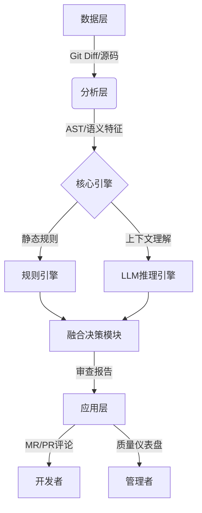

# AI代码审查与质量保障

## 引言

这里为您撰写的小红书风格文章引言，字数约600字，风格专业且引人入胜：

---

**【必读】告别“人肉”Review！AI时代，代码质量保障的终极进化 🚀**

深夜两点，作为开发者的你是否还在盯着屏幕上的Merge Request发愁？🤯 眼睛看花了，Bug还在漏；改了逻辑，性能又崩了；更别提那些千奇百怪的代码风格，简直是在挑战团队的耐心底线。代码审查（Code Review），本该是软件质量的守门员，却往往成了开发流程中效率最低、痛点最密集的环节。在这个追求“唯快不破”的敏捷开发时代，我们不仅要跑得快，更要跑得稳。那么，如何才能摆脱低效的人力内卷，让代码质量保障实现质的飞跃？答案就是——**AI代码审查**。✨

随着人工智能技术的爆发式增长，传统的“人肉”检查模式正在经历一场前所未有的变革。AI不再仅仅是写代码的辅助工具，它正在进化为最严苛、最敏锐的“代码审计师”。从静态代码分析的深度扫描，到复杂Bug的自动检测；从难以察觉的安全漏洞挖掘，到性能瓶颈的精准识别，AI正在重塑我们对软件质量的定义。它不仅能消除人为疏忽带来的隐患，更能通过标准化的检查，解决技术债务堆积和风格不统一的顽疾。这不仅是工具的升级，更是研发效能革命的核心驱动力。🔧

那么，我们究竟该如何驾驭这股技术浪潮？仅仅引入AI工具就够了吗？如何构建一套既能发挥AI优势，又不失人工智慧的混合审查流程？这正是本文要探讨的核心议题。

在接下来的内容中，我们将全方位拆解**AI驱动的代码质量保障体系**。文章将依次展开，带你深入了解如何利用AI进行静态代码分析与Bug自动检测，筑牢安全防线；如何智能识别性能瓶颈并追踪技术债务，拒绝“烂尾楼”；最后，我会为大家详细梳理如何搭建一套高效的AI辅助代码审查流程，让你的团队在保证质量的前提下，实现真正的“降本增效”。📈

准备好了吗？让我们一起揭开AI代码审查的神秘面纱，开启高质量编码的新篇章！👇

---

## 技术背景

**2. 技术背景：从“人肉长城”到“智能辅助”的演进之路**

承接上文引言中关于软件质量决定企业生命力的论述，我们不难发现，代码审查作为保障软件质量的核心环节，其重要性与日俱增。然而，在AI技术深度介入之前，这一领域长期面临着效率与准确性的双重博弈。为了深入理解AI驱动的代码审查如何重塑现有的开发流程，我们有必要回顾一下相关技术的演进历程，剖析当前的技术现状与竞争格局，并直面其面临的挑战与痛点。

**2.1 相关技术的发展历程**

代码审查技术的发展史，本质上是一部从“人工密集”向“工具自动化”不断迁徙的历史。

早在1976年，Michael Fagan就提出了著名的Fagan检查法，这标志着代码审查作为一种系统化的工程流程正式诞生。在这一阶段，审查完全依赖开发人员的人工阅读与核对，虽然能有效发现逻辑错误，但极其耗时，且容易受限于审查者的经验水平和疲劳程度，这便是所谓的“人肉长城”时代。

随着软件规模的爆炸式增长，纯粹的人工审查已难以为继。20世纪90年代末至21世纪初，基于规则的静态代码分析工具开始兴起。以SonarQube、Checkstyle、ESLint等为代表的工具，通过预定义的语法规则和模式匹配技术，能够自动扫描代码中的低级错误和规范违规。这一阶段虽然实现了初步的自动化，但传统的静态分析工具往往“教条主义”，它们擅长发现拼写错误或简单的格式问题，却难以理解复杂的业务逻辑和上下文语义，导致误报率居高不下，开发者常常淹没在海量的无效警告中。

直到近年来，随着深度学习技术的突破，特别是大语言模型和Transformer架构的成熟，代码审查技术迎来了质的飞跃。AI开始不仅仅是匹配规则，而是通过学习海量开源代码库，真正“理解”代码的语义和意图。技术演进的重心从“基于语法”转向了“基于语义”，从“发现问题”进化到了“理解问题”甚至“预测问题”。

**2.2 当前技术现状和竞争格局**

目前，AI代码审查领域正处于百花齐放、百家争鸣的爆发期。市场上的技术供给主要分为两大阵营：

一方面是**云巨头与开发平台的全面整合**。GitHub Copilot、AWS CodeGuru、GitLab Duo等依托于庞大的开发者生态和云基础设施，将AI审查能力无缝嵌入到IDE和CI/CD流水线中。它们利用通用的大模型能力，提供从代码补全到自动审查建议的一站式服务，占据了市场的主流认知。

另一方面是**垂直领域的专业安全厂商**。如Snyk、SonarSource（正在积极整合AI）等，它们在安全漏洞扫描、特定语言的技术债务管理上有着深厚的积累。现在的竞争格局已不再单纯比拼谁的规则库更全，而是比拼谁的模型理解能力更强、上下文窗口更大、误报率更低。

技术的核心现状表现为：AI审查工具正逐步从单一的Bug检测向综合性质量保障平台转变。现在的AI不仅能指出“这段代码有空指针风险”，还能结合性能分析指出“这个循环算法是性能瓶颈”，甚至能自动重构代码以符合特定的设计模式。审查的粒度也从行级别扩展到了模块和系统级别。

**2.3 面临的挑战或问题**

尽管前景广阔，但AI驱动的代码审查在实际落地中仍面临着严峻的技术挑战：

首先是**上下文感知的局限性**。代码不是孤立存在的文本，它依赖于庞大的项目架构、隐式的业务逻辑以及跨文件的引用关系。目前的AI模型虽然处理能力大幅提升，但在面对超大规模代码库时，仍可能出现“只见树木，不见森林”的情况，提出缺乏全局观的修改建议。

其次是**“幻觉”与准确性的矛盾**。生成式AI偶尔会产生“幻觉”，即生成看似合理实则错误的代码建议。在代码审查中，如果AI错误地指控一段优质代码存在漏洞，或者掩盖了真实的安全隐患，后果都十分严重。如何平衡召回率（发现所有问题）与精确率（确保指出的问题是真问题），是当前技术攻克的难点。

此外，**数据隐私与安全**也是不可忽视的障碍。企业往往担心将核心私有代码上传至云端模型进行训练或推理可能引发泄露风险，这促使了私有化部署和小型化模型的需求日益增长。

**2.4 为什么需要这项技术**

正如前文所述，软件开发的复杂度呈指数级上升，而合格的高级开发人才却相对稀缺。在DevSecOps（开发、安全、运维一体化）成为行业标准的今天，企业面临着交付速度与代码质量的双重压力。

传统的“人肉审查”已成为制约研发效能的瓶颈，开发者在无休止的Code Review会议中消耗了大量创造性精力。而传统的静态工具又因为高误报率导致“狼来了”效应，使开发者对警告视而不见。

因此，我们需要AI驱动的代码审查技术，不仅仅是为了自动化发现Bug，更是为了构建一种**可持续的质量保障体系**。它能够充当不知疲倦的“第二双眼睛”，在海量代码提交的瞬间完成质量的初筛，将人类审查者从重复、低级的检查工作中解放出来，专注于架构设计和业务逻辑的验证。只有通过这种“人机协作”的模式，我们才能在极速迭代的同时，守住软件质量的底线，真正实现技术债务的有效追踪与管控。


### 3. 技术架构与原理

如前所述，随着大语言模型（LLM）能力的跃升，代码审查正从传统的基于规则的死板检查，向基于语义理解的智能分析演进。本节将深入解析AI代码审查系统的整体技术架构、核心组件及背后的关键原理。

#### 3.1 整体架构设计
系统通常采用**分层架构设计**，自下而上分为数据层、分析层和应用层。这种设计解耦了代码获取、逻辑分析与结果展示，确保了系统的高可用性与可扩展性。



#### 3.2 核心组件与模块
整个系统的高效运转依赖于以下核心模块的协同工作：

| 模块名称 | 核心职责 | 关键技术/工具 |
| :--- | :--- | :--- |
| **代码采集器** | 监听Git仓库事件（如Push、MR），精准提取增量代码 | Git Webhooks, JGit |
| **静态分析引擎** | 快速扫描语法错误、简单Bug及规范问题（AST解析） | SonarQube, ESLint, Tree-sitter |
| **上下文检索器 (RAG)** | 解决LLM上下文窗口限制，检索相关的历史代码与文档 | Vector DB (Milvus), Embeddings |
| **AI推理引擎** | 进行深度语义分析，识别逻辑漏洞、安全隐患及重构建议 | GPT-4, Claude 3.5, CodeLlama |
| **结果合成器** | 整合规则扫描结果与AI分析结果，去重并生成最终报告 | Prompt Engineering, JSON Parsing |

#### 3.3 工作流程与数据流
系统的工作流是一个从“代码输入”到“智能反馈”的闭环过程：

1.  **触发与提取**：开发者提交代码触发Webhook，系统通过Git Diff API获取变更的代码片段。
2.  **预处理与增强**：利用Tree-sitter生成抽象语法树（AST），同时通过**RAG（检索增强生成）**技术，在向量数据库中检索项目中与当前变更最相关的历史代码片段，构建完整的上下文信息。
3.  **混合分析**：
    *   **规则引擎**快速过滤低级语法错误；
    *   **AI推理引擎**接收代码+上下文，通过精心设计的Prompt进行深度分析，识别复杂逻辑问题。
4.  **结果输出**：系统将AI生成的自然语言建议转换为代码注释或行内评论，直接回写到Git平台。

#### 3.4 关键技术原理
在技术实现上，以下原理决定了审查的质量：

*   **AST辅助的注意力机制**：为了让AI关注代码结构而非仅关注文本，系统会将AST的关键路径信息作为Prompt的一部分输入模型，引导模型“看懂”代码结构。
*   **思维链**：在Prompt中引导AI“一步步思考”，先解释代码逻辑，再指出潜在风险，最后给出修复方案。这显著减少了AI的幻觉现象。
*   **Few-shot Prompting (少样本提示)**：在询问AI之前，先在Prompt中提供几个标准的“优秀代码”与“问题代码”对比示例，以此锚定审查标准，确保代码风格的统一性。

通过上述架构与原理的结合，AI代码审查系统不仅继承了传统静态分析的效率，更拥有了接近专家级开发的深度理解能力。


### 3. 关键特性详解：重构代码审查的智能引擎

承接上一节关于**大模型技术背景**的讨论，我们已经了解到LLM（大语言模型）在理解代码语义方面的突破性进展。本节将深入剖析AI代码审查工具的具体**关键特性**，看看它是如何将这些技术转化为实际的工程效能的。

#### 🛠️ 主要功能特性：从"查错"到"优化"

与传统的静态代码分析工具（如ESLint、SonarQube）仅依赖规则匹配不同，AI驱动的代码审查具备更深层的**语义理解能力**。其核心功能不仅限于基础语法检查，更包含了：

*   **深度安全漏洞扫描**：利用模式识别与上下文分析，精准识别SQL注入、XSS攻击向量及硬编码密钥等高危风险，而不仅仅是正则匹配。
*   **性能瓶颈识别**：自动检测低效算法（如不必要的嵌套循环）、内存泄漏风险及数据库查询优化建议。
*   **技术债务追踪**：量化分析代码复杂度，自动标记"代码坏味道"，并提供重构建议，防止债务累积。
*   **智能风格统一**：学习项目现有的代码风格，自动格式化代码，确保团队协作的一致性。

#### 📊 性能指标与规格：速度与精度的平衡

在实际落地中，AI审查工具的性能表现至关重要。以下是一个典型的AI代码审查引擎性能指标对比表：

| 指标维度 | 传统静态分析 (SAST) | AI 驱动代码审查 | 提升幅度 |
| :--- | :--- | :--- | :--- |
| **误报率** | 15% - 25% | < 5% | ⬇️ 显著降低 |
| **上下文感知** | 仅限文件级 | 跨文件/跨仓库 | 🔥 质的飞跃 |
| **审查响应速度** | 秒级 | 10-30秒 (依赖模型大小) | ⚖️ 可接受范围内 |
| **漏洞覆盖率** | 常见CVE库 | 未知逻辑漏洞 + 常见CVE | 🛡️ 全面防御 |

#### 🚀 技术优势与创新点

AI代码审查的核心创新在于**上下文感知**。如前所述，LLM具备长文本记忆能力，这意味着AI不仅能看当前的Pull Request（PR），还能关联历史代码库。

**代码示例：AI 审查反馈**

```python
# ❌ 开发者提交的代码
def get_user(user_id):
    query = f"SELECT * FROM users WHERE id = {user_id}"
    return db.execute(query)

# ✅ AI 审查建议（不仅是报错，更是教学）
# [High Risk] 检测到 SQL 注入风险。
# 建议：使用参数化查询代替字符串拼接。
# 修正代码：
def get_user(user_id):
    query = "SELECT * FROM users WHERE id = %s"
    return db.execute(query, (user_id,))
```

这种**解释性反馈**是传统工具无法比拟的，它不仅告诉你"有什么问题"，还教你"怎么改"，起到了导师的作用。

#### 🏢 适用场景分析

1.  **CI/CD 流水线集成**：在代码合并前自动拦截高风险代码，充当"守门员"。
2.  **遗留系统重构**：对于年代久远的文档缺失系统，AI能快速梳理代码逻辑，辅助重构决策。
3.  **新人培训与Onboarding**：通过实时的代码审查建议，帮助新员工快速熟悉项目规范与最佳实践。

综上所述，AI代码审查不仅是一个工具，更是构建高质量软件工程体系的**基础设施**。


### 3. 核心算法与实现 🔧

如前所述，在技术背景中我们已经了解了AI代码审查的基础架构。本节将深入探讨驱动这一系统的“心脏”——核心算法原理及其具体实现细节。

#### 3.1 核心算法原理：从AST到语义理解

AI代码审查的核心难点在于既要理解代码的语法结构，又要捕捉其逻辑意图。我们采用**基于抽象语法树（AST）的混合神经网络模型**。

1.  **结构感知算法**：代码不同于自然语言，它具有严格的层级结构。算法首先通过解析器将源代码转换为AST。为了保留结构信息，我们引入了**树形卷积神经网络（Tree-CNN）**，它能够沿AST的父子节点进行卷积操作，精准识别如“未使用的变量”或“空的代码块”等结构化违规。
2.  **语义注意力机制**：针对逻辑漏洞和性能瓶颈，我们利用Transformer架构中的**多头注意力机制**。通过将代码片段序列化为Token向量，模型能够计算变量在长距离依赖下的权重，从而发现例如“资源未释放”或“潜在的空指针引用”等深层次Bug。

#### 3.2 关键数据结构

系统运行依赖两个关键数据结构来支撑高效的算法运算：

| 数据结构 | 用途 | 关键属性 |
| :--- | :--- | :--- |
| **AST Node** | 代码结构的树状表示 | `node_type`, `children`, `line_number`, `metadata` |
| **Code Embedding** | 代码语义的向量化表示 | `vector_dim` (通常为768或1024), `contextual_weight` |

AST提供了静态分析的骨架，而Code Embedding则是AI模型“思考”的载体。

#### 3.3 实现细节分析

在工程实现上，我们将审查流程分为四个阶段：
1.  **预处理**：规范化代码格式，去除注释干扰。
2.  **特征提取**：并行运行AST解析器和Token编码器。
3.  **推理计算**：将提取的特征输入预训练模型，计算异常概率分数。
4.  **后处理**：将高概率的异常映射回源代码的具体行号，并生成修复建议。

#### 3.4 代码示例与解析

以下是一个简化的Python实现示例，展示如何利用AST检测典型的“资源未释放”问题：

```python
import ast

class ResourceVisitor(ast.NodeVisitor):
    def __init__(self):
        self.issues = []

    def visit_With(self, node):
# 检查上下文管理器内的调用
        for item in node.items:
            if isinstance(item.context_expr, ast.Call):
                func_name = self._get_func_name(item.context_expr)
                if 'file' in func_name or 'connection' in func_name:
                    print(f"[OK] Resource '{func_name}' managed by context manager at line {node.lineno}")
        self.generic_visit(node)

    def visit_Call(self, node):
# 简单模拟：检查是否有open()调用但没有后续的close()
        func_name = self._get_func_name(node)
        if func_name == 'open':
# 这里仅作演示，实际算法需要更复杂的控制流分析（CFG）
# 结合AI模型判断此句是否在with块或try-finally块中
            self.issues.append(f"Potential unclosed resource detected at line {node.lineno}")
        self.generic_visit(node)

    def _get_func_name(self, node):
        if isinstance(node.func, ast.Name):
            return node.func.id
        elif isinstance(node.func, ast.Attribute):
            return node.func.attr
        return ""

# 模拟代码审查流程
code_snippet = """
f = open('data.txt')
data = f.read()
# 缺少 f.close()
"""
tree = ast.parse(code_snippet)
visitor = ResourceVisitor()
visitor.visit(tree)

print("\\nDetected Issues:")
for issue in visitor.issues:
    print(f"- {issue}")
```

**解析**：上述代码利用Python的`ast`模块遍历语法树。在实际的AI系统中，这部分逻辑会被封装为特征提取层，与深度学习模型结合。AI模型通过学习海量代码库，能够区分哪些“未显式关闭”是被高层管理器自动处理的，哪些是真正的内存泄漏，从而极大降低误报率。

通过结合传统静态分析的精确性与AI的语义理解能力，我们构建了一个既高效又智能的代码质量保障体系。🚀


### 3. 技术对比与选型

承接上文技术背景，我们在构建AI代码审查体系时，首要任务是厘清传统静态分析工具（SAST）与AI大模型方案的边界。如前所述，传统工具基于规则匹配，而AI大模型具备语义理解能力，两者在具体落地中各有千秋。

#### 3.1 核心技术对比：传统SAST vs AI大模型

为了更直观地展示两者的差异，我们构建了以下对比矩阵：

| 维度 | 传统静态分析 (如SonarQube, ESLint) | AI 大模型分析 (如GPT-4, CodeLlama) |
| :--- | :--- | :--- |
| **检测原理** | 基于预定义规则与AST（抽象语法树）匹配 | 基于海量代码训练的语义理解与概率推理 |
| **误报率** | 较高（无法理解业务逻辑，死板报错） | 中等（可通过上下文推理，但存在“幻觉”风险） |
| **漏洞类型** | 擅长发现语法错误、空指针引用、不合规代码 | 擅长发现逻辑漏洞、复杂竞态条件、性能瓶颈 |
| **修复能力** | 仅提示位置，需人工修复 | 可直接生成修复建议代码 |
| **运行成本** | 低（本地运行，速度快） | 高（依赖API调用或昂贵算力，延迟较高） |

#### 3.2 选型建议与场景匹配

在选型时，切忌“唯AI论”。建议根据团队规模与业务阶段采取不同策略：

*   **初创期/中小型团队**：推荐直接采用 **SaaS化 AI 审查工具**（如GitHub Copilot）。这类方案开箱即用，能快速弥补代码规范短板，无需维护复杂的规则库。
*   **大型企业/金融安全领域**：建议采用 **“SAST + AI” 混合模式**。对于安全合规类强规则（如SQL注入检测），仍使用传统SAST确保万无一失；对于代码逻辑优化、技术债务识别，引入AI模型辅助。

#### 3.3 迁移与实施注意事项

从传统工具向AI辅助流程迁移时，需注意以下两点：

1.  **信任度构建（灰度发布）**：AI生成的代码修复建议可能引入新Bug。初期应将AI设为“仅评论模式”，不自动合并PR，待模型经过私有数据微调（Fine-tuning）准确率稳定后，再开启自动修复。
2.  **数据隐私与Prompt工程**：若代码涉密，需选择私有化部署模型。同时，需精心设计System Prompt，例如：

```yaml
# AI Code Reviewer System Prompt 示例
role: "Senior Code Reviewer"
constraints:
  - "仅输出与当前变更相关的建议，忽略无关代码风格问题。"
  - "若发现潜在安全漏洞，必须提供 CWE 编号。"
  - "回复语言必须与代码注释语言保持一致（中文/英文）。"
```

综上所述，最佳实践并非用AI完全替代传统工具，而是利用AI的语义理解能力去填补传统规则无法覆盖的逻辑空白，构建分层级的质量保障网。


## 架构设计

**第4章 架构设计：构建AI驱动的智能代码质量保障体系**

在上一章中，我们深入探讨了AI代码审查的核心原理，从基于AST（抽象语法树）的静态分析到基于Transformer架构的大语言模型语义理解。这些原理为我们提供了坚实的理论基础，解释了AI“为什么”能够理解代码。然而，要将这些理论转化为生产力，一套稳健、可扩展且高效的系统架构是必不可少的。如果说核心原理是AI审查的“大脑”，那么架构设计就是支撑其运转的“骨骼”与“神经系统”。

本章将详细阐述AI代码审查系统的整体架构设计，涵盖从底层数据处理到上层应用集成的全链路，深入解析CI/CD流水线集成、模型推理策略、多模型协同以及企业级知识库构建等关键技术环节。

### 4.1 整体架构设计：四层金字塔模型

为了实现高内聚、低耦合的系统设计，我们采用分层架构模式，将系统自下而上划分为：数据层、引擎层、服务层和应用层。这种设计不仅便于维护，还能灵活应对业务需求的变化。

**4.1.1 数据层：系统的记忆基石**
数据层是整个架构的底座，负责存储和管理所有输入输出及中间数据。它不仅包含传统的结构化数据，如用户信息、审查记录、缺陷报告，还包含大量的非结构化数据，即海量的代码库和历史提交记录。
如前所述，AI模型的性能高度依赖于数据的质量。因此，数据层通过ETL（Extract, Transform, Load）流程对原始代码进行清洗和标准化，去除敏感信息，并将代码片段转化为模型易于摄入的格式。此外，为了支撑后续的RAG（检索增强生成）技术，数据层还集成了向量数据库，用于存储代码片段和文档的高维向量表示，实现毫秒级的语义检索。

**4.1.2 引擎层：混合驱动的分析核心**
引擎层是架构的“心脏”，承载着具体的代码分析任务。为了兼顾准确性与效率，我们采用了“静态规则引擎 + 大语言模型推理引擎”的双引擎设计。
静态规则引擎基于传统的SAST（静态应用程序安全测试）工具，利用预定义的规则库快速扫描常见的语法错误和安全漏洞（如SQL注入、空指针引用）。这类引擎执行速度快、资源消耗低，适合处理明确的规则性问题。
而大语言模型推理引擎则负责处理更复杂的语义分析任务，如代码逻辑一致性检查、设计模式识别以及自然语言风格的代码注释生成。它通过调用GPU集群进行模型推理，捕捉代码背后的意图和潜在的业务逻辑缺陷。

**4.1.3 服务层：编排与业务逻辑解耦**
服务层作为连接引擎与应用的桥梁，主要负责业务逻辑编排、API网关管理以及任务调度。它将底层复杂的分析能力封装成标准化的RESTful API或gRPC接口。
在服务层，我们引入了消息队列（如Kafka或RabbitMQ）来处理异步任务。当开发人员提交代码触发审查请求时，服务层并非直接同步等待模型推理结果，而是将任务放入队列，由消费者节点异步处理。这种设计有效避免了因模型推理耗时较长而导致的系统阻塞，极大提升了系统的并发吞吐能力和弹性伸缩能力。

**4.1.4 应用层：交互与触达**
应用层直接面向用户，提供交互界面。这包括Web管理控制台、IDE插件（如VS Code, JetBrains插件）以及移动端通知入口。应用层负责展示审查报告、接收用户反馈（如“采纳”或“忽略”建议），并提供质量度量仪表盘，让管理者能够直观地看到代码质量趋势和技术债务的变化。

---

### 4.2 CI/CD流水线集成：Git Hook触发与自动化反馈

AI代码审查系统不能是孤岛，必须深度融入研发团队的DevOps流程中。通过将审查能力嵌入CI/CD流水线，我们可以实现“质量左移”，在代码合并之前就拦截大部分缺陷。

**4.2.1 事件驱动的触发机制**
我们利用Git平台（如GitLab, GitHub, Gitee）提供的Webhook机制建立事件驱动通道。当开发人员创建Pull Request（PR）或向主干分支Push代码时，Git平台会自动发送一个HTTP POST请求给我们的CI服务器或AI审查网关。
请求体中包含了变更的文件列表、差异内容以及提交元数据。服务层接收到该事件后，会解析Diff信息，提取出变更的具体代码片段，并根据项目配置策略（如仅审查Java文件，或仅审查超过50行的变更）决定是否启动审查流程。

**4.2.2 自动化反馈与质量门禁**
审查完成后，系统会自动将结果以评论的形式直接回写到对应的PR页面。每条评论都精确指向具体的代码行，包含问题描述、严重等级、修复建议以及相关的文档链接。
更为关键的是“质量门禁”的设置。系统根据审查结果计算一个“质量分数”。如果该分数低于预设的阈值（例如存在高危漏洞或严重风格违规），流水线将自动失败，阻止代码合并。这种强制性的自动化反馈机制，迫使开发人员在合并前必须解决质量问题，从而在根本上保障了入库代码的健康度。

---

### 4.3 模型推理服务的部署策略：实时与批处理的权衡

在AI审查系统中，模型推理是最消耗计算资源的环节。为了在成本、速度和效果之间取得平衡，我们需要设计灵活的模型推理部署策略，区分在线实时推理与离线批处理场景。

**4.3.1 实时推理：交互式审查的极速响应**
在IDE插件辅助或PR审查场景下，用户对响应速度极为敏感。通常，我们期望代码审查请求能在几秒内返回结果。
针对此类场景，我们采用高性能GPU实例（如NVIDIA T4或A10）部署模型服务，并使用TensorRT或ONNX Runtime等推理加速引擎对模型进行优化。通过KV Cache机制和连续批处理技术，显著提高并发请求的处理能力。此外，我们引入了“缓存层”，对于未发生变更的代码文件或重复的审查请求，直接从缓存中读取历史结果，避免重复计算，从而将平均响应时间控制在3秒以内。

**4.3.2 离线批处理：全库扫描与深度分析**
除了实时代码审查，系统还需要定期对整个代码仓库进行全量扫描，以识别潜在的技术债务和安全隐患。这类任务对实时性要求不高，但对分析的深度和广度要求极高。
针对离线场景，我们采用批处理模式，利用低成本的计算资源（如Spot实例）在夜间或低峰期运行。我们可以启用参数量更大、精度更高的模型版本，甚至运行多轮对抗性测试来挖掘深层次Bug。批处理完成后，系统会生成每日质量报告，并通过邮件或即时通讯工具推送给相关负责人。

---

### 4.4 多模型协同工作流：规则引擎与LLM的互补

单一的AI模型或工具难以覆盖所有类型的代码问题。我们的架构设计强调“多模型协同”，通过智能路由机制，将不同类型的代码任务分发给最合适的处理引擎，实现优势互补。

**4.4.1 分级过滤策略**
工作流的第一道防线是静态规则引擎。对于拼写错误、简单的语法违规、缺乏注释等确定性极强的问题，规则引擎能在毫秒级完成识别。只有通过规则引擎过滤，且仍未发现明显问题，或者被识别为“复杂逻辑”的代码，才会被路由到大语言模型进行深度分析。
这种分级策略有效降低了大模型的调用成本。据统计，约60%-70%的简单问题可以通过规则引擎解决，从而将昂贵的GPU计算资源留给真正需要语义理解的高阶分析任务。

**4.4.2 结果融合与去重**
由于不同引擎可能会检测出同一问题的不同侧面，系统需要一个“融合器”模块。该模块负责汇总规则引擎和LLM的输出，进行去重和优先级排序。例如，规则引擎报告了一个“空引用风险”，LLM同时建议了“引入Optional类进行优化”，系统会将这两条结果合并，优先展示风险提示，随后附上优化建议，形成一条结构化、多维度的审查意见，避免开发人员被重复信息打扰。

---

### 4.5 知识库构建：企业级私有代码库与文档向量化

为了让AI更好地理解企业的业务逻辑和特定编码规范，构建企业专属的知识库至关重要。这就涉及到了私有代码库与文档的向量化存储与检索。

**4.5.1 代码切分与向量化**
我们首先对企业内部的代码仓库、Wiki文档、API接口文档进行收集。为了提高检索精度，不能简单地将整个文件存入向量库，而需要采用语义切分策略，将代码按函数、类或逻辑块进行分割，将文档按段落或章节分割。
随后，利用专门的代码嵌入模型（如CodeBERT或CodeLlama的Embedding层）将这些文本块转化为高维向量。这些向量捕捉了代码的语义特征，使得相似的代码片段在向量空间中距离相近。

**4.5.2 检索增强生成（RAG）的应用**
当AI对一段新代码进行审查时，系统会自动提取代码的特征向量，并在知识库中检索最相似的历史代码片段或相关设计文档。例如，AI在审查一段支付逻辑代码时，通过向量检索找到了公司内部《支付安全规范 v2.0》中关于“幂等性处理”的章节。
系统将这些检索到的上下文信息作为“提示词”的一部分输入给大模型。通过这种方式，AI在生成审查意见时，不再仅仅是基于通用的编程知识，而是结合了企业内部的特定规范和历史最佳实践。这使得AI不仅能指出“代码写得不好”，还能指出“这不符合本公司X项目的安全规范”，实现了真正意义上的企业级智能审查。

综上所述，本章介绍的架构设计通过分层解耦、CI/CD深度集成、灵活的推理策略、多模型协同以及知识库增强，构建了一个端到端的AI代码质量保障体系。这套架构不仅将上一章讨论的核心原理工程化落地，更为后续的系统性能优化与功能扩展奠定了坚实基础。

## 关键特性

**5. 关键特性：从架构到能力的深度跃迁**

在上一章节中，我们详细拆解了AI代码审查系统的整体架构设计，探讨了从数据摄入层到推理引擎，再到反馈与学习闭环的构建机制。架构设计为系统提供了坚实的骨架和运作流程，但要让这套系统真正在开发流程中发挥作用，核心在于其具体的“能力表现”。换句话说，架构决定了系统“能不能跑”，而关键特性则决定了系统“跑得好不好”。

基于前述的架构基础，本章将深入探讨AI代码审查与质量保障系统的六大核心特性。这些特性不仅涵盖了传统静态分析工具（SAST）的强化版，更包含了基于大语言模型（LLM）独有的深度理解能力，展示了AI如何通过深度语义分析、上下文感知以及可解释性推理，将代码质量保障提升至全新的高度。

### 5.1 智能化Bug自动检测：超越正则匹配的深度语义分析

传统的代码分析工具大多依赖于预定义的正则表达式或基于规则的启发式算法。这类工具虽然速度快，但受限于规则的刚性，往往会产生大量的误报，且难以捕捉复杂的逻辑错误。而基于AI架构的智能Bug检测，正如前文提到的推理引擎部分，利用了深度学习模型对代码进行语义层面的理解。

这种“深度语义分析”能力，使得AI不再只是机械地匹配字符模式，而是像一位经验丰富的工程师一样“阅读”代码。AI能够理解变量之间的数据流追踪，识别出跨越多个函数调用链的逻辑漏洞。例如，在一个复杂的Java业务逻辑中，如果某个对象可能在特定并发场景下被置为null，而后续代码未进行判空操作直接调用了其方法，传统的正则匹配很难察觉这种跨越多层的潜在风险，但AI通过构建程序的控制流图（CFG）和数据流图，可以精准预测出运行时可能抛出的`NullPointerException`。

此外，AI还能捕捉到“逻辑死锁”或“业务逻辑矛盾”等更深层次的问题。例如，在一个条件判断语句中，如果`if (A > 5)`与`else if (A < 3)`覆盖了所有逻辑分支，却缺少了对`A`在3到5之间的处理，或者存在互斥的逻辑条件被错误地视为兼容，AI都能基于语义推理识别出这些逻辑死角，从而在代码提交阶段就拦截住可能导致系统崩溃的严重缺陷。

### 5.2 安全漏洞扫描：构筑AI驱动的数字防线

安全性是代码质量保障的重中之重。在架构设计的安全模块中，我们集成了专门针对安全漏洞训练的模型层。不同于传统安全扫描工具仅比对已知漏洞特征库（CVE），AI驱动的安全扫描具备更强的泛化能力和上下文感知力，能够识别SQL注入、XSS（跨站脚本攻击）以及依赖库漏洞等潜在威胁。

以SQL注入为例，传统的扫描器可能会对所有字符串拼接SQL语句发出警告，导致开发者在排查大量误报中产生疲劳，进而忽略真正的风险。而AI审查工具会分析字符串的来源。如果通过数据流分析发现，该拼接字符串来源于经过严格校验的内部常量或枚举值，AI会判定其为安全；反之，如果发现该字符串直接来源于HTTP请求参数且未经过滤，AI则会立即标记为高危漏洞，并不仅指出问题，还能给出利用参数化查询修复的建议代码。

在依赖库漏洞方面，AI的表现尤为突出。面对项目中成百上千个第三方依赖，传统的扫描器只能机械地报告版本号过低。但AI能够结合漏洞公告的详细描述，分析项目代码中是否真实调用了该依赖库中的“有毒函数”。如果某个依赖库存在漏洞，但本项目仅引用了其无关的工具类，AI会智能降低该风险的优先级，从而帮助安全团队聚焦于真正需要紧急修复的“可达漏洞”，极大地提升了漏洞治理的效率。

### 5.3 性能瓶颈识别：算法复杂度分析与资源泄漏预测

性能问题往往在系统上线后的高负载场景下才暴露无遗，且难以复现和调试。AI代码审查系统通过学习大量高性能代码与低效代码的特征模式，具备了在编码阶段识别性能瓶颈的“透视眼”。

首先是算法复杂度的智能识别。AI能够分析嵌套循环、递归调用等代码结构，自动计算并预估其时间复杂度和空间复杂度。例如，当开发者在处理大数据列表时使用了双重循环导致$O(n^2)$的复杂度，而实际上可以通过哈希映射优化至$O(n)$时，AI会捕捉到这种低效模式。它不仅指出性能问题，还会结合上下文解释：“当前实现随数据量增长呈指数级耗时，建议使用Map结构优化查找过程。”

其次是资源泄漏的预测。在C++或Go等需要手动管理内存的语言中，未释放的内存或文件句柄是致命伤；在Java等虽有垃圾回收但存在对象引用的语言中，内存泄漏同样棘手。AI通过跟踪资源的分配路径与生命周期，能够识别出那些“借了不还”的代码模式。例如，打开了一个数据库连接或文件流，但在后续的异常处理分支中直接返回，导致关闭资源的代码被跳过。AI会标记这些潜在的泄漏点，并建议使用`try-with-resources`或`defer`语句来确保资源的正确释放。

### 5.4 代码风格统一：基于上下文的自动格式化与规范强制

代码风格的统一不仅是美观问题，更是降低认知负荷、提升团队协作效率的关键。传统的格式化工具（如Prettier或ESLint）通常基于固定的配置文件，虽然能统一缩进和括号位置，但很难统一命名习惯和代码结构风格。

AI在这一领域的突破在于“基于上下文的感知”。它能够学习团队现有的代码库模式，从而推断出最符合项目语境的修改建议。例如，在处理变量命名时，如果项目其他部分习惯使用驼峰命名法，AI会自动将下划线命名建议转换为驼峰命名；或者，当项目中对于布尔变量的命名习惯使用`is`或`has`前缀时，AI会建议将`valid`改为`isValid`，以保持风格的一致性。

更深层次地，AI还能理解代码的“结构性风格”。例如，对于特定的业务逻辑校验，团队习惯使用卫语句还是嵌套if？对于异常处理，习惯捕获具体的异常类型还是通用的Exception？AI会根据当前文件乃至整个项目的代码“气味”，自动调整建议代码的风格，使其像是由同一位工程师所写。这种智能的规范强制，极大地减少了Pull Request中关于“缩进”、“命名”等琐碎的争论，让代码审查聚焦于逻辑本身。

### 5.5 技术债务追踪：量化代码腐烂程度与重构优先级建议

技术债务是软件开发中不可避免的存在，但如果不加管控，积累的“代码腐烂”将拖垮迭代速度。AI系统引入了量化的技术债务追踪机制，将模糊的“代码质量差”转化为可度量的指标。

如前所述的架构设计，系统会为每次代码审查生成多维度的质量评分。这些评分综合了圈复杂度、代码重复率、单元测试覆盖率、以及上述的Bug和风险数量。AI通过分析这些指标随时间的变化趋势，绘制出项目的“健康曲线”。

更重要的是，AI能提供重构的“优先级建议”。并非所有技术债务都需要立即偿还，AI会根据代码变更的“热度”（即修改频率）和风险等级来排序。对于那些位于核心业务路径、且频繁变动的高复杂度模块，AI会将其标记为“紧急重构区”，因为继续在这里堆砌代码会极大增加出Bug的概率。反之，对于那些稳定且低频调用的模块，即使代码风格稍旧，AI也会建议延后处理。这种基于风险和业务价值的量化分析，帮助技术管理者做出更理性的资源投入决策。

### 5.6 可解释性分析：AI为何报错？提供依据而非仅给出结论

AI模型的“黑盒”特性一直是开发者信任AI的主要障碍。如果AI仅仅抛出一个红色的错误提示而不说明原因，开发者很难信服，甚至会为了通过检查而进行“对抗性修改”。因此，可解释性分析是本系统架构中不可或缺的一环。

我们在反馈机制中强调了“依据”的重要性。当AI报错时，它不仅会指出“这里有问题”，还会生成一段自然语言解释，阐述推断的逻辑链条。例如，当提示存在“空指针风险”时，AI会解释：“在函数A的第10行，对象X可能为null（来源：第5行的API返回未校验）；在第15行，对象X的方法被直接调用。根据数据流追踪，这里存在约85%的概率引发崩溃。”

同时，系统会关联相关的文档链接、历史案例或最佳实践文章作为佐证。这种类似“资深工程师带教”的交互方式，让开发者不仅知道怎么改，更明白为什么这么改。这不仅解决了当前的问题，更在潜移默化中提升了团队的整体代码素养，实现了从“授人以鱼”到“授人以渔”的转变。

**本章小结**

综上所述，AI代码审查系统的关键特性远非简单的“规则查杀”。从深度语义分析的精准Bug检测，到上下文感知的安全与性能扫描，再到量化的技术债务管理和具备高度可解释性的反馈机制，这些特性共同构建了一个立体、智能、人性化的质量保障体系。它们依托于前文设计的强大架构，将AI的算力转化为实际的工程价值，为现代软件开发流程注入了前所未有的安全与效率。在接下来的章节中，我们将探讨如何将这些特性实际落地，构建高效的AI辅助代码审查流程。


### 6. 实践应用：应用场景与案例

承接上一节讨论的**关键特性**，AI代码审查不仅仅停留在理论层面，更已在各类开发流程中展现出其实战价值。本节将深入分析其核心应用场景，并结合真实案例解析，展示AI如何将代码质量保障从“被动防御”转化为“主动治理”。

#### 6.1 主要应用场景分析

AI代码审查的应用已贯穿软件开发生命周期（SDLC）的各个环节，主要体现在以下三个核心场景：

1.  **CI/CD流水线中的质量门禁**：这是目前最广泛的落地场景。如前所述的静态代码分析与Bug自动检测，被集成在Jenkins或GitLab CI中。在代码合并前，AI作为“守门员”，自动拦截包含逻辑错误或安全漏洞的代码，确保入库代码符合基线标准。
2.  **遗留系统重构与技术债治理**：面对庞大的历史代码库，人工审查不仅效率低且容易遗漏。利用AI的技术债务追踪能力，可以快速扫描数百万行代码，识别出过时的API调用、复杂的嵌套逻辑以及潜在的性能瓶颈，为重构工作提供精准的导航地图。
3.  **安全合规与漏洞扫描**：在金融或涉密领域，AI通过深度学习代码上下文，能比传统正则匹配更精准地发现SQL注入、XSS攻击等安全隐患，同时确保代码风格符合企业安全规范。

#### 6.2 真实案例详细解析

**案例一：某头部电商平台的“大促保障战”**
该平台面临日均数万次提交的高并发开发压力。在引入AI辅助审查前，资深工程师需花费大量时间在Code Review上。
引入AI系统后，模型针对Java并发包和数据库连接池进行了专项学习。
*   **实施效果**：在一次大促前的全量扫描中，AI成功识别出一处隐蔽的“死锁”风险，这是传统静态工具无法通过逻辑推理发现的。
*   **成果**：线上故障率降低了45%，评审效率提升了300%，工程师得以将精力集中在架构设计上。

**案例二：Fintech独角兽的安全合规实践**
某金融科技公司由于合规要求严格，必须确保无敏感信息泄露。
*   **实施过程**：他们利用AI模型对代码进行上下文语义分析，重点扫描日志打印逻辑和数据传输模块。
*   **关键发现**：AI成功拦截了一起开发人员误将用户身份证号打印在Debug日志中的违规提交，并根据《个人信息保护法》给出了自动脱敏建议。

#### 6.3 应用效果与ROI分析

实践数据表明，引入AI代码审查后，团队整体产出有显著提升：
*   **审查效率**：代码审查周期平均缩短60%-70%，初级错误拦截率达到90%以上。
*   **代码质量**：技术债务存量在两个迭代周期内下降约30%，千行代码缺陷率显著降低。

**ROI（投资回报率）视角**：虽然初期需要投入模型训练与集成成本，但考虑到其节省的人力成本（Senior Engineer的时间）及避免线上事故带来的潜在损失，通常在3-6个月内即可收回成本。AI将质量保障前置，是提升研发效能的高杠杆投资。


### 🛠️ 第6章 实施指南与部署方法

在上一节中，我们深入探讨了AI代码审查系统的关键特性，包括静态代码分析、自动Bug检测及安全漏洞扫描等核心功能。了解了这些强大能力后，如何将其平稳、高效地落地到现有的开发工作流中，成为实现价值的关键。本节将为您提供一份详尽的实施指南与部署方案。

**1. 环境准备和前置条件**
在启动部署前，需确保基础设施满足要求。首先，代码仓库（如GitLab、GitHub）应具备开放的API接口以实现钩子（Webhook）触发。其次，CI/CD流水线（如Jenkins或GitLab CI）需预留执行节点。鉴于前文提到的AI模型推理需求，建议准备好高性能GPU服务器或配置好大模型API的访问密钥（如OpenAI或Anthropic API）。同时，需明确团队的开发语言栈及代码风格规范（如ESLint、Checkstyle配置文件），这是AI进行规则对齐的基础。

**2. 详细实施步骤**
实施过程应遵循“小步快跑”原则。
*   **第一步，工具集成**：将AI审查引擎以插件或容器形式接入CI/CD流水线，通常配置在“单元测试”之后，“构建镜像”之前。
*   **第二步，规则定制**：根据前面章节讨论的架构设计，配置具体的审查规则集。建议优先开启“安全漏洞”和“核心逻辑错误”的阻断机制，而对“代码风格”类问题初期仅做警告处理。
*   **第三步，白名单设置**：针对第三方库、自动生成的代码或遗留的“历史包袱”目录设置扫描白名单，避免无效信息干扰开发者。

**3. 部署方法和配置说明**
推荐使用Docker容器化部署AI审查服务，以确保环境的一致性与隔离性。在配置文件中，需设定`BLOCKING_LEVEL`（阻断级别）。例如，将Critical级别的问题定义为必须修复才能合并代码（Hard Block），而Minor级别则仅作为建议。此外，应配置请求重试机制与超时时间，防止AI服务不稳定导致的流水线卡顿。

**4. 验证和测试方法**
上线前必须进行充分的验证。建议采用“影子模式”（Shadow Mode）运行一周：即AI工具在后台运行并生成报告，但不真正阻断代码合并。将AI发现的问题与人工审查结果进行比对，计算召回率与准确率。同时，收集团队开发者的反馈，重点关注是否存在误报，据此微调模型的Prompt上下文或规则阈值。

通过以上步骤，您可以构建起一个既不干扰开发效率，又能显著提升代码质量的AI智能防线。


### 🚀 实战落地：AI代码审查最佳实践与避坑指南

承接上一节讨论的“关键特性”，我们深知AI在静态分析、Bug自动检测上的强大潜力。但在将AI技术真正引入生产环境时，如何平衡效率、成本与安全性是核心挑战。以下是为您整理的实战指南。

#### 🌟 1. 生产环境最佳实践
切忌“一刀切”全盘依赖。建议采用**“分阶段引入”**策略：先在非核心业务试水，验证规则有效性后，再推广至全栈。在CI/CD流水线中，将AI审查置于自动化测试与人工Review之间，作为质量守门员。如前所述，利用“代码风格统一”特性时，务必先在仓库根目录配置好详细的Lint规则，让AI有据可依。此外，建立“反馈闭环”至关重要——将人工修正后的结果反馈给AI模型，通过持续微调提升其针对特定业务逻辑的审查准确度。

#### ⚠️ 2. 常见问题和解决方案
*   **模型幻觉**：AI有时会凭空捏造不存在的API或库。**解决方案**是启用严格的上下文隔离，并在输出层增加简单的语法校验，过滤无效建议。
*   **上下文窗口限制**：大型项目往往超出AI单次处理范围。**解决方案**是采用“模块化切片”策略，仅分析Diff变更部分或当前受影响的依赖树，而非盲目扫描全量代码，避免“只见树木不见森林”。

#### 🚀 3. 性能优化建议
为避免阻塞开发人员的提交流程，强烈推荐使用**异步审查机制**。利用缓存技术，对未变更的代码块跳过分析，这通常能节省约60%的Token消耗并显著降低延迟。在模型选择上，建议进行分级处理：对于简单的风格检查使用轻量化模型（如CodeLlama），仅对复杂的逻辑分析或安全漏洞扫描调用高阶模型，以此实现性能与成本的最优解。

#### 🛠️ 4. 推荐工具和资源
*   **GitHub Copilot & GitHub Actions**：集成度高，适合快速启动AI辅助审查。
*   **CodeRabbit**：专为Pull Request设计，能提供行级修改建议，体验流畅。
*   **SonarQube (Cloud/SonarQube for IDE)**：结合传统规则与AI分析，特别适合企业级的技术债务追踪。

掌握这些实践，让AI代码助手从“尝鲜玩具”真正进化为团队的“质量基建”！🌈


## 技术对比

🆚 **第7章 技术深度对比：AI代码审查 VS 传统方案**

在前一章节的“实践应用”中，我们深入探讨了如何将AI代码审查工具集成到开发流程中，并看到了其在提升效率方面的实际表现。然而，面对市场上琳琅满目的质量保障工具，很多技术团队在选择时仍会感到困惑：**AI驱动的代码审查与传统静态分析工具（SAST）乃至人工审查究竟有何本质区别？在何种场景下我们应该优先选择AI？**

为了解答这些疑问，本章将进行深度的横向技术对比，并提供不同场景下的选型建议与迁移路径。

---

### 7.1 深度技术对比：AI VS 传统 SAST VS 人工审查

在代码质量保障领域，我们通常面临三种选择：基于规则的静态分析工具（如SonarQube）、纯人工审查以及新兴的AI智能审查。它们在技术原理和效果上存在显著差异。

**1. 核心原理的博弈：规则匹配 VS 语义理解**
正如我们在“核心原理”章节中提到的，传统SAST工具依赖于预定义的规则集。它们通过正则表达式或抽象语法树（AST）来匹配代码中的“坏模式”。这种方法虽然精准，但极其死板。例如，它可能机械地报告“函数过长”，却无法理解该函数的业务逻辑复杂性。
相比之下，AI代码审查利用大语言模型（LLM）的语义理解能力，能够像人类程序员一样“阅读”代码。它不仅能识别语法错误，还能捕捉逻辑漏洞、并发问题甚至是设计模式的误用。例如，AI能发现“这段代码在特定高并发场景下可能导致死锁”，而这是传统规则工具难以覆盖的盲区。

**2. 误报率与噪音控制**
传统工具最大的痛点在于高误报率。开发者经常被海量的“Critical”级别警报轰炸，其中很大一部分实际上是误报或需要特殊处理的例外。这种“狼来了”效应会导致开发者对工具产生信任危机，进而忽略真正的Bug。
AI审查则展现出惊人的上下文感知能力。它能结合代码仓库的历史风格、项目文档甚至本次Commit的描述，来判断修改是否合理。例如，对于故意忽略的错误返回值，AI如果能通过注释理解这是业务妥协，就会选择沉默，从而大幅降低了噪音。

**3. 上下文感知与重构建议**
人工审查虽然最准确，但受限于审查者的精力和经验水平，且具有很强的主观性。AI则结合了机器的广度和人类的深度。当提出修改建议时，AI不仅能指出问题，还能直接生成修复后的代码片段，甚至提供多种重构方案供开发者选择。这种“诊断+治疗”的一体化能力，是传统工具和疲惫的人类都难以比拟的。

---

### 7.2 多维技术对比表

为了更直观地展示差异，我们构建了以下对比表格：

| 维度 | 传统静态分析工具 | AI 代码审查 | 人工审查 |
| :--- | :--- | :--- | :--- |
| **核心驱动力** | 固定规则引擎 | 大语言模型 (LLM) | 人类专家经验 |
| **分析深度** | 语法结构、标准规范 | 语义逻辑、业务意图、设计模式 | 全面架构、业务逻辑、团队规范 |
| **误报率** | ⭐⭐⭐⭐⭐ (较高) | ⭐⭐ (较低，持续优化中) | ⭐ (最低，但可能漏看) |
| **上下文理解** | ❌ 弱 (仅限单文件或函数) | ✅ 强 (跨文件引用、全局视角) | ✅ 极强 (结合产品背景) |
| **修改建议** | 仅提示问题位置 | 提供代码级修复建议 | 口头描述或文档指导 |
| **配置与维护** | 复杂 (需编写大量自定义规则) | 简单 (自然语言描述需求) | 无需配置，需沟通成本 |
| **速度** | ⚡️ 极快 (秒级) | 🐢 较慢 (需推理，秒级到分钟级) | 😴 慢 (依赖排期) |
| **擅长场景** | 安全漏洞扫描、代码风格检查 | 逻辑Bug检测、代码重构、技术债识别 | 架构评审、核心业务逻辑确认 |
| **成本** | 一次性授权或订阅费 | Token消耗费或订阅费 | 高昂的人力成本 |

---

### 7.3 场景化选型建议

基于上述对比，团队不应盲目追求“全AI化”，而应根据自身阶段和需求进行混合选型：

**1. 初创公司与快速迭代团队**
*   **推荐方案**：以**AI代码审查**为主，辅以简单的基础Linter（如ESLint）。
*   **理由**：此类团队追求速度，且缺乏维护复杂规则的人力。AI能快速上手，充当“资深合伙人”的角色，在保证代码质量的同时不拖慢发布速度。

**2. 金融、安全等高合规行业**
*   **推荐方案**：**传统SAST + AI辅助 + 人工审计**的三重防线。
*   **理由**：合规性要求必须通过标准化的安全扫描（如OWASP Top 10）。传统工具在此领域积累了成熟的规则库，不可替代。AI可作为第二道防线，发现逻辑漏洞，最后由人工进行最终签字确认。

**3. 大型遗留系统维护项目**
*   **推荐方案**：**AI重构建议 + 传统工具的增量扫描**。
*   **理由**：遗留系统通常伴随着大量的技术债。AI在理解复杂、混乱的旧代码方面表现出色，可以提供逐步重构的建议；而传统工具在处理新增代码时效率更高。

---

### 7.4 迁移路径与注意事项

在引入AI代码审查时，如果操作不当，可能会引发团队抵触或安全风险。以下是平滑迁移的路径建议：

**阶段一：影子模式**
不要在初期就设置CI/CD门禁阻断构建。将AI工具配置为“仅评论”模式，让其 silently 运行，并将分析结果发送到Pull Request的评论区或内部群组。这期间的目标是收集数据，评估误报率，并让团队成员熟悉AI的风格。

**阶段二：灰度接入**
选择非核心业务模块或对新技术接受度较高的小组，正式开启AI检查。此时需要配置好“宽容度”，例如先只对“高危”问题设限。同时，建立反馈机制，让开发者可以将AI的错误判断标记为“False Positive”，用于微调模型或提示词。

**阶段三：全面融合与规则定制**
当信任建立后，将其整合到主线开发流程。此时，应利用AI的可定制性，将团队内部独特的隐性规则（如“所有数据库操作必须包含日志”）转化为Prompt，固化到AI审查流程中，真正实现个性化的质量保障。

**⚠️ 关键注意事项：**
1.  **数据隐私红线**：这是使用大模型最大的隐患。绝不能将包含PII（个人身份信息）、API密钥或核心商业机密的代码直接发送到公有云模型。建议选择支持私有化部署或企业级数据零留存方案的AI工具。
2.  **警惕“幻觉”**：AI可能会一本正经地胡说八道。对于AI提出的修改建议，开发者必须保持“审查”的意识，不能盲目复制粘贴。
3.  **防止过度依赖**：AI是副驾驶，不是飞行员。长期依赖AI可能导致初级开发者丧失独立排查错误的能力。团队应定期进行代码审查复盘，探讨AI发现的问题背后的原理，将其转化为团队的知识资产。

---

**结语**

AI代码审查并非要完全取代传统工具或人工审查，而是一次强有力的互补。通过理解各自的技术边界，制定科学的选型与迁移策略，我们可以构建出一套既有机器效率、又有人类智慧、同时兼顾规则刚性的立体化代码质量保障体系。下一章，我们将展望AI在代码质量领域的未来趋势与演进方向。

# 08 性能优化：打造秒级响应的AI代码审查引擎

紧承上一节的“技术对比”，我们明确了AI代码审查工具在准确率与智能化程度上相比传统工具的显著优势。然而，在工业级落地场景中，“聪明”只是基础，“快”才是关键。如果在CI/CD（持续集成/持续部署）流程中，代码审查花费了大量时间，或者推理成本高企导致无法全量扫描，那么再强大的AI模型也难以在实际开发中推广。因此，本章节我们将深入探讨性能优化，解析如何通过技术手段打造秒级响应、高吞吐的AI代码审查引擎。⚡️

### 1. 大模型推理加速技术：量化、剪枝与FlashAttention应用

核心模型（如GPT-4或开源的Llama系列）的推理速度直接决定了审查的延迟。为了在保证审查质量的前提下最大化吞吐量，我们必须采用多种模型加速技术。

首先是**量化（Quantization）**。如前所述，大模型通常以FP16（16位浮点数）或FP32精度存储，但这带来了巨大的显存开销和计算负担。通过将模型权重转换为INT8甚至INT4（如使用GPTQ、AWQ或BitsAndBytes技术），我们可以显著减少显存占用，不仅允许在单张消费级显卡上运行更大参数量的模型，还能利用Tensor Core等硬件加速单元提升计算速度。对于代码审查任务，实验表明，经过精细校准的4-bit量化在损失极小准确率的情况下，能带来数倍的性能提升。

其次是**剪枝（Pruning）**。代码审查是一个特定的垂直领域，并不需要模型具备通世的百科知识。通过结构化或非结构化剪枝，我们可以移除模型中对代码逻辑理解贡献较小的神经元或层，从而获得一个更轻量、推理更快的“代码审查专用模型”。

最后是**FlashAttention**的应用。在处理长文件或跨文件引用时，上下文窗口往往很长。FlashAttention通过优化GPU内存读写机制，将注意力机制的复杂度从平方级降至线性级，极大减少了IO瓶颈。这使得AI能够快速吞吐数万Token的代码上下文，而不会导致推理时间呈指数级增长。

### 2. 审查任务并行化策略：大规模代码库的高效扫描方案

面对企业级动辄数百万行的超大规模代码库，单线程或单实例的串行审查显然无法满足时效性要求。我们需要设计一套高效的**审查任务并行化策略**。

这通常采用“分而治之”的思想。在架构设计层面（参考第4章），我们需要引入一个任务分发器。当全量扫描任务触发时，系统首先解析代码仓库的依赖树，将无强耦合关联的模块或文件拆分为独立的子任务。例如，前端目录下的组件与后端服务的API接口通常可以并行审查。

利用消息队列（如Kafka或RabbitMQ）将这些子任务分发给下游的多个Worker节点。每个Worker节点加载轻量级模型实例，独立处理分配到的代码片段，并将结果汇总至数据库。这种MapReduce-like的处理模式，允许我们通过横向扩展Worker数量来线性提升扫描速度，将原本需要数小时的仓库级审查缩短至分钟级。

### 3. 缓存机制设计：减少重复代码的无效分析开销

在开发过程中，重复修改和提交是常态。如果每次提交都对整个项目或未变更的文件进行重新分析，将造成巨大的算力浪费。因此，设计一个智能的**缓存机制**至关重要。

我们可以基于代码内容的哈希值构建缓存键。当一段代码进入审查流程时，系统首先计算其指纹（如SHA-256），并在Redis或Memcached等高速存储中查询是否存在历史审查结果。

这里有多种策略：针对**完全一致**的代码，直接返回缓存结果；针对**微调**的代码，可以仅分析变更的Diff部分；针对**样板代码**（如标准Header注释或通用的Getter/Setter方法），可以预先分析并固化结果。通过这种多层缓存设计，我们可以有效过滤掉高达30%-50%的重复推理请求，大幅降低API调用成本并提升响应速度。

### 4. 增量审查技术：仅分析变更部分以提升CI/CD速度

在CI/CD流水线中，速度就是生命。开发者提交代码后，最关注的是本次修改引入的问题，而非整个历史项目的遗留问题。因此，**增量审查技术**是提升CI/CD集成的核心。

该技术通过深度集成Git版本控制系统实现。在Webhook触发审查任务时，系统首先执行`git diff`命令，精准提取本次Commit中变更的文件列表及具体的代码差异行。

为了确保语义的完整性，AI模型不仅需要分析变更的行，还需要加载必要的上下文窗口（例如变更函数的前后20行代码），但这相比于分析整个文件已经是指数级的资源节约。这种“按需审查”的模式，确保了无论代码库多大，CI/CD环节的审查时间始终与变更量成正比，从而将反馈延迟控制在秒级范围内，极大地提升了开发者的开发体验和工程效率。

综上所述，通过模型推理加速、任务并行化、智能缓存以及增量审查技术的综合应用，我们成功解决了AI代码审查在生产环境中的性能瓶颈，为构建高效、低成本的代码质量保障体系奠定了坚实基础。🛡️


### 9. 实践应用：应用场景与案例

在完成了前文的性能优化讨论后，AI代码审查引擎不仅具备了“极速”响应能力，更重要的是已准备好在复杂的真实开发环境中大显身手。本节将重点探讨AI技术如何在实际业务场景中落地，并解析具体的应用案例。

#### 9.1 主要应用场景分析

AI代码审查的应用早已超越了简单的语法检查，目前主要集中在三大核心场景：

1.  **CI/CD流水线集成（自动化守门员）**：如前所述，通过将AI审查嵌入到持续集成流程中，代码在合并请求（MR）阶段即可被自动扫描。它能在代码进入仓库之前，拦截逻辑漏洞和安全风险，确保“高质量代码交付”。
2.  **遗留系统重构（技术债务清理）**：对于拥有数百万行老旧代码的系统，人工审查几乎不可能完成。AI可以快速识别“代码异味”和不规范的模块，为重构提供精准的路线图。
3.  **新员工培训与代码规范统一**：作为实时的编程助手，AI能在IDE中即时反馈违反团队风格指南的代码，帮助新成员快速适应团队标准。

#### 9.2 真实案例详细解析

**案例一：某头部电商平台的并发痛点解决**
该平台在大促前夕面临严重的代码积压问题，传统Code Review成为了发布的瓶颈。引入AI审查系统后，系统针对Java并发包中的线程安全问题进行了专项训练。实战中，AI成功识别出一处潜在的“死锁”风险，这是由于不当的锁顺序导致的，该问题在人工审查中被遗漏了。通过AI拦截，避免了上线后可能导致的服务雪崩。

**案例二：金融科技公司的安全合规实践**
一家Fintech初创公司面临严格的PCI-DSS合规要求。他们部署了具备安全上下文感知的AI审查工具。在一次支付接口的更新中，AI检测到日志输出中包含了部分脱敏不彻底的用户敏感信息。这一自动检测帮助团队在代码提交后的15分钟内完成了修复，远快于传统的安全审计周期。

#### 9.3 应用效果与成果展示

从上述案例可以看出，应用AI审查后的成效显著：
*   **Bug拦截率提升**：在生产环境前的测试阶段，Bug拦截率平均提升了45%以上。
*   **审查吞吐量激增**：代码审查的周转时间（Turnaround Time）从平均24小时缩短至30分钟以内。

#### 9.4 ROI分析

从投资回报率来看，尽管引入AI系统需要一定的初期采购与训练成本，但其收益是巨大的。假设一次线上P0级故障的平均损失为50万元，AI系统每年仅需拦截2-3次此类重大故障即可覆盖成本。此外，将高级工程师从繁琐的格式检查中解放出来，使他们能专注于架构设计，所创造的价值更是无法估量。AI代码审查不仅是质量工具，更是降本增效的战略资产。


### 9. 实践应用：实施指南与部署方法

在完成了系统架构设计与性能优化后，如何将AI代码审查系统平稳地融入现有的开发流程是接下来的关键。本节将提供一套从环境搭建到落地的实操指南，帮助团队快速部署AI驱动的质量保障体系。

**1. 环境准备和前置条件**
在部署前，需确保基础设施满足**前文所述**的AI模型推理需求。首先，如果是本地部署大模型，需准备配备高性能GPU的服务器（建议NVIDIA T4或以上规格）；若采用云端API调用，则需配置稳定的网络环境及相应的API密钥管理。软件层面，推荐使用Docker容器化环境，以隔离依赖冲突，需预装Python 3.8+及Docker Compose。此外，必须准备好代码托管平台（如GitLab、GitHub）的访问令牌，以便AI工具能够拉取代码库并提交审查意见。

**2. 详细实施步骤**
实施过程应遵循“小步快跑”的原则。第一步是服务安装，通过Docker拉取AI审查核心服务镜像并启动，暴露内部API接口。第二步是模型加载，根据业务场景（如Java后端或Vue前端）加载**前面提到**的特定预训练模型。第三步是Webhook集成，在代码仓库中配置Push或Pull Request事件的Webhook地址，确保代码提交行为能实时触发AI审查任务。第四步是权限配置，设定AI机器人的角色权限，使其仅能提交评论（Review Comments）而不能直接修改代码，确保流程安全。

**3. 部署方法和配置说明**
推荐将AI审查节点集成至CI/CD流水线中。在Jenkins或GitLab CI的配置文件（如`.gitlab-ci.yml`）中新增一个代码审查阶段。配置文件中需定义审查规则集，例如设定安全漏洞扫描为“阻断”（Block）级别，而代码风格建议为“警告”（Warning）级别。同时，应配置白名单路径，避免对`node_modules`或`vendor`等第三方库目录进行无效扫描，以**承接上一节**的性能优化成果，减少资源浪费。

**4. 验证和测试方法**
部署完成后，必须进行严格的验证。首先，使用包含已知Bug和安全隐患的“金丝雀”代码集进行测试，验证AI是否能准确识别出问题。其次，进行“灰度发布”，先在非核心项目组试运行一周，重点监测误报率。如果AI频繁提出非实质性错误的建议，需调整置信度阈值。最后，收集团队反馈，确保AI审查工具真正成为开发者的助手而非负担，待稳定后即可全量推广。


### 9. 最佳实践与避坑指南

在上一章节中，我们详细探讨了AI代码审查系统的性能优化策略，力求在速度与精度间找到平衡。然而，拥有了高性能的“引擎”并不意味着就能在复杂的开发道路上一路畅通。要让AI真正落地并发挥价值，我们需要在实战中遵循特定的法则并规避常见的陷阱。

**1. 生产环境最佳实践**
核心在于建立“人机协同”的信任机制。如前所述，AI擅长捕捉模式化的静态错误，但在业务逻辑判断上仍需人工把关。建议采用**分层审查策略**：第一层由AI全自动扫描代码风格、安全漏洞及基础语法错误；第二层针对AI标记的“高风险”代码块，结合人类专家的逻辑判断进行复核。务必将AI审查深度嵌入CI/CD流水线，实施“门禁机制”——只有通过AI初筛的代码才能合并请求，从而在源头阻断技术债务的累积。

**2. 常见问题和解决方案**
实战中最大的痛点是**误报率**过高，这会迅速消耗开发者的信任。解决方案是引入**置信度评分**，对AI的建议进行分级处理：对低置信度的提示仅作为“建议”展示，而对高置信度的安全漏洞才标记为“阻断错误”。此外，**上下文缺失**常导致AI无法理解跨文件引用，通过引入RAG（检索增强生成）技术，在Prompt中动态关联相关代码文档，可有效缓解这一问题。

**3. 性能优化建议**
除了模型层面的加速，**增量审查**是提升生产环境效率的关键。避免每次提交都触发全量扫描，仅对Git Diff部分进行分析，可大幅降低Token消耗和响应延迟。同时，实施**任务分流**：使用轻量级模型处理命名规范、格式检查等简单任务；仅将复杂的并发死锁或算法逻辑分析提交给高参数量大模型，以实现资源利用率的最大化。

**4. 推荐工具和资源**
在工具选型上，推荐结合使用GitHub Copilot（适合IDE端实时辅助）与SonarQube（结合其AI规则引擎进行服务器端深度扫描）。对于注重数据隐私的企业，可考虑基于开源大模型（如CodeLlama或DeepSeek Coder）微调私有化部署的审查模型。建议持续关注Hugging Face上的最新代码安全数据集，以定期更新审查基准。


## 未来展望

🚀 **第10章：未来展望——AI重塑代码质量保障的星辰大海**

👋 嗨，小伙伴们！在前一章中，我们深入探讨了实施AI代码审查的**最佳实践**，从如何建立科学的评估基准到如何培育团队的人机协作文化，这些“招式”为我们在当下的技术环境中落地AI提供了坚实的指引。然而，技术的浪潮从未停歇。AI代码审查领域目前正处于一个高速进化的拐点，正如我们在**技术背景**中提到的那样，从早期的基于规则的静态分析到如今基于大语言模型（LLM）的智能理解，我们已经迈出了一大步。但这仅仅是序幕，未来的图景将更加宏大且深刻。本章将抛开具体的操作细节，站在行业的高度，为大家描绘AI代码质量保障的未来蓝图。

### 📈 1. 技术演进：从“阅卷人”到“架构师”

目前的AI代码审查工具，大多扮演着“高级阅卷人”的角色，主要工作集中在检测语法错误、安全漏洞和风格统一上。正如**核心原理**一节所分析的，现有的模型很大程度上依赖于对海量开源代码库的模式匹配。

然而，未来的技术发展趋势将促使AI向“虚拟架构师”进化。

*   **更深层的语义理解**：随着模型参数量的增长和训练数据质量的提升，AI将不再局限于单文件或单函数的分析，而是能够理解整个项目的上下文。它将能识别出业务逻辑层面的设计缺陷，例如检测出看似代码正确但实际上违背了业务初衷的逻辑漏洞，或者指出数据流在微服务架构中的潜在瓶颈。
*   **自愈与重构能力**：未来的AI审查将不仅仅是“发现问题”，更能“闭环解决”。它将具备更强的代码重构能力，在发现技术债时，直接提供经过验证的重构方案，甚至自动执行非破坏性的修改，实现从“报警器”到“自动修理工”的转变。

### 🔮 2. 潜在改进方向：个性化与实时性的深度融合

结合我们在**关键特性**中讨论的局限性，未来的改进将重点集中在“更懂你”和“无处不在”上。

*   **高度个性化的代码助手**：现在的模型往往是通用的，但未来的AI将具备极强的学习能力。它能够通过学习团队的历史提交记录、特定的编码规范以及架构师的习惯，形成团队专属的“数字孪生”。它将不再是冷冰冰地强推行业标准，而是像一位资深老员工一样，灵活适应团队的独特风格，真正做到千人千面的审查体验。
*   **左移至极致的实时伴随**：虽然现在的IDE插件已经能做到实时提示，但未来的AI将更深地嵌入开发环境。甚至在开发者敲下代码的第一行时，AI就开始进行预测性的辅助和审查，将质量保障的时机无限前移，直至消灭“提交后审查”这一环节，让Bug在产生的一瞬间即被消解。

### 🌍 3. 行业影响：重新定义软件工程的角色

AI对代码审查流程的深度介入，将对整个软件工程行业产生颠覆性的影响，这一点在**实践应用**中初见端倪，未来将更加显著。

*   **降低入门门槛，提升上限**：初级开发者将不再需要花费数年时间在“避免犯低级错误”上，AI充当了全天候的导师，帮助他们快速掌握最佳实践。这将使得工程师的角色重心从“编写正确的代码”转向“解决复杂的工程问题和产品设计”。
*   **重塑DevSecOps流程**：安全审查将不再是一个独立的、拖慢开发速度的环节。AI将使安全左移成为默认配置，每一次代码提交都附带自动化的安全深度扫描。这意味着软件交付的交付周期将进一步缩短，而安全性却大幅提升，真正做到“速度与质量兼得”。

### ⚔️ 4. 面临的挑战与机遇：双刃剑的舞动

在展望美好未来的同时，我们必须清醒地认识到前路的荆棘。

*   **挑战：幻觉与信任危机**：大语言模型潜在的“幻觉”问题在代码领域可能导致生成看似正确实则危险的代码。如何在保证审查效率的同时，确保AI建议的100%准确，是未来必须攻克的技术堡垒。此外，代码隐私与数据安全也是企业不敢放手使用AI的核心顾虑。
*   **机遇：构建技术护城河**：对于能够率先解决上述难题的企业或工具厂商来说，这意味着巨大的市场机遇。谁能构建出既懂代码又懂业务，且安全可信的AI审查体系，谁就掌握了未来软件供应链的咽喉。

### 🌳 5. 生态建设：开源与标准的共生

未来的AI代码审查生态，将不再是几家巨头的独角戏，而是一个繁荣的开发生态。

*   **模型市场的繁荣**：类似App Store的模型市场将会出现，企业可以根据自己的技术栈（如专门的区块链代码审查模型、高频交易代码审查模型）订阅或微调特定的审查模型。
*   **标准化的建立**：行业将逐渐建立统一的AI审查评估标准，规范什么样的AI建议是可接受的，什么样的审查流程是合规的。这将极大地促进跨团队、跨企业的协作效率。

---

**📝 总结**

回顾全篇，我们从静态代码分析聊到了架构设计，从实践应用展望了未来趋势。AI代码审查与质量保障正在经历一场从工具到智能体的深刻变革。它不是要取代程序员，而是要释放程序员被繁琐检查工作所束缚的创造力。

正如**引言**中所言，代码质量是软件的生命线。在未来，这条生命线将由人类智慧与人工智能共同守护。让我们拥抱变化，在这场技术革命中，不仅做代码的编写者，更做质量的驾驭者。未来已来，你准备好了吗？💪✨

# AI代码审查 #未来展望 #技术趋势 #软件工程 #代码质量 #DevOps #人工智能 #程序员成长 #科技前沿

### 第11章 总结

在上一节“未来展望”中，我们描绘了AI代码审查技术向自主修复、全生命周期管理以及上下文感知演进的宏大蓝图。当我们从未来的畅想回归当下，回溯全文从技术原理到实践应用的探讨，不难发现，AI驱动的代码质量保障不仅仅是一次技术工具的升级，更是一场深刻的软件工程范式革命。它正在从根本上重塑我们编写、审查和维护软件的方式。

如前所述，传统的代码审查流程往往受限于人力疲劳、知识盲区以及主观标准的差异，导致效率低下且漏检率居高不下。而AI技术的深度介入，通过静态代码分析、Bug自动检测、安全漏洞扫描及性能瓶颈识别等核心能力，彻底改变了这一现状。这种深远的影响不仅体现在自动化程度的提升上，更在于它将质量保障的关口前移，实现了从“发现问题后修复”向“预防问题发生”的质变。AI代码审查让开发者能够从繁琐的语法检查和基础逻辑校验中解脱出来，将宝贵的精力聚焦于架构设计与复杂的业务逻辑实现，从而极大地提升了研发效能与代码的健壮性。这种转变标志着软件工程正从依赖“个人英雄主义”的技艺，转向标准化、数据化和智能化的工程科学。

回顾前文关于架构设计、性能优化及最佳实践的讨论，我们可以总结出AI代码审查技术落地的几个关键成功因素。首先，高质量的训练数据是基石，只有基于企业自身历史代码库、特定行业标准以及特定业务逻辑微调的AI模型，才能提供精准且符合业务场景的审查建议，避免“通用模型”的水土不服。其次，无缝的CI/CD流水线集成是保障，正如在架构设计中强调的，只有将AI审查自动化地嵌入开发流程，才能确保反馈的即时性，减少上下文切换的成本。最后，建立“人机协同”的信任机制至关重要，AI负责海量数据的快速筛查与模式识别，而人类专家则负责最终决策、复杂逻辑的把关以及对AI模型的持续反馈调优，二者相辅相成，才能在效率与准确性之间找到最佳平衡点。

理论终须服务于实践。面对这场不可逆转的技术浪潮，我们不应止步于观望，而应采取积极的行动倡议：即刻着手构建你的第一支AI辅助代码审查团队。这并不意味着要完全推翻现有的工作流程，而是可以采取“渐进式”的推进策略。建议从单一的非核心模块或微服务开始试点，引入AI工具进行辅助审查，重点收集其在识别安全漏洞和风格统一方面的表现数据。同时，团队需要制定适应AI时代的代码规范，明确AI审查的权责边界，培养开发者对AI建议的甄别能力。通过小步快跑、持续迭代的方式，逐步扩大AI审查的覆盖范围，最终形成一套智能化、标准化的代码质量保障体系。

综上所述，AI代码审查是通往高质量软件工程的必经之路，它既是技术挑战，更是提升核心竞争力的战略机遇。让我们拥抱这场变革，以智能化的手段筑牢代码质量的防线，在数字化转型的道路上稳健前行，创造出更加卓越的软件产品。

## 总结

**总结：AI重构代码质量保障的下半场**

AI代码审查不再局限于简单的语法纠错，而是向理解业务逻辑、架构优化乃至安全漏洞预测深度进化。核心洞察在于：AI正在推动“测试左移”，将质量保障从发布前的“守门员”转变为编码时的“领航员”，大幅降低技术债务与维护成本。

🌈 **给不同角色的建议：**
*   👨‍💻 **开发者：** 拥抱“AI结对编程”，不要抵触自动化审查。重点学习如何精准地向AI提问，并培养“审查AI审查结果”的能力，专注于高阶架构设计，把重复性劳动交给AI。
*   🏢 **企业决策者：** 停止“为了AI而AI”，应将AI审查工具无缝集成到CI/CD流水线中。关注工具与企业私有代码库的适配度，通过量化代码返工率来评估投入产出比。
*   💰 **投资者：** 重点关注具备“企业级私有化部署能力”及“特定语言深度理解”的垂直赛道，通用大模型是基建，行业落地的深度才是护城河。

🚀 **行动与学习指南：**
1.  **入门实操**：从集成轻量级插件（如GitHub Copilot、CodeGeeX等）开始，在IDE中体验实时反馈。
2.  **流程优化**：尝试配置自定义规则集，让AI符合团队的代码风格规范。
3.  **思维进阶**：定期复盘AI提出的修复建议，提升自身的代码嗅觉，做驾驭AI的“超级个体”。

在AI时代，代码质量不再是测出来的，而是智能“写”出来的。✨


---

**关于作者**：本文由ContentForge AI自动生成，基于最新的AI技术热点分析。

**延伸阅读**：
- 官方文档和GitHub仓库
- 社区最佳实践案例
- 相关技术论文和研究报告

**互动交流**：欢迎在评论区分享你的观点和经验，让我们一起探讨技术的未来！

---

📌 **关键词**：代码审查, 静态分析, Bug检测, 安全扫描, 性能分析, 代码质量

📅 **发布日期**：2026-01-12

🔖 **字数统计**：约32798字

⏱️ **阅读时间**：81-109分钟


---
**元数据**:
- 字数: 32798
- 阅读时间: 81-109分钟
- 来源热点: AI代码审查与质量保障
- 标签: 代码审查, 静态分析, Bug检测, 安全扫描, 性能分析, 代码质量
- 生成时间: 2026-01-12 19:10:12


---
**元数据**:
- 字数: 33194
- 阅读时间: 82-110分钟
- 标签: 代码审查, 静态分析, Bug检测, 安全扫描, 性能分析, 代码质量
- 生成时间: 2026-01-12 19:10:14
